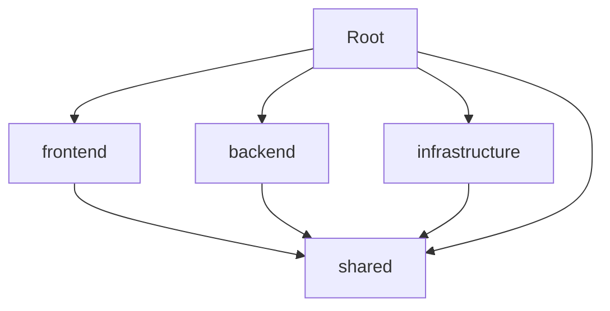

# 設計ドキュメント

## 概要

曼荼羅目標管理システムのモノレポ構成を設計する。pnpm workspaceとturboを使用して、効率的な開発環境を構築する。

## アーキテクチャ

### ディレクトリ構造

```bash
goal-mandala/
├── packages/
│   ├── frontend/           # React + TypeScript フロントエンド
│   ├── backend/            # Hono + Lambda バックエンド
│   ├── infrastructure/     # AWS CDK インフラ定義
│   └── shared/             # 共通型定義・ユーティリティ
├── tools/
│   ├── docker/             # Docker Compose設定
│   └── scripts/            # 開発用スクリプト
├── docs/                   # ドキュメント
├── .github/                # GitHub Actions設定
├── package.json            # モノレポルート設定
├── pnpm-workspace.yaml     # pnpm ワークスペース設定
├── turbo.json              # turbo設定
├── .tool-versions          # asdfバージョン管理
├── .gitignore
├── .env.example
└── README.md
```

### パッケージ依存関係



## コンポーネントとインターフェース

### 1. ルートパッケージ (package.json)

**責任:**

- 全体的な依存関係管理
- 共通スクリプトの定義
- 開発ツールの設定

**主要設定:**

- pnpm workspace設定
- 共通devDependencies
- 統一スクリプト

### 2. pnpm-workspace.yaml

**責任:**

- ワークスペースパッケージの定義
- パッケージ間の依存関係管理

**設定内容:**

```yaml
packages:
  - 'packages/*'
  - 'tools/*'
```

### 3. turbo.json

**責任:**

- ビルドパイプラインの最適化
- タスクの依存関係定義
- キャッシュ戦略

**主要タスク:**

- build: パッケージのビルド
- test: テスト実行
- lint: リントチェック
- type-check: 型チェック

### 4. 各パッケージ構成

#### frontend パッケージ

- React + TypeScript
- Vite設定
- Tailwind CSS
- React Testing Library

#### backend パッケージ

- Hono + TypeScript
- Prisma ORM
- Jest テスト
- AWS Lambda対応

#### infrastructure パッケージ

- AWS CDK + TypeScript
- 環境別設定
- デプロイスクリプト

#### shared パッケージ

- 共通型定義
- ユーティリティ関数
- 定数定義

## データモデル

### パッケージ設定構造

```typescript
interface PackageConfig {
  name: string;
  version: string;
  dependencies: Record<string, string>;
  devDependencies: Record<string, string>;
  scripts: Record<string, string>;
}

interface WorkspaceConfig {
  packages: string[];
  dependencies: Record<string, string>;
}

interface TurboConfig {
  pipeline: Record<string, TaskConfig>;
}

interface TaskConfig {
  dependsOn: string[];
  outputs: string[];
  cache: boolean;
}
```

## エラーハンドリング

### 依存関係エラー

- パッケージ間の循環依存検出
- バージョン競合の解決
- 不正な依存関係の警告

### ビルドエラー

- 型エラーの統一表示
- ビルド失敗時の詳細ログ
- 部分ビルド失敗の処理

### 開発環境エラー

- Node.jsバージョン不一致の警告
- 必要ツールの不足検出
- 環境変数の検証

## テスト戦略

### 設定テスト

- package.json設定の妥当性検証
- workspace設定の正確性確認
- turbo設定の動作確認

### 統合テスト

- パッケージ間依存関係の動作確認
- ビルドパイプラインの正常動作
- 開発サーバーの起動確認

### パフォーマンステスト

- ビルド時間の測定
- キャッシュ効果の確認
- 並列実行の効率性検証
