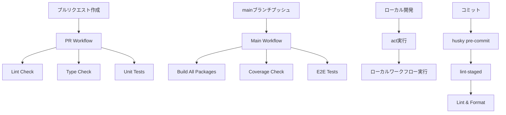

# 設計ドキュメント

## 概要

GitHub Actionsを使用したCI/CDパイプラインの基本設定を構築し、コード品質の自動チェック、テスト実行、デプロイメント準備を自動化する。モノレポ構成に対応し、効率的なワークフロー実行を実現する。

## アーキテクチャ

### ワークフロー構成



### ファイル構成

```
.github/
├── workflows/
│   ├── pr-check.yml          # プルリクエスト時のチェック
│   ├── main-ci.yml           # mainブランチのCI
│   └── manual-deploy.yml     # 手動デプロイ用（将来）
├── pull_request_template.md  # PRテンプレート
└── ISSUE_TEMPLATE/           # イシューテンプレート（将来）
.actrc                        # act設定ファイル
.husky/
├── pre-commit               # pre-commitフック
└── _/                       # huskyの内部ファイル
```

## コンポーネントと インターフェース

### 1. プルリクエストワークフロー（pr-check.yml）

#### 目的

プルリクエスト作成時の品質チェック自動化

#### トリガー

- プルリクエスト作成時
- プルリクエストへのプッシュ時

#### ジョブ構成

1. **setup**: 共通セットアップ（Node.js、pnpm、依存関係インストール）
2. **lint**: ESLintによるコード品質チェック
3. **typecheck**: TypeScriptの型チェック
4. **test**: ユニットテストの実行

#### 最適化戦略

- pnpmキャッシュの活用
- 並列ジョブ実行
- 変更されたパッケージのみの処理（turboフィルター活用）

### 2. メインブランチワークフロー（main-ci.yml）

#### 目的

mainブランチの包括的品質チェックとデプロイ準備

#### トリガー

- mainブランチへのプッシュ

#### ジョブ構成

1. **build**: 全パッケージのビルド
2. **test-coverage**: テストカバレッジ測定
3. **e2e**: E2Eテストの実行
4. **security**: セキュリティスキャン（将来）

#### 成果物

- ビルド成果物のアーティファクト保存
- カバレッジレポートの生成
- テスト結果レポート

### 3. act設定（.actrc）

#### 目的

ローカル環境でのGitHub Actionsワークフローテスト

#### 設定内容

- Dockerイメージの指定
- 環境変数の設定
- シークレットのモック設定
- ボリュームマウント設定

### 4. pre-commitフック（husky + lint-staged）

#### 目的

コミット前の自動品質チェック

#### 処理内容

1. ステージされたファイルの取得
2. 該当ファイルに対するLint実行
3. 自動フォーマット適用
4. 型チェック実行

## データモデル

### ワークフロー実行データ

```typescript
interface WorkflowRun {
  id: string;
  name: string;
  status: 'queued' | 'in_progress' | 'completed';
  conclusion: 'success' | 'failure' | 'cancelled' | 'skipped';
  jobs: Job[];
  artifacts: Artifact[];
}

interface Job {
  id: string;
  name: string;
  status: string;
  steps: Step[];
  duration: number;
}

interface Step {
  name: string;
  status: string;
  output: string;
  duration: number;
}
```

### テストカバレッジデータ

```typescript
interface CoverageReport {
  overall: {
    lines: number;
    functions: number;
    branches: number;
    statements: number;
  };
  packages: {
    [packageName: string]: {
      lines: number;
      functions: number;
      branches: number;
      statements: number;
      files: FileCoverage[];
    };
  };
}
```

## エラーハンドリング

### 1. ワークフロー失敗時の対応

#### Lint失敗

- 詳細なエラーメッセージの表示
- 修正方法の提案
- 自動修正可能な場合の提案

#### テスト失敗

- 失敗したテストの詳細表示
- テストログの保存
- 関連するコードの特定

#### ビルド失敗

- ビルドエラーの詳細表示
- 依存関係の問題の特定
- 環境固有の問題の診断

### 2. act実行時のエラー対応

#### Docker関連エラー

- 適切なDockerイメージの提案
- ボリュームマウントの問題解決
- 権限問題の対応

#### 環境変数エラー

- 必要な環境変数の一覧表示
- モック値の提案
- 設定ファイルの例示

## テスト戦略

### 1. ワークフローテスト

#### 単体テスト

- 各ステップの独立実行テスト
- 環境変数の検証
- 条件分岐の検証

#### 統合テスト

- 完全なワークフロー実行テスト
- 異なるトリガー条件でのテスト
- 失敗シナリオのテスト

### 2. ローカルテスト

#### act実行テスト

- 全ワークフローのローカル実行
- 環境差異の検証
- パフォーマンステスト

#### pre-commitテスト

- 各種ファイル変更パターンでのテスト
- エラー条件でのテスト
- 自動修正機能のテスト

## セキュリティ考慮事項

### 1. シークレット管理

#### GitHub Secrets

- AWS認証情報の安全な管理
- データベース接続情報の保護
- 外部API キーの管理

#### 環境分離

- 開発・ステージング・本番環境の分離
- 環境固有のシークレット管理
- 最小権限の原則適用

### 2. 依存関係セキュリティ

#### 脆弱性スキャン

- npm auditの自動実行
- 依存関係の定期更新
- セキュリティアラートの監視

#### コードスキャン

- 静的解析ツールの統合
- セキュリティルールの適用
- 機密情報の検出

## パフォーマンス最適化

### 1. キャッシュ戦略

#### 依存関係キャッシュ

- pnpmキャッシュの効率的活用
- Node.jsモジュールキャッシュ
- ビルド成果物キャッシュ

#### 段階的実行

- 変更検出による部分実行
- 並列ジョブ実行
- 早期失敗による時間短縮

### 2. リソース最適化

#### ランナー選択

- 適切なランナーサイズの選択
- セルフホストランナーの検討（将来）
- コスト効率の最適化

## 監視とログ

### 1. ワークフロー監視

#### メトリクス収集

- 実行時間の追跡
- 成功率の監視
- リソース使用量の測定

#### アラート設定

- 連続失敗時のアラート
- 実行時間異常のアラート
- カバレッジ低下のアラート

### 2. ログ管理

#### 構造化ログ

- JSON形式でのログ出力
- 検索可能なログ形式
- エラー分類とタグ付け

#### ログ保持

- 適切な保持期間の設定
- 重要ログの長期保存
- ログローテーション

## 運用手順

### 1. 初期セットアップ

1. GitHub Actionsワークフローファイルの作成
2. 必要なシークレットの設定
3. ブランチ保護ルールの設定
4. チームメンバーへの周知

### 2. 日常運用

1. ワークフロー実行結果の確認
2. 失敗時の原因調査と対応
3. 定期的なメンテナンス
4. パフォーマンス監視

### 3. トラブルシューティング

1. 一般的な問題の診断手順
2. エスカレーション手順
3. 緊急時の対応手順
4. 復旧手順

## 将来の拡張計画

### 1. デプロイ自動化

- AWS CDKデプロイの自動化
- 環境別デプロイ戦略
- ロールバック機能

### 2. 高度な品質チェック

- セキュリティスキャンの統合
- パフォーマンステストの自動化
- 依存関係の脆弱性チェック

### 3. 通知機能

- Slack通知の統合
- メール通知の設定
- ダッシュボードの構築
