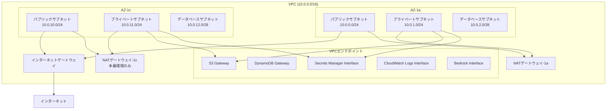
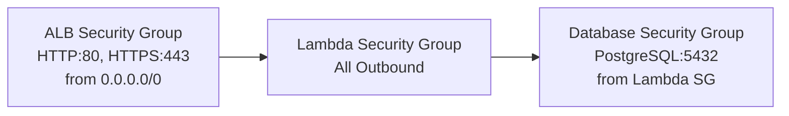

# 設計書

## 概要

AWS CDKを使用してVPC・ネットワーク構成を実装し、セキュアで高可用性なネットワーク基盤を提供します。本設計では、3層アーキテクチャ（パブリック、プライベート、データベース）を採用し、適切なセキュリティグループとVPCエンドポイントを設定します。

## アーキテクチャ

### ネットワーク構成図



### セキュリティグループ構成



## コンポーネントと インターフェース

### VpcStack クラス

#### 責務

- VPCとサブネットの作成・管理
- セキュリティグループの設定
- VPCエンドポイントの管理
- ネットワーク監視の設定

#### パブリックインターフェース

```typescript
export class VpcStack extends cdk.Stack {
  public readonly vpc: ec2.Vpc;
  public readonly databaseSecurityGroup: ec2.SecurityGroup;
  public readonly lambdaSecurityGroup: ec2.SecurityGroup;
  public readonly albSecurityGroup: ec2.SecurityGroup;
  
  constructor(scope: Construct, id: string, props: VpcStackProps);
}

export interface VpcStackProps extends cdk.StackProps {
  config: EnvironmentConfig;
}
```

#### 主要メソッド

- `createSecurityGroups()`: セキュリティグループの作成と設定
- `createVpcEndpoints()`: VPCエンドポイントの作成（環境別）
- `applyTags()`: タグの適用
- `createOutputs()`: CloudFormation出力の作成

### ネットワーク設定詳細

#### VPC設定

- **CIDR**: 10.0.0.0/16
- **DNS解決**: 有効
- **DNSホスト名**: 有効
- **最大AZ数**: 2

#### サブネット設定

| サブネット種別 | CIDR マスク | 用途 | インターネットアクセス |
|---------------|-------------|------|----------------------|
| パブリック | /24 | ALB、NATゲートウェイ | 直接アクセス |
| プライベート | /24 | Lambda関数 | NATゲートウェイ経由 |
| データベース | /28 | Aurora Serverless | なし（分離） |

#### セキュリティグループ設定

##### ALB Security Group

- **インバウンド**:
  - HTTP (80): 0.0.0.0/0
  - HTTPS (443): 0.0.0.0/0
- **アウトバウンド**: 制限あり

##### Lambda Security Group

- **インバウンド**: ALBからのアクセス（将来の拡張用）
- **アウトバウンド**: 全許可（外部API呼び出し用）

##### Database Security Group

- **インバウンド**: Lambda SGからのPostgreSQL (5432)
- **アウトバウンド**: なし

## データモデル

### 環境設定

```typescript
interface EnvironmentConfig {
  environment: 'local' | 'dev' | 'stg' | 'prd';
  region: string;
  stackPrefix: string;
  tags?: Record<string, string>;
}
```

### VPCエンドポイント設定

```typescript
interface VpcEndpointConfig {
  s3: boolean;           // Gateway型
  dynamodb: boolean;     // Gateway型
  secretsManager: boolean; // Interface型
  cloudWatchLogs: boolean; // Interface型
  bedrock: boolean;      // Interface型
}
```

## エラーハンドリング

### 設計原則

1. **Fail Fast**: 設定エラーは早期に検出
2. **明確なエラーメッセージ**: 問題の特定が容易
3. **ロールバック対応**: CloudFormationの自動ロールバック活用

### エラーケース

#### 1. CIDR重複エラー

- **原因**: 既存VPCとのCIDR重複
- **対処**: 環境別CIDR設定の確認

#### 2. AZ不足エラー

- **原因**: 指定リージョンでのAZ不足
- **対処**: 最小AZ数の調整

#### 3. セキュリティグループ循環参照

- **原因**: セキュリティグループ間の不適切な参照
- **対処**: 依存関係の明確化

### エラー監視

```typescript
// VPCフローログによる異常検知
const vpcFlowLog = new ec2.FlowLog(this, 'VpcFlowLog', {
  resourceType: ec2.FlowLogResourceType.fromVpc(this.vpc),
  destination: ec2.FlowLogDestination.toCloudWatchLogs(logGroup),
  trafficType: ec2.FlowLogTrafficType.ALL,
});
```

## テスト戦略

### ユニットテスト

- **対象**: VpcStackクラスの各メソッド
- **検証項目**:
  - リソース作成の確認
  - プロパティ設定の検証
  - 出力値の確認

### 統合テスト

- **対象**: スタック全体のデプロイ
- **検証項目**:
  - VPC接続性テスト
  - セキュリティグループルールテスト
  - VPCエンドポイント疎通テスト

### テストケース例

```typescript
describe('VpcStack', () => {
  test('VPCが正しく作成される', () => {
    template.hasResourceProperties('AWS::EC2::VPC', {
      CidrBlock: '10.0.0.0/16',
      EnableDnsHostnames: true,
      EnableDnsSupport: true,
    });
  });
  
  test('環境別NATゲートウェイ数が正しい', () => {
    // 本番環境: 2個、開発環境: 1個
  });
});
```

## パフォーマンス考慮事項

### ネットワーク最適化

1. **VPCエンドポイント**: AWSサービスへの直接接続でレイテンシ削減
2. **AZ分散**: 可用性とパフォーマンスの向上
3. **NATゲートウェイ**: 環境別の冗長化設定

### コスト最適化

1. **開発環境**: 単一NATゲートウェイでコスト削減
2. **VPCエンドポイント**: 本番環境のみで作成
3. **ログ保持期間**: 1ヶ月で設定

## セキュリティ考慮事項

### ネットワークセキュリティ

1. **最小権限の原則**: 必要最小限の通信のみ許可
2. **ネットワーク分離**: データベースサブネットの完全分離
3. **トラフィック監視**: VPCフローログによる全通信記録

### セキュリティグループ設計

1. **明示的拒否**: デフォルトで全拒否
2. **ソース制限**: 特定のセキュリティグループからのみ許可
3. **ポート制限**: 必要なポートのみ開放

## 運用・監視

### 監視項目

1. **VPCフローログ**: 異常通信の検知
2. **NATゲートウェイメトリクス**: 帯域幅使用量
3. **VPCエンドポイントメトリクス**: 接続状況

### アラート設定

1. **異常トラフィック**: 大量の拒否通信
2. **NATゲートウェイ障害**: 接続エラー増加
3. **VPCエンドポイント障害**: 接続失敗

### ログ管理

```typescript
const vpcFlowLogGroup = new logs.LogGroup(this, 'VpcFlowLogGroup', {
  logGroupName: `/aws/vpc/flowlogs/${config.stackPrefix}`,
  retention: logs.RetentionDays.ONE_MONTH,
  removalPolicy: cdk.RemovalPolicy.DESTROY,
});
```

## デプロイメント

### デプロイ順序

1. VpcStack（独立）
2. DatabaseStack（VpcStackに依存）
3. ApiStack（VpcStack、DatabaseStackに依存）
4. FrontendStack（ApiStackに依存）

### 環境別設定

#### 開発環境 (dev)

- NATゲートウェイ: 1個
- VPCエンドポイント: なし
- ログ保持: 1週間

#### 本番環境 (prd)

- NATゲートウェイ: 2個（高可用性）
- VPCエンドポイント: 全て作成
- ログ保持: 1ヶ月

### ロールバック戦略

1. **CloudFormation**: 自動ロールバック機能
2. **依存関係**: 逆順でのスタック削除
3. **データ保護**: データベースサブネットの保護設定
