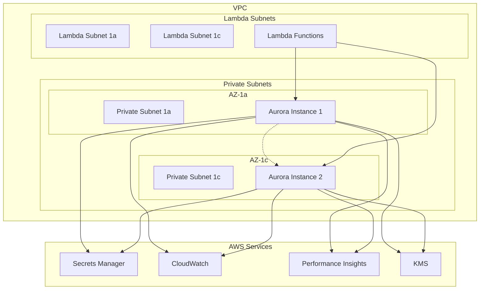

# 設計書

## 概要

Aurora Serverless V2データベースクラスターを構築し、曼荼羅目標管理システムのデータ永続化基盤を提供する。既存のVPCスタックと統合し、セキュアで高可用性なデータベース環境を実現する。

## アーキテクチャ

### システム構成図



### データベース設計

#### クラスター構成

- **エンジン**: Aurora PostgreSQL 15.4
- **クラスターモード**: Serverless V2
- **最小ACU**: 0.5 (dev/local), 1.0 (stg/prod)
- **最大ACU**: 2.0 (dev/local), 16.0 (stg/prod)
- **Multi-AZ**: 有効 (stg/prod), 無効 (dev/local)

#### ネットワーク設計

- **配置**: プライベートサブネット
- **セキュリティグループ**: Lambda専用アクセス
- **ポート**: 5432 (PostgreSQL)
- **SSL**: 必須

## コンポーネントと インターフェース

### DatabaseStack クラス

```typescript
export class DatabaseStack extends Stack {
  public readonly cluster: rds.DatabaseCluster;
  public readonly secret: secretsmanager.Secret;
  public readonly securityGroup: ec2.SecurityGroup;
  
  constructor(scope: Construct, id: string, props: DatabaseStackProps) {
    // 実装詳細は後述
  }
}
```

#### 主要プロパティ

- `cluster`: Aurora Serverless V2クラスター
- `secret`: データベース認証情報
- `securityGroup`: データベース用セキュリティグループ

#### 依存関係

- `VpcStack`: VPC、サブネット、セキュリティグループ
- `Environment`: 環境別設定

### DatabaseConstruct クラス

```typescript
export class DatabaseConstruct extends Construct {
  public readonly cluster: rds.DatabaseCluster;
  public readonly secret: secretsmanager.Secret;
  
  constructor(scope: Construct, id: string, props: DatabaseConstructProps) {
    // 再利用可能なコンストラクト実装
  }
}
```

### 環境設定インターフェース

```typescript
interface DatabaseConfig {
  minCapacity: number;
  maxCapacity: number;
  multiAz: boolean;
  backupRetention: number;
  deletionProtection: boolean;
  performanceInsights: boolean;
  monitoringInterval: number;
}
```

## データモデル

### Secrets Manager シークレット構造

```json
{
  "username": "postgres",
  "password": "auto-generated-password",
  "engine": "postgres",
  "host": "cluster-endpoint",
  "port": 5432,
  "dbname": "goalmandalamain"
}
```

### CloudWatch メトリクス

#### 監視対象メトリクス

- `DatabaseConnections`: 接続数
- `CPUUtilization`: CPU使用率
- `ServerlessDatabaseCapacity`: 現在のACU
- `ReadLatency`: 読み取りレイテンシ
- `WriteLatency`: 書き込みレイテンシ

#### アラーム設定

- 高CPU使用率 (> 80%)
- 高接続数 (> 80% of max)
- 高レイテンシ (> 1000ms)

## エラーハンドリング

### 接続エラー対応

```typescript
// 接続リトライロジック
const connectionConfig = {
  host: secret.host,
  port: secret.port,
  database: secret.dbname,
  username: secret.username,
  password: secret.password,
  ssl: { rejectUnauthorized: false },
  connectionTimeoutMillis: 30000,
  idleTimeoutMillis: 30000,
  max: 10, // 最大接続数
  min: 1,  // 最小接続数
};
```

### バックアップ・復旧

#### 自動バックアップ

- **バックアップウィンドウ**: 03:00-04:00 JST
- **保持期間**: 7日 (dev), 30日 (prod)
- **ポイントインタイム復旧**: 有効

#### 手動スナップショット

- デプロイ前の手動スナップショット作成
- 重要な変更前のバックアップ

## テスト戦略

### ユニットテスト

```typescript
describe('DatabaseStack', () => {
  test('Aurora cluster is created with correct configuration', () => {
    // CDKスタックのテスト
  });
  
  test('Security group allows Lambda access only', () => {
    // セキュリティグループ設定のテスト
  });
  
  test('Secrets Manager integration is configured', () => {
    // Secrets Manager統合のテスト
  });
});
```

### 統合テスト

```typescript
describe('Database Integration', () => {
  test('Can connect to database using Prisma', async () => {
    // Prisma接続テスト
  });
  
  test('Database schema migration works', async () => {
    // マイグレーションテスト
  });
  
  test('Performance Insights is enabled', async () => {
    // Performance Insights確認
  });
});
```

### パフォーマンステスト

#### 負荷テスト項目

- 同時接続数テスト
- スケーリング動作確認
- レスポンス時間測定
- ACU使用量監視

## セキュリティ考慮事項

### 暗号化設定

#### 保存時暗号化

- **KMS キー**: AWS管理キー使用
- **暗号化範囲**: データ、ログ、バックアップ

#### 転送時暗号化

- **SSL/TLS**: 必須
- **証明書検証**: 有効

### アクセス制御

#### IAMデータベース認証

```typescript
// Lambda実行ロールにデータベースアクセス権限付与
const dbAccessPolicy = new iam.PolicyStatement({
  effect: iam.Effect.ALLOW,
  actions: ['rds-db:connect'],
  resources: [`arn:aws:rds-db:${region}:${account}:dbuser:${clusterId}/lambda-user`],
});
```

#### ネットワークアクセス制御

- VPC内からのみアクセス可能
- セキュリティグループによる制限
- NACLによる追加制御

### 監査・ログ

#### 監査ログ設定

```typescript
const clusterParameterGroup = new rds.ParameterGroup(this, 'ClusterParameterGroup', {
  engine: rds.DatabaseClusterEngine.auroraPostgres({
    version: rds.AuroraPostgresEngineVersion.VER_15_4,
  }),
  parameters: {
    'log_statement': 'all',
    'log_min_duration_statement': '1000',
    'shared_preload_libraries': 'pg_stat_statements',
  },
});
```

## 運用・監視

### CloudWatch ダッシュボード

#### 表示項目

- データベース接続数
- CPU/メモリ使用率
- 現在のACU使用量
- クエリパフォーマンス
- エラー率

### アラート設定

#### 重要度: Critical

- データベース接続不可
- CPU使用率 > 90%
- 接続数 > 最大値の90%

#### 重要度: Warning  

- CPU使用率 > 80%
- レスポンス時間 > 1秒
- 接続数 > 最大値の70%

### バックアップ・復旧手順

#### 定期バックアップ確認

```bash
# バックアップ状況確認
aws rds describe-db-cluster-snapshots \
  --db-cluster-identifier goal-mandala-prd-aurora-cluster

# ポイントインタイム復旧可能時間確認
aws rds describe-db-clusters \
  --db-cluster-identifier goal-mandala-prd-aurora-cluster \
  --query 'DBClusters[0].EarliestRestorableTime'
```

#### 災害復旧手順

1. 最新の自動バックアップから復旧
2. ポイントインタイム復旧の実行
3. アプリケーション接続先の更新
4. データ整合性の確認

## パフォーマンス最適化

### 接続プール設定

```typescript
// Prisma接続プール設定
const prisma = new PrismaClient({
  datasources: {
    db: {
      url: databaseUrl,
    },
  },
  log: ['query', 'info', 'warn', 'error'],
});

// 接続プール設定
prisma.$connect();
```

### クエリ最適化

#### インデックス戦略

- 主キー: 自動作成
- 外部キー: 自動作成
- 検索用インデックス: Prismaスキーマで定義

#### 接続管理

- Lambda関数での接続再利用
- 接続プールサイズの最適化
- アイドル接続のタイムアウト設定

## 環境別設定

### Local環境

```json
{
  "minCapacity": 0.5,
  "maxCapacity": 1.0,
  "multiAz": false,
  "backupRetention": 1,
  "deletionProtection": false,
  "performanceInsights": false,
  "monitoringInterval": 0
}
```

### Development環境

```json
{
  "minCapacity": 0.5,
  "maxCapacity": 2.0,
  "multiAz": false,
  "backupRetention": 7,
  "deletionProtection": false,
  "performanceInsights": true,
  "monitoringInterval": 60
}
```

### Production環境

```json
{
  "minCapacity": 1.0,
  "maxCapacity": 16.0,
  "multiAz": true,
  "backupRetention": 30,
  "deletionProtection": true,
  "performanceInsights": true,
  "monitoringInterval": 60
}
```
