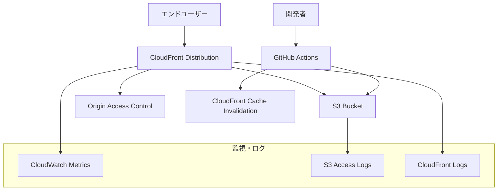

# 設計書

## 概要

フロントエンド配信のためのCloudFront + S3構成を設計し、高速で安全な静的ウェブサイトホスティング環境を構築する。

## アーキテクチャ

### 全体構成



### CDKスタック構成

- **FrontendStack**: フロントエンド配信に関するリソース
  - S3バケット（静的ウェブサイトホスティング用）
  - CloudFrontディストリビューション
  - オリジンアクセスコントロール
  - SSL証明書（ACM）
  - セキュリティヘッダー設定

## コンポーネントと インターフェース

### S3バケット設計

#### バケット設定

- **命名規則**: `{サービス名}-{環境名}-frontend-{アカウントID}`
- **バージョニング**: 有効（ロールバック対応）
- **暗号化**: AES-256（デフォルト）
- **パブリックアクセス**: 全てブロック（CloudFront経由のみ）

#### バケットポリシー

```json
{
  "Version": "2012-10-17",
  "Statement": [
    {
      "Effect": "Allow",
      "Principal": {
        "Service": "cloudfront.amazonaws.com"
      },
      "Action": "s3:GetObject",
      "Resource": "arn:aws:s3:::bucket-name/*",
      "Condition": {
        "StringEquals": {
          "AWS:SourceArn": "arn:aws:cloudfront::account:distribution/distribution-id"
        }
      }
    }
  ]
}
```

### CloudFront設計

#### ディストリビューション設定

- **オリジン**: S3バケット（OAC経由）
- **デフォルトルートオブジェクト**: `index.html`
- **価格クラス**: PriceClass_100（北米・ヨーロッパ）
- **HTTP版**: HTTPSにリダイレクト
- **圧縮**: 有効

#### キャッシュ動作

```typescript
// 静的アセット（長期キャッシュ）
{
  pathPattern: "/assets/*",
  cachePolicyId: "4135ea2d-6df8-44a3-9df3-4b5a84be39ad", // CachingOptimized
  originRequestPolicyId: "88a5eaf4-2fd4-4709-b370-b4c650ea3fcf", // CORS-S3Origin
  viewerProtocolPolicy: ViewerProtocolPolicy.REDIRECT_TO_HTTPS,
}

// HTML・API（短期キャッシュ）
{
  pathPattern: "*.html",
  cachePolicyId: "4135ea2d-6df8-44a3-9df3-4b5a84be39ad", // CachingOptimized
  originRequestPolicyId: "88a5eaf4-2fd4-4709-b370-b4c650ea3fcf", // CORS-S3Origin
  viewerProtocolPolicy: ViewerProtocolPolicy.REDIRECT_TO_HTTPS,
  ttl: {
    defaultTtl: Duration.minutes(5),
    maxTtl: Duration.hours(1),
  }
}
```

#### エラーページ設定

```typescript
errorResponses: [
  {
    httpStatus: 404,
    responseHttpStatus: 200,
    responsePagePath: '/index.html',
    ttl: Duration.minutes(5),
  },
  {
    httpStatus: 403,
    responseHttpStatus: 200,
    responsePagePath: '/index.html',
    ttl: Duration.minutes(5),
  }
]
```

### SSL証明書設計

#### ACM証明書

- **ドメイン**: 環境別ドメイン設定
  - local: `localhost`（開発用）
  - dev: `dev.goal-mandala.example.com`
  - stg: `stg.goal-mandala.example.com`
  - prd: `goal-mandala.example.com`
- **検証方法**: DNS検証
- **リージョン**: us-east-1（CloudFront要件）

### セキュリティヘッダー設計

#### Response Headers Policy

```typescript
{
  securityHeadersBehavior: {
    strictTransportSecurity: {
      accessControlMaxAge: Duration.seconds(31536000),
      includeSubdomains: true,
      preload: true,
      override: true,
    },
    contentTypeOptions: {
      override: true,
    },
    frameOptions: {
      frameOption: FrameOptions.DENY,
      override: true,
    },
    referrerPolicy: {
      referrerPolicy: ReferrerPolicyHeaderValue.STRICT_ORIGIN_WHEN_CROSS_ORIGIN,
      override: true,
    },
  },
  customHeadersBehavior: {
    customHeaders: [
      {
        header: 'X-Custom-Header',
        value: 'goal-mandala-app',
        override: true,
      }
    ]
  }
}
```

## データモデル

### 環境設定

```typescript
interface FrontendConfig {
  bucketName: string;
  domainName?: string;
  certificateArn?: string;
  enableLogging: boolean;
  priceClass: PriceClass;
  cacheSettings: {
    defaultTtl: Duration;
    maxTtl: Duration;
    minTtl: Duration;
  };
}
```

### デプロイ設定

```typescript
interface DeploymentConfig {
  buildCommand: string;
  buildDirectory: string;
  excludePatterns: string[];
  invalidationPaths: string[];
  retainOnDelete: boolean;
}
```

## エラーハンドリング

### S3エラー対応

1. **403 Forbidden**
   - 原因: バケットポリシー設定不備
   - 対応: OAC設定とバケットポリシーの確認

2. **404 Not Found**
   - 原因: ファイルが存在しない
   - 対応: index.htmlにフォールバック

3. **500 Internal Server Error**
   - 原因: S3サービス障害
   - 対応: CloudWatchアラート + 自動復旧

### CloudFrontエラー対応

1. **Origin Timeout**
   - 原因: S3レスポンス遅延
   - 対応: タイムアウト設定調整

2. **Cache Miss Rate High**
   - 原因: キャッシュ設定不適切
   - 対応: キャッシュポリシー見直し

3. **SSL Certificate Error**
   - 原因: 証明書期限切れ・設定不備
   - 対応: ACM自動更新 + アラート

## テスト戦略

### 単体テスト

1. **CDKスタックテスト**
   - リソース作成の検証
   - プロパティ設定の確認
   - 環境別設定の検証

2. **設定値テスト**
   - キャッシュポリシーの検証
   - セキュリティヘッダーの確認
   - エラーページ設定の検証

### 統合テスト

1. **デプロイテスト**
   - S3へのファイルアップロード
   - CloudFront経由でのアクセス
   - キャッシュ動作の確認

2. **セキュリティテスト**
   - 直接S3アクセスの拒否確認
   - HTTPS強制の確認
   - セキュリティヘッダーの確認

### E2Eテスト

1. **ユーザーアクセステスト**
   - 各環境でのアクセス確認
   - SPA動作の確認
   - パフォーマンス測定

2. **デプロイフローテスト**
   - CI/CDパイプライン動作確認
   - キャッシュ無効化の確認
   - ロールバック動作確認

## パフォーマンス要件

### レスポンス時間

- **初回アクセス**: < 3秒
- **キャッシュヒット**: < 500ms
- **静的アセット**: < 200ms

### キャッシュ効率

- **キャッシュヒット率**: > 90%
- **オリジンリクエスト**: < 10%

### 可用性

- **稼働率**: 99.9%以上
- **RTO**: < 5分
- **RPO**: < 1時間

## 監視・ログ

### CloudWatchメトリクス

1. **CloudFront**
   - Requests（リクエスト数）
   - BytesDownloaded（ダウンロード量）
   - 4xxErrorRate（クライアントエラー率）
   - 5xxErrorRate（サーバーエラー率）
   - CacheHitRate（キャッシュヒット率）

2. **S3**
   - NumberOfObjects（オブジェクト数）
   - BucketSizeBytes（バケットサイズ）
   - AllRequests（全リクエスト数）

### アラート設定

```typescript
// エラー率アラート
const errorRateAlarm = new cloudwatch.Alarm(this, 'HighErrorRate', {
  metric: distribution.metricErrorRate(),
  threshold: 5,
  evaluationPeriods: 2,
  treatMissingData: cloudwatch.TreatMissingData.NOT_BREACHING,
});

// キャッシュヒット率アラート
const cacheHitRateAlarm = new cloudwatch.Alarm(this, 'LowCacheHitRate', {
  metric: distribution.metricCacheHitRate(),
  threshold: 80,
  comparisonOperator: cloudwatch.ComparisonOperator.LESS_THAN_THRESHOLD,
  evaluationPeriods: 3,
});
```

### ログ管理

1. **S3アクセスログ**
   - 別バケットに保存
   - ライフサイクルポリシーで自動削除

2. **CloudFrontログ**
   - リアルタイムログ（必要に応じて）
   - 標準ログ（S3保存）

## セキュリティ考慮事項

### アクセス制御

- S3バケットへの直接アクセス禁止
- CloudFront経由のみアクセス許可
- IAMロールによる最小権限の原則

### 暗号化

- 転送時: HTTPS強制
- 保存時: S3デフォルト暗号化

### セキュリティヘッダー

- HSTS（HTTP Strict Transport Security）
- X-Content-Type-Options
- X-Frame-Options
- Referrer-Policy

## 運用考慮事項

### デプロイ戦略

- Blue-Green デプロイメント対応
- ロールバック機能
- 段階的リリース（カナリアデプロイ）

### コスト最適化

- 適切な価格クラス選択
- ライフサイクルポリシー設定
- 不要なログの自動削除

### 災害復旧

- 複数リージョンでのバックアップ
- 自動復旧スクリプト
- 復旧手順書の整備
