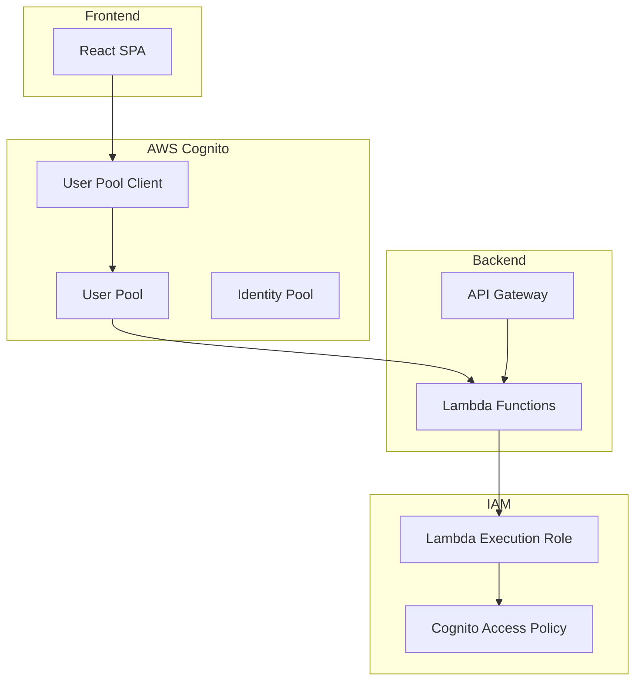
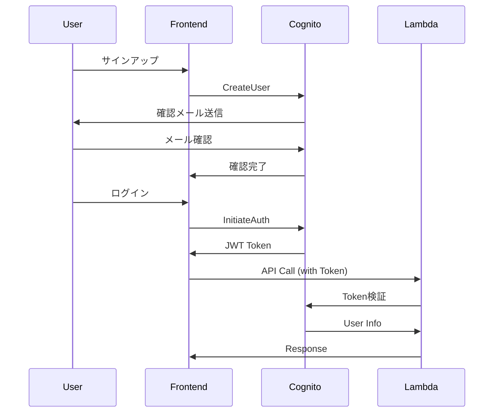

# 設計ドキュメント

## 概要

Amazon Cognitoを使用したユーザー認証システムを構築します。CDKを使用してUser Pool、User Pool Client、および関連するIAMロールを作成し、セキュアで拡張性のある認証基盤を提供します。

## アーキテクチャ

### 全体構成



### 認証フロー



## コンポーネントと インターフェース

### CognitoStack

Amazon Cognito関連のリソースを管理するCDKスタック

#### 主要コンポーネント

1. **User Pool**: ユーザー情報とパスワードを管理
2. **User Pool Client**: フロントエンドアプリケーション用のクライアント設定
3. **IAM Role**: Lambda関数がCognitoにアクセスするための権限

#### インターフェース

```typescript
export interface CognitoStackProps extends StackProps {
  environment: string;
  projectName: string;
}

export class CognitoStack extends Stack {
  public readonly userPool: cognito.UserPool;
  public readonly userPoolClient: cognito.UserPoolClient;
  public readonly lambdaRole: iam.Role;
}
```

### User Pool設定

#### 基本設定

- **ユーザー名**: メールアドレスを使用
- **必須属性**: name, email
- **自動検証**: email
- **セルフサインアップ**: 有効

#### パスワードポリシー

- **最小文字数**: 8文字
- **必須文字種**: 大文字、小文字、数字、記号
- **一時パスワード有効期限**: 7日

#### メール設定

- **送信者**: noreply@{domain}
- **確認メールテンプレート**: カスタムテンプレート使用
- **パスワードリセットテンプレート**: カスタムテンプレート使用

### User Pool Client設定

#### 認証フロー

- **ALLOW_USER_SRP_AUTH**: 有効
- **ALLOW_REFRESH_TOKEN_AUTH**: 有効
- **ALLOW_USER_PASSWORD_AUTH**: 無効（セキュリティ向上のため）

#### トークン設定

- **アクセストークン有効期限**: 1時間
- **IDトークン有効期限**: 1時間
- **リフレッシュトークン有効期限**: 30日

#### OAuth設定

- **スコープ**: openid, email, profile
- **コールバックURL**: 環境別設定
- **ログアウトURL**: 環境別設定

## データモデル

### User Pool属性

```typescript
interface UserAttributes {
  // 標準属性
  email: string;           // 必須、検証対象
  name: string;            // 必須
  
  // カスタム属性
  custom:industry?: string;      // 業種
  custom:company_size?: string;  // 組織規模
  custom:job_title?: string;     // 職種
  custom:position?: string;      // 役職
}
```

### JWT Token構造

```typescript
interface IDToken {
  sub: string;           // ユーザーID
  email: string;         // メールアドレス
  name: string;          // 名前
  email_verified: boolean;
  custom:industry?: string;
  custom:company_size?: string;
  custom:job_title?: string;
  custom:position?: string;
}

interface AccessToken {
  sub: string;           // ユーザーID
  token_use: 'access';
  scope: string;         // 'openid email profile'
  auth_time: number;
  iss: string;           // Issuer
  exp: number;           // 有効期限
  iat: number;           // 発行時刻
  client_id: string;
}
```

## エラーハンドリング

### Cognito エラー分類

#### 認証エラー

- **NotAuthorizedException**: 認証情報が無効
- **UserNotConfirmedException**: メール確認未完了
- **UserNotFoundException**: ユーザーが存在しない
- **InvalidPasswordException**: パスワードポリシー違反

#### システムエラー

- **TooManyRequestsException**: レート制限超過
- **InternalErrorException**: Cognito内部エラー
- **ResourceNotFoundException**: リソースが見つからない

### エラーハンドリング戦略

```typescript
class CognitoErrorHandler {
  static handleAuthError(error: CognitoError): AuthErrorResponse {
    switch (error.code) {
      case 'NotAuthorizedException':
        return { message: 'メールアドレスまたはパスワードが正しくありません', retryable: false };
      case 'UserNotConfirmedException':
        return { message: 'メールアドレスの確認が完了していません', retryable: false };
      case 'TooManyRequestsException':
        return { message: '一時的にアクセスが制限されています。しばらく待ってから再試行してください', retryable: true };
      default:
        return { message: '認証エラーが発生しました', retryable: false };
    }
  }
}
```

## テスト戦略

### ユニットテスト

#### CDK構成テスト

- User Pool作成の検証
- User Pool Client設定の検証
- IAMロール・ポリシーの検証
- CloudFormation出力の検証

#### 設定値テスト

- パスワードポリシーの検証
- 属性設定の検証
- 環境別設定の検証

### 統合テスト

#### Cognito API テスト

- ユーザー登録フローの検証
- ログインフローの検証
- トークン検証の検証
- パスワードリセットフローの検証

#### Lambda統合テスト

- JWT検証機能の検証
- ユーザー情報取得の検証
- 権限チェックの検証

### E2Eテスト

#### 認証フローテスト

- サインアップ → メール確認 → ログイン
- パスワードリセット → 新パスワード設定
- トークンリフレッシュ
- ログアウト

## セキュリティ考慮事項

### 認証セキュリティ

- **SRP認証**: パスワードを平文で送信しない
- **JWT検証**: 署名検証とexpiry確認
- **HTTPS必須**: 全通信の暗号化
- **CORS設定**: 適切なオリジン制限

### 権限管理

- **最小権限の原則**: 必要最小限のIAM権限
- **リソースベース制限**: 特定のUser Poolのみアクセス可能
- **環境分離**: 環境ごとに独立したリソース

### データ保護

- **属性暗号化**: 機密属性の暗号化
- **ログ制限**: 機密情報のログ出力制限
- **監査ログ**: 認証イベントの記録

## 監視・運用

### CloudWatch メトリクス

- **SignInSuccesses**: ログイン成功数
- **SignInThrottles**: レート制限発生数
- **UserRegistration**: ユーザー登録数
- **TokenRefresh**: トークンリフレッシュ数

### アラート設定

- **高エラー率**: 認証エラー率が5%を超過
- **レート制限**: スロットリング発生
- **異常ログイン**: 短時間での大量ログイン試行

### ログ管理

- **CloudTrail**: Cognito API呼び出しログ
- **Lambda Logs**: 認証処理ログ
- **アクセスログ**: 認証成功・失敗ログ

## 環境別設定

### 開発環境 (dev)

- **パスワードポリシー**: 緩和設定（開発効率重視）
- **メール送信**: テスト用ドメイン
- **削除保護**: 無効

### ステージング環境 (stg)

- **パスワードポリシー**: 本番同等
- **メール送信**: ステージング用ドメイン
- **削除保護**: 有効

### 本番環境 (prd)

- **パスワードポリシー**: 厳格設定
- **メール送信**: 本番ドメイン
- **削除保護**: 有効
- **高度なセキュリティ**: 有効
