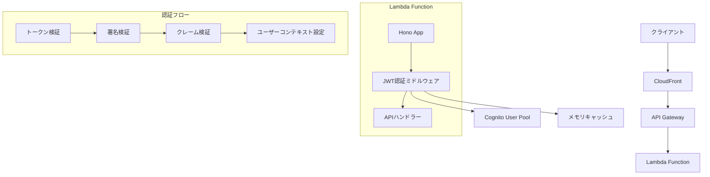

# 設計書

## 概要

JWT認証ミドルウェアは、Amazon Cognitoから発行されたJWTトークンを検証し、保護されたAPIエンドポイントへのアクセス制御を提供します。Honoフレームワークのミドルウェアとして実装し、再利用可能で型安全な認証機能を提供します。

## アーキテクチャ

### システム構成



### レイヤー構成

1. **ミドルウェア層**: Honoミドルウェアとしての認証処理
2. **検証層**: JWT署名・クレーム検証ロジック
3. **キャッシュ層**: Cognito公開鍵のメモリキャッシュ
4. **設定層**: 環境別設定管理

## コンポーネントと インターフェース

### 主要コンポーネント

#### 1. JWTAuthMiddleware

```typescript
interface JWTAuthMiddleware {
  // Honoミドルウェア関数
  authenticate(): MiddlewareHandler;
  
  // 設定可能なオプション
  configure(options: AuthMiddlewareOptions): void;
}

interface AuthMiddlewareOptions {
  userPoolId: string;
  clientId: string;
  region: string;
  enableMockAuth?: boolean;
  cacheTimeout?: number;
}
```

#### 2. JWTValidator

```typescript
interface JWTValidator {
  // トークン検証メイン処理
  validateToken(token: string): Promise<JWTPayload>;
  
  // 署名検証
  verifySignature(token: string, publicKey: string): Promise<boolean>;
  
  // クレーム検証
  validateClaims(payload: JWTPayload): boolean;
}

interface JWTPayload {
  sub: string;
  email: string;
  name?: string;
  iss: string;
  aud: string;
  token_use: 'access' | 'id';
  exp: number;
  iat: number;
}
```

#### 3. CognitoKeyManager

```typescript
interface CognitoKeyManager {
  // 公開鍵取得（キャッシュ機能付き）
  getPublicKey(kid: string): Promise<string>;
  
  // キャッシュクリア
  clearCache(): void;
  
  // キャッシュ状態確認
  isCacheValid(): boolean;
}

interface PublicKeyCache {
  keys: Map<string, string>;
  timestamp: number;
  ttl: number;
}
```

#### 4. AuthContext

```typescript
interface AuthContext {
  user: AuthenticatedUser;
  isAuthenticated: boolean;
}

interface AuthenticatedUser {
  id: string;
  email: string;
  name?: string;
  cognitoSub: string;
}
```

### API設計

#### ミドルウェア使用例

```typescript
import { Hono } from 'hono';
import { jwtAuthMiddleware } from './middleware/auth';

const app = new Hono();

// 認証ミドルウェア設定
app.use('/api/protected/*', jwtAuthMiddleware({
  userPoolId: process.env.COGNITO_USER_POOL_ID!,
  clientId: process.env.COGNITO_CLIENT_ID!,
  region: process.env.AWS_REGION!,
  enableMockAuth: process.env.NODE_ENV === 'development'
}));

// 保護されたエンドポイント
app.get('/api/protected/profile', (c) => {
  const user = c.get('user') as AuthenticatedUser;
  return c.json({ user });
});
```

## データモデル

### JWT トークン構造

```typescript
interface CognitoJWTHeader {
  alg: 'RS256';
  kid: string;
  typ: 'JWT';
}

interface CognitoJWTPayload {
  sub: string;           // ユーザーID
  email: string;         // メールアドレス
  name?: string;         // 表示名
  iss: string;           // 発行者（Cognito User Pool）
  aud: string;           // 対象者（Client ID）
  token_use: 'access' | 'id';  // トークン種別
  exp: number;           // 有効期限
  iat: number;           // 発行時刻
  auth_time?: number;    // 認証時刻
  'cognito:username'?: string;  // Cognitoユーザー名
}
```

### エラーレスポンス

```typescript
interface AuthErrorResponse {
  error: string;
  message: string;
  statusCode: number;
  timestamp: string;
}

// エラー種別
enum AuthErrorType {
  TOKEN_MISSING = 'TOKEN_MISSING',
  TOKEN_INVALID = 'TOKEN_INVALID',
  TOKEN_EXPIRED = 'TOKEN_EXPIRED',
  SIGNATURE_INVALID = 'SIGNATURE_INVALID',
  CLAIMS_INVALID = 'CLAIMS_INVALID',
  INTERNAL_ERROR = 'INTERNAL_ERROR'
}
```

## エラーハンドリング

### エラー分類と対応

| エラー種別 | HTTPステータス | 説明 | 対応 |
|------------|----------------|------|------|
| TOKEN_MISSING | 401 | Authorizationヘッダーなし | クライアントにログイン要求 |
| TOKEN_INVALID | 401 | トークン形式不正 | クライアントにログイン要求 |
| TOKEN_EXPIRED | 401 | トークン有効期限切れ | クライアントにトークン更新要求 |
| SIGNATURE_INVALID | 401 | 署名検証失敗 | クライアントにログイン要求 |
| CLAIMS_INVALID | 401 | クレーム検証失敗 | クライアントにログイン要求 |
| INTERNAL_ERROR | 500 | サーバー内部エラー | エラーログ記録、アラート送信 |

### エラーログ設計

```typescript
interface AuthErrorLog {
  timestamp: string;
  level: 'ERROR' | 'WARN' | 'INFO';
  errorType: AuthErrorType;
  message: string;
  userId?: string;
  requestId: string;
  userAgent?: string;
  ipAddress?: string;
}
```

## テスト戦略

### ユニットテスト

1. **JWTValidator テスト**
   - 有効なトークンの検証成功
   - 無効なトークンの検証失敗
   - 期限切れトークンの検証失敗
   - 署名検証の成功・失敗パターン

2. **CognitoKeyManager テスト**
   - 公開鍵取得の成功・失敗
   - キャッシュ機能の動作確認
   - キャッシュ有効期限の確認

3. **ミドルウェア統合テスト**
   - 認証成功時のリクエスト処理
   - 認証失敗時のエラーレスポンス
   - ユーザーコンテキストの設定確認

### モックテスト

```typescript
// 開発環境用モック設定
const mockAuthConfig = {
  enableMockAuth: true,
  mockUser: {
    id: 'test-user-id',
    email: 'test@example.com',
    name: 'Test User',
    cognitoSub: 'mock-cognito-sub'
  }
};
```

### 統合テスト

1. **Cognito統合テスト**
   - 実際のCognitoトークンでの検証
   - 公開鍵取得の確認
   - エラーケースの確認

2. **パフォーマンステスト**
   - キャッシュ効果の測定
   - 同時リクエスト処理の確認
   - メモリ使用量の監視

## セキュリティ考慮事項

### セキュリティ対策

1. **トークン検証の厳格化**
   - 署名検証の必須実行
   - クレーム検証の厳格な実施
   - 有効期限の厳密なチェック

2. **情報漏洩防止**
   - エラーメッセージでの機密情報除外
   - ログでのトークン内容除外
   - デバッグ情報の本番環境除外

3. **キャッシュセキュリティ**
   - メモリキャッシュのみ使用（永続化なし）
   - 適切なキャッシュ有効期限設定
   - キャッシュクリア機能の提供

### 監査ログ

```typescript
interface SecurityAuditLog {
  timestamp: string;
  event: 'AUTH_SUCCESS' | 'AUTH_FAILURE' | 'TOKEN_REFRESH';
  userId?: string;
  ipAddress: string;
  userAgent: string;
  requestId: string;
  details?: Record<string, any>;
}
```

## パフォーマンス最適化

### キャッシュ戦略

1. **公開鍵キャッシュ**
   - TTL: 1時間（デフォルト）
   - LRU方式でのキー管理
   - 検証失敗時の自動キャッシュクリア

2. **メモリ使用量最適化**
   - 必要最小限のデータのみキャッシュ
   - 定期的なキャッシュクリーンアップ
   - メモリリーク防止

### レスポンス時間目標

- 認証処理: < 100ms（キャッシュヒット時）
- 初回公開鍵取得: < 500ms
- エラーレスポンス: < 50ms

## 運用監視

### メトリクス

1. **認証成功率**: 95%以上を維持
2. **レスポンス時間**: P95 < 200ms
3. **エラー率**: < 5%
4. **キャッシュヒット率**: > 90%

### アラート設定

- 認証エラー率が10%を超過
- レスポンス時間がP95で500msを超過
- Cognito公開鍵取得の連続失敗

## 環境設定

### 環境変数

```bash
# Cognito設定
COGNITO_USER_POOL_ID=ap-northeast-1_xxxxxxxxx
COGNITO_CLIENT_ID=xxxxxxxxxxxxxxxxxxxxxxxxxx
AWS_REGION=ap-northeast-1

# 認証設定
ENABLE_MOCK_AUTH=false
JWT_CACHE_TTL=3600

# ログ設定
LOG_LEVEL=INFO
ENABLE_SECURITY_AUDIT=true
```

### 環境別設定

| 環境 | モック認証 | キャッシュTTL | ログレベル |
|------|------------|---------------|------------|
| local | true | 300秒 | DEBUG |
| dev | false | 1800秒 | INFO |
| stg | false | 3600秒 | INFO |
| prod | false | 3600秒 | WARN |
