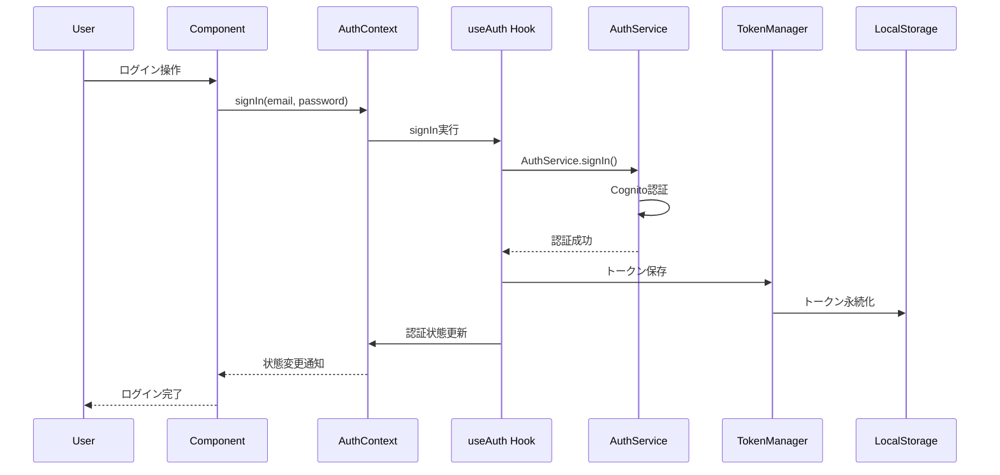

# 設計文書

## 概要

認証状態管理実装は、React Contextパターンを使用してアプリケーション全体の認証状態を一元管理し、トークンの永続化、自動ログアウト、マルチデバイス同期機能を提供します。既存の認証機能を拡張し、より堅牢で使いやすい認証システムを構築します。

## アーキテクチャ

### 全体構成

```
┌─────────────────────────────────────────────────────────────┐
│                    React Application                        │
├─────────────────────────────────────────────────────────────┤
│  ┌─────────────────┐  ┌─────────────────┐  ┌─────────────┐ │
│  │  AuthProvider   │  │ ProtectedRoute  │  │ PublicRoute │ │
│  │                 │  │                 │  │             │ │
│  └─────────────────┘  └─────────────────┘  └─────────────┘ │
├─────────────────────────────────────────────────────────────┤
│  ┌─────────────────┐  ┌─────────────────┐  ┌─────────────┐ │
│  │   useAuth Hook  │  │ useAuthContext  │  │ AuthContext │ │
│  │                 │  │                 │  │             │ │
│  └─────────────────┘  └─────────────────┘  └─────────────┘ │
├─────────────────────────────────────────────────────────────┤
│  ┌─────────────────┐  ┌─────────────────┐  ┌─────────────┐ │
│  │  AuthService    │  │ TokenManager    │  │ StorageSync │ │
│  │                 │  │                 │  │             │ │
│  └─────────────────┘  └─────────────────┘  └─────────────┘ │
├─────────────────────────────────────────────────────────────┤
│  ┌─────────────────┐  ┌─────────────────┐  ┌─────────────┐ │
│  │ LocalStorage    │  │ SessionStorage  │  │ StorageEvent│ │
│  │                 │  │                 │  │             │ │
│  └─────────────────┘  └─────────────────┘  └─────────────┘ │
└─────────────────────────────────────────────────────────────┘
```

### データフロー



## コンポーネントと インターフェース

### 1. AuthContext (拡張)

既存のAuthContextを拡張し、新機能を追加します。

```typescript
interface AuthContextType {
  // 既存機能
  isAuthenticated: boolean;
  isLoading: boolean;
  user: User | null;
  error: string | null;
  signIn: (email: string, password: string) => Promise<void>;
  signUp: (email: string, password: string, name: string) => Promise<void>;
  signOut: () => Promise<void>;
  resetPassword: (email: string) => Promise<void>;
  confirmResetPassword: (email: string, code: string, newPassword: string) => Promise<void>;
  clearError: () => void;
  checkAuthState: () => Promise<void>;

  // 新機能
  refreshToken: () => Promise<void>;
  isTokenExpired: () => boolean;
  getTokenExpirationTime: () => Date | null;
  addAuthStateListener: (listener: AuthStateListener) => () => void;
  removeAuthStateListener: (listener: AuthStateListener) => void;
}

interface AuthStateListener {
  onAuthStateChange: (state: AuthState) => void;
  onTokenExpired: () => void;
  onError: (error: AuthError) => void;
}
```

### 2. TokenManager

トークンの管理と永続化を担当します。

```typescript
interface TokenManager {
  saveToken: (token: string, refreshToken?: string) => void;
  getToken: () => string | null;
  getRefreshToken: () => string | null;
  removeTokens: () => void;
  isTokenExpired: (token?: string) => boolean;
  getTokenExpirationTime: (token?: string) => Date | null;
  refreshToken: () => Promise<string>;
  scheduleTokenRefresh: () => void;
  clearTokenRefreshSchedule: () => void;
}
```

### 3. StorageSync

複数タブ・デバイス間での認証状態同期を担当します。

```typescript
interface StorageSync {
  startSync: () => void;
  stopSync: () => void;
  broadcastAuthStateChange: (state: AuthState) => void;
  onStorageChange: (callback: (event: StorageEvent) => void) => void;
  removeStorageListener: (callback: (event: StorageEvent) => void) => void;
}
```

### 4. ProtectedRoute (拡張)

既存のProtectedRouteを拡張し、より詳細な制御を追加します。

```typescript
interface ProtectedRouteProps {
  children: React.ReactNode;
  redirectTo?: string;
  requiresProfile?: boolean;
  fallback?: React.ReactNode;
  onUnauthorized?: () => void;
}
```

### 5. PublicRoute

認証済みユーザーのアクセスを制御するコンポーネントです。

```typescript
interface PublicRouteProps {
  children: React.ReactNode;
  redirectTo?: string;
  redirectIfAuthenticated?: boolean;
}
```

## データモデル

### AuthState

```typescript
interface AuthState {
  isAuthenticated: boolean;
  isLoading: boolean;
  user: User | null;
  error: AuthError | null;
  tokenExpirationTime: Date | null;
  lastActivity: Date;
  sessionId: string;
}

interface User {
  id: string;
  email: string;
  name: string;
  profileComplete: boolean;
  createdAt: Date;
  updatedAt: Date;
}

interface AuthError {
  code: string;
  message: string;
  timestamp: Date;
  retryable: boolean;
}
```

### StorageKeys

```typescript
const STORAGE_KEYS = {
  ACCESS_TOKEN: 'auth_access_token',
  REFRESH_TOKEN: 'auth_refresh_token',
  USER_DATA: 'auth_user_data',
  SESSION_ID: 'auth_session_id',
  LAST_ACTIVITY: 'auth_last_activity',
  AUTH_STATE: 'auth_state',
} as const;
```

## エラーハンドリング

### エラー分類

1. **認証エラー** - 無効な認証情報、トークン期限切れ
2. **ネットワークエラー** - 接続失敗、タイムアウト
3. **ストレージエラー** - LocalStorage アクセス失敗
4. **同期エラー** - 複数タブ間の状態同期失敗

### エラー処理戦略

```typescript
interface ErrorHandlingStrategy {
  // 自動リトライ対象のエラー
  retryableErrors: string[];
  
  // 自動ログアウト対象のエラー
  logoutErrors: string[];
  
  // ユーザー通知が必要なエラー
  notificationErrors: string[];
  
  // エラー処理メソッド
  handleError: (error: AuthError) => Promise<void>;
  shouldRetry: (error: AuthError, retryCount: number) => boolean;
  shouldLogout: (error: AuthError) => boolean;
}
```

## テスト戦略

### ユニットテスト

1. **useAuth Hook** - 認証状態管理ロジック
2. **TokenManager** - トークン管理機能
3. **StorageSync** - ストレージ同期機能
4. **AuthService** - 認証サービス拡張機能

### 統合テスト

1. **認証フロー** - ログイン〜ログアウトの完全フロー
2. **トークン更新** - 自動トークンリフレッシュ
3. **複数タブ同期** - タブ間での認証状態同期
4. **自動ログアウト** - トークン期限切れ時の処理

### E2Eテスト

1. **保護されたルート** - 認証が必要なページのアクセス制御
2. **セッション永続化** - ブラウザ再起動後の状態復元
3. **自動ログアウト** - 長時間非アクティブ時の処理

## セキュリティ考慮事項

### トークンセキュリティ

1. **安全な保存** - LocalStorageでの暗号化保存
2. **XSS対策** - トークンアクセスの制限
3. **CSRF対策** - SameSite Cookieの使用検討

### セッション管理

1. **セッションタイムアウト** - 非アクティブ時の自動ログアウト
2. **同時セッション制御** - 複数デバイスでのセッション管理
3. **セッション無効化** - 強制ログアウト機能

### データ保護

1. **機密情報の暗号化** - ローカルストレージでの暗号化
2. **ログ出力制御** - 機密情報のログ出力防止
3. **メモリリーク防止** - 適切なクリーンアップ処理

## パフォーマンス最適化

### レンダリング最適化

1. **Context分割** - 認証状態とユーザー情報の分離
2. **メモ化** - 不要な再レンダリングの防止
3. **遅延読み込み** - 認証関連コンポーネントの遅延読み込み

### ストレージ最適化

1. **キャッシュ戦略** - トークン検証結果のキャッシュ
2. **バッチ処理** - 複数の認証操作のバッチ化
3. **圧縮** - ストレージデータの圧縮

## 実装詳細

### フェーズ1: 基盤拡張

1. TokenManagerクラスの実装
2. StorageSyncクラスの実装
3. 既存useAuthフックの拡張

### フェーズ2: 自動化機能

1. 自動トークンリフレッシュ機能
2. 自動ログアウト機能
3. セッションタイムアウト機能

### フェーズ3: 同期機能

1. 複数タブ間の状態同期
2. StorageEventハンドリング
3. 認証状態リスナー機能

### フェーズ4: ルート保護

1. ProtectedRouteコンポーネント拡張
2. PublicRouteコンポーネント実装
3. ルーティング統合

## 運用考慮事項

### 監視・ログ

1. **認証メトリクス** - ログイン成功率、エラー率
2. **パフォーマンス監視** - 認証処理時間
3. **セキュリティログ** - 不正アクセス試行の記録

### 設定管理

1. **環境別設定** - 開発・本番環境での設定分離
2. **機能フラグ** - 新機能の段階的リリース
3. **設定検証** - 起動時の設定値検証

### 互換性

1. **ブラウザ対応** - 主要ブラウザでの動作保証
2. **後方互換性** - 既存コードとの互換性維持
3. **段階的移行** - 新機能への段階的移行計画
