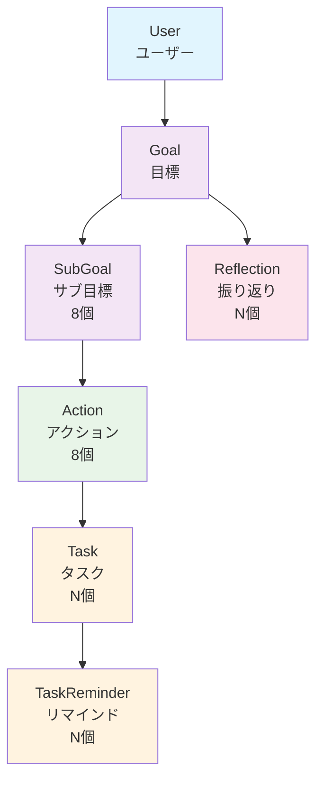
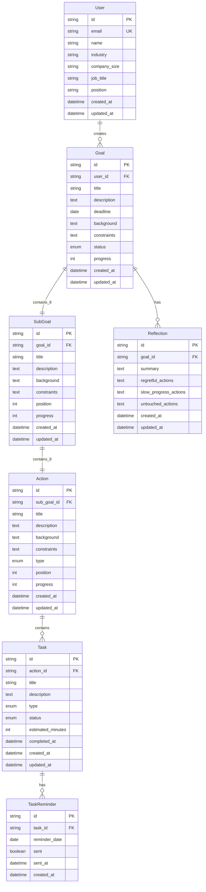

# 設計書

## 概要

曼荼羅目標管理システムのデータベース設計において、エンティティ関連図（ER図）を設計し、システムで扱うデータの構造とリレーションシップを定義する。マンダラチャートの階層構造（目標→サブ目標→アクション→タスク）を適切にモデル化し、データ整合性を保証する設計を行う。

## アーキテクチャ

### データモデル階層構造



### ER図


  
    Goal {
        string id PK
        string user_id FK
        string title
        text description
        date deadline
        text background
        text constraints
        enum status
        int progress
        datetime created_at
        datetime updated_at
    }
  
    SubGoal {
        string id PK
        string goal_id FK
        string title
        text description
        text background
        text constraints
        int position
        int progress
        datetime created_at
        datetime updated_at
    }
  
    Action {
        string id PK
        string sub_goal_id FK
        string title
        text description
        text background
        text constraints
        enum type
        int position
        int progress
        datetime created_at
        datetime updated_at
    }
  
    Task {
        string id PK
        string action_id FK
        string title
        text description
        enum type
        enum status
        int estimated_minutes
        datetime completed_at
        datetime created_at
        datetime updated_at
    }
  
    TaskReminder {
        string id PK
        string task_id FK
        date reminder_date
        boolean sent
        datetime sent_at
        datetime created_at
    }
  
    Reflection {
        string id PK
        string goal_id FK
        text summary
        text regretful_actions
        text slow_progress_actions
        text untouched_actions
        datetime created_at
        datetime updated_at
    }
  
    User ||--o{ Goal : creates
    Goal ||--|| SubGoal : contains_8
    SubGoal ||--|| Action : contains_8
    Action ||--o{ Task : contains
    Task ||--o{ TaskReminder : has
    Goal ||--o{ Reflection : has
```

## コンポーネントとインターフェース

### エンティティ定義

#### User（ユーザー）

システムを利用するユーザーの基本情報を管理する。

```typescript
interface User {
  id: string;           // UUID、主キー
  email: string;        // メールアドレス、ユニーク制約
  name: string;         // 表示名
  industry?: string;    // 業種
  company_size?: string; // 組織規模
  job_title?: string;   // 職種
  position?: string;    // 役職
  created_at: Date;     // 作成日時
  updated_at: Date;     // 更新日時
}
```

#### Goal（目標）

ユーザーが設定する中心目標を管理する。

```typescript
interface Goal {
  id: string;           // UUID、主キー
  user_id: string;      // ユーザーID、外部キー
  title: string;        // 目標タイトル
  description: string;  // 目標説明
  deadline: Date;       // 達成期限
  background: string;   // 背景・理由
  constraints?: string; // 制約事項
  status: GoalStatus;   // 目標状態
  progress: number;     // 進捗率（0-100）
  created_at: Date;     // 作成日時
  updated_at: Date;     // 更新日時
}

enum GoalStatus {
  DRAFT = 'draft',           // 下書き
  ACTIVE = 'active',         // 活動中
  COMPLETED = 'completed',   // 完了
  PAUSED = 'paused',         // 一時停止
  CANCELLED = 'cancelled'    // 中止
}
```

#### SubGoal（サブ目標）

目標を達成するための8つのサブ目標を管理する。

```typescript
interface SubGoal {
  id: string;           // UUID、主キー
  goal_id: string;      // 目標ID、外部キー
  title: string;        // サブ目標タイトル
  description: string;  // サブ目標説明
  background: string;   // 背景・理由
  constraints?: string; // 制約事項
  position: number;     // 位置（0-7）
  progress: number;     // 進捗率（0-100）
  created_at: Date;     // 作成日時
  updated_at: Date;     // 更新日時
}
```

#### Action（アクション）

サブ目標を達成するための8つのアクションを管理する。

```typescript
interface Action {
  id: string;           // UUID、主キー
  sub_goal_id: string;  // サブ目標ID、外部キー
  title: string;        // アクションタイトル
  description: string;  // アクション説明
  background: string;   // 背景・理由
  constraints?: string; // 制約事項
  type: ActionType;     // アクション種別
  position: number;     // 位置（0-7）
  progress: number;     // 進捗率（0-100）
  created_at: Date;     // 作成日時
  updated_at: Date;     // 更新日時
}

enum ActionType {
  EXECUTION = 'execution', // 実行アクション
  HABIT = 'habit'         // 習慣アクション
}
```

#### Task（タスク）

アクションを実行するための具体的なタスクを管理する。

```typescript
interface Task {
  id: string;              // UUID、主キー
  action_id: string;       // アクションID、外部キー
  title: string;           // タスクタイトル
  description?: string;    // タスク説明
  type: TaskType;          // タスク種別
  status: TaskStatus;      // タスク状態
  estimated_minutes: number; // 推定所要時間（分）
  completed_at?: Date;     // 完了日時
  created_at: Date;        // 作成日時
  updated_at: Date;        // 更新日時
}

enum TaskType {
  EXECUTION = 'execution', // 実行タスク
  HABIT = 'habit'         // 習慣タスク
}

enum TaskStatus {
  NOT_STARTED = 'not_started', // 未着手
  IN_PROGRESS = 'in_progress', // 進行中
  COMPLETED = 'completed',     // 完了
  SKIPPED = 'skipped'         // スキップ
}
```

#### TaskReminder（タスクリマインド）

タスクのリマインド情報を管理する。

```typescript
interface TaskReminder {
  id: string;           // UUID、主キー
  task_id: string;      // タスクID、外部キー
  reminder_date: Date;  // リマインド日
  sent: boolean;        // 送信済みフラグ
  sent_at?: Date;       // 送信日時
  created_at: Date;     // 作成日時
}
```

#### Reflection（振り返り）

目標に対する振り返り情報を管理する。

```typescript
interface Reflection {
  id: string;                      // UUID、主キー
  goal_id: string;                 // 目標ID、外部キー
  summary: string;                 // 総括
  regretful_actions?: string;      // 惜しかったアクション
  slow_progress_actions?: string;  // 思ったより進まなかったアクション
  untouched_actions?: string;      // 未着手となったアクション
  created_at: Date;                // 作成日時
  updated_at: Date;                // 更新日時
}
```

## データモデル

### リレーションシップ設計

#### 1:N リレーションシップ

- **User → Goal**: 1人のユーザーは複数の目標を持つ
- **Action → Task**: 1つのアクションは複数のタスクを持つ
- **Task → TaskReminder**: 1つのタスクは複数のリマインドを持つ
- **Goal → Reflection**: 1つの目標は複数の振り返りを持つ

#### 1:8 リレーションシップ（固定）

- **Goal → SubGoal**: 1つの目標は必ず8つのサブ目標を持つ
- **SubGoal → Action**: 1つのサブ目標は必ず8つのアクションを持つ

### 制約条件定義

#### 主キー制約

```sql
-- 全テーブルでUUID型の主キーを使用
ALTER TABLE users ADD CONSTRAINT pk_users PRIMARY KEY (id);
ALTER TABLE goals ADD CONSTRAINT pk_goals PRIMARY KEY (id);
ALTER TABLE sub_goals ADD CONSTRAINT pk_sub_goals PRIMARY KEY (id);
ALTER TABLE actions ADD CONSTRAINT pk_actions PRIMARY KEY (id);
ALTER TABLE tasks ADD CONSTRAINT pk_tasks PRIMARY KEY (id);
ALTER TABLE task_reminders ADD CONSTRAINT pk_task_reminders PRIMARY KEY (id);
ALTER TABLE reflections ADD CONSTRAINT pk_reflections PRIMARY KEY (id);
```

#### 外部キー制約

```sql
-- 参照整合性を保証する外部キー制約
ALTER TABLE goals ADD CONSTRAINT fk_goals_user_id 
  FOREIGN KEY (user_id) REFERENCES users(id) ON DELETE CASCADE;

ALTER TABLE sub_goals ADD CONSTRAINT fk_sub_goals_goal_id 
  FOREIGN KEY (goal_id) REFERENCES goals(id) ON DELETE CASCADE;

ALTER TABLE actions ADD CONSTRAINT fk_actions_sub_goal_id 
  FOREIGN KEY (sub_goal_id) REFERENCES sub_goals(id) ON DELETE CASCADE;

ALTER TABLE tasks ADD CONSTRAINT fk_tasks_action_id 
  FOREIGN KEY (action_id) REFERENCES actions(id) ON DELETE CASCADE;

ALTER TABLE task_reminders ADD CONSTRAINT fk_task_reminders_task_id 
  FOREIGN KEY (task_id) REFERENCES tasks(id) ON DELETE CASCADE;

ALTER TABLE reflections ADD CONSTRAINT fk_reflections_goal_id 
  FOREIGN KEY (goal_id) REFERENCES goals(id) ON DELETE CASCADE;
```

#### ユニーク制約

```sql
-- ユーザーのメールアドレスはユニーク
ALTER TABLE users ADD CONSTRAINT uk_users_email UNIQUE (email);

-- サブ目標の位置は目標内でユニーク
ALTER TABLE sub_goals ADD CONSTRAINT uk_sub_goals_position 
  UNIQUE (goal_id, position);

-- アクションの位置はサブ目標内でユニーク
ALTER TABLE actions ADD CONSTRAINT uk_actions_position 
  UNIQUE (sub_goal_id, position);
```

#### チェック制約

```sql
-- 進捗率は0-100の範囲
ALTER TABLE goals ADD CONSTRAINT ck_goals_progress 
  CHECK (progress >= 0 AND progress <= 100);

ALTER TABLE sub_goals ADD CONSTRAINT ck_sub_goals_progress 
  CHECK (progress >= 0 AND progress <= 100);

ALTER TABLE actions ADD CONSTRAINT ck_actions_progress 
  CHECK (progress >= 0 AND progress <= 100);

-- 位置は0-7の範囲
ALTER TABLE sub_goals ADD CONSTRAINT ck_sub_goals_position 
  CHECK (position >= 0 AND position <= 7);

ALTER TABLE actions ADD CONSTRAINT ck_actions_position 
  CHECK (position >= 0 AND position <= 7);

-- 推定時間は正の値
ALTER TABLE tasks ADD CONSTRAINT ck_tasks_estimated_minutes 
  CHECK (estimated_minutes > 0);
```

### 制約条件定義

#### 主キー制約

```sql
-- 全テーブルでUUID型の主キーを使用
ALTER TABLE users ADD CONSTRAINT pk_users PRIMARY KEY (id);
ALTER TABLE goals ADD CONSTRAINT pk_goals PRIMARY KEY (id);
ALTER TABLE sub_goals ADD CONSTRAINT pk_sub_goals PRIMARY KEY (id);
ALTER TABLE actions ADD CONSTRAINT pk_actions PRIMARY KEY (id);
ALTER TABLE tasks ADD CONSTRAINT pk_tasks PRIMARY KEY (id);
ALTER TABLE task_reminders ADD CONSTRAINT pk_task_reminders PRIMARY KEY (id);
ALTER TABLE reflections ADD CONSTRAINT pk_reflections PRIMARY KEY (id);
```

#### 外部キー制約

```sql
-- 参照整合性を保証する外部キー制約
ALTER TABLE goals ADD CONSTRAINT fk_goals_user_id 
  FOREIGN KEY (user_id) REFERENCES users(id) ON DELETE CASCADE;

ALTER TABLE sub_goals ADD CONSTRAINT fk_sub_goals_goal_id 
  FOREIGN KEY (goal_id) REFERENCES goals(id) ON DELETE CASCADE;

ALTER TABLE actions ADD CONSTRAINT fk_actions_sub_goal_id 
  FOREIGN KEY (sub_goal_id) REFERENCES sub_goals(id) ON DELETE CASCADE;

ALTER TABLE tasks ADD CONSTRAINT fk_tasks_action_id 
  FOREIGN KEY (action_id) REFERENCES actions(id) ON DELETE CASCADE;

ALTER TABLE task_reminders ADD CONSTRAINT fk_task_reminders_task_id 
  FOREIGN KEY (task_id) REFERENCES tasks(id) ON DELETE CASCADE;

ALTER TABLE reflections ADD CONSTRAINT fk_reflections_goal_id 
  FOREIGN KEY (goal_id) REFERENCES goals(id) ON DELETE CASCADE;
```

#### ユニーク制約

```sql
-- ユーザーのメールアドレスはユニーク
ALTER TABLE users ADD CONSTRAINT uk_users_email UNIQUE (email);

-- サブ目標の位置は目標内でユニーク
ALTER TABLE sub_goals ADD CONSTRAINT uk_sub_goals_position 
  UNIQUE (goal_id, position);

-- アクションの位置はサブ目標内でユニーク
ALTER TABLE actions ADD CONSTRAINT uk_actions_position 
  UNIQUE (sub_goal_id, position);
```

#### チェック制約

```sql
-- 進捗率は0-100の範囲
ALTER TABLE goals ADD CONSTRAINT ck_goals_progress 
  CHECK (progress >= 0 AND progress <= 100);

ALTER TABLE sub_goals ADD CONSTRAINT ck_sub_goals_progress 
  CHECK (progress >= 0 AND progress <= 100);

ALTER TABLE actions ADD CONSTRAINT ck_actions_progress 
  CHECK (progress >= 0 AND progress <= 100);

-- 位置は0-7の範囲
ALTER TABLE sub_goals ADD CONSTRAINT ck_sub_goals_position 
  CHECK (position >= 0 AND position <= 7);

ALTER TABLE actions ADD CONSTRAINT ck_actions_position 
  CHECK (position >= 0 AND position <= 7);

-- 推定時間は正の値
ALTER TABLE tasks ADD CONSTRAINT ck_tasks_estimated_minutes 
  CHECK (estimated_minutes > 0);
```

### インデックス設計

#### パフォーマンス最適化インデックス

```sql
-- ユーザーの目標一覧取得用
CREATE INDEX idx_goals_user_id_created_at ON goals(user_id, created_at DESC);

-- 目標のサブ目標取得用
CREATE INDEX idx_sub_goals_goal_id_position ON sub_goals(goal_id, position);

-- サブ目標のアクション取得用
CREATE INDEX idx_actions_sub_goal_id_position ON actions(sub_goal_id, position);

-- アクションのタスク取得用
CREATE INDEX idx_tasks_action_id_status ON tasks(action_id, status);

-- リマインド送信用
CREATE INDEX idx_task_reminders_reminder_date_sent ON task_reminders(reminder_date, sent);

-- 振り返り履歴取得用
CREATE INDEX idx_reflections_goal_id_created_at ON reflections(goal_id, created_at DESC);

-- ユーザーのメール検索用（既にユニーク制約でインデックス作成済み）
-- CREATE INDEX idx_users_email ON users(email);
```

## エラーハンドリング

### データ整合性エラー

1. **外部キー制約違反**
   - 存在しないユーザーIDで目標を作成しようとした場合
   - 削除されたアクションに対してタスクを作成しようとした場合

2. **ユニーク制約違反**
   - 既存のメールアドレスでユーザー登録しようとした場合
   - 同じ位置に複数のサブ目標を配置しようとした場合

3. **チェック制約違反**
   - 進捗率に100を超える値を設定しようとした場合
   - 位置に7を超える値を設定しようとした場合

### ビジネスルール違反

1. **マンダラ構造違反**
   - 8個以外のサブ目標を持つ目標
   - 8個以外のアクションを持つサブ目標

2. **状態遷移エラー**
   - 完了済みの目標に新しいタスクを追加しようとした場合
   - キャンセル済みの目標の進捗を更新しようとした場合

## テスト戦略

### データ整合性テスト

1. **制約テスト**
   - 各制約条件の動作確認
   - 制約違反時のエラーメッセージ確認

2. **カスケード削除テスト**
   - ユーザー削除時の関連データ削除確認
   - 目標削除時の階層データ削除確認

### パフォーマンステスト

1. **インデックス効果測定**
   - 大量データでのクエリ性能測定
   - インデックス使用状況の確認

2. **スケーラビリティテスト**
   - 同時接続数増加時の性能測定
   - データ量増加時の性能劣化確認

## セキュリティ考慮事項

### データアクセス制御

1. **行レベルセキュリティ**
   - ユーザーは自分のデータのみアクセス可能
   - 管理者権限の適切な制御

2. **データ暗号化**
   - 機密情報の暗号化保存
   - 転送時暗号化の実装

### 監査ログ

1. **変更履歴管理**
   - 重要データの変更履歴記録
   - 削除操作の監査ログ

2. **アクセスログ**
   - データアクセスパターンの監視
   - 異常アクセスの検知

## 運用考慮事項

### バックアップ戦略

1. **定期バックアップ**
   - 日次フルバックアップ
   - 時間別差分バックアップ

2. **復旧手順**
   - ポイントインタイム復旧
   - 部分復旧手順

### メンテナンス

1. **統計情報更新**
   - 定期的な統計情報更新
   - インデックス再構築

2. **データクリーンアップ**
   - 古いリマインドデータの削除
   - 不要な履歴データの整理

### インデックス設計

#### パフォーマンス最適化インデックス

```sql
-- ユーザーの目標一覧取得用
CREATE INDEX idx_goals_user_id_created_at ON goals(user_id, created_at DESC);

-- 目標のサブ目標取得用
CREATE INDEX idx_sub_goals_goal_id_position ON sub_goals(goal_id, position);

-- サブ目標のアクション取得用
CREATE INDEX idx_actions_sub_goal_id_position ON actions(sub_goal_id, position);

-- アクションのタスク取得用
CREATE INDEX idx_tasks_action_id_status ON tasks(action_id, status);

-- リマインド送信用
CREATE INDEX idx_task_reminders_reminder_date_sent ON task_reminders(reminder_date, sent);

-- 振り返り履歴取得用
CREATE INDEX idx_reflections_goal_id_created_at ON reflections(goal_id, created_at DESC);

-- ユーザーのメール検索用（既にユニーク制約でインデックス作成済み）
-- CREATE INDEX idx_users_email ON users(email);
```
## エラーハンドリング

### データ整合性エラー

1. **外部キー制約違反**
   - 存在しないユーザーIDで目標を作成しようとした場合
   - 削除されたアクションに対してタスクを作成しようとした場合

2. **ユニーク制約違反**
   - 既存のメールアドレスでユーザー登録しようとした場合
   - 同じ位置に複数のサブ目標を配置しようとした場合

3. **チェック制約違反**
   - 進捗率に100を超える値を設定しようとした場合
   - 位置に7を超える値を設定しようとした場合

### ビジネスルール違反

1. **マンダラ構造違反**
   - 8個以外のサブ目標を持つ目標
   - 8個以外のアクションを持つサブ目標

2. **状態遷移エラー**
   - 完了済みの目標に新しいタスクを追加しようとした場合
   - キャンセル済みの目標の進捗を更新しようとした場合

## テスト戦略

### データ整合性テスト

1. **制約テスト**
   - 各制約条件の動作確認
   - 制約違反時のエラーメッセージ確認

2. **カスケード削除テスト**
   - ユーザー削除時の関連データ削除確認
   - 目標削除時の階層データ削除確認

### パフォーマンステスト

1. **インデックス効果測定**
   - 大量データでのクエリ性能測定
   - インデックス使用状況の確認

2. **スケーラビリティテスト**
   - 同時接続数増加時の性能測定
   - データ量増加時の性能劣化確認

## セキュリティ考慮事項

### データアクセス制御

1. **行レベルセキュリティ**
   - ユーザーは自分のデータのみアクセス可能
   - 管理者権限の適切な制御

2. **データ暗号化**
   - 機密情報の暗号化保存
   - 転送時暗号化の実装

### 監査ログ

1. **変更履歴管理**
   - 重要データの変更履歴記録
   - 削除操作の監査ログ

2. **アクセスログ**
   - データアクセスパターンの監視
   - 異常アクセスの検知

## 運用考慮事項

### バックアップ戦略

1. **定期バックアップ**
   - 日次フルバックアップ
   - 時間別差分バックアップ

2. **復旧手順**
   - ポイントインタイム復旧
   - 部分復旧手順

### メンテナンス

1. **統計情報更新**
   - 定期的な統計情報更新
   - インデックス再構築

2. **データクリーンアップ**
   - 古いリマインドデータの削除
   - 不要な履歴データの整理
### データ整合性検証

#### マンダラ構造検証クエリ

```sql
-- 8個のサブ目標を持たない目標を検出
SELECT g.id, g.title, COUNT(sg.id) as subgoal_count
FROM goals g
LEFT JOIN sub_goals sg ON g.id = sg.goal_id
GROUP BY g.id, g.title
HAVING COUNT(sg.id) != 8;

-- 8個のアクションを持たないサブ目標を検出
SELECT sg.id, sg.title, COUNT(a.id) as action_count
FROM sub_goals sg
LEFT JOIN actions a ON sg.id = a.sub_goal_id
GROUP BY sg.id, sg.title
HAVING COUNT(a.id) != 8;
```

#### 進捗計算整合性検証

```sql
-- アクション進捗とタスク完了率の整合性確認
SELECT a.id, a.title, a.progress,
       ROUND(AVG(CASE WHEN t.status = 'completed' THEN 100 ELSE 0 END)) as calculated_progress
FROM actions a
LEFT JOIN tasks t ON a.id = t.action_id
GROUP BY a.id, a.title, a.progress
HAVING ABS(a.progress - ROUND(AVG(CASE WHEN t.status = 'completed' THEN 100 ELSE 0 END))) > 5;
```
