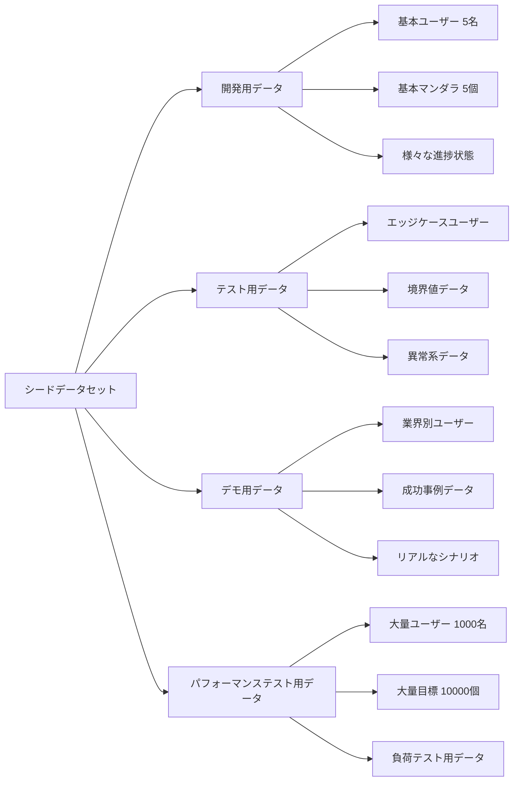

# 設計書

## 概要

曼荼羅目標管理システムの開発・テスト・デモンストレーション用のシードデータを作成し、データベースへの投入・管理機能を実装する。開発効率の向上、テストの自動化、システムデモンストレーションの品質向上を目的とする。

## アーキテクチャ

### シードデータ管理システム構成

```mermaid
graph TD
    A[シードデータ管理システム] --> B[データ定義層]
    A --> C[データ生成層]
    A --> D[データ投入層]
    A --> E[データ管理層]
    
    B --> B1[ユーザーデータ定義]
    B --> B2[マンダラデータ定義]
    B --> B3[進捗データ定義]
    B --> B4[メタデータ定義]
    
    C --> C1[開発用データ生成]
    C --> C2[テスト用データ生成]
    C --> C3[デモ用データ生成]
    C --> C4[パフォーマンステスト用データ生成]
    
    D --> D1[Prismaシード機能]
    D --> D2[トランザクション制御]
    D --> D3[エラーハンドリング]
    D --> D4[ロールバック機能]
    
    E --> E1[データクリーンアップ]
    E --> E2[データ検証]
    E --> E3[環境別管理]
    E --> E4[ログ・監査]
    
    classDef dataClass fill:#e1f5fe
    classDef generationClass fill:#f3e5f5
    classDef insertClass fill:#e8f5e8
    classDef managementClass fill:#fff3e0
    
    class B,B1,B2,B3,B4 dataClass
    class C,C1,C2,C3,C4 generationClass
    class D,D1,D2,D3,D4 insertClass
    class E,E1,E2,E3,E4 managementClass
```



### データセット分類



## コンポーネントとインターフェース

### データ定義インターフェース

#### シードデータ基本構造

```typescript
interface SeedDataSet {
  name: string;
  description: string;
  environment: 'dev' | 'test' | 'demo' | 'performance';
  users: SeedUser[];
  goals: SeedGoal[];
  metadata: SeedMetadata;
}

interface SeedMetadata {
  version: string;
  createdAt: Date;
  author: string;
  tags: string[];
  estimatedRecords: number;
}
```

#### ユーザーシードデータ

```typescript
interface SeedUser {
  id: string;
  email: string;
  name: string;
  industry?: string;
  company_size?: string;
  job_title?: string;
  position?: string;
  profile: UserProfile;
}

interface UserProfile {
  persona: 'individual' | 'corporate' | 'student' | 'freelancer';
  experience_level: 'beginner' | 'intermediate' | 'advanced';
  goal_types: string[];
}
```

#### マンダラシードデータ

```typescript
interface SeedGoal {
  id: string;
  user_id: string;
  title: string;
  description: string;
  deadline: Date;
  background: string;
  constraints?: string;
  status: GoalStatus;
  progress: number;
  sub_goals: SeedSubGoal[];
  reflections: SeedReflection[];
}

interface SeedSubGoal {
  id: string;
  title: string;
  description: string;
  background: string;
  constraints?: string;
  position: number;
  progress: number;
  actions: SeedAction[];
}

interface SeedAction {
  id: string;
  title: string;
  description: string;
  background: string;
  constraints?: string;
  type: ActionType;
  position: number;
  progress: number;
  tasks: SeedTask[];
}

interface SeedTask {
  id: string;
  title: string;
  description?: string;
  type: TaskType;
  status: TaskStatus;
  estimated_minutes: number;
  completed_at?: Date;
  reminders: SeedTaskReminder[];
}

interface SeedTaskReminder {
  id: string;
  reminder_date: Date;
  sent: boolean;
  sent_at?: Date;
}

interface SeedReflection {
  id: string;
  summary: string;
  regretful_actions?: string;
  slow_progress_actions?: string;
  untouched_actions?: string;
}
```

### データ管理機能

#### 環境別データセット管理

```typescript
class EnvironmentManager {
  private dataSets: Map<string, SeedDataSet> = new Map();

  registerDataSet(environment: string, dataSet: SeedDataSet): void {
    this.dataSets.set(environment, dataSet);
  }

  async deployToEnvironment(environment: string): Promise<void> {
    const dataSet = this.dataSets.get(environment);
    if (!dataSet) {
      throw new Error(`データセットが見つかりません: ${environment}`);
    }

    const seedManager = new SeedManager(this.getPrismaClient(environment));
    await seedManager.seedDatabase(dataSet);
  }
}
```

#### データ検証機能

```typescript
class DataValidator {
  validateDataSet(dataSet: SeedDataSet): ValidationResult {
    const errors: string[] = [];

    // マンダラ構造検証
    for (const goal of dataSet.goals) {
      if (goal.sub_goals.length !== 8) {
        errors.push(`目標 ${goal.title} のサブ目標数が8個ではありません`);
      }

      for (const subGoal of goal.sub_goals) {
        if (subGoal.actions.length !== 8) {
          errors.push(`サブ目標 ${subGoal.title} のアクション数が8個ではありません`);
        }
      }
    }

    return { isValid: errors.length === 0, errors };
  }
}
```

## エラーハンドリング

### データ投入エラー

1. **制約違反エラー**
   - 重複するメールアドレス
   - 無効な進捗率値
   - 位置の重複

2. **データ整合性エラー**
   - 存在しない外部キー参照
   - マンダラ構造違反

### 復旧機能

```typescript
class RecoveryManager {
  async rollbackToBackup(backupId: string): Promise<void> {
    // バックアップからの復旧処理
  }

  async createBackup(): Promise<string> {
    // 現在のデータのバックアップ作成
    return 'backup-id';
  }
}
```
