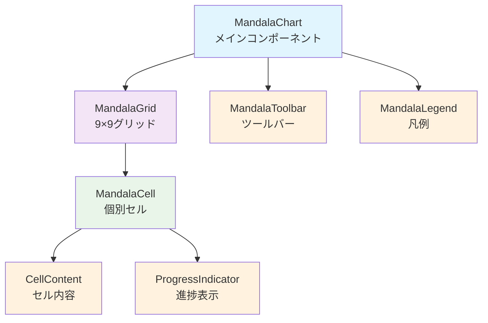
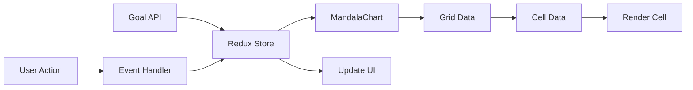

# 設計書

## 概要

曼荼羅目標管理システムにおいて、マンダラチャートを視覚的に表示するReactコンポーネントを設計・実装する。9×9のグリッドレイアウトで目標、サブ目標、アクションを階層的に表示し、進捗状況を色分けで表現する。レスポンシブ対応とアクセシビリティを考慮した実装を行う。

## アーキテクチャ

### コンポーネント構成



### データフロー



## コンポーネント設計

### MandalaChart（メインコンポーネント）

マンダラチャート全体を管理するルートコンポーネント。

```typescript
interface MandalaChartProps {
  goalId: string;
  editable?: boolean;
  onCellClick?: (cellData: CellData) => void;
  onCellEdit?: (cellData: CellData) => void;
  className?: string;
}

interface MandalaChartState {
  goal: Goal | null;
  subGoals: SubGoal[];
  actions: Action[];
  loading: boolean;
  error: string | null;
}

const MandalaChart: React.FC<MandalaChartProps> = ({
  goalId,
  editable = false,
  onCellClick,
  onCellEdit,
  className
}) => {
  // 実装詳細
};
```

### MandalaGrid（グリッドコンポーネント）

9×9のグリッドレイアウトを管理するコンポーネント。

```typescript
interface MandalaGridProps {
  gridData: GridData;
  editable: boolean;
  onCellClick: (cellData: CellData) => void;
  onCellEdit: (cellData: CellData) => void;
  onCellDrag?: (from: Position, to: Position) => void;
}

interface GridData {
  goal: Goal;
  cells: CellData[][];
}

interface Position {
  row: number;
  col: number;
}

const MandalaGrid: React.FC<MandalaGridProps> = ({
  gridData,
  editable,
  onCellClick,
  onCellEdit,
  onCellDrag
}) => {
  // 実装詳細
};
```

### MandalaCell（セルコンポーネント）

個別のセルを表示するコンポーネント。

```typescript
interface MandalaCellProps {
  cellData: CellData;
  position: Position;
  editable: boolean;
  onClick: (cellData: CellData) => void;
  onEdit: (cellData: CellData) => void;
  onDragStart?: (position: Position) => void;
  onDragEnd?: (position: Position) => void;
}

interface CellData {
  id: string;
  type: 'goal' | 'subgoal' | 'action' | 'empty';
  title: string;
  description?: string;
  progress: number;
  status?: string;
  deadline?: Date;
  position: Position;
}

const MandalaCell: React.FC<MandalaCellProps> = ({
  cellData,
  position,
  editable,
  onClick,
  onEdit,
  onDragStart,
  onDragEnd
}) => {
  // 実装詳細
};
```

### CellContent（セル内容コンポーネント）

セル内の表示内容を管理するコンポーネント。

```typescript
interface CellContentProps {
  cellData: CellData;
  compact?: boolean;
}

const CellContent: React.FC<CellContentProps> = ({
  cellData,
  compact = false
}) => {
  // 実装詳細
};
```

### ProgressIndicator（進捗表示コンポーネント）

進捗状況を視覚的に表示するコンポーネント。

```typescript
interface ProgressIndicatorProps {
  progress: number;
  size?: 'small' | 'medium' | 'large';
  showText?: boolean;
  colorScheme?: 'default' | 'mandala';
}

const ProgressIndicator: React.FC<ProgressIndicatorProps> = ({
  progress,
  size = 'medium',
  showText = true,
  colorScheme = 'mandala'
}) => {
  // 実装詳細
};
```

## スタイリング設計

### CSS Grid レイアウト

```css
.mandala-grid {
  display: grid;
  grid-template-columns: repeat(9, 1fr);
  grid-template-rows: repeat(9, 1fr);
  gap: 2px;
  aspect-ratio: 1;
  max-width: 100%;
  background-color: var(--border-color);
}

.mandala-cell {
  background-color: var(--cell-bg);
  border-radius: 4px;
  padding: 8px;
  display: flex;
  flex-direction: column;
  justify-content: center;
  align-items: center;
  text-align: center;
  cursor: pointer;
  transition: all 0.2s ease;
  position: relative;
}

.mandala-cell:hover {
  transform: scale(1.02);
  box-shadow: 0 2px 8px rgba(0, 0, 0, 0.1);
}

.mandala-cell:focus {
  outline: 2px solid var(--focus-color);
  outline-offset: 2px;
}
```

### 進捗色分けシステム

```css
.progress-0 { background-color: #ffebee; border-left: 4px solid #f44336; }
.progress-1-33 { background-color: #fff3e0; border-left: 4px solid #ff9800; }
.progress-34-66 { background-color: #fffde7; border-left: 4px solid #ffeb3b; }
.progress-67-99 { background-color: #f1f8e9; border-left: 4px solid #8bc34a; }
.progress-100 { background-color: #e8f5e8; border-left: 4px solid #4caf50; }
```

### レスポンシブ対応

```css
/* デスクトップ */
@media (min-width: 1024px) {
  .mandala-chart {
    max-width: 800px;
    margin: 0 auto;
  }
  
  .mandala-cell {
    min-height: 80px;
    font-size: 14px;
  }
}

/* タブレット */
@media (min-width: 768px) and (max-width: 1023px) {
  .mandala-chart {
    max-width: 600px;
    margin: 0 auto;
  }
  
  .mandala-cell {
    min-height: 60px;
    font-size: 12px;
  }
}

/* スマートフォン */
@media (max-width: 767px) {
  .mandala-chart {
    overflow-x: auto;
    padding: 16px;
  }
  
  .mandala-grid {
    min-width: 500px;
  }
  
  .mandala-cell {
    min-height: 50px;
    font-size: 10px;
    padding: 4px;
  }
}
```

## データ変換ロジック

### グリッドデータ生成

```typescript
const generateGridData = (goal: Goal, subGoals: SubGoal[], actions: Action[]): GridData => {
  const cells: CellData[][] = Array(9).fill(null).map(() => Array(9).fill(null));
  
  // 中央に目標を配置
  cells[4][4] = {
    id: goal.id,
    type: 'goal',
    title: goal.title,
    description: goal.description,
    progress: goal.progress,
    deadline: goal.deadline,
    position: { row: 4, col: 4 }
  };
  
  // サブ目標を配置
  const subGoalPositions = [
    { row: 1, col: 4 }, // 上
    { row: 1, col: 7 }, // 右上
    { row: 4, col: 7 }, // 右
    { row: 7, col: 7 }, // 右下
    { row: 7, col: 4 }, // 下
    { row: 7, col: 1 }, // 左下
    { row: 4, col: 1 }, // 左
    { row: 1, col: 1 }  // 左上
  ];
  
  subGoals.forEach((subGoal, index) => {
    const pos = subGoalPositions[index];
    cells[pos.row][pos.col] = {
      id: subGoal.id,
      type: 'subgoal',
      title: subGoal.title,
      description: subGoal.description,
      progress: subGoal.progress,
      position: pos
    };
  });
  
  // アクションを配置
  subGoals.forEach((subGoal, subGoalIndex) => {
    const subGoalActions = actions.filter(action => action.sub_goal_id === subGoal.id);
    const blockPositions = getBlockPositions(subGoalIndex);
    
    subGoalActions.forEach((action, actionIndex) => {
      const pos = blockPositions[actionIndex];
      cells[pos.row][pos.col] = {
        id: action.id,
        type: 'action',
        title: action.title,
        description: action.description,
        progress: action.progress,
        status: action.type,
        position: pos
      };
    });
  });
  
  return { goal, cells };
};

const getBlockPositions = (blockIndex: number): Position[] => {
  const blockConfigs = [
    // 上ブロック (0,3-5)
    [
      { row: 0, col: 3 }, { row: 0, col: 4 }, { row: 0, col: 5 },
      { row: 1, col: 3 }, { row: 1, col: 5 },
      { row: 2, col: 3 }, { row: 2, col: 4 }, { row: 2, col: 5 }
    ],
    // 右上ブロック (0-2, 6-8)
    [
      { row: 0, col: 6 }, { row: 0, col: 7 }, { row: 0, col: 8 },
      { row: 1, col: 6 }, { row: 1, col: 8 },
      { row: 2, col: 6 }, { row: 2, col: 7 }, { row: 2, col: 8 }
    ],
    // 他のブロック設定...
  ];
  
  return blockConfigs[blockIndex] || [];
};
```

## アクセシビリティ実装

### ARIA属性設定

```typescript
const getCellAriaLabel = (cellData: CellData): string => {
  const { type, title, progress } = cellData;
  
  switch (type) {
    case 'goal':
      return `目標: ${title}, 進捗: ${progress}%`;
    case 'subgoal':
      return `サブ目標: ${title}, 進捗: ${progress}%`;
    case 'action':
      return `アクション: ${title}, 進捗: ${progress}%`;
    default:
      return '空のセル';
  }
};

const MandalaCell: React.FC<MandalaCellProps> = ({ cellData, ...props }) => {
  return (
    <div
      role="gridcell"
      tabIndex={0}
      aria-label={getCellAriaLabel(cellData)}
      aria-describedby={`cell-${cellData.id}-description`}
      onKeyDown={handleKeyDown}
      {...props}
    >
      {/* セル内容 */}
    </div>
  );
};
```

### キーボードナビゲーション

```typescript
const useKeyboardNavigation = (gridData: GridData) => {
  const [focusPosition, setFocusPosition] = useState<Position>({ row: 4, col: 4 });
  
  const handleKeyDown = useCallback((event: KeyboardEvent) => {
    const { key } = event;
    const { row, col } = focusPosition;
    
    switch (key) {
      case 'ArrowUp':
        event.preventDefault();
        setFocusPosition({ row: Math.max(0, row - 1), col });
        break;
      case 'ArrowDown':
        event.preventDefault();
        setFocusPosition({ row: Math.min(8, row + 1), col });
        break;
      case 'ArrowLeft':
        event.preventDefault();
        setFocusPosition({ row, col: Math.max(0, col - 1) });
        break;
      case 'ArrowRight':
        event.preventDefault();
        setFocusPosition({ row, col: Math.min(8, col + 1) });
        break;
      case 'Enter':
      case ' ':
        event.preventDefault();
        // セルアクション実行
        break;
    }
  }, [focusPosition]);
  
  return { focusPosition, handleKeyDown };
};
```

## パフォーマンス最適化

### 仮想化実装

```typescript
const VirtualizedMandalaGrid: React.FC<MandalaGridProps> = ({ gridData, ...props }) => {
  const [visibleCells, setVisibleCells] = useState<Position[]>([]);
  const containerRef = useRef<HTMLDivElement>(null);
  
  useEffect(() => {
    const updateVisibleCells = () => {
      if (!containerRef.current) return;
      
      const container = containerRef.current;
      const { scrollTop, scrollLeft, clientHeight, clientWidth } = container;
      
      // 表示領域内のセルを計算
      const cellSize = 80; // セルサイズ
      const startRow = Math.floor(scrollTop / cellSize);
      const endRow = Math.min(8, Math.ceil((scrollTop + clientHeight) / cellSize));
      const startCol = Math.floor(scrollLeft / cellSize);
      const endCol = Math.min(8, Math.ceil((scrollLeft + clientWidth) / cellSize));
      
      const visible: Position[] = [];
      for (let row = startRow; row <= endRow; row++) {
        for (let col = startCol; col <= endCol; col++) {
          visible.push({ row, col });
        }
      }
      
      setVisibleCells(visible);
    };
    
    updateVisibleCells();
    const container = containerRef.current;
    container?.addEventListener('scroll', updateVisibleCells);
    
    return () => container?.removeEventListener('scroll', updateVisibleCells);
  }, []);
  
  return (
    <div ref={containerRef} className="virtualized-grid">
      {visibleCells.map(({ row, col }) => (
        <MandalaCell
          key={`${row}-${col}`}
          cellData={gridData.cells[row][col]}
          position={{ row, col }}
          {...props}
        />
      ))}
    </div>
  );
};
```

### メモ化最適化

```typescript
const MemoizedMandalaCell = React.memo<MandalaCellProps>(
  ({ cellData, position, ...props }) => {
    return <MandalaCell cellData={cellData} position={position} {...props} />;
  },
  (prevProps, nextProps) => {
    return (
      prevProps.cellData.id === nextProps.cellData.id &&
      prevProps.cellData.progress === nextProps.cellData.progress &&
      prevProps.cellData.title === nextProps.cellData.title &&
      prevProps.editable === nextProps.editable
    );
  }
);
```

## エラーハンドリング

### エラー境界実装

```typescript
interface MandalaErrorBoundaryState {
  hasError: boolean;
  error: Error | null;
}

class MandalaErrorBoundary extends React.Component<
  React.PropsWithChildren<{}>,
  MandalaErrorBoundaryState
> {
  constructor(props: React.PropsWithChildren<{}>) {
    super(props);
    this.state = { hasError: false, error: null };
  }
  
  static getDerivedStateFromError(error: Error): MandalaErrorBoundaryState {
    return { hasError: true, error };
  }
  
  componentDidCatch(error: Error, errorInfo: React.ErrorInfo) {
    console.error('Mandala Chart Error:', error, errorInfo);
    // エラー報告サービスに送信
  }
  
  render() {
    if (this.state.hasError) {
      return (
        <div className="mandala-error">
          <h3>マンダラチャートの表示でエラーが発生しました</h3>
          <p>ページを再読み込みしてください。</p>
          <button onClick={() => window.location.reload()}>
            再読み込み
          </button>
        </div>
      );
    }
    
    return this.props.children;
  }
}
```

### データ検証

```typescript
const validateGridData = (gridData: GridData): ValidationResult => {
  const errors: string[] = [];
  
  // 目標の存在確認
  if (!gridData.goal) {
    errors.push('目標データが存在しません');
  }
  
  // セルデータの整合性確認
  const { cells } = gridData;
  if (!cells || cells.length !== 9 || cells.some(row => row.length !== 9)) {
    errors.push('グリッドデータの構造が不正です');
  }
  
  // 中央セルの確認
  if (!cells[4][4] || cells[4][4].type !== 'goal') {
    errors.push('中央セルに目標が配置されていません');
  }
  
  return {
    isValid: errors.length === 0,
    errors
  };
};
```

## テスト戦略

### ユニットテスト

```typescript
describe('MandalaChart', () => {
  const mockGoal: Goal = {
    id: '1',
    title: 'テスト目標',
    progress: 50,
    // その他のプロパティ
  };
  
  it('正常にレンダリングされる', () => {
    render(<MandalaChart goalId="1" />);
    expect(screen.getByRole('grid')).toBeInTheDocument();
  });
  
  it('9×9のセルが表示される', () => {
    render(<MandalaChart goalId="1" />);
    const cells = screen.getAllByRole('gridcell');
    expect(cells).toHaveLength(81);
  });
  
  it('セルクリック時にコールバックが呼ばれる', () => {
    const onCellClick = jest.fn();
    render(<MandalaChart goalId="1" onCellClick={onCellClick} />);
    
    const goalCell = screen.getByLabelText(/目標:/);
    fireEvent.click(goalCell);
    
    expect(onCellClick).toHaveBeenCalledWith(
      expect.objectContaining({ type: 'goal' })
    );
  });
});
```

### E2Eテスト

```typescript
test('マンダラチャートの表示と操作', async ({ page }) => {
  await page.goto('/mandala/1');
  
  // マンダラチャートの表示確認
  await expect(page.locator('.mandala-grid')).toBeVisible();
  
  // セル数の確認
  const cells = page.locator('.mandala-cell');
  await expect(cells).toHaveCount(81);
  
  // 中央セル（目標）の確認
  const goalCell = page.locator('.mandala-cell').nth(40); // 中央セル
  await expect(goalCell).toContainText('テスト目標');
  
  // セルクリック操作
  await goalCell.click();
  await expect(page.locator('.goal-detail-modal')).toBeVisible();
  
  // キーボードナビゲーション
  await goalCell.focus();
  await page.keyboard.press('ArrowRight');
  await expect(page.locator('.mandala-cell:focus')).not.toBe(goalCell);
});
```

## セキュリティ考慮事項

### XSS対策

```typescript
const sanitizeText = (text: string): string => {
  return text
    .replace(/&/g, '&amp;')
    .replace(/</g, '&lt;')
    .replace(/>/g, '&gt;')
    .replace(/"/g, '&quot;')
    .replace(/'/g, '&#x27;');
};

const CellContent: React.FC<CellContentProps> = ({ cellData }) => {
  return (
    <div>
      <h4>{sanitizeText(cellData.title)}</h4>
      {cellData.description && (
        <p>{sanitizeText(cellData.description)}</p>
      )}
    </div>
  );
};
```

### データ検証

```typescript
const validateCellData = (cellData: unknown): cellData is CellData => {
  if (!cellData || typeof cellData !== 'object') return false;
  
  const data = cellData as Record<string, unknown>;
  
  return (
    typeof data.id === 'string' &&
    ['goal', 'subgoal', 'action', 'empty'].includes(data.type as string) &&
    typeof data.title === 'string' &&
    typeof data.progress === 'number' &&
    data.progress >= 0 && data.progress <= 100
  );
};
```
