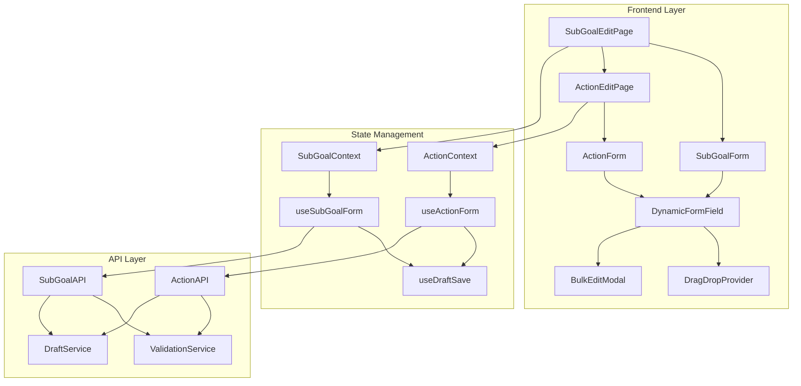
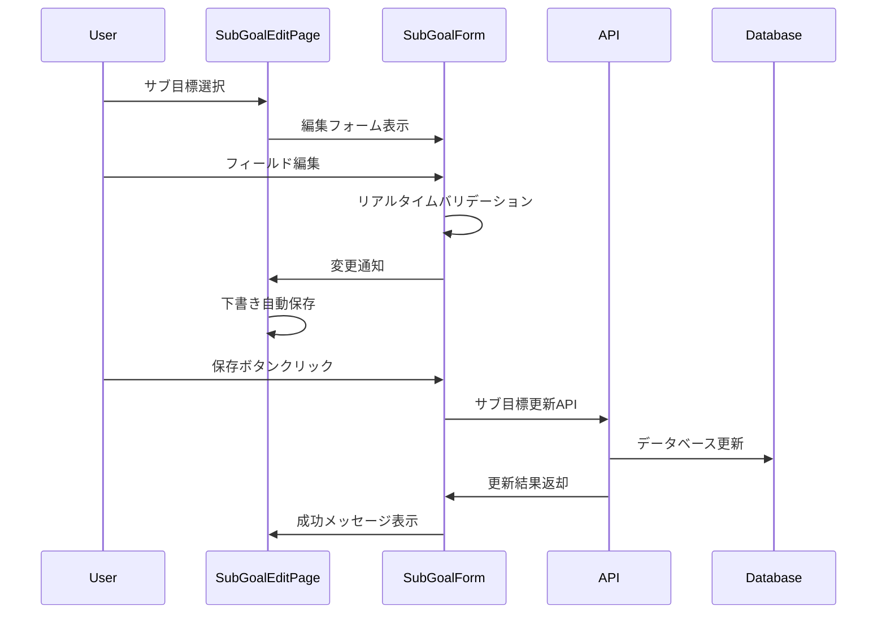
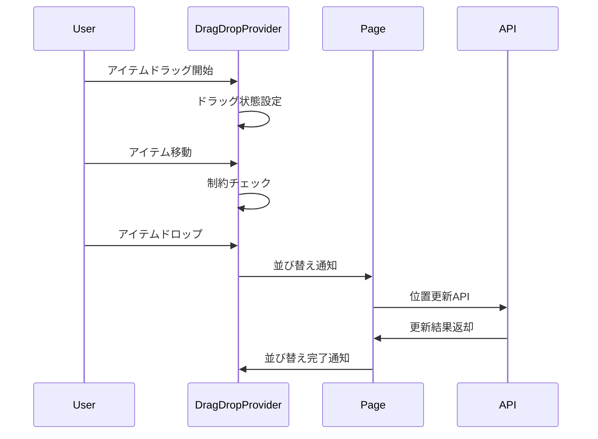

# 設計書

## 概要

サブ目標・アクション入力フォーム機能の詳細設計を定義します。AI生成されたサブ目標（8個）とアクション（64個）を効率的に確認・編集できるユーザーインターフェースを提供します。

## アーキテクチャ

### システム構成



## コンポーネント設計

### 1. SubGoalEditPage コンポーネント

**責務:** サブ目標確認・編集画面の全体制御

```typescript
interface SubGoalEditPageProps {
  goalId: string;
  onComplete: (subGoals: SubGoal[]) => void;
  onBack: () => void;
}

interface SubGoalEditPageState {
  subGoals: SubGoal[];
  selectedSubGoal: SubGoal | null;
  isLoading: boolean;
  isDirty: boolean;
  validationErrors: ValidationError[];
}
```

**主要機能:**
- 8つのサブ目標の一覧表示
- 個別サブ目標の選択・編集
- ドラッグ&ドロップによる並び替え
- 一括編集モード
- AI再生成機能

### 2. ActionEditPage コンポーネント

**責務:** アクション確認・編集画面の全体制御

```typescript
interface ActionEditPageProps {
  goalId: string;
  subGoals: SubGoal[];
  onComplete: (actions: Action[]) => void;
  onBack: () => void;
}

interface ActionEditPageState {
  actions: Action[];
  selectedSubGoalId: string | null;
  selectedAction: Action | null;
  isLoading: boolean;
  isDirty: boolean;
  validationErrors: ValidationError[];
}
```

**主要機能:**
- サブ目標別アクション表示（8×8=64個）
- サブ目標切り替えタブ
- アクション種別設定（実行/習慣）
- ドラッグ&ドロップによる並び替え
- 一括編集モード

### 3. DynamicFormField コンポーネント

**責務:** 動的フォームフィールドの提供

```typescript
interface DynamicFormFieldProps {
  field: FormFieldConfig;
  value: any;
  onChange: (value: any) => void;
  onBlur?: () => void;
  error?: string;
  disabled?: boolean;
  autoFocus?: boolean;
}

interface FormFieldConfig {
  name: string;
  type: 'text' | 'textarea' | 'select' | 'radio';
  label: string;
  placeholder?: string;
  required: boolean;
  maxLength?: number;
  minLength?: number;
  validation?: ValidationRule[];
}
```

**主要機能:**
- リアルタイムバリデーション
- 文字数カウント表示
- エラーメッセージ表示
- アクセシビリティ対応

### 4. DragDropProvider コンポーネント

**責務:** ドラッグ&ドロップ機能の提供

```typescript
interface DragDropProviderProps {
  items: DraggableItem[];
  onReorder: (newOrder: DraggableItem[]) => void;
  constraints?: DragConstraints;
  children: React.ReactNode;
}

interface DraggableItem {
  id: string;
  position: number;
  type: 'subgoal' | 'action';
  parentId?: string; // アクションの場合はサブ目標ID
}

interface DragConstraints {
  allowCrossGroup: boolean;
  maxItems?: number;
  minItems?: number;
}
```

**主要機能:**
- タッチデバイス対応
- 視覚的フィードバック
- 制約チェック
- アニメーション効果

### 5. BulkEditModal コンポーネント

**責務:** 一括編集機能の提供

```typescript
interface BulkEditModalProps {
  isOpen: boolean;
  selectedItems: (SubGoal | Action)[];
  onClose: () => void;
  onSave: (changes: BulkEditChanges) => void;
}

interface BulkEditChanges {
  commonFields: Record<string, any>;
  individualChanges: Record<string, Record<string, any>>;
  deleteItems: string[];
}
```

**主要機能:**
- 共通フィールド一括変更
- 個別項目の個別変更
- 一括削除機能
- 変更プレビュー

## データフロー設計

### 1. サブ目標編集フロー



### 2. ドラッグ&ドロップフロー



## 状態管理設計

### 1. SubGoalContext

```typescript
interface SubGoalContextValue {
  // 状態
  subGoals: SubGoal[];
  selectedSubGoal: SubGoal | null;
  isLoading: boolean;
  isDirty: boolean;
  validationErrors: ValidationError[];
  
  // アクション
  loadSubGoals: (goalId: string) => Promise<void>;
  selectSubGoal: (subGoal: SubGoal) => void;
  updateSubGoal: (id: string, changes: Partial<SubGoal>) => void;
  reorderSubGoals: (newOrder: SubGoal[]) => void;
  bulkUpdateSubGoals: (changes: BulkEditChanges) => void;
  regenerateSubGoals: (goalId: string) => Promise<void>;
  saveDraft: () => Promise<void>;
  restoreDraft: () => Promise<void>;
}
```

### 2. ActionContext

```typescript
interface ActionContextValue {
  // 状態
  actions: Action[];
  selectedSubGoalId: string | null;
  selectedAction: Action | null;
  isLoading: boolean;
  isDirty: boolean;
  validationErrors: ValidationError[];
  
  // アクション
  loadActions: (goalId: string) => Promise<void>;
  selectSubGoal: (subGoalId: string) => void;
  selectAction: (action: Action) => void;
  updateAction: (id: string, changes: Partial<Action>) => void;
  reorderActions: (subGoalId: string, newOrder: Action[]) => void;
  bulkUpdateActions: (changes: BulkEditChanges) => void;
  saveDraft: () => Promise<void>;
  restoreDraft: () => Promise<void>;
}
```

## API設計

### 1. サブ目標API

```typescript
// GET /api/goals/{goalId}/subgoals
interface GetSubGoalsResponse {
  subGoals: SubGoal[];
  total: number;
}

// PUT /api/subgoals/{id}
interface UpdateSubGoalRequest {
  title: string;
  description: string;
  background: string;
  constraints?: string;
  position: number;
}

// PUT /api/goals/{goalId}/subgoals/reorder
interface ReorderSubGoalsRequest {
  subGoals: Array<{
    id: string;
    position: number;
  }>;
}

// POST /api/goals/{goalId}/subgoals/bulk-update
interface BulkUpdateSubGoalsRequest {
  updates: Array<{
    id: string;
    changes: Partial<SubGoal>;
  }>;
  deletes: string[];
}

// POST /api/goals/{goalId}/subgoals/regenerate
interface RegenerateSubGoalsRequest {
  goalId: string;
  preserveCustomizations: boolean;
}
```

### 2. アクションAPI

```typescript
// GET /api/goals/{goalId}/actions
interface GetActionsResponse {
  actions: Action[];
  total: number;
  groupedBySubGoal: Record<string, Action[]>;
}

// PUT /api/actions/{id}
interface UpdateActionRequest {
  title: string;
  description: string;
  background: string;
  constraints?: string;
  type: ActionType;
  position: number;
}

// PUT /api/subgoals/{subGoalId}/actions/reorder
interface ReorderActionsRequest {
  actions: Array<{
    id: string;
    position: number;
  }>;
}

// POST /api/goals/{goalId}/actions/bulk-update
interface BulkUpdateActionsRequest {
  updates: Array<{
    id: string;
    changes: Partial<Action>;
  }>;
  deletes: string[];
}
```

## バリデーション設計

### 1. フィールドバリデーション

```typescript
interface ValidationRule {
  type: 'required' | 'minLength' | 'maxLength' | 'pattern' | 'custom';
  value?: any;
  message: string;
  validator?: (value: any) => boolean;
}

const subGoalValidationRules: Record<string, ValidationRule[]> = {
  title: [
    { type: 'required', message: 'タイトルは必須です' },
    { type: 'minLength', value: 1, message: 'タイトルを入力してください' },
    { type: 'maxLength', value: 100, message: 'タイトルは100文字以内で入力してください' }
  ],
  description: [
    { type: 'required', message: '説明は必須です' },
    { type: 'minLength', value: 10, message: '説明は10文字以上で入力してください' },
    { type: 'maxLength', value: 500, message: '説明は500文字以内で入力してください' }
  ],
  background: [
    { type: 'required', message: '背景は必須です' },
    { type: 'minLength', value: 10, message: '背景は10文字以上で入力してください' },
    { type: 'maxLength', value: 500, message: '背景は500文字以内で入力してください' }
  ],
  constraints: [
    { type: 'maxLength', value: 300, message: '制約事項は300文字以内で入力してください' }
  ]
};
```

### 2. ビジネスロジックバリデーション

```typescript
interface BusinessValidationRule {
  name: string;
  validator: (data: any, context: any) => ValidationResult;
  message: string;
}

const businessValidationRules: BusinessValidationRule[] = [
  {
    name: 'uniqueSubGoalTitles',
    validator: (subGoals: SubGoal[]) => {
      const titles = subGoals.map(sg => sg.title.toLowerCase());
      return titles.length === new Set(titles).size;
    },
    message: 'サブ目標のタイトルは重複できません'
  },
  {
    name: 'completeSubGoalSet',
    validator: (subGoals: SubGoal[]) => {
      return subGoals.length === 8;
    },
    message: 'サブ目標は8個必要です'
  },
  {
    name: 'completeActionSet',
    validator: (actions: Action[], subGoalId: string) => {
      const subGoalActions = actions.filter(a => a.sub_goal_id === subGoalId);
      return subGoalActions.length === 8;
    },
    message: '各サブ目標にはアクションが8個必要です'
  }
];
```

## エラーハンドリング設計

### 1. エラー分類

```typescript
enum FormErrorType {
  VALIDATION_ERROR = 'validation_error',
  NETWORK_ERROR = 'network_error',
  SERVER_ERROR = 'server_error',
  BUSINESS_LOGIC_ERROR = 'business_logic_error',
  DRAFT_SAVE_ERROR = 'draft_save_error'
}

interface FormError {
  type: FormErrorType;
  field?: string;
  message: string;
  code?: string;
  details?: any;
}
```

### 2. エラー表示戦略

```typescript
interface ErrorDisplayStrategy {
  inline: boolean;      // フィールド横にエラー表示
  toast: boolean;       // トースト通知
  modal: boolean;       // モーダルダイアログ
  summary: boolean;     // ページ上部にサマリー表示
}

const errorDisplayStrategies: Record<FormErrorType, ErrorDisplayStrategy> = {
  [FormErrorType.VALIDATION_ERROR]: {
    inline: true,
    toast: false,
    modal: false,
    summary: true
  },
  [FormErrorType.NETWORK_ERROR]: {
    inline: false,
    toast: true,
    modal: false,
    summary: false
  },
  [FormErrorType.SERVER_ERROR]: {
    inline: false,
    toast: false,
    modal: true,
    summary: false
  },
  [FormErrorType.BUSINESS_LOGIC_ERROR]: {
    inline: true,
    toast: true,
    modal: false,
    summary: true
  },
  [FormErrorType.DRAFT_SAVE_ERROR]: {
    inline: false,
    toast: true,
    modal: false,
    summary: false
  }
};
```

## パフォーマンス最適化

### 1. レンダリング最適化

- React.memo による不要な再レンダリング防止
- useMemo による計算結果のメモ化
- useCallback による関数の再生成防止
- 仮想スクロール（64個のアクション表示時）

### 2. データ取得最適化

- React Query による API キャッシュ
- 楽観的更新による UX 向上
- バックグラウンド更新
- エラー時の自動リトライ

### 3. 下書き保存最適化

- デバウンス処理による API 呼び出し削減
- 差分検出による不要な保存防止
- ローカルストレージによる一時保存
- 圧縮による保存サイズ削減

## テスト戦略

### 1. ユニットテスト

- コンポーネントの単体テスト
- カスタムフックのテスト
- バリデーション関数のテスト
- ユーティリティ関数のテスト

### 2. 統合テスト

- フォーム送信フローのテスト
- ドラッグ&ドロップ機能のテスト
- 一括編集機能のテスト
- 下書き保存・復元のテスト

### 3. E2Eテスト

- サブ目標編集フローのテスト
- アクション編集フローのテスト
- レスポンシブ対応のテスト
- アクセシビリティのテスト

## セキュリティ考慮事項

### 1. 入力検証

- XSS 攻撃対策（入力値のサニタイズ）
- SQL インジェクション対策（パラメータ化クエリ）
- CSRF 攻撃対策（トークン検証）

### 2. 認証・認可

- JWT トークンによる認証
- ユーザー所有権の検証
- API エンドポイントの認可チェック

### 3. データ保護

- 機密情報のマスキング
- ログ出力時の個人情報除外
- 通信の暗号化（HTTPS）
