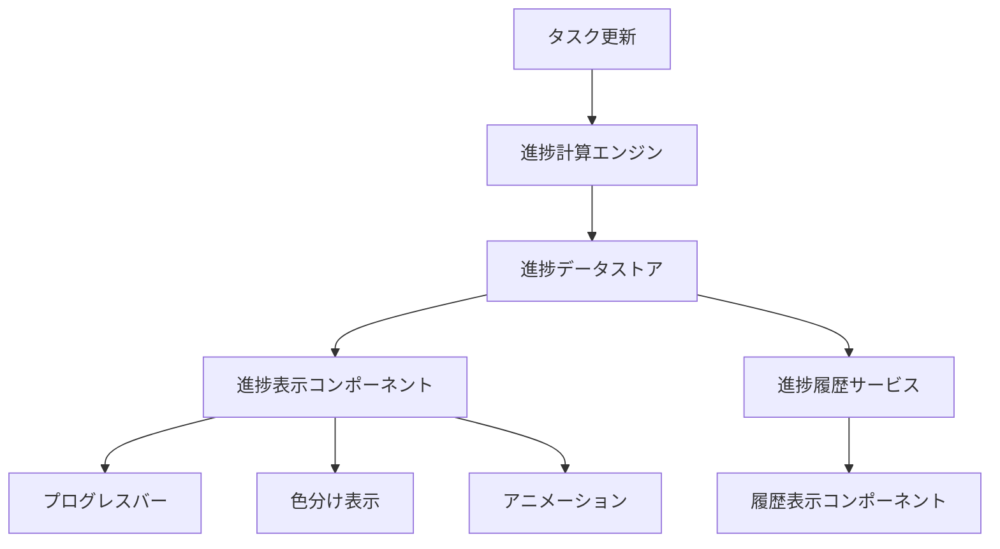
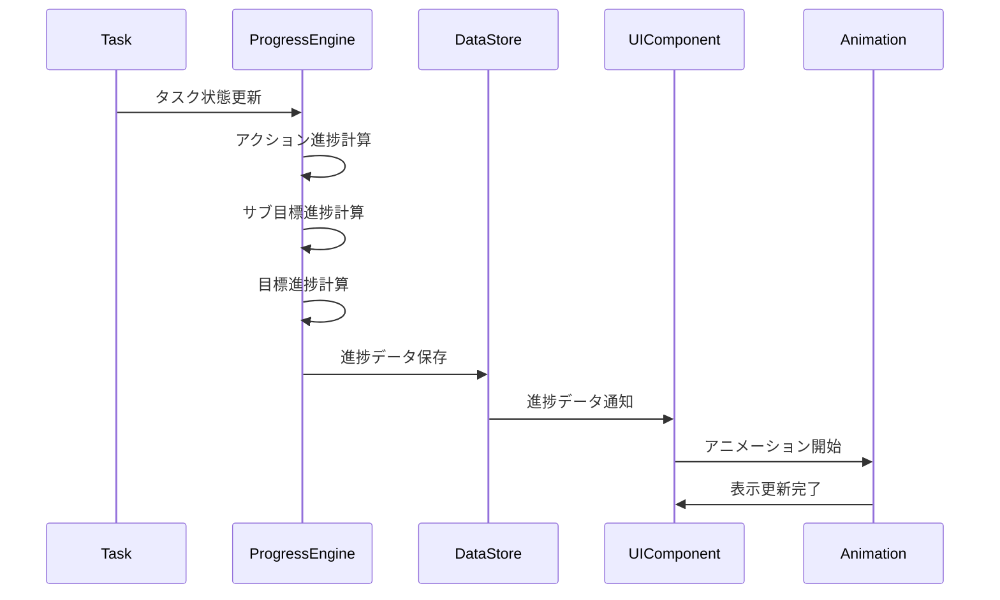

# 設計書

## 概要

マンダラチャートシステムの進捗表示機能を実装するための設計書です。階層的な進捗計算、視覚的な表示コンポーネント、アニメーション効果、履歴表示機能を含む包括的な進捗管理システムを設計します。

## アーキテクチャ

### システム構成



### データフロー



## コンポーネント設計

### 1. 進捗計算エンジン (ProgressCalculationEngine)

#### 責務
- 階層的な進捗計算の実行
- 進捗データの整合性保証
- 計算結果のキャッシュ管理

#### インターフェース

```typescript
interface ProgressCalculationEngine {
  calculateTaskProgress(taskId: string): Promise<number>;
  calculateActionProgress(actionId: string): Promise<number>;
  calculateSubGoalProgress(subGoalId: string): Promise<number>;
  calculateGoalProgress(goalId: string): Promise<number>;
  recalculateFromTask(taskId: string): Promise<ProgressHierarchy>;
}

interface ProgressHierarchy {
  task: TaskProgress;
  action: ActionProgress;
  subGoal: SubGoalProgress;
  goal: GoalProgress;
}
```

#### 計算ロジック

**実行アクション進捗計算:**
```typescript
const executionActionProgress = (completedTasks: number, totalTasks: number): number => {
  return totalTasks > 0 ? (completedTasks / totalTasks) * 100 : 0;
};
```

**習慣アクション進捗計算:**
```typescript
const habitActionProgress = (continuousDays: number, targetDays: number): number => {
  const requiredDays = Math.ceil(targetDays * 0.8); // 80%継続で達成
  return Math.min((continuousDays / requiredDays) * 100, 100);
};
```

**サブ目標進捗計算:**
```typescript
const subGoalProgress = (actionProgresses: number[]): number => {
  return actionProgresses.reduce((sum, progress) => sum + progress, 0) / actionProgresses.length;
};
```

**目標進捗計算:**
```typescript
const goalProgress = (subGoalProgresses: number[]): number => {
  return subGoalProgresses.reduce((sum, progress) => sum + progress, 0) / subGoalProgresses.length;
};
```

### 2. プログレスバーコンポーネント (ProgressBar)

#### プロパティ

```typescript
interface ProgressBarProps {
  value: number; // 0-100
  size?: 'small' | 'medium' | 'large';
  showLabel?: boolean;
  animated?: boolean;
  colorScheme?: 'default' | 'success' | 'warning' | 'danger';
  tooltip?: string;
  className?: string;
}
```

#### 色分けルール

```typescript
const getProgressColor = (progress: number): string => {
  if (progress === 0) return 'bg-gray-200';
  if (progress < 50) return 'bg-red-400';
  if (progress < 80) return 'bg-yellow-400';
  return 'bg-green-400';
};
```

#### スタイル定義

```css
.progress-bar {
  @apply w-full bg-gray-200 rounded-full overflow-hidden;
  height: var(--progress-height, 8px);
}

.progress-fill {
  @apply h-full transition-all duration-300 ease-out;
  transform-origin: left;
}

.progress-fill.animated {
  animation: progressFill 0.8s ease-out;
}

@keyframes progressFill {
  from { transform: scaleX(0); }
  to { transform: scaleX(1); }
}
```

### 3. マンダラセル色分け表示 (MandalaCell)

#### 色分けスキーム

```typescript
interface ColorScheme {
  background: string;
  border: string;
  text: string;
}

const getColorScheme = (progress: number): ColorScheme => {
  const schemes = {
    0: { background: 'bg-gray-100', border: 'border-gray-300', text: 'text-gray-600' },
    1: { background: 'bg-red-50', border: 'border-red-200', text: 'text-red-700' },
    50: { background: 'bg-yellow-50', border: 'border-yellow-200', text: 'text-yellow-700' },
    80: { background: 'bg-green-50', border: 'border-green-200', text: 'text-green-700' },
    100: { background: 'bg-green-100', border: 'border-green-400', text: 'text-green-800' }
  };

  if (progress === 0) return schemes[0];
  if (progress < 50) return schemes[1];
  if (progress < 80) return schemes[50];
  if (progress < 100) return schemes[80];
  return schemes[100];
};
```

### 4. アニメーションシステム (AnimationController)

#### アニメーション種類

```typescript
interface AnimationConfig {
  duration: number;
  easing: string;
  delay?: number;
}

const animationConfigs = {
  progressUpdate: { duration: 300, easing: 'ease-out' },
  colorChange: { duration: 300, easing: 'ease-in-out' },
  completion: { duration: 600, easing: 'ease-out', delay: 100 }
};
```

#### 完了アニメーション

```typescript
const completionAnimation = {
  keyframes: [
    { transform: 'scale(1)', boxShadow: '0 0 0 0 rgba(34, 197, 94, 0.7)' },
    { transform: 'scale(1.05)', boxShadow: '0 0 0 10px rgba(34, 197, 94, 0)' },
    { transform: 'scale(1)', boxShadow: '0 0 0 0 rgba(34, 197, 94, 0)' }
  ],
  options: { duration: 600, easing: 'ease-out' }
};
```

### 5. 進捗履歴サービス (ProgressHistoryService)

#### データモデル

```typescript
interface ProgressHistoryEntry {
  id: string;
  entityId: string;
  entityType: 'goal' | 'subgoal' | 'action' | 'task';
  progress: number;
  timestamp: Date;
  changeReason?: string;
}

interface ProgressHistoryQuery {
  entityId: string;
  entityType: string;
  startDate: Date;
  endDate: Date;
  granularity?: 'day' | 'week' | 'month';
}
```

#### API設計

```typescript
interface ProgressHistoryService {
  recordProgress(entry: Omit<ProgressHistoryEntry, 'id' | 'timestamp'>): Promise<void>;
  getProgressHistory(query: ProgressHistoryQuery): Promise<ProgressHistoryEntry[]>;
  getProgressTrend(entityId: string, days: number): Promise<ProgressTrend>;
  getSignificantChanges(entityId: string, threshold: number): Promise<ProgressHistoryEntry[]>;
}

interface ProgressTrend {
  direction: 'increasing' | 'decreasing' | 'stable';
  rate: number; // 変化率（%/日）
  confidence: number; // 信頼度（0-1）
}
```

### 6. 履歴表示コンポーネント (ProgressHistoryChart)

#### チャートライブラリ選定
- **Chart.js**: 軽量で豊富な機能
- **Recharts**: React専用、TypeScript対応
- **Victory**: モジュラー設計、カスタマイズ性

#### 推奨: Recharts

```typescript
interface ProgressHistoryChartProps {
  data: ProgressHistoryEntry[];
  width?: number;
  height?: number;
  showGrid?: boolean;
  showTooltip?: boolean;
  highlightSignificantChanges?: boolean;
}
```

#### チャート設定

```typescript
const chartConfig = {
  margin: { top: 20, right: 30, left: 20, bottom: 20 },
  grid: { strokeDasharray: '3 3', stroke: '#e0e0e0' },
  line: { stroke: '#3b82f6', strokeWidth: 2 },
  dot: { fill: '#3b82f6', strokeWidth: 2, r: 4 },
  tooltip: {
    contentStyle: {
      backgroundColor: '#f8fafc',
      border: '1px solid #e2e8f0',
      borderRadius: '6px'
    }
  }
};
```

## データモデル

### 進捗データ構造

```typescript
interface ProgressData {
  entityId: string;
  entityType: 'goal' | 'subgoal' | 'action' | 'task';
  currentProgress: number;
  previousProgress: number;
  lastUpdated: Date;
  calculationMethod: 'completion' | 'continuity' | 'average';
  metadata?: {
    totalTasks?: number;
    completedTasks?: number;
    continuousDays?: number;
    targetDays?: number;
  };
}
```

### キャッシュ戦略

```typescript
interface ProgressCache {
  key: string; // `${entityType}:${entityId}`
  data: ProgressData;
  expiresAt: Date;
  dependencies: string[]; // 依存する他のエンティティのキー
}
```

## エラーハンドリング

### エラー種類

```typescript
enum ProgressCalculationError {
  INVALID_ENTITY = 'INVALID_ENTITY',
  CIRCULAR_DEPENDENCY = 'CIRCULAR_DEPENDENCY',
  CALCULATION_TIMEOUT = 'CALCULATION_TIMEOUT',
  DATA_INCONSISTENCY = 'DATA_INCONSISTENCY'
}
```

### エラー処理戦略

```typescript
interface ErrorHandlingStrategy {
  retryCount: number;
  fallbackValue: number;
  notificationRequired: boolean;
  logLevel: 'error' | 'warn' | 'info';
}

const errorStrategies: Record<ProgressCalculationError, ErrorHandlingStrategy> = {
  [ProgressCalculationError.INVALID_ENTITY]: {
    retryCount: 0,
    fallbackValue: 0,
    notificationRequired: true,
    logLevel: 'error'
  },
  [ProgressCalculationError.CALCULATION_TIMEOUT]: {
    retryCount: 2,
    fallbackValue: -1, // 計算中を示す
    notificationRequired: false,
    logLevel: 'warn'
  }
};
```

## テスト戦略

### ユニットテスト

```typescript
describe('ProgressCalculationEngine', () => {
  describe('calculateActionProgress', () => {
    it('実行アクションの進捗を正しく計算する', () => {
      // テストケース実装
    });
    
    it('習慣アクションの進捗を正しく計算する', () => {
      // テストケース実装
    });
  });
});
```

### 統合テスト

```typescript
describe('Progress Display Integration', () => {
  it('タスク完了時に全階層の進捗が更新される', async () => {
    // 統合テストケース実装
  });
});
```

### パフォーマンステスト

```typescript
describe('Progress Calculation Performance', () => {
  it('大量データでも1秒以内に計算完了する', async () => {
    // パフォーマンステスト実装
  });
});
```

## セキュリティ考慮事項

### データアクセス制御
- ユーザーは自分の進捗データのみアクセス可能
- 進捗計算は認証されたリクエストでのみ実行

### データ整合性
- 進捗データの改ざん防止
- 計算結果の検証機能

## パフォーマンス最適化

### キャッシュ戦略
- 計算結果の適切なキャッシュ
- 依存関係に基づくキャッシュ無効化

### 非同期処理
- 重い計算処理の非同期実行
- プログレッシブな表示更新

### メモ化
- 同一パラメータでの重複計算回避
- React.memoによるコンポーネント最適化
