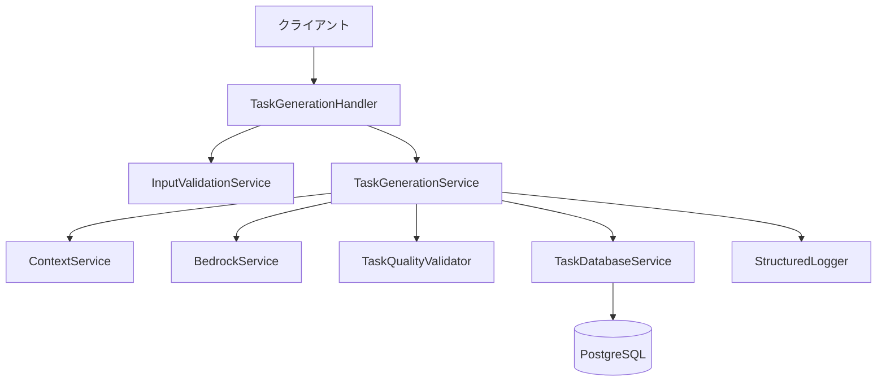
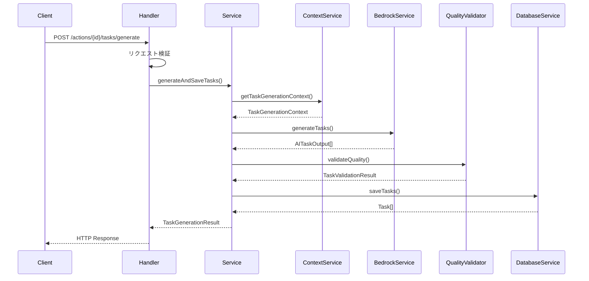
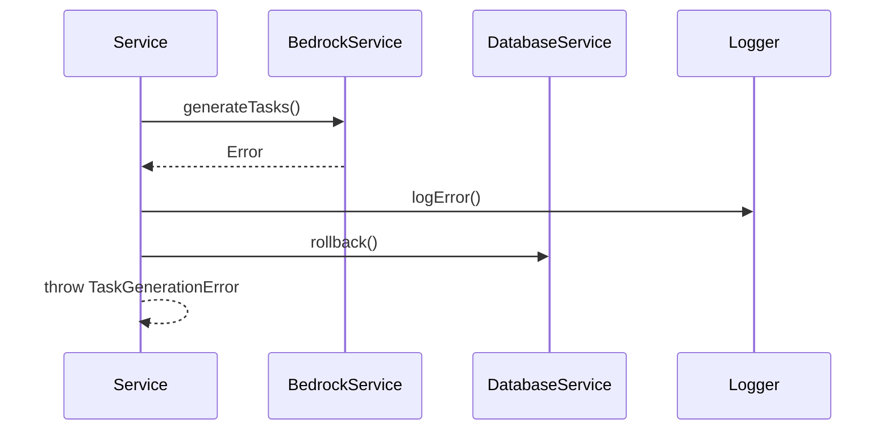

# 2.2.4 タスク生成API - 設計書

## アーキテクチャ概要



## コンポーネント設計

### 1. TaskGenerationHandler
**責務**: HTTPリクエストの処理とレスポンス生成

```typescript
interface TaskGenerationHandler {
  handle(event: APIGatewayProxyEvent): Promise<APIGatewayProxyResult>;
}
```

**主要機能**:
- リクエスト検証
- 認証・認可チェック
- サービス層の呼び出し
- エラーハンドリング
- レスポンス生成

### 2. TaskGenerationService
**責務**: タスク生成のビジネスロジック

```typescript
interface TaskGenerationService {
  generateAndSaveTasks(actionId: string, context?: TaskGenerationContext): Promise<TaskGenerationResult>;
}
```

**主要機能**:
- コンテキスト情報の取得
- AI生成の実行
- 品質検証
- データベース保存
- トランザクション管理

### 3. ContextService
**責務**: タスク生成に必要なコンテキスト情報の収集

```typescript
interface ContextService {
  getTaskGenerationContext(actionId: string): Promise<TaskGenerationContext>;
}
```

**収集情報**:
- アクション詳細
- 関連するサブ目標
- ユーザー設定
- 既存タスク情報

### 4. BedrockService (拡張)
**責務**: Claude 3.5 Sonnetを使用したタスク生成

```typescript
interface BedrockService {
  generateTasks(context: TaskGenerationContext): Promise<AITaskOutput[]>;
}
```

**生成内容**:
- タスクタイトル
- タスク説明
- 優先度
- 推定時間

### 5. TaskQualityValidator
**責務**: 生成されたタスクの品質検証

```typescript
interface TaskQualityValidator {
  validateQuality(tasks: AITaskOutput[]): Promise<TaskValidationResult>;
}
```

**検証項目**:
- タイトル長制限（30文字以内）
- 説明長制限（200文字以内）
- 重複チェック
- 実行可能性検証

### 6. TaskDatabaseService
**責務**: タスクデータの永続化

```typescript
interface TaskDatabaseService {
  saveTasks(actionId: string, tasks: TaskOutput[]): Promise<Task[]>;
  executeInTransaction<T>(operation: () => Promise<T>): Promise<T>;
}
```

**主要機能**:
- タスクの一括挿入
- トランザクション管理
- 楽観的ロック
- エラーハンドリング

## データフロー

### 1. タスク生成フロー


### 2. エラーハンドリングフロー


## 型定義

### TaskGenerationContext
```typescript
interface TaskGenerationContext {
  action: {
    id: string;
    title: string;
    description: string;
    background: string;
    type: ActionType;
  };
  subGoal: {
    id: string;
    title: string;
    description: string;
  };
  goal: {
    id: string;
    title: string;
    description: string;
    deadline: Date;
  };
  user: {
    preferences: {
      workStyle?: string;
      timeAvailable?: number;
    };
  };
  existingTasks: Task[];
}
```

### AITaskOutput
```typescript
interface AITaskOutput {
  title: string;
  description: string;
  priority: TaskPriority;
  estimatedMinutes: number;
  reasoning: string;
}
```

### TaskOutput
```typescript
interface TaskOutput {
  title: string;
  description: string;
  priority: TaskPriority;
  estimatedMinutes: number;
  position: number;
}
```

### TaskGenerationResult
```typescript
interface TaskGenerationResult {
  actionId: string;
  tasks: Task[];
  generatedAt: string;
  totalTasks: number;
}
```

### TaskGenerationResponse
```typescript
interface TaskGenerationResponse {
  success: boolean;
  data?: TaskGenerationResult;
  error?: {
    code: string;
    message: string;
    details?: ErrorDetail[];
  };
  metadata: {
    requestId: string;
    processingTime?: number;
    timestamp?: string;
  };
}
```

## プロンプト設計

### タスク生成プロンプト
```
あなたは優秀なプロジェクトマネージャーです。以下のアクションを3-5個の具体的で実行可能なタスクに分解してください。

## アクション情報
- タイトル: {{action.title}}
- 説明: {{action.description}}
- 背景: {{action.background}}
- 種別: {{action.type}}

## コンテキスト
- サブ目標: {{subGoal.title}}
- 最終目標: {{goal.title}}
- 期限: {{goal.deadline}}
- ユーザーの作業スタイル: {{user.preferences.workStyle}}
- 利用可能時間: {{user.preferences.timeAvailable}}分

## 要件
1. 各タスクは30文字以内のタイトル
2. 各タスクは200文字以内の説明
3. 優先度（HIGH/MEDIUM/LOW）を設定
4. 推定実行時間（分単位）を算出
5. 実行可能で具体的な内容
6. 重複しない内容

## 出力形式
JSON形式で以下の構造で出力してください：

```json
{
  "tasks": [
    {
      "title": "タスクタイトル",
      "description": "タスクの詳細説明",
      "priority": "HIGH|MEDIUM|LOW",
      "estimatedMinutes": 60,
      "reasoning": "このタスクが必要な理由"
    }
  ]
}
```
```

## エラー設計

### エラーコード
```typescript
enum TaskGenerationErrorCode {
  // 入力エラー
  INVALID_REQUEST = 'INVALID_REQUEST',
  ACTION_NOT_FOUND = 'ACTION_NOT_FOUND',
  VALIDATION_ERROR = 'VALIDATION_ERROR',
  
  // AI生成エラー
  AI_GENERATION_FAILED = 'AI_GENERATION_FAILED',
  AI_RESPONSE_INVALID = 'AI_RESPONSE_INVALID',
  AI_TIMEOUT = 'AI_TIMEOUT',
  
  // 品質エラー
  QUALITY_VALIDATION_FAILED = 'QUALITY_VALIDATION_FAILED',
  DUPLICATE_TASKS = 'DUPLICATE_TASKS',
  INVALID_TASK_FORMAT = 'INVALID_TASK_FORMAT',
  
  // データベースエラー
  DATABASE_ERROR = 'DATABASE_ERROR',
  TRANSACTION_FAILED = 'TRANSACTION_FAILED',
  
  // システムエラー
  INTERNAL_ERROR = 'INTERNAL_ERROR',
  RATE_LIMIT_EXCEEDED = 'RATE_LIMIT_EXCEEDED'
}
```

### エラーハンドリング戦略
```typescript
class TaskGenerationError extends Error {
  constructor(
    public code: TaskGenerationErrorCode,
    message: string,
    public details?: ErrorDetail[],
    public retryable: boolean = false
  ) {
    super(message);
  }
}
```

## セキュリティ設計

### 認証・認可
- JWT認証による本人確認
- アクション所有者チェック
- レート制限（1日10回/アクション）

### 入力検証
- スキーマ検証
- SQLインジェクション対策
- XSS対策
- 入力値サニタイゼーション

### データ保護
- 機密情報のマスキング
- ログの適切な出力レベル
- 個人情報の暗号化

## パフォーマンス設計

### 最適化戦略
- データベースクエリの最適化
- インデックスの適切な設定
- 並列処理の活用
- キャッシュの活用

### 監視指標
- API応答時間
- AI生成時間
- データベース処理時間
- エラー率
- スループット

## テスト設計

### 単体テスト
- 各サービスクラスのテスト
- モック使用による独立性確保
- エッジケースの網羅

### 統合テスト
- サービス間連携のテスト
- データベース操作のテスト
- AI生成の統合テスト

### E2Eテスト
- API全体のフローテスト
- エラーケースのテスト
- パフォーマンステスト

## デプロイ設計

### インフラ構成
- AWS Lambda関数
- API Gateway統合
- RDS PostgreSQL
- CloudWatch監視

### CI/CD
- GitHub Actions
- 自動テスト実行
- 段階的デプロイ
- ロールバック機能

## 運用設計

### 監視・アラート
- CloudWatch Metrics
- カスタムメトリクス
- アラート設定
- ダッシュボード

### ログ管理
- 構造化ログ
- ログレベル管理
- ログ保持期間
- 検索・分析機能
