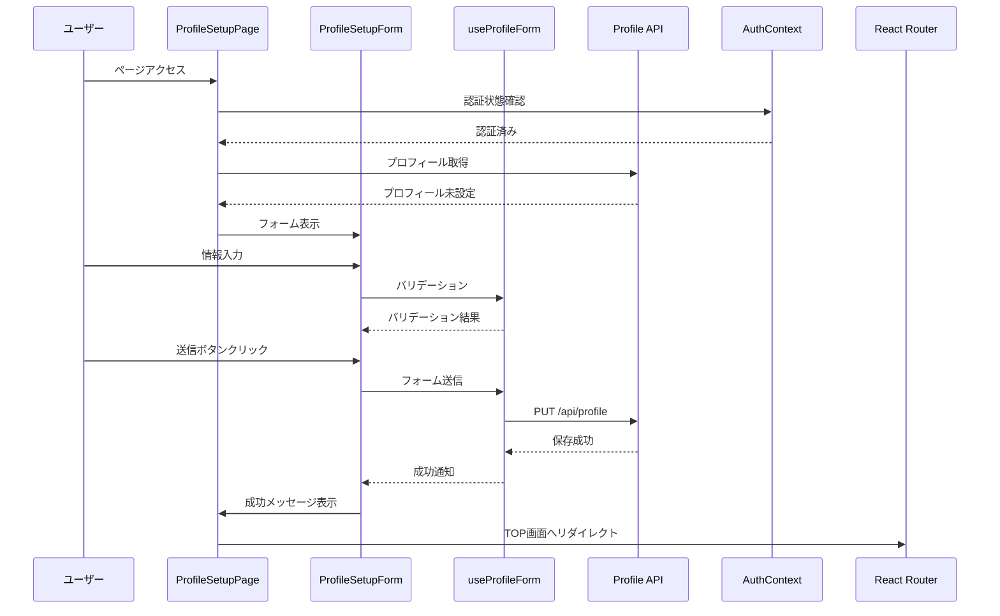

# 設計書

## 概要

プロフィール入力画面は、初回ログイン時にユーザーの所属組織情報と本人情報を収集するための画面です。収集した情報はAI生成時のコンテキスト情報として活用され、より適切なマンダラチャートの生成を可能にします。

## アーキテクチャ

### コンポーネント構成

```
ProfileSetupPage (ページコンポーネント)
├── AuthLayout (レイアウトコンポーネント)
│   ├── Header
│   ├── ProfileSetupForm (フォームコンポーネント)
│   │   ├── OrganizationSection (所属組織情報セクション)
│   │   │   ├── IndustrySelect (業種選択)
│   │   │   └── CompanySizeSelect (組織規模選択)
│   │   ├── PersonalSection (本人情報セクション)
│   │   │   ├── JobTitleInput (職種入力)
│   │   │   └── PositionInput (役職入力)
│   │   └── SubmitButton (送信ボタン)
│   └── Footer
├── ErrorAlert (エラー表示)
├── SuccessMessage (成功メッセージ)
└── NetworkStatus (ネットワーク状態表示)
```

### データフロー



## コンポーネント設計

### 1. ProfileSetupPage

**責務:**
- ページ全体の状態管理
- 認証状態の確認
- プロフィール設定済みチェック
- リダイレクト処理
- エラーハンドリング

**Props:**
```typescript
interface ProfileSetupPageProps {
  className?: string;
}
```

**State:**
```typescript
interface PageState {
  isLoading: boolean;
  error: string | null;
  successMessage: string | null;
  isInitialized: boolean;
}
```

**主要メソッド:**
- `checkProfileStatus()`: プロフィール設定状態を確認
- `handleSubmit()`: フォーム送信処理
- `handleError()`: エラーハンドリング
- `redirectToTop()`: TOP画面へのリダイレクト

### 2. ProfileSetupForm

**責務:**
- フォームの表示とレイアウト
- 入力値の管理
- バリデーション実行
- フォーム送信

**Props:**
```typescript
interface ProfileSetupFormProps {
  onSubmit: (data: ProfileFormData) => Promise<void>;
  isLoading?: boolean;
  error?: string | null;
  className?: string;
}
```

**State:**
```typescript
interface FormState {
  industry: string;
  companySize: string;
  jobTitle: string;
  position: string;
  errors: Record<string, string>;
  touched: Record<string, boolean>;
}
```

**主要メソッド:**
- `handleChange()`: 入力値変更処理
- `handleBlur()`: フォーカス離脱時の処理
- `validateField()`: フィールド単位のバリデーション
- `validateForm()`: フォーム全体のバリデーション
- `handleSubmit()`: フォーム送信処理

### 3. IndustrySelect

**責務:**
- 業種選択ドロップダウンの表示
- 選択値の管理
- バリデーションエラーの表示

**Props:**
```typescript
interface IndustrySelectProps {
  value: string;
  onChange: (value: string) => void;
  onBlur: () => void;
  error?: string;
  disabled?: boolean;
  required?: boolean;
}
```

**選択肢:**
```typescript
const INDUSTRY_OPTIONS = [
  { value: '', label: '業種を選択してください' },
  { value: 'it-communication', label: 'IT・通信' },
  { value: 'manufacturing', label: '製造業' },
  { value: 'finance-insurance', label: '金融・保険' },
  { value: 'retail-wholesale', label: '小売・卸売' },
  { value: 'service', label: 'サービス業' },
  { value: 'medical-welfare', label: '医療・福祉' },
  { value: 'education', label: '教育' },
  { value: 'construction-real-estate', label: '建設・不動産' },
  { value: 'transportation-logistics', label: '運輸・物流' },
  { value: 'other', label: 'その他' },
] as const;
```

### 4. CompanySizeSelect

**責務:**
- 組織規模選択ドロップダウンの表示
- 選択値の管理
- バリデーションエラーの表示

**Props:**
```typescript
interface CompanySizeSelectProps {
  value: string;
  onChange: (value: string) => void;
  onBlur: () => void;
  error?: string;
  disabled?: boolean;
  required?: boolean;
}
```

**選択肢:**
```typescript
const COMPANY_SIZE_OPTIONS = [
  { value: '', label: '組織規模を選択してください' },
  { value: '1-10', label: '1-10人' },
  { value: '11-50', label: '11-50人' },
  { value: '51-200', label: '51-200人' },
  { value: '201-500', label: '201-500人' },
  { value: '501-1000', label: '501-1000人' },
  { value: '1001+', label: '1001人以上' },
  { value: 'individual', label: '個人事業主' },
] as const;
```

### 5. JobTitleInput

**責務:**
- 職種入力フィールドの表示
- 入力値の管理
- 文字数制限
- バリデーションエラーの表示

**Props:**
```typescript
interface JobTitleInputProps {
  value: string;
  onChange: (value: string) => void;
  onBlur: () => void;
  error?: string;
  disabled?: boolean;
  required?: boolean;
  maxLength?: number;
}
```

### 6. PositionInput

**責務:**
- 役職入力フィールドの表示
- 入力値の管理
- 文字数制限
- バリデーションエラーの表示

**Props:**
```typescript
interface PositionInputProps {
  value: string;
  onChange: (value: string) => void;
  onBlur: () => void;
  error?: string;
  disabled?: boolean;
  required?: boolean;
  maxLength?: number;
}
```

## カスタムフック設計

### useProfileForm

**責務:**
- フォーム状態の管理
- バリデーション処理
- API通信
- エラーハンドリング

**インターフェース:**
```typescript
interface UseProfileFormOptions {
  onSuccess?: () => void;
  onError?: (error: Error) => void;
}

interface UseProfileFormReturn {
  // 状態
  formData: ProfileFormData;
  errors: Record<string, string>;
  touched: Record<string, boolean>;
  isLoading: boolean;
  isSubmitting: boolean;
  error: string | null;
  successMessage: string | null;
  
  // メソッド
  setFieldValue: (field: string, value: string) => void;
  setFieldTouched: (field: string, touched: boolean) => void;
  validateField: (field: string) => string | undefined;
  validateForm: () => boolean;
  handleSubmit: () => Promise<void>;
  resetForm: () => void;
  clearError: () => void;
  clearSuccess: () => void;
}

function useProfileForm(options?: UseProfileFormOptions): UseProfileFormReturn;
```

**実装詳細:**
```typescript
export function useProfileForm(options?: UseProfileFormOptions) {
  const [formData, setFormData] = useState<ProfileFormData>({
    industry: '',
    companySize: '',
    jobTitle: '',
    position: '',
  });
  
  const [errors, setErrors] = useState<Record<string, string>>({});
  const [touched, setTouched] = useState<Record<string, boolean>>({});
  const [isLoading, setIsLoading] = useState(false);
  const [isSubmitting, setIsSubmitting] = useState(false);
  const [error, setError] = useState<string | null>(null);
  const [successMessage, setSuccessMessage] = useState<string | null>(null);
  
  // バリデーション処理
  const validateField = useCallback((field: string): string | undefined => {
    const value = formData[field as keyof ProfileFormData];
    
    switch (field) {
      case 'industry':
        if (!value) return '業種を選択してください';
        break;
      case 'companySize':
        if (!value) return '組織規模を選択してください';
        break;
      case 'jobTitle':
        if (!value) return '職種を入力してください';
        if (value.length > 100) return '職種は100文字以内で入力してください';
        break;
      case 'position':
        if (value && value.length > 100) return '役職は100文字以内で入力してください';
        break;
    }
    
    return undefined;
  }, [formData]);
  
  // フォーム全体のバリデーション
  const validateForm = useCallback((): boolean => {
    const newErrors: Record<string, string> = {};
    
    ['industry', 'companySize', 'jobTitle', 'position'].forEach(field => {
      const error = validateField(field);
      if (error) {
        newErrors[field] = error;
      }
    });
    
    setErrors(newErrors);
    return Object.keys(newErrors).length === 0;
  }, [validateField]);
  
  // フィールド値の設定
  const setFieldValue = useCallback((field: string, value: string) => {
    setFormData(prev => ({ ...prev, [field]: value }));
    
    // バリデーションエラーをクリア
    if (errors[field]) {
      setErrors(prev => {
        const newErrors = { ...prev };
        delete newErrors[field];
        return newErrors;
      });
    }
  }, [errors]);
  
  // フィールドのタッチ状態を設定
  const setFieldTouched = useCallback((field: string, isTouched: boolean) => {
    setTouched(prev => ({ ...prev, [field]: isTouched }));
    
    // タッチされた場合はバリデーション実行
    if (isTouched) {
      const error = validateField(field);
      if (error) {
        setErrors(prev => ({ ...prev, [field]: error }));
      }
    }
  }, [validateField]);
  
  // フォーム送信処理
  const handleSubmit = useCallback(async () => {
    // 全フィールドをタッチ済みにする
    setTouched({
      industry: true,
      companySize: true,
      jobTitle: true,
      position: true,
    });
    
    // バリデーション実行
    if (!validateForm()) {
      return;
    }
    
    setIsSubmitting(true);
    setError(null);
    
    try {
      // API呼び出し
      await ProfileService.updateProfile(formData);
      
      setSuccessMessage('プロフィールを保存しました');
      
      // 成功コールバック実行
      if (options?.onSuccess) {
        options.onSuccess();
      }
    } catch (err) {
      const errorMessage = err instanceof Error ? err.message : '予期しないエラーが発生しました';
      setError(errorMessage);
      
      // エラーコールバック実行
      if (options?.onError) {
        options.onError(err as Error);
      }
    } finally {
      setIsSubmitting(false);
    }
  }, [formData, validateForm, options]);
  
  // フォームリセット
  const resetForm = useCallback(() => {
    setFormData({
      industry: '',
      companySize: '',
      jobTitle: '',
      position: '',
    });
    setErrors({});
    setTouched({});
    setError(null);
    setSuccessMessage(null);
  }, []);
  
  // エラークリア
  const clearError = useCallback(() => {
    setError(null);
  }, []);
  
  // 成功メッセージクリア
  const clearSuccess = useCallback(() => {
    setSuccessMessage(null);
  }, []);
  
  return {
    formData,
    errors,
    touched,
    isLoading,
    isSubmitting,
    error,
    successMessage,
    setFieldValue,
    setFieldTouched,
    validateField,
    validateForm,
    handleSubmit,
    resetForm,
    clearError,
    clearSuccess,
  };
}
```

## データモデル

### ProfileFormData

```typescript
interface ProfileFormData {
  industry: string;
  companySize: string;
  jobTitle: string;
  position: string;
}
```

### ProfileFormErrors

```typescript
interface ProfileFormErrors {
  industry?: string;
  companySize?: string;
  jobTitle?: string;
  position?: string;
}
```

## バリデーションルール

### 業種（industry）
- 必須項目
- 選択肢から選択

### 組織規模（companySize）
- 必須項目
- 選択肢から選択

### 職種（jobTitle）
- 必須項目
- 最大100文字
- 空白のみは不可

### 役職（position）
- 任意項目
- 最大100文字

## API統合

### プロフィール更新API

**エンドポイント:** `PUT /api/profile`

**リクエスト:**
```typescript
interface UpdateProfileRequest {
  industry: string;
  company_size: string;
  job_title: string;
  position?: string;
}
```

**レスポンス（成功）:**
```typescript
interface UpdateProfileResponse {
  success: true;
  data: {
    id: string;
    email: string;
    name: string;
    industry: string;
    company_size: string;
    job_title: string;
    position: string | null;
    created_at: string;
    updated_at: string;
  };
}
```

**レスポンス（エラー）:**
```typescript
interface ErrorResponse {
  success: false;
  error: {
    code: string;
    message: string;
  };
}
```

## スタイリング

### Tailwind CSSクラス

**フォームコンテナ:**
```css
.form-container {
  @apply max-w-2xl mx-auto px-4 sm:px-6 lg:px-8 py-8;
}
```

**セクション:**
```css
.form-section {
  @apply mb-8 p-6 bg-white rounded-lg shadow-sm;
}

.section-title {
  @apply text-lg font-semibold text-gray-900 mb-4;
}
```

**フォームフィールド:**
```css
.form-field {
  @apply mb-6;
}

.form-label {
  @apply block text-sm font-medium text-gray-700 mb-2;
}

.form-input {
  @apply w-full px-3 py-2 border border-gray-300 rounded-md shadow-sm
         focus:outline-none focus:ring-2 focus:ring-blue-500 focus:border-blue-500
         disabled:bg-gray-100 disabled:cursor-not-allowed;
}

.form-select {
  @apply w-full px-3 py-2 border border-gray-300 rounded-md shadow-sm
         focus:outline-none focus:ring-2 focus:ring-blue-500 focus:border-blue-500
         disabled:bg-gray-100 disabled:cursor-not-allowed;
}

.form-error {
  @apply mt-1 text-sm text-red-600;
}

.form-input-error {
  @apply border-red-300 focus:ring-red-500 focus:border-red-500;
}
```

**ボタン:**
```css
.submit-button {
  @apply w-full py-3 px-4 bg-blue-600 text-white font-medium rounded-md
         hover:bg-blue-700 focus:outline-none focus:ring-2 focus:ring-offset-2 focus:ring-blue-500
         disabled:bg-gray-400 disabled:cursor-not-allowed
         transition-colors duration-200;
}

.submit-button-loading {
  @apply flex items-center justify-center;
}
```

### レスポンシブブレークポイント

```typescript
const breakpoints = {
  mobile: '< 768px',
  tablet: '768px - 1024px',
  desktop: '> 1024px',
};
```

**モバイル（< 768px）:**
- 1カラムレイアウト
- フルワイドフォーム
- タッチ操作に適したボタンサイズ（最小44px × 44px）

**タブレット（768px - 1024px）:**
- 中央寄せレイアウト
- 最大幅600px

**デスクトップ（> 1024px）:**
- 中央寄せレイアウト
- 最大幅800px

## アクセシビリティ

### ARIA属性

```typescript
// 必須フィールド
<input
  aria-required="true"
  aria-invalid={!!error}
  aria-describedby={error ? `${id}-error` : undefined}
/>

// エラーメッセージ
<div id={`${id}-error`} role="alert" aria-live="polite">
  {error}
</div>

// ローディング状態
<button aria-busy={isLoading} disabled={isLoading}>
  {isLoading ? '保存中...' : '次へ'}
</button>
```

### キーボードナビゲーション

- Tabキーで全フィールドとボタンにフォーカス可能
- Enterキーでフォーム送信
- Escapeキーでドロップダウンを閉じる
- フォーカスインジケーターの明確な表示

### スクリーンリーダー対応

- 全フィールドに適切なラベル
- エラーメッセージの読み上げ
- ローディング状態の通知
- 成功メッセージの通知

## エラーハンドリング

### エラーの種類

1. **バリデーションエラー**
   - フィールド単位で表示
   - リアルタイムフィードバック

2. **APIエラー**
   - 画面上部に表示
   - 5秒後に自動非表示

3. **ネットワークエラー**
   - 画面上部に表示
   - リトライボタン表示

4. **認証エラー**
   - ログイン画面にリダイレクト

### エラーメッセージ

```typescript
const ERROR_MESSAGES = {
  REQUIRED_INDUSTRY: '業種を選択してください',
  REQUIRED_COMPANY_SIZE: '組織規模を選択してください',
  REQUIRED_JOB_TITLE: '職種を入力してください',
  MAX_LENGTH_JOB_TITLE: '職種は100文字以内で入力してください',
  MAX_LENGTH_POSITION: '役職は100文字以内で入力してください',
  API_ERROR: 'プロフィールの保存に失敗しました。もう一度お試しください。',
  NETWORK_ERROR: 'ネットワークエラーが発生しました。接続を確認してください。',
  UNAUTHORIZED: '認証エラーが発生しました。再度ログインしてください。',
  UNKNOWN_ERROR: '予期しないエラーが発生しました。',
};
```

## パフォーマンス最適化

### コード分割

```typescript
// 遅延読み込み
const ProfileSetupPage = lazy(() => import('./pages/ProfileSetupPage'));
```

### メモ化

```typescript
// コンポーネントのメモ化
const IndustrySelect = memo(IndustrySelectComponent);
const CompanySizeSelect = memo(CompanySizeSelectComponent);

// コールバックのメモ化
const handleChange = useCallback((field: string, value: string) => {
  setFieldValue(field, value);
}, [setFieldValue]);

// 値のメモ化
const hasErrors = useMemo(() => {
  return Object.keys(errors).length > 0;
}, [errors]);
```

### デバウンス

```typescript
// バリデーションのデバウンス
const debouncedValidate = useMemo(
  () => debounce((field: string) => {
    const error = validateField(field);
    if (error) {
      setErrors(prev => ({ ...prev, [field]: error }));
    }
  }, 300),
  [validateField]
);
```

## テスト戦略

### ユニットテスト

1. **コンポーネントテスト**
   - 各コンポーネントの表示確認
   - プロパティの正しい受け渡し
   - イベントハンドラーの動作確認

2. **フックテスト**
   - useProfileFormの各機能
   - バリデーション処理
   - API通信処理

3. **バリデーションテスト**
   - 各フィールドのバリデーションルール
   - エラーメッセージの表示

### 統合テスト

1. **フォーム送信フロー**
   - 入力→バリデーション→送信→成功
   - 入力→バリデーション→エラー表示

2. **認証フロー**
   - 未認証時のリダイレクト
   - プロフィール設定済み時のリダイレクト

### E2Eテスト

1. **正常系**
   - 初回ログイン→プロフィール入力→TOP画面遷移

2. **異常系**
   - バリデーションエラー表示
   - APIエラー表示
   - ネットワークエラー表示

## セキュリティ考慮事項

### 入力値のサニタイゼーション

```typescript
function sanitizeInput(value: string): string {
  return value
    .trim()
    .replace(/[<>]/g, '') // HTMLタグの除去
    .substring(0, 100); // 最大長制限
}
```

### CSRF対策

- APIリクエストに認証トークンを含める
- SameSite Cookie属性の設定

### XSS対策

- Reactの自動エスケープ機能を活用
- dangerouslySetInnerHTMLの使用禁止

## 監視とログ

### ログ出力

```typescript
// ページ表示ログ
logger.info('ProfileSetupPage: Page loaded', {
  userId: user.id,
  timestamp: new Date().toISOString(),
});

// フォーム送信ログ
logger.info('ProfileSetupPage: Form submitted', {
  userId: user.id,
  timestamp: new Date().toISOString(),
});

// エラーログ
logger.error('ProfileSetupPage: API error', {
  userId: user.id,
  error: error.message,
  timestamp: new Date().toISOString(),
});
```

### パフォーマンス監視

```typescript
// ページロード時間
performance.mark('profile-setup-start');
// ... ページ処理 ...
performance.mark('profile-setup-end');
performance.measure('profile-setup', 'profile-setup-start', 'profile-setup-end');
```

## 今後の拡張性

### 将来的な機能追加

1. **プロフィール画像アップロード**
   - S3への画像アップロード
   - 画像プレビュー機能
   - 画像サイズ制限

2. **追加フィールド**
   - 所在地
   - 言語設定
   - タイムゾーン

3. **ソーシャルログイン連携**
   - Google
   - GitHub
   - LinkedIn

4. **プロフィール公開設定**
   - 公開/非公開の切り替え
   - 項目ごとの公開設定
