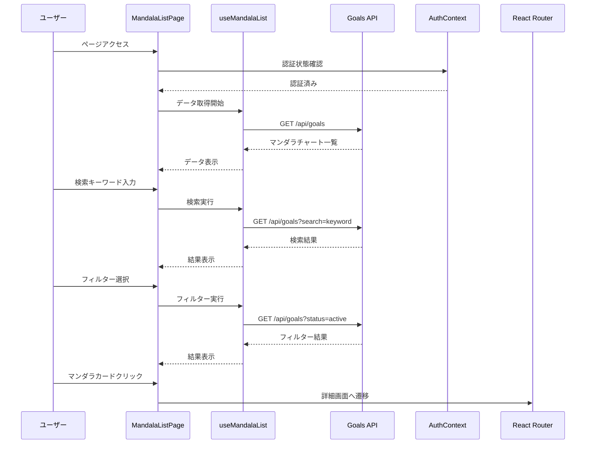

# 設計書

## 概要

マンダラチャート一覧画面（TOP画面）は、ユーザーが作成した全てのマンダラチャートを一覧表示し、検索・フィルター・ソート機能を提供する画面です。ユーザーは複数の目標を効率的に管理し、適切なマンダラチャートを選択して詳細画面に遷移できます。

## アーキテクチャ

### コンポーネント構成

```
MandalaListPage (ページコンポーネント)
├── AppLayout (レイアウトコンポーネント)
│   ├── Header
│   │   ├── Logo
│   │   ├── SearchBar (検索バー)
│   │   └── UserMenu (ユーザーメニュー)
│   ├── MandalaListContainer (一覧コンテナ)
│   │   ├── FilterBar (フィルター・ソートバー)
│   │   │   ├── StatusFilter (状態フィルター)
│   │   │   ├── SortDropdown (ソートドロップダウン)
│   │   │   └── CreateButton (新規作成ボタン)
│   │   ├── MandalaGrid (マンダラグリッド)
│   │   │   └── MandalaCard[] (マンダラカード配列)
│   │   │       ├── CardHeader (カードヘッダー)
│   │   │       │   ├── StatusBadge (状態バッジ)
│   │   │       │   └── DeadlineWarning (期限警告)
│   │   │       ├── CardBody (カード本体)
│   │   │       │   ├── Title (タイトル)
│   │   │       │   ├── Description (説明)
│   │   │       │   └── ProgressCircle (進捗円グラフ)
│   │   │       └── CardFooter (カードフッター)
│   │   │           ├── Deadline (達成期限)
│   │   │           └── Timestamps (作成・更新日時)
│   │   ├── EmptyState (空状態表示)
│   │   └── Pagination (ページネーション)
│   └── Footer
├── LoadingSpinner (ローディング表示)
├── ErrorAlert (エラー表示)
└── SkeletonLoader (スケルトンローダー)
```


### データフロー



## コンポーネント設計

### 1. MandalaListPage

**責務:**
- ページ全体の状態管理
- 認証状態の確認
- データ取得とキャッシュ管理
- エラーハンドリング
- リダイレクト処理

**Props:**
```typescript
interface MandalaListPageProps {
  className?: string;
}
```

**State:**
```typescript
interface PageState {
  isLoading: boolean;
  isInitialized: boolean;
  error: string | null;
}
```


### 2. MandalaCard

**責務:**
- マンダラチャートの概要表示
- 進捗率の視覚化
- 状態バッジの表示
- クリックイベントの処理

**Props:**
```typescript
interface MandalaCardProps {
  mandala: MandalaChartSummary;
  onClick: (id: string) => void;
  className?: string;
}

interface MandalaChartSummary {
  id: string;
  title: string;
  description: string;
  deadline: Date;
  status: GoalStatus;
  progress: number;
  createdAt: Date;
  updatedAt: Date;
}

enum GoalStatus {
  DRAFT = 'draft',
  ACTIVE = 'active',
  COMPLETED = 'completed',
  PAUSED = 'paused',
  CANCELLED = 'cancelled',
}
```

### 3. SearchBar

**責務:**
- 検索キーワードの入力
- リアルタイム検索
- 検索クリア機能

**Props:**
```typescript
interface SearchBarProps {
  value: string;
  onChange: (value: string) => void;
  onClear: () => void;
  placeholder?: string;
  disabled?: boolean;
}
```

### 4. StatusFilter

**責務:**
- 目標状態によるフィルタリング
- フィルター条件の表示

**Props:**
```typescript
interface StatusFilterProps {
  value: GoalStatus | 'all';
  onChange: (status: GoalStatus | 'all') => void;
  disabled?: boolean;
}
```

### 5. SortDropdown

**責務:**
- ソート条件の選択
- ソート順序の管理

**Props:**
```typescript
interface SortDropdownProps {
  value: SortOption;
  onChange: (option: SortOption) => void;
  disabled?: boolean;
}

type SortOption =
  | 'created_at_desc'
  | 'created_at_asc'
  | 'updated_at_desc'
  | 'updated_at_asc'
  | 'deadline_asc'
  | 'deadline_desc'
  | 'progress_desc'
  | 'progress_asc';
```


### 6. ProgressCircle

**責務:**
- 進捗率の円形表示
- 色分け表示（0-30%: 赤、31-70%: 黄、71-100%: 緑）

**Props:**
```typescript
interface ProgressCircleProps {
  progress: number; // 0-100
  size?: 'sm' | 'md' | 'lg';
  showLabel?: boolean;
  className?: string;
}
```

### 7. StatusBadge

**責務:**
- 目標状態のバッジ表示
- 状態に応じた色分け

**Props:**
```typescript
interface StatusBadgeProps {
  status: GoalStatus;
  className?: string;
}
```

### 8. Pagination

**責務:**
- ページネーション表示
- ページ遷移処理

**Props:**
```typescript
interface PaginationProps {
  currentPage: number;
  totalPages: number;
  totalItems: number;
  itemsPerPage: number;
  onPageChange: (page: number) => void;
  disabled?: boolean;
}
```

### 9. EmptyState

**責務:**
- 空状態の表示
- 新規作成への誘導

**Props:**
```typescript
interface EmptyStateProps {
  title: string;
  description: string;
  actionLabel?: string;
  onAction?: () => void;
  icon?: React.ReactNode;
}
```

### 10. UserMenu

**責務:**
- ユーザーメニューの表示
- 設定・ログアウト機能

**Props:**
```typescript
interface UserMenuProps {
  userName: string;
  userEmail: string;
  onSettingsClick: () => void;
  onLogoutClick: () => void;
}
```


## カスタムフック設計

### useMandalaList

**責務:**
- マンダラチャート一覧の取得
- 検索・フィルター・ソート処理
- ページネーション管理
- キャッシュ管理

**インターフェース:**
```typescript
interface UseMandalaListOptions {
  initialPage?: number;
  itemsPerPage?: number;
}

interface UseMandalaListReturn {
  // データ
  mandalas: MandalaChartSummary[];
  totalItems: number;
  totalPages: number;
  
  // 状態
  isLoading: boolean;
  isFetching: boolean;
  error: string | null;
  
  // フィルター・検索・ソート
  searchKeyword: string;
  statusFilter: GoalStatus | 'all';
  sortOption: SortOption;
  currentPage: number;
  
  // メソッド
  setSearchKeyword: (keyword: string) => void;
  setStatusFilter: (status: GoalStatus | 'all') => void;
  setSortOption: (option: SortOption) => void;
  setCurrentPage: (page: number) => void;
  refetch: () => Promise<void>;
  clearFilters: () => void;
}

function useMandalaList(options?: UseMandalaListOptions): UseMandalaListReturn;
```

**実装詳細:**
```typescript
export function useMandalaList(options?: UseMandalaListOptions) {
  const itemsPerPage = options?.itemsPerPage || 20;
  
  const [searchKeyword, setSearchKeyword] = useState('');
  const [statusFilter, setStatusFilter] = useState<GoalStatus | 'all'>('all');
  const [sortOption, setSortOption] = useState<SortOption>('created_at_desc');
  const [currentPage, setCurrentPage] = useState(options?.initialPage || 1);
  
  const [mandalas, setMandalas] = useState<MandalaChartSummary[]>([]);
  const [totalItems, setTotalItems] = useState(0);
  const [isLoading, setIsLoading] = useState(false);
  const [isFetching, setIsFetching] = useState(false);
  const [error, setError] = useState<string | null>(null);
  
  // データ取得
  const fetchMandalas = useCallback(async () => {
    setIsFetching(true);
    setError(null);
    
    try {
      const params = {
        search: searchKeyword,
        status: statusFilter !== 'all' ? statusFilter : undefined,
        sort: sortOption,
        page: currentPage,
        limit: itemsPerPage,
      };
      
      const response = await GoalsService.getGoals(params);
      
      setMandalas(response.data);
      setTotalItems(response.total);
    } catch (err) {
      const errorMessage = err instanceof Error ? err.message : 'データの取得に失敗しました';
      setError(errorMessage);
    } finally {
      setIsFetching(false);
      setIsLoading(false);
    }
  }, [searchKeyword, statusFilter, sortOption, currentPage, itemsPerPage]);
  
  // 初回データ取得
  useEffect(() => {
    setIsLoading(true);
    fetchMandalas();
  }, [fetchMandalas]);
  
  // 検索キーワード変更時はページを1に戻す
  useEffect(() => {
    if (currentPage !== 1) {
      setCurrentPage(1);
    }
  }, [searchKeyword, statusFilter, sortOption]);
  
  // フィルタークリア
  const clearFilters = useCallback(() => {
    setSearchKeyword('');
    setStatusFilter('all');
    setSortOption('created_at_desc');
    setCurrentPage(1);
  }, []);
  
  const totalPages = Math.ceil(totalItems / itemsPerPage);
  
  return {
    mandalas,
    totalItems,
    totalPages,
    isLoading,
    isFetching,
    error,
    searchKeyword,
    statusFilter,
    sortOption,
    currentPage,
    setSearchKeyword,
    setStatusFilter,
    setSortOption,
    setCurrentPage,
    refetch: fetchMandalas,
    clearFilters,
  };
}
```


## データモデル

### MandalaChartSummary

```typescript
interface MandalaChartSummary {
  id: string;
  title: string;
  description: string;
  deadline: Date;
  status: GoalStatus;
  progress: number;
  createdAt: Date;
  updatedAt: Date;
}
```

### GoalsListResponse

```typescript
interface GoalsListResponse {
  success: boolean;
  data: MandalaChartSummary[];
  total: number;
  page: number;
  limit: number;
  totalPages: number;
}
```

### GoalsListParams

```typescript
interface GoalsListParams {
  search?: string;
  status?: GoalStatus;
  sort?: SortOption;
  page?: number;
  limit?: number;
}
```

## API統合

### マンダラチャート一覧取得API

**エンドポイント:** `GET /api/goals`

**クエリパラメータ:**
```typescript
interface GetGoalsQuery {
  search?: string;        // 検索キーワード
  status?: GoalStatus;    // 状態フィルター
  sort?: SortOption;      // ソート条件
  page?: number;          // ページ番号（デフォルト: 1）
  limit?: number;         // 1ページあたりの件数（デフォルト: 20）
}
```

**レスポンス（成功）:**
```typescript
interface GetGoalsResponse {
  success: true;
  data: Array<{
    id: string;
    user_id: string;
    title: string;
    description: string;
    deadline: string;
    status: GoalStatus;
    progress: number;
    created_at: string;
    updated_at: string;
  }>;
  total: number;
  page: number;
  limit: number;
  totalPages: number;
}
```

**レスポンス（エラー）:**
```typescript
interface ErrorResponse {
  success: false;
  error: {
    code: string;
    message: string;
  };
}
```


## スタイリング

### Tailwind CSSクラス

**ページコンテナ:**
```css
.page-container {
  @apply min-h-screen bg-gray-50;
}

.content-container {
  @apply max-w-7xl mx-auto px-4 sm:px-6 lg:px-8 py-8;
}
```

**ヘッダー:**
```css
.header {
  @apply bg-white shadow-sm border-b border-gray-200;
}

.header-content {
  @apply max-w-7xl mx-auto px-4 sm:px-6 lg:px-8 py-4 flex items-center justify-between;
}

.search-bar {
  @apply flex-1 max-w-2xl mx-4;
}

.search-input {
  @apply w-full px-4 py-2 border border-gray-300 rounded-lg
         focus:outline-none focus:ring-2 focus:ring-blue-500 focus:border-blue-500;
}
```

**フィルターバー:**
```css
.filter-bar {
  @apply flex flex-wrap items-center gap-4 mb-6;
}

.filter-dropdown {
  @apply px-4 py-2 border border-gray-300 rounded-lg bg-white
         focus:outline-none focus:ring-2 focus:ring-blue-500 focus:border-blue-500;
}

.create-button {
  @apply ml-auto px-6 py-2 bg-blue-600 text-white font-medium rounded-lg
         hover:bg-blue-700 focus:outline-none focus:ring-2 focus:ring-offset-2 focus:ring-blue-500
         transition-colors duration-200;
}
```

**マンダラグリッド:**
```css
.mandala-grid {
  @apply grid gap-6
         grid-cols-1
         sm:grid-cols-2
         lg:grid-cols-3;
}
```

**マンダラカード:**
```css
.mandala-card {
  @apply bg-white rounded-lg shadow-sm border border-gray-200
         hover:shadow-md hover:border-blue-300
         focus:outline-none focus:ring-2 focus:ring-blue-500
         transition-all duration-200 cursor-pointer;
}

.card-header {
  @apply flex items-center justify-between p-4 border-b border-gray-100;
}

.card-body {
  @apply p-4;
}

.card-footer {
  @apply px-4 py-3 bg-gray-50 border-t border-gray-100 rounded-b-lg;
}

.card-title {
  @apply text-lg font-semibold text-gray-900 mb-2 line-clamp-2;
}

.card-description {
  @apply text-sm text-gray-600 mb-4 line-clamp-3;
}
```

**状態バッジ:**
```css
.status-badge {
  @apply inline-flex items-center px-2.5 py-0.5 rounded-full text-xs font-medium;
}

.status-draft {
  @apply bg-gray-100 text-gray-800;
}

.status-active {
  @apply bg-blue-100 text-blue-800;
}

.status-completed {
  @apply bg-green-100 text-green-800;
}

.status-paused {
  @apply bg-orange-100 text-orange-800;
}

.status-cancelled {
  @apply bg-red-100 text-red-800;
}
```

**進捗円グラフ:**
```css
.progress-circle {
  @apply relative inline-flex items-center justify-center;
}

.progress-circle-svg {
  @apply transform -rotate-90;
}

.progress-circle-bg {
  @apply stroke-gray-200;
}

.progress-circle-fill {
  @apply transition-all duration-300;
}

.progress-low {
  @apply stroke-red-500;
}

.progress-medium {
  @apply stroke-yellow-500;
}

.progress-high {
  @apply stroke-green-500;
}

.progress-label {
  @apply absolute text-sm font-semibold text-gray-700;
}
```

**ページネーション:**
```css
.pagination {
  @apply flex items-center justify-center gap-2 mt-8;
}

.pagination-button {
  @apply px-4 py-2 border border-gray-300 rounded-lg bg-white
         hover:bg-gray-50 focus:outline-none focus:ring-2 focus:ring-blue-500
         disabled:opacity-50 disabled:cursor-not-allowed
         transition-colors duration-200;
}

.pagination-button-active {
  @apply bg-blue-600 text-white border-blue-600 hover:bg-blue-700;
}
```

**空状態:**
```css
.empty-state {
  @apply flex flex-col items-center justify-center py-16 px-4;
}

.empty-state-icon {
  @apply w-16 h-16 text-gray-400 mb-4;
}

.empty-state-title {
  @apply text-xl font-semibold text-gray-900 mb-2;
}

.empty-state-description {
  @apply text-gray-600 mb-6 text-center max-w-md;
}
```


### レスポンシブブレークポイント

```typescript
const breakpoints = {
  mobile: '< 768px',
  tablet: '768px - 1024px',
  desktop: '> 1024px',
};
```

**モバイル（< 768px）:**
- 1カラムグリッド
- 検索・フィルター・ソートを縦方向に配置
- タッチ操作に適したボタンサイズ（最小44px × 44px）
- ユーザーメニューをハンバーガーメニューに変更

**タブレット（768px - 1024px）:**
- 2カラムグリッド
- 検索・フィルター・ソートを横方向に配置
- 適度な余白とカードサイズ

**デスクトップ（> 1024px）:**
- 3カラムグリッド
- 全機能を横方向に配置
- 最大幅7xlコンテナ

## アクセシビリティ

### ARIA属性

```typescript
// 検索バー
<input
  type="search"
  role="searchbox"
  aria-label="マンダラチャートを検索"
  aria-describedby="search-description"
/>

// フィルタードロップダウン
<select
  aria-label="目標状態でフィルター"
  aria-describedby="filter-description"
>
  <option value="all">全て</option>
  <option value="active">活動中</option>
</select>

// マンダラカード
<article
  role="button"
  tabIndex={0}
  aria-label={`${title}のマンダラチャート、進捗率${progress}%`}
  onClick={handleClick}
  onKeyPress={handleKeyPress}
>
  {/* カード内容 */}
</article>

// ページネーション
<nav aria-label="ページネーション">
  <button
    aria-label="前のページ"
    aria-disabled={currentPage === 1}
  >
    前へ
  </button>
  <button
    aria-label={`ページ${page}`}
    aria-current={currentPage === page ? 'page' : undefined}
  >
    {page}
  </button>
  <button
    aria-label="次のページ"
    aria-disabled={currentPage === totalPages}
  >
    次へ
  </button>
</nav>

// ローディング状態
<div role="status" aria-live="polite" aria-busy={isLoading}>
  {isLoading ? 'データを読み込んでいます...' : null}
</div>

// エラーメッセージ
<div role="alert" aria-live="assertive">
  {error}
</div>
```

### キーボードナビゲーション

- Tabキーで全てのインタラクティブ要素にフォーカス可能
- Enterキー/Spaceキーでマンダラカードを選択
- 矢印キーでカード間を移動（オプション）
- Escapeキーでドロップダウンを閉じる
- フォーカスインジケーターの明確な表示

### スクリーンリーダー対応

- 各マンダラカードの内容を適切に読み上げ
- 進捗率を「進捗率XX%」として読み上げ
- 状態バッジを「状態: 活動中」として読み上げ
- ローディング状態の通知
- エラーメッセージの読み上げ


## エラーハンドリング

### エラーの種類

1. **データ取得エラー**
   - 画面上部に表示
   - 再試行ボタン表示

2. **ネットワークエラー**
   - 画面上部に表示
   - 再試行ボタン表示

3. **認証エラー**
   - ログイン画面にリダイレクト

4. **検索・フィルターエラー**
   - インライン表示
   - フィルタークリアボタン表示

### エラーメッセージ

```typescript
const ERROR_MESSAGES = {
  FETCH_ERROR: 'データの取得に失敗しました。もう一度お試しください。',
  NETWORK_ERROR: 'ネットワークエラーが発生しました。接続を確認してください。',
  UNAUTHORIZED: '認証エラーが発生しました。再度ログインしてください。',
  NO_RESULTS: '該当するマンダラチャートが見つかりませんでした。',
  UNKNOWN_ERROR: '予期しないエラーが発生しました。',
};
```

## パフォーマンス最適化

### コード分割

```typescript
// 遅延読み込み
const MandalaListPage = lazy(() => import('./pages/MandalaListPage'));
const MandalaCard = lazy(() => import('./components/MandalaCard'));
```

### メモ化

```typescript
// コンポーネントのメモ化
const MandalaCard = memo(MandalaCardComponent);
const ProgressCircle = memo(ProgressCircleComponent);
const StatusBadge = memo(StatusBadgeComponent);

// コールバックのメモ化
const handleCardClick = useCallback((id: string) => {
  navigate(`/mandala/${id}`);
}, [navigate]);

// 値のメモ化
const filteredMandalas = useMemo(() => {
  return mandalas.filter(mandala => {
    // フィルター処理
  });
}, [mandalas, statusFilter, searchKeyword]);
```

### デバウンス

```typescript
// 検索のデバウンス
const debouncedSearch = useMemo(
  () => debounce((keyword: string) => {
    setSearchKeyword(keyword);
  }, 300),
  []
);
```

### 仮想スクロール（オプション）

```typescript
// 大量データの場合は仮想スクロールを使用
import { FixedSizeGrid } from 'react-window';

<FixedSizeGrid
  columnCount={3}
  columnWidth={350}
  height={600}
  rowCount={Math.ceil(mandalas.length / 3)}
  rowHeight={250}
  width={1100}
>
  {({ columnIndex, rowIndex, style }) => (
    <div style={style}>
      <MandalaCard mandala={mandalas[rowIndex * 3 + columnIndex]} />
    </div>
  )}
</FixedSizeGrid>
```

### 画像最適化

```typescript
// 遅延読み込み

```


## テスト戦略

### ユニットテスト

1. **コンポーネントテスト**
   - MandalaCard: 表示内容、クリックイベント
   - ProgressCircle: 進捗率の色分け
   - StatusBadge: 状態に応じた表示
   - SearchBar: 検索入力、クリア機能
   - Pagination: ページ遷移

2. **フックテスト**
   - useMandalaList: データ取得、フィルター、ソート、ページネーション

3. **ユーティリティテスト**
   - 日付フォーマット
   - 進捗率計算
   - 状態判定

### 統合テスト

1. **検索フロー**
   - 検索キーワード入力→結果表示
   - 検索クリア→全件表示

2. **フィルターフロー**
   - フィルター選択→結果表示
   - フィルタークリア→全件表示

3. **ソートフロー**
   - ソート条件選択→並び替え表示

4. **ページネーションフロー**
   - ページ遷移→データ取得→表示

### E2Eテスト

1. **正常系**
   - ログイン→一覧表示→カード選択→詳細画面遷移
   - 検索→結果表示
   - フィルター→結果表示
   - ソート→並び替え表示
   - ページネーション→次ページ表示

2. **異常系**
   - データ取得エラー表示
   - ネットワークエラー表示
   - 空状態表示
   - 検索結果なし表示

## セキュリティ考慮事項

### 認証・認可

```typescript
// 認証チェック
useEffect(() => {
  if (!isAuthenticated) {
    navigate('/login');
  }
}, [isAuthenticated, navigate]);

// APIリクエストに認証トークンを含める
const fetchMandalas = async () => {
  const token = await getAuthToken();
  const response = await fetch('/api/goals', {
    headers: {
      'Authorization': `Bearer ${token}`,
    },
  });
};
```

### XSS対策

```typescript
// Reactの自動エスケープ機能を活用
<div>{mandala.title}</div>

// dangerouslySetInnerHTMLの使用禁止
// ❌ <div dangerouslySetInnerHTML={{ __html: mandala.description }} />
```

### CSRF対策

- SameSite Cookie属性の設定
- APIリクエストに認証トークンを含める

## 監視とログ

### ログ出力

```typescript
// ページ表示ログ
logger.info('MandalaListPage: Page loaded', {
  userId: user.id,
  timestamp: new Date().toISOString(),
});

// 検索ログ
logger.info('MandalaListPage: Search executed', {
  userId: user.id,
  keyword: searchKeyword,
  resultCount: mandalas.length,
  timestamp: new Date().toISOString(),
});

// エラーログ
logger.error('MandalaListPage: API error', {
  userId: user.id,
  error: error.message,
  timestamp: new Date().toISOString(),
});
```

### パフォーマンス監視

```typescript
// ページロード時間
performance.mark('mandala-list-start');
// ... ページ処理 ...
performance.mark('mandala-list-end');
performance.measure('mandala-list', 'mandala-list-start', 'mandala-list-end');

// API応答時間
const startTime = Date.now();
await fetchMandalas();
const endTime = Date.now();
logger.info('API response time', { duration: endTime - startTime });
```


## 今後の拡張性

### 将来的な機能追加

1. **マンダラチャート削除機能**
   - カードメニューから削除
   - 削除確認ダイアログ
   - 削除後の一覧更新

2. **マンダラチャート複製機能**
   - カードメニューから複製
   - 複製後の編集画面遷移

3. **マンダラチャート共有機能**
   - 共有リンク生成
   - 共有設定（公開/非公開）

4. **マンダラチャートエクスポート機能**
   - PDF出力
   - CSV出力
   - 画像出力

5. **マンダラチャートタグ機能**
   - タグ付け
   - タグによるフィルタリング

6. **マンダラチャートお気に入り機能**
   - お気に入り登録
   - お気に入りフィルター

7. **マンダラチャートアーカイブ機能**
   - アーカイブ化
   - アーカイブフィルター

8. **マンダラチャート統計機能**
   - 達成率の推移グラフ
   - 目標達成数の統計
   - 活動時間の統計

9. **マンダラチャート検索拡張**
   - サブ目標・アクションも検索対象
   - 高度な検索条件
   - 保存済み検索

10. **マンダラチャート一括操作**
    - 複数選択
    - 一括削除
    - 一括状態変更

11. **マンダラチャートソート拡張**
    - カスタムソート
    - 複数条件ソート

12. **マンダラチャートビュー切替**
    - カード表示
    - リスト表示
    - テーブル表示

13. **マンダラチャート通知設定**
    - 期限通知
    - 進捗通知
    - リマインド通知

14. **マンダラチャートテンプレート機能**
    - テンプレート保存
    - テンプレートから作成

15. **マンダラチャートコラボレーション機能**
    - チーム共有
    - コメント機能
    - 変更履歴
