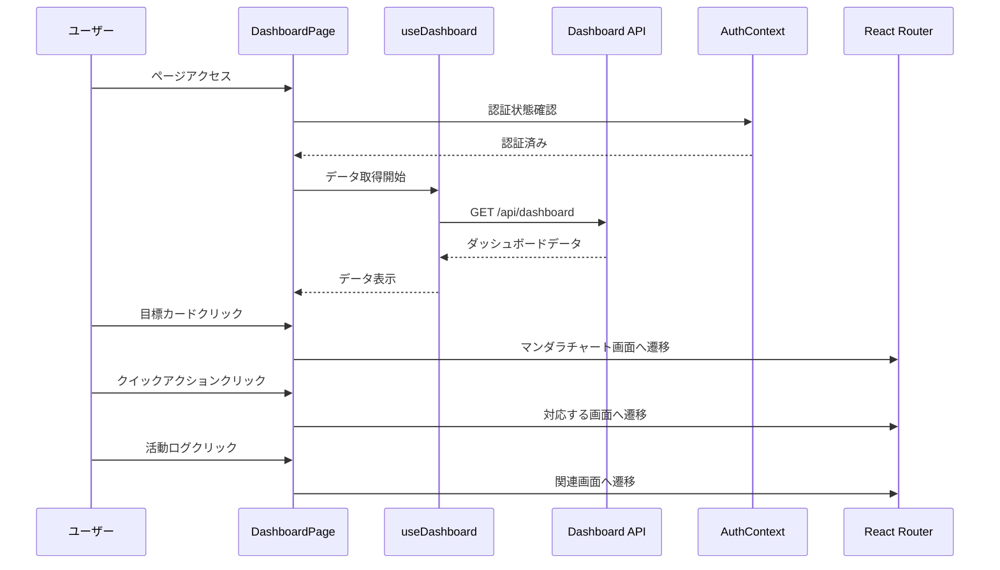

# 設計書

## 概要

ダッシュボード画面は、ユーザーが自分の目標達成状況を一目で把握し、最近の活動や統計情報を確認できる画面です。進捗サマリー、アクティブな目標、最近の活動、統計情報、クイックアクションを提供することで、モチベーション維持と効率的な目標管理を支援します。

## アーキテクチャ

### コンポーネント構成

```
DashboardPage (ページコンポーネント)
├── AppLayout (レイアウトコンポーネント)
│   ├── Header
│   │   ├── Logo
│   │   ├── Navigation
│   │   └── UserMenu
│   ├── DashboardContainer (ダッシュボードコンテナ)
│   │   ├── WelcomeMessage (ウェルカムメッセージ)
│   │   ├── ProgressSummary (進捗サマリーセクション)
│   │   │   ├── SummaryStats (統計カード)
│   │   │   │   ├── ActiveGoalsCard (アクティブ目標数)
│   │   │   │   ├── CompletedGoalsCard (完了目標数)
│   │   │   │   ├── AverageProgressCard (平均進捗率)
│   │   │   │   └── WeeklyTasksCard (今週のタスク数)
│   │   │   └── ActiveGoalsList (アクティブな目標リスト)
│   │   │       └── GoalCard[] (目標カード配列)
│   │   │           ├── GoalTitle (目標タイトル)
│   │   │           ├── ProgressBar (進捗バー)
│   │   │           └── Deadline (達成期限)
│   │   ├── RecentActivity (最近の活動セクション)
│   │   │   ├── ActivityList (活動リスト)
│   │   │   │   └── ActivityItem[] (活動アイテム配列)
│   │   │   │       ├── ActivityIcon (活動アイコン)
│   │   │   │       ├── ActivityContent (活動内容)
│   │   │   │       └── ActivityTime (活動時刻)
│   │   │   └── ViewMoreLink (もっと見るリンク)
│   │   ├── Statistics (統計情報セクション)
│   │   │   └── StatCard[] (統計カード配列)
│   │   │       ├── StatIcon (統計アイコン)
│   │   │       ├── StatValue (統計値)
│   │   │       └── StatLabel (統計ラベル)
│   │   └── QuickActions (クイックアクションセクション)
│   │       └── ActionButton[] (アクションボタン配列)
│   │           ├── ButtonIcon (ボタンアイコン)
│   │           └── ButtonLabel (ボタンラベル)
│   └── Footer
├── LoadingSpinner (ローディング表示)
├── ErrorAlert (エラー表示)
└── SkeletonLoader (スケルトンローダー)
```


### データフロー



## コンポーネント設計

### 1. DashboardPage

**責務:**
- ページ全体の状態管理
- 認証状態の確認
- データ取得とキャッシュ管理
- エラーハンドリング
- リダイレクト処理

**Props:**
```typescript
interface DashboardPageProps {
  className?: string;
}
```

**State:**
```typescript
interface PageState {
  isLoading: boolean;
  isInitialized: boolean;
  error: string | null;
}
```

### 2. WelcomeMessage

**責務:**
- ウェルカムメッセージの表示
- ユーザー名の表示

**Props:**
```typescript
interface WelcomeMessageProps {
  userName: string;
  className?: string;
}
```

### 3. SummaryStats

**責務:**
- 統計カードの表示
- 進捗率の視覚化

**Props:**
```typescript
interface SummaryStatsProps {
  activeGoals: number;
  completedGoals: number;
  averageProgress: number;
  weeklyTasks: number;
  monthlyTasks: number;
  className?: string;
}
```


### 4. GoalCard

**責務:**
- アクティブな目標の概要表示
- 進捗バーの表示
- クリックイベントの処理

**Props:**
```typescript
interface GoalCardProps {
  goal: ActiveGoal;
  onClick: (id: string) => void;
  className?: string;
}

interface ActiveGoal {
  id: string;
  title: string;
  progress: number;
  deadline: Date;
  isDeadlineNear: boolean;
}
```

### 5. ActivityItem

**責務:**
- 活動ログの表示
- 活動種別に応じたアイコン表示
- 相対時間の表示

**Props:**
```typescript
interface ActivityItemProps {
  activity: Activity;
  onClick?: (activity: Activity) => void;
  className?: string;
}

interface Activity {
  id: string;
  type: ActivityType;
  content: string;
  relatedId?: string;
  timestamp: Date;
}

enum ActivityType {
  TASK_COMPLETED = 'task_completed',
  GOAL_CREATED = 'goal_created',
  GOAL_UPDATED = 'goal_updated',
  GOAL_COMPLETED = 'goal_completed',
}
```

### 6. StatCard

**責務:**
- 統計情報の表示
- アイコンと数値の表示

**Props:**
```typescript
interface StatCardProps {
  icon: React.ReactNode;
  label: string;
  value: string | number;
  unit?: string;
  trend?: 'up' | 'down' | 'neutral';
  className?: string;
}
```

### 7. ActionButton

**責務:**
- クイックアクションボタンの表示
- クリックイベントの処理

**Props:**
```typescript
interface ActionButtonProps {
  icon: React.ReactNode;
  label: string;
  onClick: () => void;
  variant?: 'primary' | 'secondary' | 'outline';
  className?: string;
}
```

### 8. ProgressCircle

**責務:**
- 平均進捗率の円形表示
- 色分け表示（0-30%: 赤、31-70%: 黄、71-100%: 緑）

**Props:**
```typescript
interface ProgressCircleProps {
  progress: number; // 0-100
  size?: 'sm' | 'md' | 'lg';
  showLabel?: boolean;
  className?: string;
}
```


## カスタムフック設計

### useDashboard

**責務:**
- ダッシュボードデータの取得
- データのキャッシュ管理
- エラーハンドリング

**インターフェース:**
```typescript
interface UseDashboardReturn {
  // データ
  summary: DashboardSummary | null;
  activeGoals: ActiveGoal[];
  recentActivities: Activity[];
  statistics: Statistics | null;
  
  // 状態
  isLoading: boolean;
  isFetching: boolean;
  error: string | null;
  
  // メソッド
  refetch: () => Promise<void>;
}

interface DashboardSummary {
  activeGoalsCount: number;
  completedGoalsCount: number;
  averageProgress: number;
  weeklyTasksCount: number;
  monthlyTasksCount: number;
}

interface Statistics {
  totalTasks: number;
  completedTasks: number;
  taskCompletionRate: number;
  averageTaskTime: number;
  topProgressGoal: {
    id: string;
    title: string;
    progress: number;
  } | null;
}

function useDashboard(): UseDashboardReturn;
```

**実装詳細:**
```typescript
export function useDashboard() {
  const [summary, setSummary] = useState<DashboardSummary | null>(null);
  const [activeGoals, setActiveGoals] = useState<ActiveGoal[]>([]);
  const [recentActivities, setRecentActivities] = useState<Activity[]>([]);
  const [statistics, setStatistics] = useState<Statistics | null>(null);
  
  const [isLoading, setIsLoading] = useState(false);
  const [isFetching, setIsFetching] = useState(false);
  const [error, setError] = useState<string | null>(null);
  
  // データ取得
  const fetchDashboard = useCallback(async () => {
    setIsFetching(true);
    setError(null);
    
    try {
      const response = await DashboardService.getDashboard();
      
      setSummary(response.summary);
      setActiveGoals(response.activeGoals);
      setRecentActivities(response.recentActivities);
      setStatistics(response.statistics);
    } catch (err) {
      const errorMessage = err instanceof Error ? err.message : 'データの取得に失敗しました';
      setError(errorMessage);
    } finally {
      setIsFetching(false);
      setIsLoading(false);
    }
  }, []);
  
  // 初回データ取得
  useEffect(() => {
    setIsLoading(true);
    fetchDashboard();
  }, [fetchDashboard]);
  
  return {
    summary,
    activeGoals,
    recentActivities,
    statistics,
    isLoading,
    isFetching,
    error,
    refetch: fetchDashboard,
  };
}
```


## データモデル

### DashboardResponse

```typescript
interface DashboardResponse {
  success: boolean;
  data: {
    summary: {
      activeGoalsCount: number;
      completedGoalsCount: number;
      averageProgress: number;
      weeklyTasksCount: number;
      monthlyTasksCount: number;
    };
    activeGoals: Array<{
      id: string;
      title: string;
      progress: number;
      deadline: string;
    }>;
    recentActivities: Array<{
      id: string;
      type: ActivityType;
      content: string;
      relatedId?: string;
      timestamp: string;
    }>;
    statistics: {
      totalTasks: number;
      completedTasks: number;
      taskCompletionRate: number;
      averageTaskTime: number;
      topProgressGoal: {
        id: string;
        title: string;
        progress: number;
      } | null;
    };
  };
}
```

## API統合

### ダッシュボードデータ取得API

**エンドポイント:** `GET /api/dashboard`

**レスポンス（成功）:**
```typescript
interface GetDashboardResponse {
  success: true;
  data: {
    summary: {
      activeGoalsCount: number;
      completedGoalsCount: number;
      averageProgress: number;
      weeklyTasksCount: number;
      monthlyTasksCount: number;
    };
    activeGoals: Array<{
      id: string;
      title: string;
      progress: number;
      deadline: string;
    }>;
    recentActivities: Array<{
      id: string;
      type: string;
      content: string;
      relatedId?: string;
      timestamp: string;
    }>;
    statistics: {
      totalTasks: number;
      completedTasks: number;
      taskCompletionRate: number;
      averageTaskTime: number;
      topProgressGoal: {
        id: string;
        title: string;
        progress: number;
      } | null;
    };
  };
}
```

**レスポンス（エラー）:**
```typescript
interface ErrorResponse {
  success: false;
  error: {
    code: string;
    message: string;
  };
}
```


## スタイリング

### Tailwind CSSクラス

**ページコンテナ:**
```css
.dashboard-container {
  @apply min-h-screen bg-gray-50;
}

.dashboard-content {
  @apply max-w-7xl mx-auto px-4 sm:px-6 lg:px-8 py-8;
}
```

**ウェルカムメッセージ:**
```css
.welcome-message {
  @apply mb-8;
}

.welcome-title {
  @apply text-3xl font-bold text-gray-900;
}

.welcome-subtitle {
  @apply text-gray-600 mt-2;
}
```

**セクション:**
```css
.dashboard-section {
  @apply mb-8;
}

.section-header {
  @apply flex items-center justify-between mb-4;
}

.section-title {
  @apply text-xl font-semibold text-gray-900;
}

.section-link {
  @apply text-blue-600 hover:text-blue-700 text-sm font-medium;
}
```

**進捗サマリー:**
```css
.summary-grid {
  @apply grid gap-6
         grid-cols-1
         sm:grid-cols-2
         lg:grid-cols-4;
}

.summary-card {
  @apply bg-white rounded-lg shadow-sm border border-gray-200 p-6;
}

.summary-value {
  @apply text-3xl font-bold text-gray-900;
}

.summary-label {
  @apply text-sm text-gray-600 mt-2;
}
```

**アクティブな目標:**
```css
.goals-list {
  @apply space-y-4;
}

.goal-card {
  @apply bg-white rounded-lg shadow-sm border border-gray-200 p-4
         hover:shadow-md hover:border-blue-300
         focus:outline-none focus:ring-2 focus:ring-blue-500
         transition-all duration-200 cursor-pointer;
}

.goal-header {
  @apply flex items-center justify-between mb-2;
}

.goal-title {
  @apply text-lg font-semibold text-gray-900;
}

.goal-deadline {
  @apply text-sm text-gray-600;
}

.goal-progress-bar {
  @apply w-full bg-gray-200 rounded-full h-2;
}

.goal-progress-fill {
  @apply h-2 rounded-full transition-all duration-300;
}
```

**最近の活動:**
```css
.activity-list {
  @apply space-y-3;
}

.activity-item {
  @apply flex items-start gap-3 p-3 rounded-lg
         hover:bg-gray-50 cursor-pointer transition-colors duration-200;
}

.activity-icon {
  @apply flex-shrink-0 w-8 h-8 rounded-full flex items-center justify-center;
}

.activity-icon-completed {
  @apply bg-green-100 text-green-600;
}

.activity-icon-created {
  @apply bg-blue-100 text-blue-600;
}

.activity-icon-updated {
  @apply bg-yellow-100 text-yellow-600;
}

.activity-content {
  @apply flex-1;
}

.activity-text {
  @apply text-sm text-gray-900;
}

.activity-time {
  @apply text-xs text-gray-500 mt-1;
}
```

**統計情報:**
```css
.stats-grid {
  @apply grid gap-6
         grid-cols-1
         sm:grid-cols-2
         lg:grid-cols-3;
}

.stat-card {
  @apply bg-white rounded-lg shadow-sm border border-gray-200 p-6;
}

.stat-header {
  @apply flex items-center gap-3 mb-4;
}

.stat-icon {
  @apply w-10 h-10 rounded-lg flex items-center justify-center;
}

.stat-value {
  @apply text-2xl font-bold text-gray-900;
}

.stat-label {
  @apply text-sm text-gray-600 mt-1;
}
```

**クイックアクション:**
```css
.quick-actions {
  @apply grid gap-4
         grid-cols-1
         sm:grid-cols-2
         lg:grid-cols-3;
}

.action-button {
  @apply flex items-center gap-3 px-6 py-4 rounded-lg
         bg-white border-2 border-gray-200
         hover:border-blue-500 hover:bg-blue-50
         focus:outline-none focus:ring-2 focus:ring-blue-500
         transition-all duration-200 cursor-pointer;
}

.action-icon {
  @apply w-6 h-6 text-blue-600;
}

.action-label {
  @apply text-sm font-medium text-gray-900;
}
```


### レスポンシブブレークポイント

```typescript
const breakpoints = {
  mobile: '< 768px',
  tablet: '768px - 1024px',
  desktop: '> 1024px',
};
```

**モバイル（< 768px）:**
- 1カラムレイアウト
- 各セクションを縦方向に配置
- タッチ操作に適したボタンサイズ（最小44px × 44px）

**タブレット（768px - 1024px）:**
- 2カラムレイアウト（進捗サマリー、統計情報）
- 適度な余白とカードサイズ

**デスクトップ（> 1024px）:**
- 3カラムレイアウト（進捗サマリー、最近の活動、統計情報）
- 最大幅7xlコンテナ

## アクセシビリティ

### ARIA属性

```typescript
// ウェルカムメッセージ
<h1 role="heading" aria-level="1">
  こんにちは、{userName}さん
</h1>

// 進捗サマリー
<section aria-labelledby="progress-summary-title">
  <h2 id="progress-summary-title">進捗サマリー</h2>
  {/* コンテンツ */}
</section>

// 統計カード
<div
  role="region"
  aria-label={`${label}: ${value}${unit}`}
>
  {/* カード内容 */}
</div>

// アクティブな目標カード
<article
  role="button"
  tabIndex={0}
  aria-label={`${title}、進捗率${progress}%、期限${deadline}`}
  onClick={handleClick}
  onKeyPress={handleKeyPress}
>
  {/* カード内容 */}
</article>

// 最近の活動
<ul role="list" aria-label="最近の活動">
  <li role="listitem">
    {/* 活動アイテム */}
  </li>
</ul>

// クイックアクション
<button
  aria-label={label}
  onClick={onClick}
>
  {/* ボタン内容 */}
</button>

// ローディング状態
<div role="status" aria-live="polite" aria-busy={isLoading}>
  {isLoading ? 'データを読み込んでいます...' : null}
</div>

// エラーメッセージ
<div role="alert" aria-live="assertive">
  {error}
</div>
```

### キーボードナビゲーション

- Tabキーで全てのインタラクティブ要素にフォーカス可能
- Enterキー/Spaceキーで目標カードやボタンを選択
- フォーカスインジケーターの明確な表示

### スクリーンリーダー対応

- 各セクションの見出しを適切に読み上げ
- 進捗率を「進捗率XX%」として読み上げ
- 統計情報を「ラベル: 値 単位」として読み上げ
- ローディング状態の通知
- エラーメッセージの読み上げ


## エラーハンドリング

### エラーの種類

1. **データ取得エラー**
   - 画面上部に表示
   - 再試行ボタン表示

2. **ネットワークエラー**
   - 画面上部に表示
   - 再試行ボタン表示

3. **認証エラー**
   - ログイン画面にリダイレクト

### エラーメッセージ

```typescript
const ERROR_MESSAGES = {
  FETCH_ERROR: 'データの取得に失敗しました。もう一度お試しください。',
  NETWORK_ERROR: 'ネットワークエラーが発生しました。接続を確認してください。',
  UNAUTHORIZED: '認証エラーが発生しました。再度ログインしてください。',
  UNKNOWN_ERROR: '予期しないエラーが発生しました。',
};
```

## パフォーマンス最適化

### コード分割

```typescript
// 遅延読み込み
const DashboardPage = lazy(() => import('./pages/DashboardPage'));
const GoalCard = lazy(() => import('./components/GoalCard'));
const StatCard = lazy(() => import('./components/StatCard'));
```

### メモ化

```typescript
// コンポーネントのメモ化
const GoalCard = memo(GoalCardComponent);
const StatCard = memo(StatCardComponent);
const ActivityItem = memo(ActivityItemComponent);

// コールバックのメモ化
const handleGoalClick = useCallback((id: string) => {
  navigate(`/mandala/${id}`);
}, [navigate]);

// 値のメモ化
const sortedActivities = useMemo(() => {
  return recentActivities.sort((a, b) => 
    new Date(b.timestamp).getTime() - new Date(a.timestamp).getTime()
  );
}, [recentActivities]);
```

### 画像最適化

```typescript
// 遅延読み込み

```

## テスト戦略

### ユニットテスト

1. **コンポーネントテスト**
   - GoalCard: 表示内容、クリックイベント
   - StatCard: 統計値の表示
   - ActivityItem: 活動ログの表示
   - ActionButton: クリックイベント

2. **フックテスト**
   - useDashboard: データ取得、エラーハンドリング

3. **ユーティリティテスト**
   - 相対時間フォーマット
   - 進捗率計算

### 統合テスト

1. **データ取得フロー**
   - ページアクセス→データ取得→表示

2. **ナビゲーションフロー**
   - 目標カードクリック→詳細画面遷移
   - クイックアクションクリック→対応画面遷移

### E2Eテスト

1. **正常系**
   - ログイン→ダッシュボード表示
   - 目標カードクリック→詳細画面遷移
   - クイックアクションクリック→対応画面遷移

2. **異常系**
   - データ取得エラー表示
   - ネットワークエラー表示
   - 空状態表示


## セキュリティ考慮事項

### 認証・認可

```typescript
// 認証チェック
useEffect(() => {
  if (!isAuthenticated) {
    navigate('/login');
  }
}, [isAuthenticated, navigate]);

// APIリクエストに認証トークンを含める
const fetchDashboard = async () => {
  const token = await getAuthToken();
  const response = await fetch('/api/dashboard', {
    headers: {
      'Authorization': `Bearer ${token}`,
    },
  });
};
```

### XSS対策

```typescript
// Reactの自動エスケープ機能を活用
<div>{goal.title}</div>

// dangerouslySetInnerHTMLの使用禁止
// ❌ <div dangerouslySetInnerHTML={{ __html: activity.content }} />
```

### CSRF対策

- SameSite Cookie属性の設定
- APIリクエストに認証トークンを含める

## 監視とログ

### ログ出力

```typescript
// ページ表示ログ
logger.info('DashboardPage: Page loaded', {
  userId: user.id,
  timestamp: new Date().toISOString(),
});

// データ取得ログ
logger.info('DashboardPage: Data fetched', {
  userId: user.id,
  activeGoalsCount: summary.activeGoalsCount,
  timestamp: new Date().toISOString(),
});

// エラーログ
logger.error('DashboardPage: API error', {
  userId: user.id,
  error: error.message,
  timestamp: new Date().toISOString(),
});
```

### パフォーマンス監視

```typescript
// ページロード時間
performance.mark('dashboard-start');
// ... ページ処理 ...
performance.mark('dashboard-end');
performance.measure('dashboard', 'dashboard-start', 'dashboard-end');

// API応答時間
const startTime = Date.now();
await fetchDashboard();
const endTime = Date.now();
logger.info('API response time', { duration: endTime - startTime });
```

## 今後の拡張性

### 将来的な機能追加

1. **カスタマイズ可能なダッシュボード**
   - ウィジェットの追加・削除
   - レイアウトのカスタマイズ
   - 表示項目の選択

2. **グラフ・チャート機能**
   - 進捗推移グラフ
   - タスク完了数の推移
   - 目標達成率の推移

3. **通知センター**
   - 未読通知の表示
   - 通知の既読管理
   - 通知設定

4. **目標推奨機能**
   - AIによる目標推奨
   - 類似目標の提案
   - 達成可能性の予測

5. **チーム機能**
   - チームダッシュボード
   - メンバーの進捗表示
   - チーム統計

6. **エクスポート機能**
   - ダッシュボードのPDF出力
   - 統計データのCSV出力
   - レポート生成

7. **リアルタイム更新**
   - WebSocketによるリアルタイム更新
   - 進捗の自動更新
   - 活動ログの自動追加

8. **モチベーション機能**
   - 達成バッジ
   - ストリーク表示
   - 励ましメッセージ

9. **比較機能**
   - 前月との比較
   - 目標間の比較
   - 平均との比較

10. **フィルター機能**
    - 期間フィルター
    - 目標種別フィルター
    - カスタムフィルター
