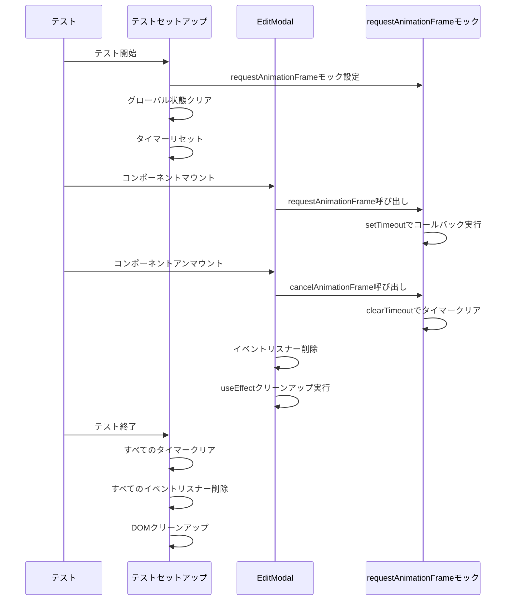

# 設計書

## 概要

テスト環境におけるrequestAnimationFrame未定義エラーとメモリリーク問題を解決するための設計を定義します。主な対策として、テストセットアップでのrequestAnimationFrameモック実装、EditModalのクリーンアップ処理改善、テスト終了時のクリーンアップ強化を行います。

## アーキテクチャ

### システム構成

```
テスト環境
├── テストセットアップ (vitest.setup.ts)
│   ├── requestAnimationFrameモック
│   ├── グローバル状態クリア
│   └── タイマーリセット
├── コンポーネント (EditModal.tsx)
│   ├── requestAnimationFrame使用
│   ├── useEffectクリーンアップ
│   └── イベントリスナー管理
└── テストファイル (EditModal.test.tsx)
    ├── メモリリーク検出テスト
    ├── クリーンアップ検証テスト
    └── 複数回マウント・アンマウントテスト
```

### 処理フロー



## コンポーネント設計

### 1. requestAnimationFrameモック

#### 目的
テスト環境でrequestAnimationFrameを使用可能にし、適切にクリーンアップできるようにする。

#### 実装方法

```typescript
// packages/frontend/vitest.setup.ts

// requestAnimationFrameのタイマーIDを管理
const rafTimers = new Set<NodeJS.Timeout>();

// requestAnimationFrameモック
global.requestAnimationFrame = (callback: FrameRequestCallback): number => {
  const timer = setTimeout(() => {
    callback(Date.now());
    rafTimers.delete(timer);
  }, 16); // 約60fps
  rafTimers.add(timer);
  return timer as unknown as number;
};

// cancelAnimationFrameモック
global.cancelAnimationFrame = (id: number): void => {
  const timer = id as unknown as NodeJS.Timeout;
  clearTimeout(timer);
  rafTimers.delete(timer);
};

// テスト終了時のクリーンアップ
afterEach(() => {
  // すべてのrequestAnimationFrameタイマーをクリア
  rafTimers.forEach(timer => clearTimeout(timer));
  rafTimers.clear();
});
```

#### 設計上の考慮事項

- **タイマーID管理**: Setを使用してすべてのタイマーIDを追跡
- **自動クリーンアップ**: afterEachで確実にクリーンアップ
- **60fps相当**: 16msのsetTimeoutで実際のrequestAnimationFrameに近い動作を再現

### 2. EditModalのクリーンアップ処理改善

#### 目的
EditModalコンポーネントがアンマウント時に適切にリソースを解放する。

#### 実装方法

```typescript
// packages/frontend/src/components/mandala/EditModal.tsx

useEffect(() => {
  if (!isOpen) return;

  let rafId: number | null = null;

  const animate = () => {
    // アニメーション処理
    rafId = requestAnimationFrame(animate);
  };

  rafId = requestAnimationFrame(animate);

  return () => {
    // クリーンアップ: requestAnimationFrameをキャンセル
    if (rafId !== null) {
      cancelAnimationFrame(rafId);
      rafId = null;
    }
  };
}, [isOpen]);
```

#### 設計上の考慮事項

- **rafIdの管理**: useEffect内でrafIdを管理し、クリーンアップ時にキャンセル
- **null初期化**: クリーンアップ後にnullに設定してメモリリークを防止
- **条件付き実行**: isOpenがfalseの場合は早期リターン

### 3. テスト終了時のクリーンアップ強化

#### 目的
テスト終了時にすべてのリソースを確実にクリーンアップする。

#### 実装方法

```typescript
// packages/frontend/vitest.setup.ts

afterEach(() => {
  // 1. すべてのタイマーをクリア
  vi.clearAllTimers();
  
  // 2. すべてのrequestAnimationFrameタイマーをクリア
  rafTimers.forEach(timer => clearTimeout(timer));
  rafTimers.clear();
  
  // 3. DOMクリーンアップ
  cleanup();
  
  // 4. グローバル状態クリア
  localStorage.clear();
  sessionStorage.clear();
  
  // 5. すべてのモックをクリア
  vi.clearAllMocks();
});
```

#### 設計上の考慮事項

- **順序**: タイマー → requestAnimationFrame → DOM → グローバル状態 → モックの順でクリーンアップ
- **確実性**: 各クリーンアップ処理を個別に実行して確実性を高める
- **再利用性**: afterEachで実行することで、すべてのテストで自動的にクリーンアップ

### 4. メモリリーク検出テスト

#### 目的
メモリリークが発生していないことを自動的に検証する。

#### 実装方法

```typescript
// packages/frontend/src/components/mandala/EditModal.test.tsx

describe('メモリリーク検出', () => {
  it('複数回のマウント・アンマウントでメモリリークが発生しない', () => {
    // requestAnimationFrameタイマーの数を記録
    const initialTimerCount = rafTimers.size;

    // 10回マウント・アンマウントを繰り返す
    for (let i = 0; i < 10; i++) {
      const { unmount } = render(
        <EditModal
          isOpen={true}
          onClose={vi.fn()}
          onSave={vi.fn()}
          initialData={{ title: 'Test' }}
        />
      );
      unmount();
    }

    // タイマーが残っていないことを確認
    expect(rafTimers.size).toBe(initialTimerCount);
  });

  it('アンマウント後にrequestAnimationFrameがキャンセルされる', () => {
    const { unmount } = render(
      <EditModal
        isOpen={true}
        onClose={vi.fn()}
        onSave={vi.fn()}
        initialData={{ title: 'Test' }}
      />
    );

    // タイマーが設定されていることを確認
    const timerCountBeforeUnmount = rafTimers.size;
    expect(timerCountBeforeUnmount).toBeGreaterThan(0);

    // アンマウント
    unmount();

    // タイマーがクリアされていることを確認
    expect(rafTimers.size).toBe(0);
  });
});
```

#### 設計上の考慮事項

- **タイマー数の追跡**: rafTimers.sizeでタイマー数を確認
- **複数回テスト**: 10回のマウント・アンマウントでメモリリークを検出
- **明確なアサーション**: タイマーが残っていないことを明確に検証

## データモデル

### requestAnimationFrameタイマー管理

```typescript
// タイマーIDを管理するSet
const rafTimers: Set<NodeJS.Timeout> = new Set();

// タイマーID追加
rafTimers.add(timer);

// タイマーID削除
rafTimers.delete(timer);

// すべてのタイマークリア
rafTimers.forEach(timer => clearTimeout(timer));
rafTimers.clear();
```

## エラーハンドリング

### 1. requestAnimationFrame未定義エラー

**原因**: テスト環境でrequestAnimationFrameが定義されていない

**対策**: テストセットアップでrequestAnimationFrameをモック

**エラーメッセージ**: 
```
ReferenceError: requestAnimationFrame is not defined
```

**修正後**: エラーが発生しない

### 2. Worker予期せぬ終了エラー

**原因**: メモリリークによりWorkerがクラッシュ

**対策**: すべてのクリーンアップ処理を実装

**エラーメッセージ**:
```
Worker unexpectedly exited
```

**修正後**: エラーが発生しない

### 3. メモリリークエラー

**原因**: タイマーやイベントリスナーがクリーンアップされていない

**対策**: useEffectのクリーンアップ関数を実装

**検出方法**: メモリリーク検出テストで自動検出

## テスト戦略

### 1. ユニットテスト

#### requestAnimationFrameモックのテスト

```typescript
describe('requestAnimationFrameモック', () => {
  it('requestAnimationFrameが正しく動作する', (done) => {
    const callback = vi.fn(() => done());
    requestAnimationFrame(callback);
  });

  it('cancelAnimationFrameが正しく動作する', (done) => {
    const callback = vi.fn();
    const id = requestAnimationFrame(callback);
    cancelAnimationFrame(id);
    
    setTimeout(() => {
      expect(callback).not.toHaveBeenCalled();
      done();
    }, 20);
  });
});
```

#### EditModalのクリーンアップテスト

```typescript
describe('EditModalのクリーンアップ', () => {
  it('アンマウント時にrequestAnimationFrameをキャンセルする', () => {
    const { unmount } = render(<EditModal isOpen={true} />);
    const timerCountBefore = rafTimers.size;
    expect(timerCountBefore).toBeGreaterThan(0);
    
    unmount();
    
    expect(rafTimers.size).toBe(0);
  });
});
```

### 2. メモリリーク検出テスト

```typescript
describe('メモリリーク検出', () => {
  it('複数回のマウント・アンマウントでメモリリークが発生しない', () => {
    for (let i = 0; i < 10; i++) {
      const { unmount } = render(<EditModal isOpen={true} />);
      unmount();
    }
    
    expect(rafTimers.size).toBe(0);
  });
});
```

### 3. 統合テスト

```typescript
describe('EditModal統合テスト', () => {
  it('開く→閉じる→開くのサイクルでメモリリークが発生しない', async () => {
    const { rerender, unmount } = render(<EditModal isOpen={false} />);
    
    // 開く
    rerender(<EditModal isOpen={true} />);
    await waitFor(() => expect(rafTimers.size).toBeGreaterThan(0));
    
    // 閉じる
    rerender(<EditModal isOpen={false} />);
    await waitFor(() => expect(rafTimers.size).toBe(0));
    
    // 再度開く
    rerender(<EditModal isOpen={true} />);
    await waitFor(() => expect(rafTimers.size).toBeGreaterThan(0));
    
    // アンマウント
    unmount();
    expect(rafTimers.size).toBe(0);
  });
});
```

## パフォーマンス最適化

### 1. requestAnimationFrameモックの最適化

- **タイマーID管理**: Setを使用して高速な追加・削除を実現
- **メモリ効率**: 不要なタイマーIDを即座に削除

### 2. クリーンアップ処理の最適化

- **早期リターン**: 不要な処理をスキップ
- **バッチ処理**: 複数のクリーンアップ処理をまとめて実行

## セキュリティ考慮事項

特になし（テスト環境のみの変更）

## ドキュメント

### ステアリングファイルの更新

以下の内容を`.kiro/steering/9-test-guide.md`に追加します：

#### requestAnimationFrameの使用方法

```markdown
### requestAnimationFrameの使用方法

#### テスト環境でのrequestAnimationFrame

テスト環境では、requestAnimationFrameは自動的にモックされます。モックは以下の特徴を持ちます：

- setTimeoutを使用して約60fps（16ms）でコールバックを実行
- すべてのタイマーIDを追跡し、テスト終了時に自動的にクリーンアップ
- cancelAnimationFrameで明示的にキャンセル可能

#### コンポーネントでの使用例

```typescript
useEffect(() => {
  if (!isOpen) return;

  let rafId: number | null = null;

  const animate = () => {
    // アニメーション処理
    rafId = requestAnimationFrame(animate);
  };

  rafId = requestAnimationFrame(animate);

  return () => {
    // クリーンアップ: requestAnimationFrameをキャンセル
    if (rafId !== null) {
      cancelAnimationFrame(rafId);
      rafId = null;
    }
  };
}, [isOpen]);
```

#### メモリリーク防止のベストプラクティス

1. **必ずクリーンアップする**: useEffectのクリーンアップ関数でcancelAnimationFrameを呼び出す
2. **rafIdをnullに設定**: クリーンアップ後にrafIdをnullに設定してメモリリークを防止
3. **条件付き実行**: 不要な場合は早期リターンして無駄な処理を避ける
4. **メモリリーク検出テスト**: 複数回のマウント・アンマウントでメモリリークが発生しないことを確認
```

## 実装の優先順位

1. **高優先度**: requestAnimationFrameモック実装（要件1）
2. **高優先度**: EditModalのクリーンアップ処理改善（要件2）
3. **高優先度**: テスト終了時のクリーンアップ強化（要件3）
4. **中優先度**: メモリリーク検出テストの追加（要件7）
5. **中優先度**: 他のコンポーネントのrequestAnimationFrame使用確認（要件4）
6. **低優先度**: Worker予期せぬ終了エラーの調査（要件5）
7. **低優先度**: テストセットアップの改善（要件6）
8. **低優先度**: ドキュメントとガイドラインの更新（要件8）

## 成功基準

1. requestAnimationFrame未定義エラーが発生しない
2. EditModalのテストがすべて成功する
3. メモリリーク検出テストがすべて成功する
4. Worker予期せぬ終了エラーが発生しない
5. テスト実行時間が大幅に増加しない（目標: 10%以内の増加）
6. すべてのテストが安定して成功する（成功率100%）

## リスクと対策

### リスク1: requestAnimationFrameモックの精度

**リスク**: モックが実際のrequestAnimationFrameと異なる動作をする可能性

**対策**: 
- 16msのsetTimeoutで約60fpsを再現
- 実際のブラウザ環境でも動作確認

### リスク2: 他のコンポーネントへの影響

**リスク**: requestAnimationFrameを使用する他のコンポーネントに影響が出る可能性

**対策**:
- コードベース全体を検索してrequestAnimationFrame使用箇所を特定
- 各コンポーネントでクリーンアップ処理を確認

### リスク3: パフォーマンスへの影響

**リスク**: クリーンアップ処理の追加によりテスト実行時間が増加する可能性

**対策**:
- クリーンアップ処理を最適化
- テスト実行時間を測定して影響を確認

## 今後の拡張

1. **自動メモリリーク検出**: すべてのコンポーネントテストで自動的にメモリリークを検出
2. **パフォーマンス監視**: テスト実行時間とメモリ使用量を継続的に監視
3. **ベストプラクティスの自動チェック**: ESLintルールでrequestAnimationFrameのクリーンアップを強制
