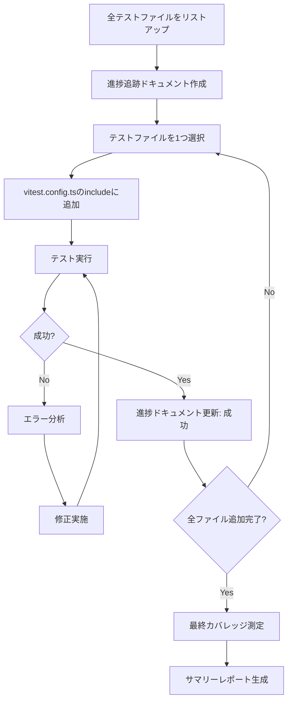
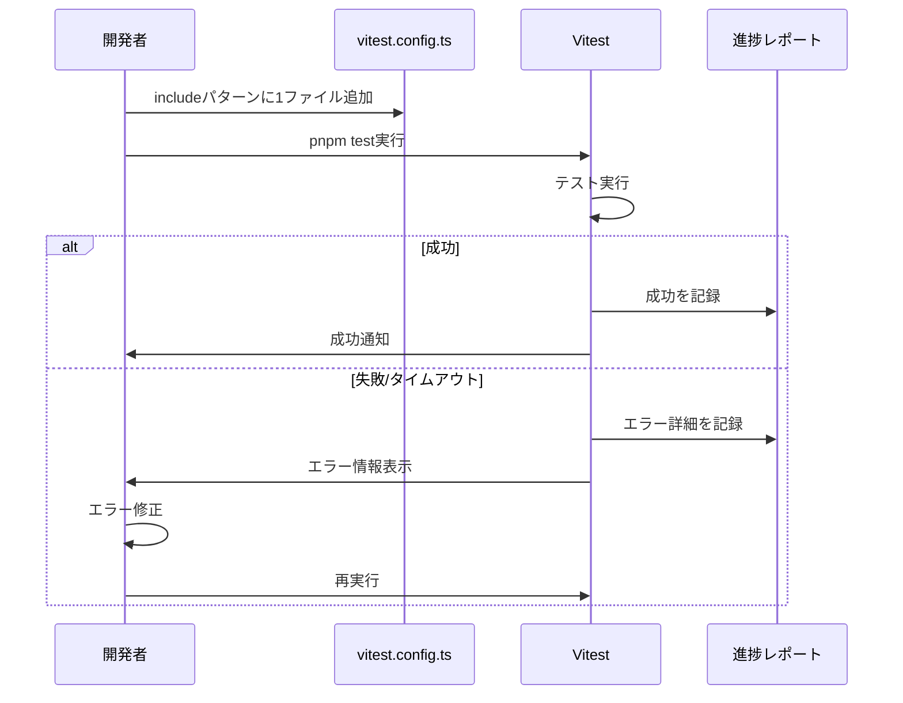

# 設計書

## 概要

フロントエンドのテストスイート（149個のテストファイル）を段階的に追加し、全テストケースを実行可能な状態にする。現在、多くのテストがタイムアウト、エラー、無限ループなどの問題により実行できない。テストファイルを一つずつ追加しながら問題を特定・修正し、最終的に全テストを通して正確なカバレッジを測定する。

## アーキテクチャ

### 段階的追加プロセス



### テスト実行フロー



## コンポーネントとインターフェース

### 1. 進捗追跡システム

#### 進捗ドキュメント構造

```typescript
interface TestProgress {
  totalFiles: number;
  processedFiles: number;
  passedFiles: number;
  failedFiles: number;
  timeoutFiles: number;
  files: TestFileStatus[];
}

interface TestFileStatus {
  path: string;
  status: 'pending' | 'passed' | 'failed' | 'timeout';
  errorMessage?: string;
  stackTrace?: string;
  executionTime?: number;
  attempts: number;
}
```

#### 進捗追跡ドキュメント（Markdown形式）

```markdown
# テスト追加進捗レポート

## 統計情報

- 総ファイル数: 149
- 処理済み: 0
- 成功: 0
- 失敗: 0
- タイムアウト: 0

## ファイル別状態

### 成功 (0)

### 失敗 (0)

### タイムアウト (0)

### 未処理 (149)
- [ ] packages/frontend/src/contexts/SubGoalContext.test.tsx
- [ ] packages/frontend/src/contexts/ActionContext.test.tsx
...
```

### 2. テスト設定管理

#### vitest.config.ts の段階的更新

```typescript
// 初期状態: 特定のファイルのみ
include: [
  'src/components/common/ErrorAlert.test.tsx',
],

// 1ファイル追加後
include: [
  'src/components/common/ErrorAlert.test.tsx',
  'src/components/common/SuccessMessage.test.tsx',
],

// 最終状態: 全ファイル
include: [
  'src/**/*.test.{ts,tsx}',
],
```

### 3. エラー分類システム

#### エラーカテゴリ

```typescript
enum ErrorCategory {
  TIMEOUT = 'timeout',
  MISSING_MOCK = 'missing_mock',
  DOM_QUERY = 'dom_query',
  ASYNC_ISSUE = 'async_issue',
  MEMORY_LEAK = 'memory_leak',
  INFINITE_LOOP = 'infinite_loop',
  TYPE_ERROR = 'type_error',
  IMPORT_ERROR = 'import_error',
  OTHER = 'other',
}

interface ErrorAnalysis {
  category: ErrorCategory;
  description: string;
  suggestedFix: string;
  priority: 'high' | 'medium' | 'low';
}
```

#### エラーパターンマッチング

```typescript
const errorPatterns: Record<ErrorCategory, RegExp[]> = {
  [ErrorCategory.TIMEOUT]: [
    /Test timed out/,
    /Exceeded timeout/,
  ],
  [ErrorCategory.MISSING_MOCK]: [
    /Cannot find module/,
    /is not a function/,
    /undefined is not an object/,
  ],
  [ErrorCategory.DOM_QUERY]: [
    /Unable to find element/,
    /TestingLibraryElementError/,
  ],
  [ErrorCategory.ASYNC_ISSUE]: [
    /act\(\) warning/,
    /not wrapped in act/,
  ],
  // ...
};
```

## データモデル

### テストファイルリスト

```typescript
interface TestFileList {
  files: string[];
  categories: {
    components: string[];
    hooks: string[];
    services: string[];
    utils: string[];
    contexts: string[];
    pages: string[];
  };
}
```

### カバレッジデータ

```typescript
interface CoverageData {
  lines: {
    total: number;
    covered: number;
    percentage: number;
  };
  branches: {
    total: number;
    covered: number;
    percentage: number;
  };
  functions: {
    total: number;
    covered: number;
    percentage: number;
  };
  statements: {
    total: number;
    covered: number;
    percentage: number;
  };
  files: FileCoverage[];
}

interface FileCoverage {
  path: string;
  lines: number;
  branches: number;
  functions: number;
  statements: number;
}
```

## 正確性プロパティ

*プロパティは、システムの全ての有効な実行において真であるべき特性や動作の形式的な記述です。プロパティは、人間が読める仕様と機械で検証可能な正確性保証の橋渡しをします。*

### プロパティ1: テストファイル追加の冪等性

*任意の*テストファイルについて、includeパターンに追加して実行した結果は、同じファイルを再度追加して実行しても同じ結果になる

**検証: 要件1.2**

### プロパティ2: 進捗追跡の完全性

*任意の*テストファイルについて、処理された場合、進捗ドキュメントに必ず記録される（成功、失敗、タイムアウトのいずれか）

**検証: 要件2.2**

### プロパティ3: エラー分類の網羅性

*任意の*テストエラーについて、エラーカテゴリのいずれかに分類される

**検証: 要件3.1, 3.2, 3.3, 3.4**

### プロパティ4: カバレッジの単調増加

*任意の*テストファイル追加について、成功した場合、全体のカバレッジは減少しない（単調増加）

**検証: 要件4.1**

### プロパティ5: テスト独立性の保持

*任意の*2つのテストファイルについて、一方のテストの実行結果は他方のテストの実行結果に影響を与えない

**検証: 要件5.2**

## エラーハンドリング

### タイムアウトエラー

```typescript
// タイムアウト検出
if (executionTime > testTimeout) {
  return {
    status: 'timeout',
    errorMessage: `Test timed out after ${executionTime}ms`,
    suggestedFix: [
      'タイムアウト値を増やす（testTimeout設定）',
      '遅い操作を特定する（console.timeを使用）',
      '非同期処理を適切にawaitする',
    ],
  };
}
```

### モック不足エラー

```typescript
// モック不足検出
if (error.message.includes('is not a function')) {
  return {
    status: 'failed',
    category: ErrorCategory.MISSING_MOCK,
    suggestedFix: [
      'vi.mock()でモジュールをモックする',
      'モック関数をvi.fn()で作成する',
      'モックの戻り値をmockReturnValue()で設定する',
    ],
  };
}
```

### DOM クエリエラー

```typescript
// DOM クエリエラー検出
if (error.message.includes('Unable to find element')) {
  return {
    status: 'failed',
    category: ErrorCategory.DOM_QUERY,
    suggestedFix: [
      'getByRole()を使用する（推奨）',
      'findBy*()で非同期レンダリングを待つ',
      'queryBy*()で存在しない要素をテストする',
      'screen.debug()で現在のDOMを確認する',
    ],
  };
}
```

### 非同期処理エラー

```typescript
// 非同期処理エラー検出
if (error.message.includes('act() warning')) {
  return {
    status: 'failed',
    category: ErrorCategory.ASYNC_ISSUE,
    suggestedFix: [
      'act()で状態更新をラップする',
      'waitFor()で非同期処理を待つ',
      'findBy*()で非同期レンダリングを待つ',
    ],
  };
}
```

## テスト戦略

### 段階的追加の順序

1. **基本コンポーネント** (優先度: 高)
   - ErrorAlert, SuccessMessage など
   - 依存関係が少ない
   - 修正が容易

2. **ユーティリティ関数** (優先度: 高)
   - sanitize, validation など
   - 純粋関数が多い
   - テストが安定

3. **フォームコンポーネント** (優先度: 中)
   - TextInput, TextArea など
   - React Hook Formに依存
   - モックが必要

4. **複雑なコンポーネント** (優先度: 中)
   - EditModal, HistoryPanel など
   - 複数の依存関係
   - 統合テストが必要

5. **ページコンポーネント** (優先度: 低)
   - SubGoalEditPage など
   - 多くの依存関係
   - E2Eテストで代替可能

### テスト修正の優先順位

1. **タイムアウト** (優先度: 最高)
   - テスト実行をブロックする
   - 無限ループの可能性

2. **モック不足** (優先度: 高)
   - 修正が比較的容易
   - パターンが明確

3. **DOM クエリ** (優先度: 高)
   - 修正が比較的容易
   - パターンが明確

4. **非同期処理** (優先度: 中)
   - 修正に時間がかかる
   - パターンが複雑

5. **その他** (優先度: 低)
   - ケースバイケース
   - 個別対応が必要

### ユニットテスト

各段階で以下をテストする：

1. **テストファイル追加**
   - includeパターンが正しく更新される
   - 追加されたファイルのみが実行される

2. **進捗追跡**
   - 進捗ドキュメントが正しく更新される
   - 統計情報が正確に計算される

3. **エラー分類**
   - エラーが正しくカテゴリ分類される
   - 修正提案が適切に生成される

4. **カバレッジ測定**
   - カバレッジデータが正確に収集される
   - カバレッジが単調増加する

### プロパティベーステスト

各プロパティについて、fast-checkを使用してテストする：

1. **プロパティ1: 冪等性**
   ```typescript
   fc.assert(
     fc.property(fc.string(), (testFile) => {
       const result1 = runTest(testFile);
       const result2 = runTest(testFile);
       return result1.status === result2.status;
     })
   );
   ```

2. **プロパティ2: 完全性**
   ```typescript
   fc.assert(
     fc.property(fc.string(), (testFile) => {
       runTest(testFile);
       const progress = getProgress();
       return progress.files.some(f => f.path === testFile);
     })
   );
   ```

3. **プロパティ4: 単調増加**
   ```typescript
   fc.assert(
     fc.property(fc.string(), (testFile) => {
       const coverageBefore = getCoverage();
       runTest(testFile);
       const coverageAfter = getCoverage();
       return coverageAfter.lines.percentage >= coverageBefore.lines.percentage;
     })
   );
   ```

## 実装計画

### フェーズ1: 準備（1日）

1. 全テストファイルのリストアップ
2. 進捗追跡ドキュメントの作成
3. エラー分類システムの実装

### フェーズ2: 段階的追加（5-7日）

1. 基本コンポーネントのテスト追加（1日）
2. ユーティリティ関数のテスト追加（1日）
3. フォームコンポーネントのテスト追加（2日）
4. 複雑なコンポーネントのテスト追加（2日）
5. ページコンポーネントのテスト追加（1日）

### フェーズ3: 最終検証（1日）

1. 全テストの実行確認
2. カバレッジ測定
3. サマリーレポート生成
4. ドキュメント更新

## 成功基準

1. **全テスト成功**: 149個全てのテストファイルが成功する
2. **カバレッジ目標**: 全体のカバレッジが80%以上
3. **実行時間**: 全テストが60秒以内に完了する
4. **安定性**: 3回連続で全テストが成功する
5. **ドキュメント**: 進捗レポートとサマリーレポートが完成する
