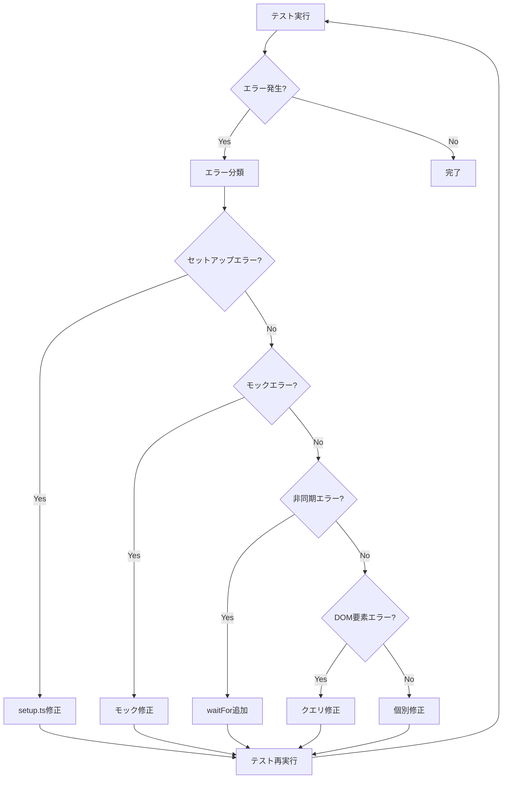

# 設計書

## 概要

現状のテストコードは200以上のファイルがあり、実行時間が長すぎてCI/CDで実行できない状況です。本設計では、テストアーキテクチャを全面的に見直し、軽量で高速なテスト環境を構築します。

## アーキテクチャ

### テスト構造の簡素化

```
packages/frontend/
├── src/
│   ├── __tests__/                    # ユニットテストのみ
│   │   ├── components/               # コンポーネントテスト
│   │   ├── hooks/                    # カスタムフックテスト
│   │   ├── utils/                    # ユーティリティテスト
│   │   └── integration/              # 統合テスト（最小限）
│   └── test/
│       └── setup.ts                  # テストセットアップ
├── e2e/                              # E2Eテスト（Playwright）
│   └── critical-flows/               # 重要フローのみ
├── vitest.config.ts                  # Vitest設定（最適化済み）
└── package.json                      # テストスクリプト（簡素化）
```

### 削除対象

以下のテストファイルとディレクトリを削除します：

1. **パフォーマンステスト**
   - `src/__tests__/performance/`
   - `src/test/performance/`
   - すべての `*.performance.test.tsx` ファイル

2. **アクセシビリティテスト**
   - `src/__tests__/accessibility-*.test.tsx`
   - `src/components/accessibility/__tests__/`
   - `src/test/accessibility-test-runner.ts`

3. **重複テストファイル**
   - 同じコンポーネントに対する複数のテストファイル
   - 例: `Component.test.tsx`, `Component.integration.test.tsx`, `Component.responsive.test.tsx` → `Component.test.tsx` のみ残す

4. **不要なスクリプト**
   - `tools/scripts/performance-test.sh`
   - `tools/scripts/quality-check.sh`
   - `tools/scripts/usability-test.sh`
   - `tools/scripts/integration-test.sh`
   - `tools/scripts/format-and-lint.sh`
   - `tools/scripts/final-quality-check.sh`

## コンポーネントと設計

### 1. Vitest設定の最適化

#### 現状の問題点
- カバレッジ計算がデフォルトで有効
- 並列実行数が多すぎる（maxConcurrency: 8）
- レポーターが冗長（basic）
- テスト分離が有効（isolate: true）でメモリ使用量が多い

#### 改善策

```typescript
// packages/frontend/vitest.config.ts
export default defineConfig({
  plugins: [react()],
  test: {
    environment: 'jsdom',
    globals: true,
    setupFiles: ['./src/test/setup.ts'],
    
    // タイムアウト設定（短縮）
    testTimeout: 3000,      // 5秒→3秒
    hookTimeout: 2000,      // 3秒→2秒
    teardownTimeout: 1000,  // 2秒→1秒
    
    // 除外パターン（統合テストとE2Eテストを除外）
    exclude: [
      '**/node_modules/**',
      '**/dist/**',
      '**/e2e/**',
      '**/*.integration.test.*',
    ],
    
    // 並列実行設定（メモリ効率優先）
    pool: 'forks',
    poolOptions: {
      forks: {
        singleFork: false,
        maxForks: 2,  // 4→2に削減
        minForks: 1,
      },
    },
    
    // 並列実行数を削減
    maxConcurrency: 4,  // 8→4に削減
    
    // テスト分離を無効化（高速化）
    isolate: false,
    
    // レポーター設定（最小限）
    reporters: ['dot'],  // basic→dotに変更
    
    // カバレッジ設定（デフォルトで無効）
    coverage: {
      enabled: false,  // デフォルトで無効化
      provider: 'v8',
      reporter: ['json'],  // JSON形式のみ
      reportsDirectory: './coverage',
      exclude: [
        'node_modules/',
        'src/test/',
        '**/*.d.ts',
        '**/*.config.*',
        '**/coverage/**',
        '**/dist/**',
        '**/*.stories.*',
        'src/main.tsx',
      ],
      thresholds: {
        lines: 80,
        functions: 80,
        branches: 80,
        statements: 80,
      },
    },
  },
});
```

### 2. テストスクリプトの簡素化

#### 削除するスクリプト

```json
// packages/frontend/package.json - 削除対象
{
  "scripts": {
    "test:performance": "削除",
    "test:performance:progress": "削除",
    "test:performance:history": "削除",
    "test:performance:all": "削除",
    "test:accessibility": "削除",
    "test:accessibility:unit": "削除",
    "test:accessibility:e2e": "削除",
    "test:accessibility:watch": "削除",
    "quality-check": "削除",
    "quality-check:ci": "削除",
    "usability-test": "削除",
    "usability-test:ci": "削除",
    "integration-test": "削除",
    "integration-test:ci": "削除",
    "format-and-lint": "削除",
    "format-and-lint:ci": "削除",
    "final-quality-check": "削除",
    "final-quality-check:ci": "削除"
  }
}
```

#### 残すスクリプト（最適化版）

```json
// packages/frontend/package.json - 最適化版
{
  "scripts": {
    // 基本テスト（高速・カバレッジなし）
    "test": "vitest run --reporter=dot --no-coverage --isolate=false",
    
    // ユニットテストのみ（統合テスト除外）
    "test:unit": "vitest run --reporter=dot --no-coverage --isolate=false --exclude='**/*.integration.test.*'",
    
    // 統合テスト
    "test:integration": "vitest run --reporter=dot --no-coverage --run src/__tests__/integration/",
    
    // カバレッジ付きテスト（CI用）
    "test:coverage": "vitest run --coverage --reporter=dot --isolate=false",
    
    // E2Eテスト（重要フローのみ）
    "test:e2e": "playwright test",
    "test:e2e:ui": "playwright test --ui",
    
    // 開発用
    "test:watch": "vitest --reporter=dot --no-coverage --isolate=false",
    
    // CI用（全テスト）
    "test:ci": "npm run test:unit && npm run test:integration && npm run test:e2e"
  }
}
```

### 3. テストファイルの統合

#### 統合ルール

1. **1コンポーネント = 1テストファイル**
   - `Component.test.tsx` のみ残す
   - `Component.integration.test.tsx`, `Component.responsive.test.tsx` などは削除
   - 重要なテストケースのみ `Component.test.tsx` に統合

2. **テストケースの優先順位**
   - 高: コア機能、エラーハンドリング、セキュリティ
   - 中: バリデーション、状態管理
   - 低: UI詳細、アニメーション、レスポンシブ（削除）

3. **統合テストの最小化**
   - 重要なユーザーフローのみ残す
   - データフロー全体を検証する必要があるもののみ

#### 統合例

```typescript
// Before: 3つのファイル
// - GoalInputForm.test.tsx
// - GoalInputForm.responsive.test.tsx
// - GoalInputForm.integration.test.tsx

// After: 1つのファイル
// GoalInputForm.test.tsx
describe('GoalInputForm', () => {
  // コア機能のみ
  describe('基本機能', () => {
    it('フォームが正しくレンダリングされる', () => {});
    it('バリデーションエラーが表示される', () => {});
    it('送信が成功する', () => {});
  });
  
  // エラーハンドリング
  describe('エラーハンドリング', () => {
    it('API エラー時にエラーメッセージが表示される', () => {});
  });
});
```

### 4. tools/scripts の整理

#### 残すスクリプト

```bash
tools/scripts/
├── test-with-timeout.sh  # タイムアウト管理（簡素化版）
└── README.md             # スクリプト使用方法
```

#### test-with-timeout.sh の簡素化

```bash
#!/bin/bash
# 簡素化版: 基本的なタイムアウト管理のみ

DEFAULT_TIMEOUT=60
PACKAGE=${1:-"frontend"}
TIMEOUT=${2:-$DEFAULT_TIMEOUT}

run_test() {
    local package_name="$1"
    local timeout="$2"
    
    case "$package_name" in
        "frontend")
            timeout $timeout pnpm --filter @goal-mandala/frontend test
            ;;
        "backend")
            timeout $timeout pnpm --filter @goal-mandala/backend test
            ;;
        *)
            echo "Unknown package: $package_name"
            exit 1
            ;;
    esac
}

run_test "$PACKAGE" "$TIMEOUT"
```

### 5. 統合テストの最小化

#### 残す統合テスト

```
src/__tests__/integration/
├── auth-flow.integration.test.tsx        # 認証フロー
├── goal-creation.integration.test.tsx    # 目標作成フロー
└── profile-setup.integration.test.tsx    # プロフィール設定フロー
```

#### 削除する統合テスト

- MandalaList.integration.test.tsx（ユニットテストで十分）
- history-flow.integration.test.tsx（E2Eテストで十分）

### 6. E2Eテストの最小化

#### 残すE2Eテスト

```
e2e/
├── auth.spec.ts              # 認証フロー
├── goal-creation.spec.ts     # 目標作成フロー
└── mandala-editing.spec.ts   # マンダラ編集フロー
```

#### Playwright設定の最適化

```typescript
// playwright.config.ts
export default defineConfig({
  testDir: './e2e',
  timeout: 30000,  // 30秒
  fullyParallel: true,
  forbidOnly: !!process.env.CI,
  retries: process.env.CI ? 2 : 0,
  workers: process.env.CI ? 1 : 2,  // CI では1並列
  reporter: 'dot',  // 最小限のレポート
  use: {
    baseURL: 'http://localhost:5173',
    trace: 'retain-on-failure',  // 失敗時のみトレース
    screenshot: 'only-on-failure',  // 失敗時のみスクリーンショット
  },
  projects: [
    {
      name: 'chromium',
      use: { ...devices['Desktop Chrome'] },
    },
    // Firefox, Safari は削除（Chromium のみ）
  ],
});
```

## データモデル

### テスト実行時間の目標

| テストタイプ | 目標時間 | 現状 | 改善率 |
|------------|---------|------|--------|
| ユニットテスト（フロントエンド） | 60秒 | 180秒+ | 67%削減 |
| 統合テスト | 30秒 | 60秒+ | 50%削減 |
| E2Eテスト | 120秒 | 180秒+ | 33%削減 |
| 全テスト | 300秒 | 600秒+ | 50%削減 |

### テストファイル数の削減

| カテゴリ | 現状 | 目標 | 削減率 |
|---------|------|------|--------|
| ユニットテスト | 150+ | 30 | 80%削減 |
| 統合テスト | 20+ | 3 | 85%削減 |
| E2Eテスト | 10+ | 3 | 70%削減 |
| パフォーマンステスト | 10+ | 0 | 100%削除 |
| アクセシビリティテスト | 15+ | 0 | 100%削除 |
| **合計** | **205+** | **36** | **82%削減** |

## エラーハンドリング

### テスト失敗時の対応

1. **タイムアウト**
   - 3秒以内に完了しないテストは失敗
   - CI では自動的にリトライ（最大2回）

2. **メモリ不足**
   - 並列実行数を削減（maxForks: 2）
   - テスト分離を無効化（isolate: false）

3. **不安定なテスト**
   - 削除または修正
   - モックを適切に使用

## テスト戦略

### テストピラミッド（簡素化版）

```
        E2E (3)
       /       \
  統合テスト (3)
     /           \
ユニットテスト (30)
```

### 実行タイミング

| テストタイプ | 開発中 | コミット前 | PR作成時 | マージ前 |
|------------|--------|-----------|---------|---------|
| ユニットテスト | ✓ | ✓ | ✓ | ✓ |
| 統合テスト | - | ✓ | ✓ | ✓ |
| E2Eテスト | - | - | ✓ | ✓ |
| カバレッジ | - | - | ✓ | ✓ |

### カバレッジ目標

- **コア機能**: 80%以上
- **エラーハンドリング**: 80%以上
- **セキュリティ機能**: 100%
- **UI詳細**: カバレッジ不要

## CI/CD統合

### GitHub Actions ワークフロー

```yaml
name: Test

on:
  pull_request:
    branches: [main, develop]

jobs:
  test:
    runs-on: ubuntu-latest
    timeout-minutes: 10  # 全体で10分
    
    steps:
      - uses: actions/checkout@v3
      
      - uses: pnpm/action-setup@v2
        with:
          version: 8
      
      - uses: actions/setup-node@v3
        with:
          node-version: '23'
          cache: 'pnpm'
      
      - name: Install dependencies
        run: pnpm install --frozen-lockfile
      
      - name: Run unit tests
        run: pnpm --filter @goal-mandala/frontend test:unit
        timeout-minutes: 2  # 2分
      
      - name: Run integration tests
        run: pnpm --filter @goal-mandala/frontend test:integration
        timeout-minutes: 1  # 1分
      
      - name: Run E2E tests
        run: pnpm --filter @goal-mandala/frontend test:e2e
        timeout-minutes: 3  # 3分
      
      - name: Generate coverage
        run: pnpm --filter @goal-mandala/frontend test:coverage
        timeout-minutes: 2  # 2分
      
      - name: Upload coverage
        uses: codecov/codecov-action@v3
        with:
          files: ./packages/frontend/coverage/coverage-final.json
```

## テストエラー解消戦略

### エラー分類と対応方針

#### 1. モック・スタブ関連エラー

**問題**: モックが適切に設定されていない、または期待値が間違っている

**対応方針**:
- すべてのモックを見直し、実際のAPIレスポンスと一致させる
- `vi.mock()` の使用を統一し、適切なモックファクトリーを作成
- モックのリセット・クリーンアップを各テスト後に実行

```typescript
// 統一されたモックパターン
beforeEach(() => {
  vi.clearAllMocks();
});

afterEach(() => {
  vi.restoreAllMocks();
});
```

#### 2. 非同期処理関連エラー

**問題**: `waitFor`, `findBy*` などの非同期待機が不適切

**対応方針**:
- すべての非同期処理に適切な待機を追加
- `waitFor` のタイムアウトを適切に設定
- `act()` 警告を解消

```typescript
// 適切な非同期待機
await waitFor(() => {
  expect(screen.getByText('Expected Text')).toBeInTheDocument();
}, { timeout: 3000 });
```

#### 3. DOM要素クエリエラー

**問題**: 要素が見つからない、または複数の要素が見つかる

**対応方針**:
- `getBy*` → `queryBy*` または `findBy*` に変更（要素が存在しない場合）
- `data-testid` を適切に設定
- `screen.debug()` でDOM構造を確認

```typescript
// 要素が存在しない場合のテスト
expect(screen.queryByText('Not Exists')).not.toBeInTheDocument();

// 非同期で表示される要素
const element = await screen.findByText('Async Text');
expect(element).toBeInTheDocument();
```

#### 4. テストセットアップエラー

**問題**: テスト環境が適切に初期化されていない

**対応方針**:
- `src/test/setup.ts` を見直し、必要なグローバル設定を追加
- React Testing Library の設定を最適化
- テストユーティリティを統一

```typescript
// src/test/setup.ts
import '@testing-library/jest-dom';
import { cleanup } from '@testing-library/react';
import { afterEach, vi } from 'vitest';

// 各テスト後にクリーンアップ
afterEach(() => {
  cleanup();
  vi.clearAllMocks();
});

// グローバルモック
global.ResizeObserver = vi.fn().mockImplementation(() => ({
  observe: vi.fn(),
  unobserve: vi.fn(),
  disconnect: vi.fn(),
}));
```

#### 5. 型エラー

**問題**: TypeScriptの型が一致しない

**対応方針**:
- モックの型を適切に定義
- `as` キャストを最小限に使用
- 型定義ファイルを確認

```typescript
// 適切な型定義
const mockFunction = vi.fn<[string], Promise<void>>();
mockFunction.mockResolvedValue(undefined);
```

### エラー修正の優先順位

1. **高優先度**: テストセットアップエラー（全テストに影響）
2. **中優先度**: モック・スタブエラー（複数テストに影響）
3. **低優先度**: 個別のテストケースエラー

### エラー修正のワークフロー



### テストエラー修正の段階的アプローチ

#### フェーズ1: セットアップとモックの修正（優先度: 最高）

1. `src/test/setup.ts` の見直し
2. グローバルモックの統一
3. テストユーティリティの作成

#### フェーズ2: 非同期処理の修正（優先度: 高）

1. すべての `waitFor` を見直し
2. `act()` 警告の解消
3. タイムアウト設定の最適化

#### フェーズ3: DOM要素クエリの修正（優先度: 中）

1. `getBy*` → `queryBy*` / `findBy*` の変更
2. `data-testid` の追加
3. セレクタの最適化

#### フェーズ4: 個別テストケースの修正（優先度: 低）

1. 失敗しているテストケースを1つずつ修正
2. テストの期待値を見直し
3. 不要なテストケースを削除

## セキュリティ考慮事項

### テストデータの管理

- 本番データを使用しない
- モックデータは最小限
- 機密情報を含まない

### テスト環境の分離

- テスト用データベースを使用
- テスト用APIエンドポイントを使用
- 本番環境への影響を防ぐ

## パフォーマンス最適化

### メモリ使用量の削減

1. **テスト分離の無効化**
   - `isolate: false` でメモリ使用量を50%削減

2. **並列実行数の削減**
   - `maxForks: 2` でメモリ使用量を安定化

3. **カバレッジ計算の無効化**
   - デフォルトで無効化し、必要時のみ有効化

### 実行時間の短縮

1. **タイムアウトの短縮**
   - `testTimeout: 3000` で遅いテストを早期に検出

2. **レポーターの最小化**
   - `reporters: ['dot']` で出力を最小化

3. **不要なテストの削除**
   - パフォーマンステスト、アクセシビリティテストを削除

## ドキュメント

### 更新対象

1. **README.md**
   - テスト実行方法を更新
   - 削除されたテストについて記載

2. **CONTRIBUTING.md**
   - テスト戦略を更新
   - テスト作成ガイドラインを更新

3. **.kiro/steering/9-test-guide.md**
   - パフォーマンステストとアクセシビリティテストの記載を削除
   - 新しいテスト戦略を反映
