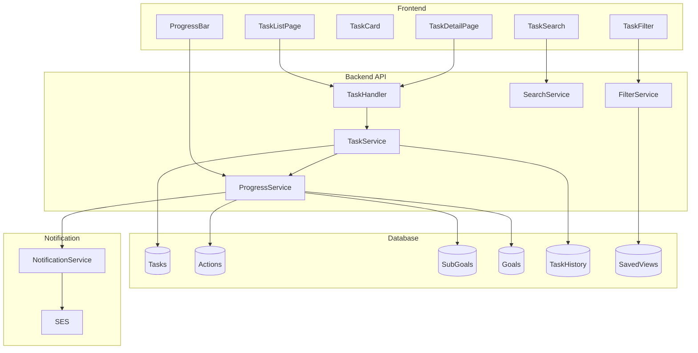

# タスク管理機能 設計書

## Overview

タスク管理機能は、マンダラチャートから生成されたタスクを効率的に管理するための包括的なシステムです。本機能は、タスクの一覧表示、詳細確認、状態更新、フィルター・検索、進捗計算、通知機能を提供し、利用者が目標達成に向けて日々のタスクを着実に実行できるようサポートします。

## Architecture

### システム構成



## Components and Interfaces

### Frontend Components

#### TaskListPage
タスク一覧画面のメインコンポーネント

**Props:**
- `userId: string` - ユーザーID
- `filters?: TaskFilters` - 適用するフィルター
- `searchQuery?: string` - 検索クエリ

**State:**
- `tasks: Task[]` - タスク一覧
- `loading: boolean` - ローディング状態
- `error: Error | null` - エラー状態
- `selectedTasks: string[]` - 選択されたタスクID

**Methods:**
- `fetchTasks()` - タスク一覧を取得
- `handleStatusChange(taskId: string, status: TaskStatus)` - タスク状態を更新
- `handleBulkOperation(operation: BulkOperation)` - 一括操作を実行
- `handleFilterChange(filters: TaskFilters)` - フィルターを変更
- `handleSearchChange(query: string)` - 検索クエリを変更

#### TaskDetailPage
タスク詳細画面のコンポーネント

**Props:**
- `taskId: string` - タスクID

**State:**
- `task: Task | null` - タスク詳細
- `notes: TaskNote[]` - タスクのノート一覧
- `history: TaskHistory[]` - タスク履歴
- `loading: boolean` - ローディング状態

**Methods:**
- `fetchTaskDetail()` - タスク詳細を取得
- `updateTaskStatus(status: TaskStatus)` - タスク状態を更新
- `addNote(content: string)` - ノートを追加
- `updateNote(noteId: string, content: string)` - ノートを更新
- `deleteNote(noteId: string)` - ノートを削除

#### TaskCard
タスクカードコンポーネント

**Props:**
- `task: Task` - タスク情報
- `onStatusChange: (status: TaskStatus) => void` - 状態変更ハンドラー
- `onSelect: (selected: boolean) => void` - 選択ハンドラー
- `selected: boolean` - 選択状態


#### TaskFilter
フィルターコンポーネント

**Props:**
- `filters: TaskFilters` - 現在のフィルター
- `onChange: (filters: TaskFilters) => void` - フィルター変更ハンドラー
- `actions: Action[]` - アクション一覧（フィルター用）

**State:**
- `statusFilters: TaskStatus[]` - 状態フィルター
- `deadlineFilter: DeadlineFilter` - 期限フィルター
- `actionFilters: string[]` - アクションフィルター

#### TaskSearch
検索コンポーネント

**Props:**
- `query: string` - 検索クエリ
- `onChange: (query: string) => void` - 検索クエリ変更ハンドラー
- `onSaveView: (name: string) => void` - ビュー保存ハンドラー

#### ProgressBar
進捗バーコンポーネント

**Props:**
- `progress: number` - 進捗率（0-100）
- `label: string` - ラベル
- `size: 'small' | 'medium' | 'large'` - サイズ

### Backend Services

#### TaskService
タスク管理のビジネスロジック

**Methods:**
- `getTasks(userId: string, filters?: TaskFilters): Promise<Task[]>` - タスク一覧を取得
- `getTaskById(taskId: string): Promise<Task>` - タスク詳細を取得
- `updateTaskStatus(taskId: string, status: TaskStatus): Promise<Task>` - タスク状態を更新
- `bulkUpdateStatus(taskIds: string[], status: TaskStatus): Promise<void>` - 一括状態更新
- `bulkDelete(taskIds: string[]): Promise<void>` - 一括削除
- `addNote(taskId: string, content: string): Promise<TaskNote>` - ノートを追加
- `updateNote(noteId: string, content: string): Promise<TaskNote>` - ノートを更新
- `deleteNote(noteId: string): Promise<void>` - ノートを削除
- `getTaskHistory(taskId: string): Promise<TaskHistory[]>` - タスク履歴を取得


#### FilterService
フィルター・検索のビジネスロジック

**Methods:**
- `applyFilters(tasks: Task[], filters: TaskFilters): Task[]` - フィルターを適用
- `searchTasks(tasks: Task[], query: string): Task[]` - タスクを検索
- `saveView(userId: string, name: string, filters: TaskFilters, query: string): Promise<SavedView>` - ビューを保存
- `getSavedViews(userId: string): Promise<SavedView[]>` - 保存済みビューを取得
- `deleteSavedView(viewId: string): Promise<void>` - 保存済みビューを削除

#### SearchService
検索機能のビジネスロジック

**Methods:**
- `search(tasks: Task[], query: string): Task[]` - タスクを検索
- `highlightMatches(text: string, query: string): string` - マッチした部分をハイライト
- `parseQuery(query: string): SearchQuery` - 検索クエリを解析

#### ProgressService
進捗計算のビジネスロジック

**Methods:**
- `calculateTaskProgress(task: Task): number` - タスク進捗を計算
- `calculateActionProgress(actionId: string): Promise<number>` - アクション進捗を計算
- `calculateSubGoalProgress(subGoalId: string): Promise<number>` - サブ目標進捗を計算
- `calculateGoalProgress(goalId: string): Promise<number>` - 目標進捗を計算
- `updateProgress(taskId: string): Promise<void>` - 進捗を更新（タスク→アクション→サブ目標→目標）

#### NotificationService
通知機能のビジネスロジック

**Methods:**
- `sendDeadlineReminder(task: Task): Promise<void>` - 期限リマインダーを送信
- `sendOverdueNotification(task: Task): Promise<void>` - 期限超過通知を送信
- `cancelNotification(taskId: string): Promise<void>` - 通知をキャンセル
- `scheduleNotification(task: Task): Promise<void>` - 通知をスケジュール


## Data Models

### Task
```typescript
interface Task {
  id: string;
  actionId: string;
  title: string;
  description?: string;
  type: TaskType; // 'execution' | 'habit'
  status: TaskStatus; // 'not_started' | 'in_progress' | 'completed' | 'skipped'
  estimatedMinutes: number;
  deadline?: Date;
  completedAt?: Date;
  createdAt: Date;
  updatedAt: Date;
}

enum TaskType {
  EXECUTION = 'execution',
  HABIT = 'habit'
}

enum TaskStatus {
  NOT_STARTED = 'not_started',
  IN_PROGRESS = 'in_progress',
  COMPLETED = 'completed',
  SKIPPED = 'skipped'
}
```

### TaskNote
```typescript
interface TaskNote {
  id: string;
  taskId: string;
  content: string;
  createdAt: Date;
  updatedAt: Date;
  userId: string;
}
```

### TaskHistory
```typescript
interface TaskHistory {
  id: string;
  taskId: string;
  oldStatus: TaskStatus;
  newStatus: TaskStatus;
  changedAt: Date;
  userId: string;
}
```

### TaskFilters
```typescript
interface TaskFilters {
  statuses?: TaskStatus[];
  deadlineRange?: DeadlineRange;
  actionIds?: string[];
}

type DeadlineRange = 'today' | 'this_week' | 'overdue' | 'custom';

interface CustomDeadlineRange {
  start: Date;
  end: Date;
}
```


### SavedView
```typescript
interface SavedView {
  id: string;
  userId: string;
  name: string;
  filters: TaskFilters;
  searchQuery?: string;
  createdAt: Date;
  updatedAt: Date;
}
```

### Action
```typescript
interface Action {
  id: string;
  subGoalId: string;
  title: string;
  description: string;
  type: ActionType; // 'execution' | 'habit'
  progress: number; // 0-100
  position: number; // 0-7
  createdAt: Date;
  updatedAt: Date;
}
```

### SubGoal
```typescript
interface SubGoal {
  id: string;
  goalId: string;
  title: string;
  description: string;
  progress: number; // 0-100
  position: number; // 0-7
  createdAt: Date;
  updatedAt: Date;
}
```

### Goal
```typescript
interface Goal {
  id: string;
  userId: string;
  title: string;
  description: string;
  deadline: Date;
  status: GoalStatus;
  progress: number; // 0-100
  createdAt: Date;
  updatedAt: Date;
}

enum GoalStatus {
  DRAFT = 'draft',
  ACTIVE = 'active',
  COMPLETED = 'completed',
  PAUSED = 'paused',
  CANCELLED = 'cancelled'
}
```


## Correctness Properties

*A property is a characteristic or behavior that should hold true across all valid executions of a system-essentially, a formal statement about what the system should do. Properties serve as the bridge between human-readable specifications and machine-verifiable correctness guarantees.*

### Acceptance Criteria Testing Prework

#### Requirement 1: タスク一覧表示

1.1 WHEN a user accesses the task list page THEN the system SHALL display all tasks assigned to the user
- Thoughts: これはユーザーに割り当てられた全タスクが表示されることを確認する必要がある。任意のユーザーIDとタスクセットに対して、フィルターなしで全タスクが返されることをテストできる
- Testable: yes - property

1.2 WHEN displaying tasks THEN the system SHALL show task title, description, type, status, estimated time, and deadline
- Thoughts: タスク表示時に必要な情報が全て含まれていることを確認する。任意のタスクに対して、レンダリング結果に全ての必須フィールドが含まれることをテストできる
- Testable: yes - property

1.3 WHEN displaying tasks THEN the system SHALL group tasks by status
- Thoughts: タスクが状態別にグループ化されることを確認する。任意のタスクセットに対して、グループ化後の各グループ内のタスクが同じ状態を持つことをテストできる
- Testable: yes - property

1.4 WHEN displaying tasks THEN the system SHALL highlight tasks with approaching deadlines
- Thoughts: 期限が近いタスクがハイライトされることを確認する。任意のタスクセットに対して、24時間以内の期限を持つタスクがハイライトされることをテストできる
- Testable: yes - property

1.5 WHEN displaying tasks THEN the system SHALL show the associated action and sub-goal for each task
- Thoughts: 各タスクに関連するアクションとサブ目標が表示されることを確認する。任意のタスクに対して、関連情報が含まれることをテストできる
- Testable: yes - property


#### Requirement 2: タスク状態更新

2.1 WHEN a user clicks on a task THEN the system SHALL display the task detail page
- Thoughts: これは特定のUIインタラクションの結果をテストする。任意のタスクに対して、クリック後に詳細ページが表示されることをテストできる
- Testable: yes - example

2.2 WHEN viewing task details THEN the system SHALL show all task information
- Thoughts: タスク詳細表示時に全情報が含まれることを確認する。任意のタスクに対して、全フィールドが表示されることをテストできる
- Testable: yes - property

2.3 WHEN a user updates task status THEN the system SHALL save the new status immediately
- Thoughts: 状態更新が即座に保存されることを確認する。任意のタスクと状態に対して、更新後にデータベースに反映されることをテストできる
- Testable: yes - property

2.4 WHEN a user marks a task as completed THEN the system SHALL record the completion time
- Thoughts: 完了時刻が記録されることを確認する。任意のタスクに対して、完了状態に更新した際にcompletedAtが設定されることをテストできる
- Testable: yes - property

2.5 WHEN a user updates task status THEN the system SHALL recalculate and update the progress
- Thoughts: 状態更新時に進捗が再計算されることを確認する。任意のタスクに対して、状態更新後に関連する進捗が更新されることをテストできる
- Testable: yes - property

#### Requirement 3: ノート機能

3.1 WHEN viewing task details THEN the system SHALL provide a note input field
- Thoughts: これはUIコンポーネントの存在確認。特定の例でテストする
- Testable: yes - example

3.2 WHEN a user enters a note THEN the system SHALL save the note with a timestamp
- Thoughts: ノート保存時にタイムスタンプが記録されることを確認する。任意のノート内容に対して、保存後にタイムスタンプが設定されることをテストできる
- Testable: yes - property

3.3 WHEN viewing task details THEN the system SHALL display all notes in chronological order
- Thoughts: ノートが時系列順に表示されることを確認する。任意のノートセットに対して、表示順が時系列順であることをテストできる
- Testable: yes - property

3.4 WHEN a user edits a note THEN the system SHALL update the note and record the edit time
- Thoughts: ノート編集時に更新時刻が記録されることを確認する。任意のノートに対して、編集後にupdatedAtが更新されることをテストできる
- Testable: yes - property

3.5 WHEN a user deletes a note THEN the system SHALL remove the note from the task
- Thoughts: ノート削除が正しく機能することを確認する。任意のノートに対して、削除後にデータベースから削除されることをテストできる
- Testable: yes - property


#### Requirement 4-6: フィルター機能

4.1-6.5 フィルター関連の要件
- Thoughts: フィルター機能は任意の条件とタスクセットに対して、正しい結果を返すことを確認する必要がある。これは複数の条件を組み合わせた汎用的なプロパティとしてテストできる
- Testable: yes - property

#### Requirement 7: 検索機能

7.1 WHEN a user enters a search keyword THEN the system SHALL display tasks with titles or descriptions containing the keyword
- Thoughts: 検索機能が正しく動作することを確認する。任意のキーワードとタスクセットに対して、マッチするタスクのみが返されることをテストできる
- Testable: yes - property

7.2 WHEN a user enters multiple keywords THEN the system SHALL display tasks matching all keywords
- Thoughts: 複数キーワード検索が正しく動作することを確認する。任意のキーワードセットに対して、全てのキーワードにマッチするタスクのみが返されることをテストできる
- Testable: yes - property

7.3 WHEN a user clears the search keyword THEN the system SHALL display all tasks
- Thoughts: 検索クリアが正しく動作することを確認する。これは検索前後の状態を比較するプロパティとしてテストできる
- Testable: yes - property

7.4 WHEN displaying search results THEN the system SHALL highlight the matched keywords
- Thoughts: マッチしたキーワードがハイライトされることを確認する。任意のキーワードとテキストに対して、ハイライトが正しく適用されることをテストできる
- Testable: yes - property

7.5 WHEN no tasks match the search keyword THEN the system SHALL display a message
- Thoughts: 検索結果がない場合のメッセージ表示を確認する。これは特定の例でテストする
- Testable: yes - example


#### Requirement 8: 保存済みビュー

8.1-8.5 保存済みビュー関連の要件
- Thoughts: ビューの保存・読み込み・削除が正しく動作することを確認する。これはCRUD操作のプロパティとしてテストできる
- Testable: yes - property

#### Requirement 9: 一括操作

9.1 WHEN viewing the task list THEN the system SHALL provide checkboxes
- Thoughts: これはUIコンポーネントの存在確認。特定の例でテストする
- Testable: yes - example

9.2-9.5 一括操作関連の要件
- Thoughts: 一括操作が正しく動作することを確認する。任意のタスクセットに対して、一括操作が全てのタスクに適用されることをテストできる
- Testable: yes - property

#### Requirement 10-12: 進捗計算

10.1-12.5 進捗計算関連の要件
- Thoughts: 進捗計算が正しく動作することを確認する。任意のタスク・アクション・サブ目標・目標に対して、進捗が正しく計算されることをテストできる。これは階層的な計算のプロパティとしてテストできる
- Testable: yes - property

#### Requirement 13: タスク履歴

13.1-13.5 タスク履歴関連の要件
- Thoughts: タスク履歴が正しく記録・表示されることを確認する。任意のタスクと状態変更に対して、履歴が正しく記録されることをテストできる
- Testable: yes - property

#### Requirement 14: 進捗表示

14.1-14.5 進捗表示関連の要件
- Thoughts: 進捗バーが正しく表示されることを確認する。任意の進捗値に対して、正しい色とパーセンテージが表示されることをテストできる
- Testable: yes - property

#### Requirement 15: 通知機能

15.1-15.5 通知関連の要件
- Thoughts: 通知が正しく送信・キャンセルされることを確認する。任意のタスクと期限に対して、通知が正しくスケジュールされることをテストできる
- Testable: yes - property


### Property Reflection

プロパティの冗長性を排除するため、以下の統合を行います：

1. **フィルター機能（Requirement 4-6）**: 状態フィルター、期限フィルター、アクションフィルターは、汎用的なフィルタープロパティとして統合できる
2. **進捗計算（Requirement 10-12）**: タスク→アクション→サブ目標→目標の階層的な進捗計算は、単一の包括的なプロパティとして統合できる
3. **一括操作（Requirement 9）**: 一括状態更新と一括削除は、汎用的な一括操作プロパティとして統合できる

### Correctness Properties

#### Property 1: タスク一覧の完全性
*For any* ユーザーIDとフィルター条件、getTasks関数は、そのユーザーに割り当てられた全タスクのうち、フィルター条件に一致するタスクのみを返す
**Validates: Requirements 1.1, 4.1-4.5, 5.1-5.5, 6.1-6.5**

#### Property 2: タスク表示の完全性
*For any* タスク、表示されるタスク情報には、title、description、type、status、estimatedMinutes、deadline、関連するaction、sub-goalの全てが含まれる
**Validates: Requirements 1.2, 1.5, 2.2**

#### Property 3: タスクグループ化の正確性
*For any* タスクセット、状態別にグループ化された結果では、各グループ内の全タスクが同じ状態を持つ
**Validates: Requirements 1.3**

#### Property 4: 期限ハイライトの正確性
*For any* タスクセット、現在時刻から24時間以内の期限を持つタスクは全てハイライトされ、それ以外のタスクはハイライトされない
**Validates: Requirements 1.4**

#### Property 5: タスク状態更新の即時性
*For any* タスクと新しい状態、updateTaskStatus関数を呼び出した後、データベースから取得したタスクの状態は新しい状態と一致する
**Validates: Requirements 2.3**

#### Property 6: 完了時刻の記録
*For any* タスク、状態を'completed'に更新した場合、completedAtフィールドが現在時刻で設定される
**Validates: Requirements 2.4**


#### Property 7: 進捗の連鎖更新
*For any* タスク、タスクの状態を更新した場合、関連するアクション、サブ目標、目標の進捗が正しく再計算され更新される
**Validates: Requirements 2.5, 10.1-10.5, 11.1-11.5, 12.1-12.5**

#### Property 8: ノート保存のタイムスタンプ
*For any* タスクとノート内容、ノートを保存した場合、createdAtフィールドが現在時刻で設定される
**Validates: Requirements 3.2**

#### Property 9: ノート表示の時系列順
*For any* タスクのノートセット、表示されるノートは全てcreatedAtの昇順でソートされている
**Validates: Requirements 3.3**

#### Property 10: ノート編集の更新時刻
*For any* ノート、ノートを編集した場合、updatedAtフィールドが現在時刻で更新される
**Validates: Requirements 3.4**

#### Property 11: ノート削除の完全性
*For any* ノート、ノートを削除した場合、データベースから完全に削除され、タスク詳細取得時にそのノートは含まれない
**Validates: Requirements 3.5**

#### Property 12: 検索の正確性
*For any* キーワードとタスクセット、検索結果には、titleまたはdescriptionにキーワードを含むタスクのみが含まれる
**Validates: Requirements 7.1**

#### Property 13: 複数キーワード検索の正確性
*For any* 複数のキーワードとタスクセット、検索結果には、全てのキーワードをtitleまたはdescriptionに含むタスクのみが含まれる
**Validates: Requirements 7.2**

#### Property 14: 検索クリアの完全性
*For any* タスクセット、検索クエリをクリアした場合、フィルター前の全タスクが表示される
**Validates: Requirements 7.3**

#### Property 15: キーワードハイライトの正確性
*For any* キーワードとテキスト、ハイライト処理後のテキストには、キーワードに一致する全ての部分がハイライトマークアップで囲まれている
**Validates: Requirements 7.4**


#### Property 16: 保存済みビューのラウンドトリップ
*For any* ユーザー、ビュー名、フィルター、検索クエリ、ビューを保存してから読み込んだ場合、読み込まれたフィルターと検索クエリは保存時と同じである
**Validates: Requirements 8.1-8.5**

#### Property 17: 一括操作の完全性
*For any* タスクIDセットと操作、一括操作を実行した場合、指定された全てのタスクに操作が適用される
**Validates: Requirements 9.2-9.5**

#### Property 18: タスク履歴の記録
*For any* タスクと状態変更、タスクの状態を更新した場合、履歴エントリが作成され、oldStatus、newStatus、changedAt、userIdが正しく記録される
**Validates: Requirements 13.1-13.5**

#### Property 19: 進捗バーの色分け
*For any* 進捗値、進捗バーの色は、0-33%の場合は赤、34-66%の場合は黄、67-100%の場合は緑である
**Validates: Requirements 14.4**

#### Property 20: 通知のスケジューリング
*For any* タスク、期限が24時間以内の場合、通知がスケジュールされる。タスクが完了状態に更新された場合、通知がキャンセルされる
**Validates: Requirements 15.1-15.5**

## Error Handling

### エラー分類

#### クライアントエラー（4xx）
- **400 Bad Request**: 不正なリクエストパラメータ
- **401 Unauthorized**: 認証エラー
- **403 Forbidden**: 権限エラー
- **404 Not Found**: リソースが見つからない
- **409 Conflict**: 競合エラー（楽観的ロック）

#### サーバーエラー（5xx）
- **500 Internal Server Error**: 予期しないエラー
- **503 Service Unavailable**: サービス一時停止


### エラーハンドリング戦略

#### バックエンド
```typescript
class TaskError extends Error {
  constructor(
    public code: string,
    public message: string,
    public statusCode: number,
    public details?: unknown
  ) {
    super(message);
    this.name = 'TaskError';
  }
}

// エラーハンドリングミドルウェア
const errorHandler = (error: Error, req: Request, res: Response) => {
  if (error instanceof TaskError) {
    return res.status(error.statusCode).json({
      error: {
        code: error.code,
        message: error.message,
        details: error.details
      }
    });
  }

  // 予期しないエラー
  console.error('Unexpected error:', error);
  return res.status(500).json({
    error: {
      code: 'INTERNAL_ERROR',
      message: 'An unexpected error occurred'
    }
  });
};
```

#### フロントエンド
```typescript
// エラー表示コンポーネント
const ErrorDisplay: React.FC<{ error: Error }> = ({ error }) => {
  if (error instanceof TaskError) {
    return (
      <Alert severity="error">
        <AlertTitle>{error.code}</AlertTitle>
        {error.message}
      </Alert>
    );
  }

  return (
    <Alert severity="error">
      <AlertTitle>エラー</AlertTitle>
      予期しないエラーが発生しました
    </Alert>
  );
};

// エラーハンドリングフック
const useTaskOperations = () => {
  const [error, setError] = useState<Error | null>(null);

  const handleError = (error: Error) => {
    setError(error);
    // エラーログ送信
    logError(error);
  };

  return { error, handleError };
};
```


### リトライ戦略

```typescript
// 指数バックオフによるリトライ
const retryWithBackoff = async <T>(
  fn: () => Promise<T>,
  maxRetries: number = 3,
  baseDelay: number = 1000
): Promise<T> => {
  for (let i = 0; i < maxRetries; i++) {
    try {
      return await fn();
    } catch (error) {
      if (i === maxRetries - 1) throw error;
      
      const delay = baseDelay * Math.pow(2, i);
      await new Promise(resolve => setTimeout(resolve, delay));
    }
  }
  throw new Error('Max retries exceeded');
};

// 使用例
const updateTaskWithRetry = async (taskId: string, status: TaskStatus) => {
  return retryWithBackoff(() => taskService.updateTaskStatus(taskId, status));
};
```

## Testing Strategy

### テスト戦略の概要

本機能では、以下の3層のテスト戦略を採用します：

1. **ユニットテスト**: 個別の関数・コンポーネントのテスト
2. **プロパティベーステスト**: 正確性プロパティの検証
3. **統合テスト**: API + データベースの結合テスト

### ユニットテスト

#### バックエンド（Jest）

```typescript
describe('TaskService', () => {
  describe('getTasks', () => {
    it('should return all tasks for a user', async () => {
      const userId = 'user-1';
      const tasks = await taskService.getTasks(userId);
      
      expect(tasks).toBeInstanceOf(Array);
      tasks.forEach(task => {
        expect(task.actionId).toBeDefined();
      });
    });

    it('should filter tasks by status', async () => {
      const userId = 'user-1';
      const filters = { statuses: [TaskStatus.COMPLETED] };
      const tasks = await taskService.getTasks(userId, filters);
      
      tasks.forEach(task => {
        expect(task.status).toBe(TaskStatus.COMPLETED);
      });
    });
  });
});
```


#### フロントエンド（Vitest + React Testing Library）

```typescript
describe('TaskListPage', () => {
  it('should render task list', () => {
    const tasks = [
      generateMockTask({ title: 'Task 1' }),
      generateMockTask({ title: 'Task 2' })
    ];
    
    render(<TaskListPage tasks={tasks} />);
    
    expect(screen.getByText('Task 1')).toBeInTheDocument();
    expect(screen.getByText('Task 2')).toBeInTheDocument();
  });

  it('should filter tasks by status', async () => {
    const tasks = [
      generateMockTask({ status: TaskStatus.COMPLETED }),
      generateMockTask({ status: TaskStatus.NOT_STARTED })
    ];
    
    render(<TaskListPage tasks={tasks} />);
    
    const statusFilter = screen.getByLabelText('Status Filter');
    await userEvent.selectOptions(statusFilter, TaskStatus.COMPLETED);
    
    expect(screen.queryByText(tasks[1].title)).not.toBeInTheDocument();
  });
});
```

### プロパティベーステスト

プロパティベーステストには**fast-check**ライブラリを使用します。各プロパティは最低100回の反復でテストします。

```typescript
import fc from 'fast-check';

describe('Property 1: タスク一覧の完全性', () => {
  /**
   * Feature: task-management, Property 1: タスク一覧の完全性
   * Validates: Requirements 1.1, 4.1-4.5, 5.1-5.5, 6.1-6.5
   */
  it('should return only tasks matching filter criteria', () => {
    fc.assert(
      fc.property(
        fc.array(taskArbitrary),
        fc.record({
          statuses: fc.option(fc.array(fc.constantFrom(...Object.values(TaskStatus)))),
          actionIds: fc.option(fc.array(fc.string()))
        }),
        async (tasks, filters) => {
          // Setup: データベースにタスクを保存
          await Promise.all(tasks.map(task => taskRepository.save(task)));
          
          // Execute: フィルター適用
          const result = await taskService.getTasks('user-1', filters);
          
          // Verify: 全ての結果がフィルター条件に一致
          result.forEach(task => {
            if (filters.statuses) {
              expect(filters.statuses).toContain(task.status);
            }
            if (filters.actionIds) {
              expect(filters.actionIds).toContain(task.actionId);
            }
          });
        }
      ),
      { numRuns: 100 }
    );
  });
});
```


```typescript
describe('Property 7: 進捗の連鎖更新', () => {
  /**
   * Feature: task-management, Property 7: 進捗の連鎖更新
   * Validates: Requirements 2.5, 10.1-10.5, 11.1-11.5, 12.1-12.5
   */
  it('should update progress cascade when task status changes', () => {
    fc.assert(
      fc.property(
        taskArbitrary,
        fc.constantFrom(...Object.values(TaskStatus)),
        async (task, newStatus) => {
          // Setup: タスクとその階層構造を作成
          const action = await actionRepository.findById(task.actionId);
          const subGoal = await subGoalRepository.findById(action.subGoalId);
          const goal = await goalRepository.findById(subGoal.goalId);
          
          const oldActionProgress = action.progress;
          const oldSubGoalProgress = subGoal.progress;
          const oldGoalProgress = goal.progress;
          
          // Execute: タスク状態を更新
          await taskService.updateTaskStatus(task.id, newStatus);
          
          // Verify: 進捗が更新されている
          const updatedAction = await actionRepository.findById(task.actionId);
          const updatedSubGoal = await subGoalRepository.findById(action.subGoalId);
          const updatedGoal = await goalRepository.findById(subGoal.goalId);
          
          // 進捗が変化している（または同じ）
          expect(updatedAction.progress).toBeGreaterThanOrEqual(0);
          expect(updatedAction.progress).toBeLessThanOrEqual(100);
          expect(updatedSubGoal.progress).toBeGreaterThanOrEqual(0);
          expect(updatedSubGoal.progress).toBeLessThanOrEqual(100);
          expect(updatedGoal.progress).toBeGreaterThanOrEqual(0);
          expect(updatedGoal.progress).toBeLessThanOrEqual(100);
        }
      ),
      { numRuns: 100 }
    );
  });
});
```

### 統合テスト

```typescript
describe('Task Management Integration Tests', () => {
  beforeAll(async () => {
    // テストデータベースのセットアップ
    await setupTestDatabase();
  });

  afterAll(async () => {
    // テストデータベースのクリーンアップ
    await cleanupTestDatabase();
  });

  it('should complete full task lifecycle', async () => {
    // 1. タスク作成
    const task = await taskService.createTask({
      actionId: 'action-1',
      title: 'Test Task',
      type: TaskType.EXECUTION,
      estimatedMinutes: 30
    });

    // 2. タスク取得
    const fetchedTask = await taskService.getTaskById(task.id);
    expect(fetchedTask.title).toBe('Test Task');

    // 3. タスク状態更新
    await taskService.updateTaskStatus(task.id, TaskStatus.IN_PROGRESS);
    const inProgressTask = await taskService.getTaskById(task.id);
    expect(inProgressTask.status).toBe(TaskStatus.IN_PROGRESS);

    // 4. タスク完了
    await taskService.updateTaskStatus(task.id, TaskStatus.COMPLETED);
    const completedTask = await taskService.getTaskById(task.id);
    expect(completedTask.status).toBe(TaskStatus.COMPLETED);
    expect(completedTask.completedAt).toBeDefined();

    // 5. 進捗確認
    const action = await actionRepository.findById(task.actionId);
    expect(action.progress).toBeGreaterThan(0);
  });
});
```


## API Endpoints

### タスク管理API

#### GET /api/tasks
タスク一覧を取得

**Query Parameters:**
- `status[]`: TaskStatus[] - 状態フィルター（複数指定可）
- `deadlineRange`: DeadlineRange - 期限フィルター
- `actionIds[]`: string[] - アクションIDフィルター（複数指定可）
- `search`: string - 検索クエリ

**Response:**
```json
{
  "tasks": [
    {
      "id": "task-1",
      "actionId": "action-1",
      "title": "タスクタイトル",
      "description": "タスク説明",
      "type": "execution",
      "status": "not_started",
      "estimatedMinutes": 30,
      "deadline": "2025-12-31T23:59:59Z",
      "completedAt": null,
      "createdAt": "2025-01-01T00:00:00Z",
      "updatedAt": "2025-01-01T00:00:00Z",
      "action": {
        "id": "action-1",
        "title": "アクションタイトル",
        "subGoal": {
          "id": "subgoal-1",
          "title": "サブ目標タイトル"
        }
      }
    }
  ],
  "total": 100,
  "page": 1,
  "pageSize": 20
}
```

#### GET /api/tasks/:id
タスク詳細を取得

**Response:**
```json
{
  "task": {
    "id": "task-1",
    "actionId": "action-1",
    "title": "タスクタイトル",
    "description": "タスク説明",
    "type": "execution",
    "status": "not_started",
    "estimatedMinutes": 30,
    "deadline": "2025-12-31T23:59:59Z",
    "completedAt": null,
    "createdAt": "2025-01-01T00:00:00Z",
    "updatedAt": "2025-01-01T00:00:00Z"
  },
  "notes": [
    {
      "id": "note-1",
      "content": "ノート内容",
      "createdAt": "2025-01-01T00:00:00Z",
      "updatedAt": "2025-01-01T00:00:00Z"
    }
  ],
  "history": [
    {
      "id": "history-1",
      "oldStatus": "not_started",
      "newStatus": "in_progress",
      "changedAt": "2025-01-01T00:00:00Z",
      "userId": "user-1"
    }
  ]
}
```


#### PATCH /api/tasks/:id/status
タスク状態を更新

**Request Body:**
```json
{
  "status": "completed"
}
```

**Response:**
```json
{
  "task": {
    "id": "task-1",
    "status": "completed",
    "completedAt": "2025-01-01T12:00:00Z",
    "updatedAt": "2025-01-01T12:00:00Z"
  },
  "progress": {
    "action": 50,
    "subGoal": 25,
    "goal": 12
  }
}
```

#### POST /api/tasks/:id/notes
ノートを追加

**Request Body:**
```json
{
  "content": "ノート内容"
}
```

**Response:**
```json
{
  "note": {
    "id": "note-1",
    "taskId": "task-1",
    "content": "ノート内容",
    "createdAt": "2025-01-01T12:00:00Z",
    "updatedAt": "2025-01-01T12:00:00Z",
    "userId": "user-1"
  }
}
```

#### PATCH /api/tasks/:id/notes/:noteId
ノートを更新

**Request Body:**
```json
{
  "content": "更新されたノート内容"
}
```

**Response:**
```json
{
  "note": {
    "id": "note-1",
    "content": "更新されたノート内容",
    "updatedAt": "2025-01-01T13:00:00Z"
  }
}
```

#### DELETE /api/tasks/:id/notes/:noteId
ノートを削除

**Response:**
```json
{
  "success": true
}
```


#### POST /api/tasks/bulk/status
一括状態更新

**Request Body:**
```json
{
  "taskIds": ["task-1", "task-2", "task-3"],
  "status": "completed"
}
```

**Response:**
```json
{
  "success": true,
  "updatedCount": 3
}
```

#### DELETE /api/tasks/bulk
一括削除

**Request Body:**
```json
{
  "taskIds": ["task-1", "task-2", "task-3"]
}
```

**Response:**
```json
{
  "success": true,
  "deletedCount": 3
}
```

### 保存済みビューAPI

#### GET /api/saved-views
保存済みビュー一覧を取得

**Response:**
```json
{
  "views": [
    {
      "id": "view-1",
      "name": "今日のタスク",
      "filters": {
        "deadlineRange": "today"
      },
      "searchQuery": "",
      "createdAt": "2025-01-01T00:00:00Z"
    }
  ]
}
```

#### POST /api/saved-views
ビューを保存

**Request Body:**
```json
{
  "name": "今日のタスク",
  "filters": {
    "deadlineRange": "today"
  },
  "searchQuery": ""
}
```

**Response:**
```json
{
  "view": {
    "id": "view-1",
    "name": "今日のタスク",
    "filters": {
      "deadlineRange": "today"
    },
    "searchQuery": "",
    "createdAt": "2025-01-01T00:00:00Z"
  }
}
```

#### DELETE /api/saved-views/:id
保存済みビューを削除

**Response:**
```json
{
  "success": true
}
```


## Database Schema

### tasks テーブル

```sql
CREATE TABLE tasks (
  id VARCHAR(36) PRIMARY KEY,
  action_id VARCHAR(36) NOT NULL,
  title VARCHAR(255) NOT NULL,
  description TEXT,
  type ENUM('execution', 'habit') NOT NULL,
  status ENUM('not_started', 'in_progress', 'completed', 'skipped') NOT NULL DEFAULT 'not_started',
  estimated_minutes INT NOT NULL,
  deadline TIMESTAMP,
  completed_at TIMESTAMP,
  created_at TIMESTAMP NOT NULL DEFAULT CURRENT_TIMESTAMP,
  updated_at TIMESTAMP NOT NULL DEFAULT CURRENT_TIMESTAMP ON UPDATE CURRENT_TIMESTAMP,
  
  FOREIGN KEY (action_id) REFERENCES actions(id) ON DELETE CASCADE,
  INDEX idx_action_id (action_id),
  INDEX idx_status (status),
  INDEX idx_deadline (deadline),
  INDEX idx_created_at (created_at)
);
```

### task_notes テーブル

```sql
CREATE TABLE task_notes (
  id VARCHAR(36) PRIMARY KEY,
  task_id VARCHAR(36) NOT NULL,
  user_id VARCHAR(36) NOT NULL,
  content TEXT NOT NULL,
  created_at TIMESTAMP NOT NULL DEFAULT CURRENT_TIMESTAMP,
  updated_at TIMESTAMP NOT NULL DEFAULT CURRENT_TIMESTAMP ON UPDATE CURRENT_TIMESTAMP,
  
  FOREIGN KEY (task_id) REFERENCES tasks(id) ON DELETE CASCADE,
  FOREIGN KEY (user_id) REFERENCES users(id) ON DELETE CASCADE,
  INDEX idx_task_id (task_id),
  INDEX idx_created_at (created_at)
);
```

### task_history テーブル

```sql
CREATE TABLE task_history (
  id VARCHAR(36) PRIMARY KEY,
  task_id VARCHAR(36) NOT NULL,
  user_id VARCHAR(36) NOT NULL,
  old_status ENUM('not_started', 'in_progress', 'completed', 'skipped') NOT NULL,
  new_status ENUM('not_started', 'in_progress', 'completed', 'skipped') NOT NULL,
  changed_at TIMESTAMP NOT NULL DEFAULT CURRENT_TIMESTAMP,
  
  FOREIGN KEY (task_id) REFERENCES tasks(id) ON DELETE CASCADE,
  FOREIGN KEY (user_id) REFERENCES users(id) ON DELETE CASCADE,
  INDEX idx_task_id (task_id),
  INDEX idx_changed_at (changed_at)
);
```


### saved_views テーブル

```sql
CREATE TABLE saved_views (
  id VARCHAR(36) PRIMARY KEY,
  user_id VARCHAR(36) NOT NULL,
  name VARCHAR(255) NOT NULL,
  filters JSON NOT NULL,
  search_query VARCHAR(255),
  created_at TIMESTAMP NOT NULL DEFAULT CURRENT_TIMESTAMP,
  updated_at TIMESTAMP NOT NULL DEFAULT CURRENT_TIMESTAMP ON UPDATE CURRENT_TIMESTAMP,
  
  FOREIGN KEY (user_id) REFERENCES users(id) ON DELETE CASCADE,
  INDEX idx_user_id (user_id),
  INDEX idx_created_at (created_at)
);
```

## Performance Considerations

### データベース最適化

1. **インデックス戦略**
   - `action_id`: タスク取得時の頻繁な結合
   - `status`: フィルター処理の高速化
   - `deadline`: 期限フィルターの高速化
   - `created_at`: ソート処理の高速化

2. **クエリ最適化**
   - N+1問題の回避（eager loading）
   - 適切なページネーション
   - 不要なカラムの除外（SELECT *の回避）

3. **キャッシュ戦略**
   - タスク一覧のキャッシュ（5分）
   - 進捗計算結果のキャッシュ（1分）
   - 保存済みビューのキャッシュ（10分）

### フロントエンド最適化

1. **仮想スクロール**
   - 大量のタスクを効率的に表示
   - react-windowライブラリの使用

2. **楽観的更新**
   - タスク状態更新時の即座のUI反映
   - バックグラウンドでのAPI呼び出し

3. **デバウンス**
   - 検索入力のデバウンス（300ms）
   - フィルター変更のデバウンス（200ms）


## Security Considerations

### 認証・認可

1. **JWT認証**
   - 全APIエンドポイントでJWTトークンを検証
   - トークンの有効期限チェック

2. **リソースアクセス制御**
   - ユーザーは自分のタスクのみアクセス可能
   - タスクIDとユーザーIDの関連チェック

```typescript
// 認可ミドルウェア
const authorizeTaskAccess = async (req: Request, res: Response, next: NextFunction) => {
  const taskId = req.params.id;
  const userId = req.user.id;

  const task = await taskRepository.findById(taskId);
  if (!task) {
    return res.status(404).json({ error: 'Task not found' });
  }

  const action = await actionRepository.findById(task.actionId);
  const subGoal = await subGoalRepository.findById(action.subGoalId);
  const goal = await goalRepository.findById(subGoal.goalId);

  if (goal.userId !== userId) {
    return res.status(403).json({ error: 'Access denied' });
  }

  next();
};
```

### 入力検証

1. **バリデーションスキーマ**

```typescript
import { z } from 'zod';

const TaskStatusUpdateSchema = z.object({
  status: z.enum(['not_started', 'in_progress', 'completed', 'skipped'])
});

const TaskNoteSchema = z.object({
  content: z.string().min(1).max(5000)
});

const BulkOperationSchema = z.object({
  taskIds: z.array(z.string().uuid()).min(1).max(100),
  status: z.enum(['not_started', 'in_progress', 'completed', 'skipped']).optional()
});
```

2. **SQLインジェクション対策**
   - Prismaによるパラメータ化クエリ
   - 生SQLの使用禁止

3. **XSS対策**
   - ユーザー入力のサニタイズ
   - Content Security Policyの設定


## Monitoring and Logging

### ログ戦略

1. **構造化ログ**

```typescript
import { Logger } from '@/utils/logger';

const logger = new Logger('TaskService');

// 情報ログ
logger.info('Task status updated', {
  taskId: task.id,
  oldStatus: oldStatus,
  newStatus: newStatus,
  userId: userId
});

// エラーログ
logger.error('Failed to update task status', {
  taskId: task.id,
  error: error.message,
  stack: error.stack
});
```

2. **ログレベル**
   - **ERROR**: エラー発生時
   - **WARN**: 警告（リトライ、パフォーマンス低下）
   - **INFO**: 重要な操作（タスク作成、状態更新）
   - **DEBUG**: デバッグ情報（開発環境のみ）

### メトリクス

1. **パフォーマンスメトリクス**
   - API応答時間
   - データベースクエリ時間
   - キャッシュヒット率

2. **ビジネスメトリクス**
   - タスク完了率
   - 平均タスク完了時間
   - アクティブユーザー数

3. **エラーメトリクス**
   - エラー発生率
   - エラー種別の分布
   - リトライ回数

### アラート設定

```typescript
// CloudWatch アラーム設定
const errorRateAlarm = new cloudwatch.Alarm(this, 'TaskApiErrorRate', {
  metric: taskApi.metricServerError(),
  threshold: 5,
  evaluationPeriods: 2,
  alarmDescription: 'Task API error rate is too high'
});

const responseTimeAlarm = new cloudwatch.Alarm(this, 'TaskApiResponseTime', {
  metric: taskApi.metricLatency(),
  threshold: 2000, // 2秒
  evaluationPeriods: 3,
  alarmDescription: 'Task API response time is too slow'
});
```


## Deployment Strategy

### インフラ構成

```typescript
// CDK Stack
export class TaskManagementStack extends Stack {
  constructor(scope: Construct, id: string, props?: StackProps) {
    super(scope, id, props);

    // Lambda関数
    const taskHandler = new lambda.Function(this, 'TaskHandler', {
      runtime: lambda.Runtime.NODEJS_18_X,
      handler: 'task.handler',
      code: lambda.Code.fromAsset('dist'),
      environment: {
        DATABASE_URL: process.env.DATABASE_URL!,
        JWT_SECRET: process.env.JWT_SECRET!
      },
      timeout: Duration.seconds(30),
      memorySize: 512
    });

    // API Gateway
    const api = new apigateway.RestApi(this, 'TaskApi', {
      restApiName: 'Task Management API',
      deployOptions: {
        stageName: 'prod',
        throttlingRateLimit: 100,
        throttlingBurstLimit: 200
      }
    });

    // /tasks エンドポイント
    const tasks = api.root.addResource('tasks');
    tasks.addMethod('GET', new apigateway.LambdaIntegration(taskHandler));
    tasks.addMethod('POST', new apigateway.LambdaIntegration(taskHandler));

    // /tasks/{id} エンドポイント
    const task = tasks.addResource('{id}');
    task.addMethod('GET', new apigateway.LambdaIntegration(taskHandler));
    task.addMethod('PATCH', new apigateway.LambdaIntegration(taskHandler));
    task.addMethod('DELETE', new apigateway.LambdaIntegration(taskHandler));
  }
}
```

### デプロイメントパイプライン

1. **ステージング環境**
   - 自動デプロイ（developブランチ）
   - 統合テスト実行
   - パフォーマンステスト実行

2. **本番環境**
   - 手動承認後デプロイ（mainブランチ）
   - カナリアデプロイ（10% → 50% → 100%）
   - ロールバック機能


## Future Enhancements

### Phase 2 機能

1. **タスクテンプレート**
   - よく使うタスクをテンプレート化
   - テンプレートからの一括作成

2. **タスク依存関係**
   - タスク間の依存関係を定義
   - 依存タスク完了後に自動的に次のタスクを有効化

3. **タスク優先度**
   - 優先度の設定（高/中/低）
   - 優先度に基づくソート・フィルター

4. **タスク推定時間の学習**
   - 実際の完了時間を記録
   - 推定時間の精度向上

5. **タスク分析ダッシュボード**
   - タスク完了率の推移
   - 平均完了時間の分析
   - 生産性レポート

6. **モバイルアプリ対応**
   - React Nativeによるモバイルアプリ
   - プッシュ通知

7. **チーム機能**
   - タスクの共有
   - チームメンバーへのタスク割り当て

8. **カレンダー統合**
   - Google Calendar連携
   - タスクをカレンダーに表示

## Conclusion

本設計書では、タスク管理機能の包括的な設計を定義しました。主要な設計ポイントは以下の通りです：

1. **階層的な進捗管理**: タスク→アクション→サブ目標→目標の連鎖的な進捗更新
2. **柔軟なフィルター・検索**: 複数条件の組み合わせによる効率的なタスク管理
3. **プロパティベーステスト**: 20個の正確性プロパティによる品質保証
4. **パフォーマンス最適化**: インデックス、キャッシュ、仮想スクロールによる高速化
5. **セキュリティ**: JWT認証、入力検証、リソースアクセス制御

この設計に基づいて実装を進めることで、利用者が目標達成に向けて日々のタスクを着実に実行できる、高品質なタスク管理システムを構築できます。

