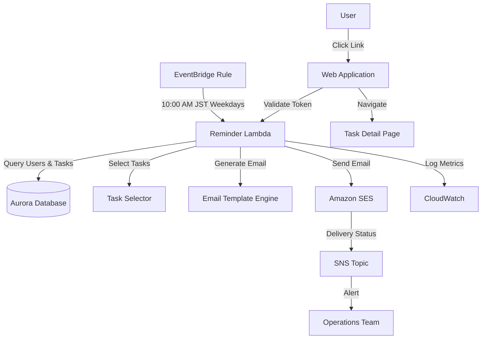

# リマインド機能 設計書

## Overview

リマインド機能は、ユーザーが日々のタスクを忘れずに実行できるよう、メールでタスクをリマインドするシステムです。Amazon EventBridgeで平日午前10時（JST）にLambda関数をトリガーし、Amazon SESでメールを配信します。タスク選択ロジックは、ユーザーの気分選択（「このまま行く」「気分を変える」）に基づいて、適切なタスクを選択します。

## Architecture

### System Components



### Data Flow

1. **Trigger Phase**: EventBridge triggers Reminder Lambda at 10:00 AM JST on weekdays
2. **User Selection Phase**: Lambda queries database for active users with pending tasks
3. **Task Selection Phase**: For each user, Task Selector chooses tasks based on mood preference
4. **Email Generation Phase**: Email Template Engine generates personalized HTML email
5. **Email Delivery Phase**: Amazon SES sends email to user
6. **Logging Phase**: Lambda logs delivery status and metrics to CloudWatch

## Components and Interfaces

### 1. Reminder Lambda Function

**Responsibility**: Orchestrate the reminder process for all users

**Interface**:
```typescript
interface ReminderLambdaHandler {
  handler(event: EventBridgeEvent): Promise<ReminderResult>;
}

interface ReminderResult {
  totalUsers: number;
  emailsSent: number;
  emailsFailed: number;
  processingTimeMs: number;
}
```

**Key Methods**:
- `processAllUsers()`: Query and process all eligible users
- `processUser(userId: string)`: Process reminder for a single user
- `handleError(error: Error, userId: string)`: Handle and log errors

### 2. Task Selector Service

**Responsibility**: Select appropriate tasks for reminder based on user preferences

**Interface**:
```typescript
interface TaskSelectorService {
  selectTasksForReminder(
    userId: string,
    moodPreference: MoodPreference | null
  ): Promise<Task[]>;
}

type MoodPreference = 'stay_on_track' | 'change_pace';

interface TaskSelectionCriteria {
  maxExecutionTasks: number; // 3
  habitTaskFrequency: 'weekly'; // Once per week
  moodPreference: MoodPreference | null;
}
```

**Selection Algorithm**:
1. Query all incomplete tasks for user
2. Separate execution tasks and habit tasks
3. Apply mood preference logic:
   - `stay_on_track`: 2/3 from same/adjacent actions, 1/3 from oldest 10
   - `change_pace`: All from oldest 10
   - `null` (first time): Completely random
4. Ensure habit tasks are reminded at least once per week
5. Limit execution tasks to maximum 3 per day
6. Return selected tasks

### 3. Email Service

**Responsibility**: Generate and send reminder emails using Amazon SES

**Interface**:
```typescript
interface EmailService {
  sendReminderEmail(
    user: User,
    tasks: Task[],
    goal: Goal
  ): Promise<EmailResult>;
  
  generateDeepLink(
    userId: string,
    taskId: string
  ): Promise<string>;
}

interface EmailResult {
  messageId: string;
  success: boolean;
  error?: string;
}
```

**Email Template Structure**:
```html
<!DOCTYPE html>
<html>
<head>
  <meta charset="UTF-8">
  <title>今日のタスクリマインド</title>
</head>
<body>
  <h1>こんにちは、{{userName}}さん</h1>
  <p>今日のタスクをお知らせします。</p>
  
  <h2>目標: {{goalTitle}}</h2>
  
  <ul>
    {{#each tasks}}
    <li>
      <strong>{{title}}</strong> ({{estimatedMinutes}}分)
      <br>
      <a href="{{deepLink}}">タスクを開始する</a>
    </li>
    {{/each}}
  </ul>
  
  <p>合計所要時間: {{totalMinutes}}分</p>
  
  <hr>
  <p><small><a href="{{unsubscribeLink}}">配信停止</a></small></p>
</body>
</html>
```

### 4. Deep Link Service

**Responsibility**: Generate and validate secure deep links for email

**Interface**:
```typescript
interface DeepLinkService {
  generateToken(
    userId: string,
    taskId: string,
    expiresIn: number // 24 hours
  ): Promise<string>;
  
  validateToken(token: string): Promise<DeepLinkPayload | null>;
}

interface DeepLinkPayload {
  userId: string;
  taskId: string;
  expiresAt: Date;
}
```

**Token Format**: JWT with HS256 algorithm
- Payload: `{ userId, taskId, exp }`
- Expiration: 24 hours
- Secret: Stored in AWS Secrets Manager

### 5. Reminder Schedule Service

**Responsibility**: Manage EventBridge rule for reminder scheduling

**Interface**:
```typescript
interface ReminderScheduleService {
  createSchedule(): Promise<void>;
  updateSchedule(enabled: boolean): Promise<void>;
  getScheduleStatus(): Promise<ScheduleStatus>;
}

interface ScheduleStatus {
  enabled: boolean;
  nextTriggerTime: Date;
  lastTriggerTime: Date;
}
```

**EventBridge Rule Configuration**:
- Schedule Expression: `cron(0 1 ? * MON-FRI *)` (10:00 AM JST = 01:00 UTC)
- Target: Reminder Lambda Function
- Retry Policy: 2 retries with exponential backoff

## Data Models

### Reminder Log

```typescript
interface ReminderLog {
  id: string;
  userId: string;
  sentAt: Date;
  taskIds: string[];
  emailStatus: 'sent' | 'failed' | 'bounced';
  messageId?: string;
  errorMessage?: string;
  retryCount: number;
}
```

### User Reminder Preference

```typescript
interface UserReminderPreference {
  userId: string;
  enabled: boolean;
  moodPreference: MoodPreference | null;
  lastReminderSentAt: Date | null;
  unsubscribedAt: Date | null;
}
```

### Habit Task Reminder Tracking

```typescript
interface HabitTaskReminderTracking {
  taskId: string;
  lastRemindedAt: Date;
  reminderCount: number;
  weekNumber: number; // ISO week number
}
```

## Correctness Properties

*A property is a characteristic or behavior that should hold true across all valid executions of a system-essentially, a formal statement about what the system should do. Properties serve as the bridge between human-readable specifications and machine-verifiable correctness guarantees.*

### Property 1: No Email for Users Without Tasks

*For any* user with no pending tasks, the ReminderSystem should not send a reminder email
**Validates: Requirements 1.2**

### Property 2: Email Delivery Logging

*For any* reminder email sent, the ReminderSystem should create a log entry with timestamp and user ID
**Validates: Requirements 1.3, 8.1**

### Property 3: Email Retry with Exponential Backoff

*For any* failed email delivery, the ReminderSystem should retry up to 3 times with exponential backoff
**Validates: Requirements 1.4**

### Property 4: Email Contains User Name

*For any* reminder email generated, it should include the user's name in the greeting
**Validates: Requirements 2.1**

### Property 5: Email Contains Goal Title

*For any* reminder email generated, it should include the goal title associated with the tasks
**Validates: Requirements 2.2**

### Property 6: Email Lists All Tasks

*For any* reminder email generated, it should list all tasks for the day with their titles and estimated time
**Validates: Requirements 2.3**

### Property 7: Email Contains Total Time

*For any* reminder email generated, it should include the correct total estimated time for all tasks
**Validates: Requirements 2.4**

### Property 8: Deep Link in Email

*For any* task in a reminder email, the email should include a deep link to that task's detail page
**Validates: Requirements 3.1**

### Property 9: Deep Link Authentication

*For any* valid deep link token, the ReminderSystem should authenticate the user automatically
**Validates: Requirements 3.2**

### Property 10: Deep Link Expiration Time

*For any* deep link token generated, it should have an expiration time of exactly 24 hours
**Validates: Requirements 3.3**

### Property 11: Valid Deep Link Navigation

*For any* valid deep link, clicking it should navigate the user directly to the task detail page
**Validates: Requirements 3.5**

### Property 12: Stay On Track Task Selection Ratio

*For any* user with "stay_on_track" mood preference, 2/3 of selected tasks should be from the same or adjacent actions
**Validates: Requirements 4.1**

### Property 13: Change Pace Task Selection Source

*For any* user with "change_pace" mood preference, all selected tasks should be from the oldest 10 incomplete tasks
**Validates: Requirements 4.3**

### Property 14: First Time Random Selection

*For any* user with no mood preference set, task selection should be completely random
**Validates: Requirements 4.4**

### Property 15: Execution Task Limit

*For any* task selection, the number of execution tasks should not exceed 3
**Validates: Requirements 5.1**

### Property 16: Habit Task Weekly Reminder

*For any* habit task over a 7-day period, it should be included in reminders at least once
**Validates: Requirements 5.2**

### Property 17: Habit Task Even Distribution

*For any* set of habit tasks over multiple weeks, reminders should be spread evenly across weekdays
**Validates: Requirements 5.3**

### Property 18: Habit Task Priority

*For any* habit task not reminded in the past 7 days, it should be prioritized for the current day
**Validates: Requirements 5.4**

### Property 19: Remaining Slots Filled with Execution Tasks

*For any* task selection where criteria are met, remaining slots should be filled with execution tasks
**Validates: Requirements 5.5**

### Property 20: Processing Time Limit

*For any* reminder Lambda invocation, all eligible users should be processed within 5 minutes
**Validates: Requirements 6.4**

### Property 21: No Email for Inactive Goals

*For any* user with no active goals, the ReminderSystem should not send reminder emails
**Validates: Requirements 7.1**

### Property 22: Stop Email on Goal Completion

*For any* user who completes all goals, the ReminderSystem should automatically stop sending reminder emails
**Validates: Requirements 7.2**

### Property 23: Start Email on Goal Creation

*For any* user who creates a new goal, the ReminderSystem should automatically start sending reminder emails
**Validates: Requirements 7.3**

### Property 24: No Email for Paused Goals

*For any* user with a paused goal, the ReminderSystem should not send reminder emails for tasks related to that goal
**Validates: Requirements 7.4**

### Property 25: Resume Email on Goal Resume

*For any* user who resumes a paused goal, the ReminderSystem should resume sending reminder emails for tasks related to that goal
**Validates: Requirements 7.5**

### Property 26: Success Logging with Message ID

*For any* successful email delivery, the ReminderSystem should record the SES message ID
**Validates: Requirements 8.2**

### Property 27: Failure Logging with Error Details

*For any* failed email delivery, the ReminderSystem should log the error message and error code
**Validates: Requirements 8.3**

### Property 28: Metrics Publishing

*For any* monitoring operation, the ReminderSystem should publish metrics to CloudWatch (sent count, failed count, retry count)
**Validates: Requirements 8.4**

### Property 29: Unsubscribe Link in Email

*For any* reminder email sent, it should include an unsubscribe link in the email footer
**Validates: Requirements 9.1**

### Property 30: Unsubscribe Preference Update

*For any* user who clicks the unsubscribe link, the ReminderSystem should mark the user's reminder preference as disabled
**Validates: Requirements 9.2**

### Property 31: No Email for Unsubscribed Users

*For any* user who has disabled reminders, the ReminderSystem should not send reminder emails
**Validates: Requirements 9.3**

### Property 32: Resume Email on Re-enable

*For any* user who re-enables reminders, the ReminderSystem should resume sending reminder emails starting the next weekday
**Validates: Requirements 9.5**

## Error Handling

### Error Categories

1. **Transient Errors** (Retry)
   - SES throttling
   - Network timeouts
   - Database connection errors

2. **Permanent Errors** (Log and Skip)
   - Invalid email address
   - User not found
   - No tasks available

3. **Critical Errors** (Alert Operations)
   - SES service unavailable
   - Database unavailable
   - Lambda timeout

### Error Handling Strategy

```typescript
async function processUser(userId: string): Promise<void> {
  try {
    const user = await getUserById(userId);
    const tasks = await selectTasksForReminder(userId);
    
    if (tasks.length === 0) {
      logger.info('No tasks for user', { userId });
      return;
    }
    
    await sendReminderEmail(user, tasks);
    await logReminderSent(userId, tasks);
    
  } catch (error) {
    if (isTransientError(error)) {
      await retryWithBackoff(() => processUser(userId), 3);
    } else if (isPermanentError(error)) {
      logger.warn('Permanent error, skipping user', { userId, error });
    } else {
      logger.error('Critical error', { userId, error });
      await alertOperations(error);
      throw error;
    }
  }
}
```

## Testing Strategy

### Unit Tests

1. **Task Selector Tests**
   - Test mood preference logic with various scenarios
   - Test execution task limit (max 3)
   - Test habit task weekly distribution
   - Test edge cases (no tasks, all completed, etc.)

2. **Email Service Tests**
   - Test email template generation
   - Test deep link generation
   - Test SES integration (mocked)
   - Test retry logic

3. **Deep Link Service Tests**
   - Test token generation
   - Test token validation
   - Test expiration logic
   - Test invalid token handling

### Property-Based Tests

Each correctness property should be implemented as a property-based test using fast-check:

1. Generate random user data, task data, and preferences
2. Execute the reminder system logic
3. Verify the property holds for all generated inputs
4. Run at least 100 iterations per property

### Integration Tests

1. **End-to-End Reminder Flow**
   - Trigger Lambda manually
   - Verify email sent to test user
   - Verify deep link works
   - Verify logging and metrics

2. **EventBridge Integration**
   - Verify schedule triggers Lambda
   - Verify Lambda processes users
   - Verify CloudWatch logs

3. **SES Integration**
   - Verify email delivery
   - Verify bounce handling
   - Verify unsubscribe handling

### E2E Tests (Playwright)

1. **Deep Link Navigation**
   - Click deep link in email
   - Verify redirect to task detail page
   - Verify task information displayed

2. **Unsubscribe Flow**
   - Click unsubscribe link
   - Verify preference updated
   - Verify no more emails sent

## Security Considerations

### Email Security

1. **SPF/DKIM/DMARC**: Configure SES with proper email authentication
2. **Rate Limiting**: Limit emails per user per day to prevent abuse
3. **Content Sanitization**: Sanitize all user-generated content in emails

### Deep Link Security

1. **Token Signing**: Use HS256 JWT with secret from Secrets Manager
2. **Token Expiration**: 24-hour expiration to limit exposure
3. **One-Time Use**: Consider implementing one-time use tokens for extra security

### Data Privacy

1. **PII Protection**: Do not log email addresses or personal information
2. **Unsubscribe Compliance**: Honor unsubscribe requests immediately
3. **Data Retention**: Delete reminder logs after 90 days

## Performance Optimization

### Batch Processing

- Process users in batches of 100 to avoid Lambda timeout
- Use Promise.all() for parallel email sending within batches
- Implement circuit breaker for SES to handle throttling

### Caching

- Cache user preferences in memory during Lambda execution
- Cache email templates to avoid repeated compilation
- Cache deep link secrets to avoid repeated Secrets Manager calls

### Monitoring

- Track email delivery rate (target: >95%)
- Track Lambda execution time (target: <5 minutes)
- Track SES bounce rate (target: <2%)
- Alert on anomalies (sudden drop in delivery rate, high error rate)

## Deployment Strategy

### Infrastructure as Code (CDK)

```typescript
// ReminderStack
const reminderLambda = new lambda.Function(this, 'ReminderLambda', {
  runtime: lambda.Runtime.NODEJS_18_X,
  handler: 'reminder.handler',
  timeout: Duration.minutes(5),
  environment: {
    SES_REGION: 'us-east-1',
    FROM_EMAIL: 'noreply@goal-mandala.com',
  },
});

const reminderRule = new events.Rule(this, 'ReminderRule', {
  schedule: events.Schedule.cron({
    minute: '0',
    hour: '1', // 10:00 AM JST = 01:00 UTC
    weekDay: 'MON-FRI',
  }),
});

reminderRule.addTarget(new targets.LambdaFunction(reminderLambda));
```

### Gradual Rollout

1. **Phase 1**: Deploy to test environment, send to test users only
2. **Phase 2**: Deploy to production, enable for 10% of users
3. **Phase 3**: Monitor metrics for 1 week, increase to 50% if stable
4. **Phase 4**: Enable for 100% of users

### Rollback Plan

1. Disable EventBridge rule to stop reminders
2. Revert Lambda function to previous version
3. Verify no emails are being sent
4. Investigate and fix issues
5. Re-enable gradually

## Future Enhancements

1. **Customizable Reminder Time**: Allow users to choose their preferred reminder time
2. **Multiple Reminders**: Support multiple reminders per day (morning, afternoon, evening)
3. **SMS Reminders**: Add SMS as an alternative to email
4. **Push Notifications**: Add web push notifications for mobile users
5. **Smart Scheduling**: Use ML to predict optimal reminder times based on user behavior
