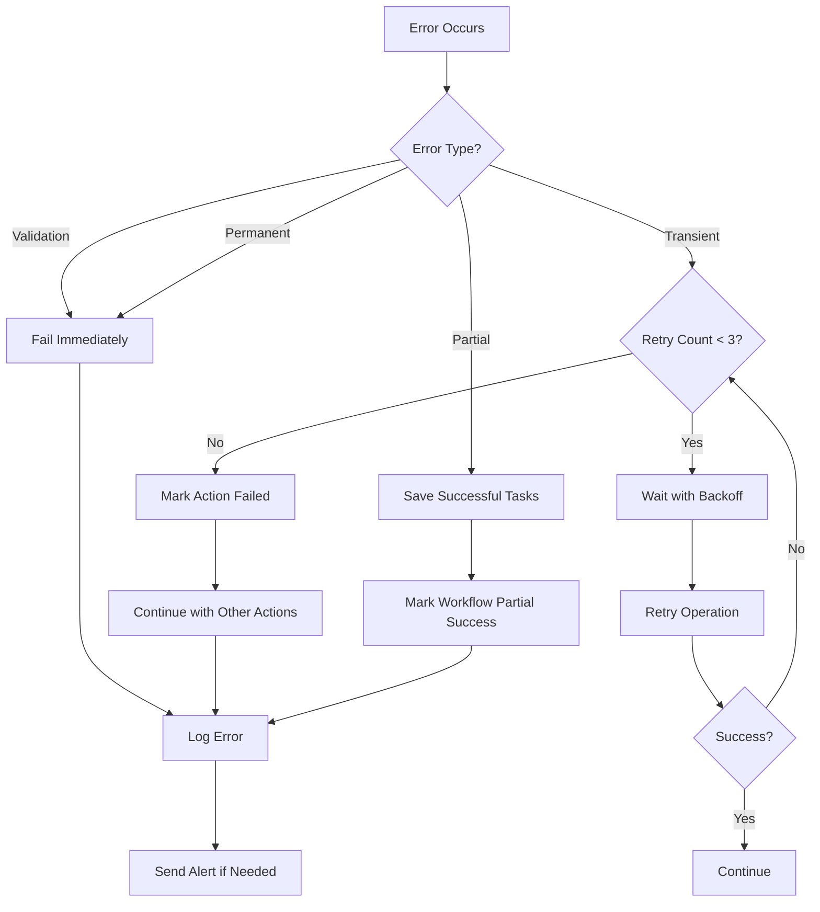

# Step Functions統合 設計書

## Overview

Step Functions統合機能は、アクションからタスクへの変換処理を非同期ワークフローとして実装します。AWS Step Functionsを使用してワークフローをオーケストレーションし、既存のAI統合Lambda関数を再利用しながら、信頼性の高いタスク生成を実現します。

## Architecture

### システム構成図

```mermaid
graph TB
    subgraph "Frontend"
        UI[React UI]
    end
    
    subgraph "API Layer"
        APIGW[API Gateway]
        StartLambda[Start Workflow Lambda]
        StatusLambda[Get Status Lambda]
        CancelLambda[Cancel Workflow Lambda]
    end
    
    subgraph "Workflow Layer"
        SF[Step Functions State Machine]
        TaskGenLambda[Task Generation Lambda]
    end
    
    subgraph "AI Layer"
        Bedrock[Amazon Bedrock]
    end
    
    subgraph "Data Layer"
        DDB[(DynamoDB)]
        S3[(S3 Archive)]
    end
    
    subgraph "Monitoring Layer"
        CW[CloudWatch]
        SNS[SNS Topic]
    end
    
    UI -->|POST /goals/{id}/start-activity| APIGW
    UI -->|GET /workflows/{arn}/status| APIGW
    UI -->|POST /workflows/{arn}/cancel| APIGW
    
    APIGW --> StartLambda
    APIGW --> StatusLambda
    APIGW --> CancelLambda
    
    StartLambda -->|StartExecution| SF
    StatusLambda -->|DescribeExecution| SF
    CancelLambda -->|StopExecution| SF
    
    SF -->|Invoke| TaskGenLambda
    TaskGenLambda -->|Generate Tasks| Bedrock
    TaskGenLambda -->|Save Tasks| DDB
    
    SF -->|Log Events| CW
    SF -->|Send Alerts| SNS
    
    DDB -->|Archive Old Data| S3
```

### State Machine定義

```json
{
  "Comment": "Task Generation Workflow",
  "StartAt": "ValidateInput",
  "States": {
    "ValidateInput": {
      "Type": "Task",
      "Resource": "arn:aws:lambda:REGION:ACCOUNT:function:ValidateInputFunction",
      "Next": "GetActions",
      "Catch": [
        {
          "ErrorEquals": ["States.ALL"],
          "Next": "HandleValidationError"
        }
      ]
    },
    "GetActions": {
      "Type": "Task",
      "Resource": "arn:aws:lambda:REGION:ACCOUNT:function:GetActionsFunction",
      "Next": "CreateBatches",
      "Retry": [
        {
          "ErrorEquals": ["States.TaskFailed"],
          "IntervalSeconds": 2,
          "MaxAttempts": 3,
          "BackoffRate": 2.0
        }
      ],
      "Catch": [
        {
          "ErrorEquals": ["States.ALL"],
          "Next": "HandleGetActionsError"
        }
      ]
    },
    "CreateBatches": {
      "Type": "Task",
      "Resource": "arn:aws:lambda:REGION:ACCOUNT:function:CreateBatchesFunction",
      "Next": "ProcessBatches"
    },
    "ProcessBatches": {
      "Type": "Map",
      "ItemsPath": "$.batches",
      "MaxConcurrency": 3,
      "Iterator": {
        "StartAt": "ProcessBatch",
        "States": {
          "ProcessBatch": {
            "Type": "Map",
            "ItemsPath": "$.actions",
            "MaxConcurrency": 8,
            "Iterator": {
              "StartAt": "GenerateTasks",
              "States": {
                "GenerateTasks": {
                  "Type": "Task",
                  "Resource": "arn:aws:lambda:REGION:ACCOUNT:function:TaskGenerationFunction",
                  "TimeoutSeconds": 120,
                  "Retry": [
                    {
                      "ErrorEquals": ["States.TaskFailed"],
                      "IntervalSeconds": 2,
                      "MaxAttempts": 3,
                      "BackoffRate": 2.0
                    }
                  ],
                  "Catch": [
                    {
                      "ErrorEquals": ["States.ALL"],
                      "ResultPath": "$.error",
                      "Next": "MarkActionFailed"
                    }
                  ],
                  "Next": "SaveTasks"
                },
                "SaveTasks": {
                  "Type": "Task",
                  "Resource": "arn:aws:lambda:REGION:ACCOUNT:function:SaveTasksFunction",
                  "Retry": [
                    {
                      "ErrorEquals": ["States.TaskFailed"],
                      "IntervalSeconds": 1,
                      "MaxAttempts": 3,
                      "BackoffRate": 2.0
                    }
                  ],
                  "Catch": [
                    {
                      "ErrorEquals": ["States.ALL"],
                      "ResultPath": "$.error",
                      "Next": "MarkActionFailed"
                    }
                  ],
                  "Next": "MarkActionSuccess"
                },
                "MarkActionSuccess": {
                  "Type": "Pass",
                  "Result": {
                    "status": "success"
                  },
                  "End": true
                },
                "MarkActionFailed": {
                  "Type": "Pass",
                  "Result": {
                    "status": "failed"
                  },
                  "End": true
                }
              }
            },
            "Next": "UpdateBatchProgress"
          },
          "UpdateBatchProgress": {
            "Type": "Task",
            "Resource": "arn:aws:lambda:REGION:ACCOUNT:function:UpdateProgressFunction",
            "End": true
          }
        }
      },
      "Next": "AggregateResults"
    },
    "AggregateResults": {
      "Type": "Task",
      "Resource": "arn:aws:lambda:REGION:ACCOUNT:function:AggregateResultsFunction",
      "Next": "CheckResults"
    },
    "CheckResults": {
      "Type": "Choice",
      "Choices": [
        {
          "Variable": "$.allSuccess",
          "BooleanEquals": true,
          "Next": "UpdateGoalStatusActive"
        },
        {
          "Variable": "$.partialSuccess",
          "BooleanEquals": true,
          "Next": "UpdateGoalStatusPartial"
        }
      ],
      "Default": "UpdateGoalStatusFailed"
    },
    "UpdateGoalStatusActive": {
      "Type": "Task",
      "Resource": "arn:aws:lambda:REGION:ACCOUNT:function:UpdateGoalStatusFunction",
      "Parameters": {
        "goalId.$": "$.goalId",
        "status": "active"
      },
      "Next": "Success"
    },
    "UpdateGoalStatusPartial": {
      "Type": "Task",
      "Resource": "arn:aws:lambda:REGION:ACCOUNT:function:UpdateGoalStatusFunction",
      "Parameters": {
        "goalId.$": "$.goalId",
        "status": "partial"
      },
      "Next": "SendPartialSuccessNotification"
    },
    "UpdateGoalStatusFailed": {
      "Type": "Task",
      "Resource": "arn:aws:lambda:REGION:ACCOUNT:function:UpdateGoalStatusFunction",
      "Parameters": {
        "goalId.$": "$.goalId",
        "status": "failed"
      },
      "Next": "SendFailureNotification"
    },
    "SendPartialSuccessNotification": {
      "Type": "Task",
      "Resource": "arn:aws:states:::sns:publish",
      "Parameters": {
        "TopicArn": "arn:aws:sns:REGION:ACCOUNT:workflow-notifications",
        "Subject": "Task Generation Partially Succeeded",
        "Message.$": "$.notificationMessage"
      },
      "Next": "Success"
    },
    "SendFailureNotification": {
      "Type": "Task",
      "Resource": "arn:aws:states:::sns:publish",
      "Parameters": {
        "TopicArn": "arn:aws:sns:REGION:ACCOUNT:workflow-notifications",
        "Subject": "Task Generation Failed",
        "Message.$": "$.notificationMessage"
      },
      "Next": "Fail"
    },
    "HandleValidationError": {
      "Type": "Task",
      "Resource": "arn:aws:lambda:REGION:ACCOUNT:function:HandleErrorFunction",
      "Next": "Fail"
    },
    "HandleGetActionsError": {
      "Type": "Task",
      "Resource": "arn:aws:lambda:REGION:ACCOUNT:function:HandleErrorFunction",
      "Next": "Fail"
    },
    "Success": {
      "Type": "Succeed"
    },
    "Fail": {
      "Type": "Fail"
    }
  },
  "TimeoutSeconds": 900
}
```

## Components and Interfaces

### 1. Start Workflow Lambda

**責務**: ワークフロー実行を開始し、実行ARNを返す

**入力**:
```typescript
interface StartWorkflowInput {
  goalId: string;
  userId: string;
}
```

**出力**:
```typescript
interface StartWorkflowOutput {
  executionArn: string;
  startDate: string;
  status: 'RUNNING';
}
```

**処理フロー**:
1. 入力バリデーション（goalId、userId）
2. 目標の存在確認
3. Step Functions実行開始
4. 実行ARNをデータベースに保存
5. 目標ステータスを"processing"に更新

### 2. Task Generation Lambda

**責務**: アクションからタスクを生成（既存Lambda関数を再利用）

**入力**:
```typescript
interface TaskGenerationInput {
  actionId: string;
  goalContext: {
    title: string;
    description: string;
    deadline: string;
  };
  actionContext: {
    title: string;
    description: string;
    type: 'execution' | 'habit';
  };
}
```

**出力**:
```typescript
interface TaskGenerationOutput {
  actionId: string;
  tasks: Array<{
    title: string;
    description: string;
    type: 'execution' | 'habit';
    estimatedMinutes: number;
  }>;
  status: 'success' | 'failed';
  error?: string;
}
```

### 3. Save Tasks Lambda

**責務**: 生成されたタスクをデータベースに保存

**入力**:
```typescript
interface SaveTasksInput {
  actionId: string;
  tasks: Array<{
    title: string;
    description: string;
    type: 'execution' | 'habit';
    estimatedMinutes: number;
  }>;
}
```

**出力**:
```typescript
interface SaveTasksOutput {
  actionId: string;
  savedTaskIds: string[];
  status: 'success' | 'failed';
  error?: string;
}
```

### 4. Update Progress Lambda

**責務**: ワークフロー進捗を更新

**入力**:
```typescript
interface UpdateProgressInput {
  executionArn: string;
  processedActions: number;
  totalActions: number;
  currentBatch: number;
  totalBatches: number;
}
```

**出力**:
```typescript
interface UpdateProgressOutput {
  executionArn: string;
  progressPercentage: number;
  estimatedTimeRemaining: number;
}
```

### 5. Get Status Lambda

**責務**: ワークフロー実行状況を取得

**入力**:
```typescript
interface GetStatusInput {
  executionArn: string;
}
```

**出力**:
```typescript
interface GetStatusOutput {
  executionArn: string;
  status: 'RUNNING' | 'SUCCEEDED' | 'FAILED' | 'TIMED_OUT' | 'ABORTED';
  startDate: string;
  stopDate?: string;
  progressPercentage: number;
  processedActions: number;
  totalActions: number;
  failedActions: string[];
  error?: string;
}
```

### 6. Cancel Workflow Lambda

**責務**: 実行中のワークフローをキャンセル

**入力**:
```typescript
interface CancelWorkflowInput {
  executionArn: string;
  reason: string;
}
```

**出力**:
```typescript
interface CancelWorkflowOutput {
  executionArn: string;
  status: 'ABORTED';
  stopDate: string;
}
```

## Data Models

### WorkflowExecution テーブル

```typescript
interface WorkflowExecution {
  executionArn: string;        // パーティションキー
  goalId: string;              // GSI
  userId: string;
  status: 'RUNNING' | 'SUCCEEDED' | 'FAILED' | 'TIMED_OUT' | 'ABORTED';
  startDate: string;
  stopDate?: string;
  input: {
    goalId: string;
    actionIds: string[];
  };
  output?: {
    successCount: number;
    failedCount: number;
    failedActions: string[];
  };
  progressPercentage: number;
  processedActions: number;
  totalActions: number;
  currentBatch: number;
  totalBatches: number;
  estimatedTimeRemaining: number;
  createdAt: string;
  updatedAt: string;
  ttl?: number;                // 90日後に自動削除
}
```

### WorkflowExecutionHistory テーブル（S3アーカイブ用）

```typescript
interface WorkflowExecutionHistory {
  executionArn: string;
  goalId: string;
  userId: string;
  status: string;
  startDate: string;
  stopDate: string;
  duration: number;
  successCount: number;
  failedCount: number;
  failedActions: string[];
  stateTransitions: Array<{
    timestamp: string;
    state: string;
    input: any;
    output: any;
  }>;
  archivedAt: string;
}
```

## Correctness Properties

*A property is a characteristic or behavior that should hold true across all valid executions of a system-essentially, a formal statement about what the system should do. Properties serve as the bridge between human-readable specifications and machine-verifiable correctness guarantees.*

### Property 1: Workflow Execution Idempotency

*For any* goal ID and user ID, starting a workflow multiple times with the same input should not create duplicate tasks

**Validates: Requirements 1.1, 10.1**

**Test Strategy**: 
- Generate random goal IDs and user IDs
- Start workflow multiple times with same input
- Verify only one execution is active at a time
- Verify no duplicate tasks are created

### Property 2: Batch Processing Completeness

*For any* set of actions, all actions should be processed exactly once across all batches

**Validates: Requirements 2.1, 2.2, 2.3**

**Test Strategy**:
- Generate random number of actions (1-64)
- Process through batching logic
- Verify each action appears in exactly one batch
- Verify batch sizes are ≤ 8

### Property 3: Retry Exponential Backoff

*For any* failed AI service call, retry intervals should follow exponential backoff (2s, 4s, 8s)

**Validates: Requirements 3.1, 3.2, 3.3**

**Test Strategy**:
- Simulate AI service failures
- Measure time between retry attempts
- Verify intervals match exponential backoff pattern

### Property 4: Timeout Enforcement

*For any* workflow execution, if execution time exceeds 15 minutes, the workflow should be aborted

**Validates: Requirements 4.1, 4.4**

**Test Strategy**:
- Simulate long-running operations
- Verify workflow aborts at 15-minute mark
- Verify timeout is logged correctly

### Property 5: Task Persistence Atomicity

*For any* action, either all generated tasks are saved or none are saved (no partial saves)

**Validates: Requirements 5.1, 5.4**

**Test Strategy**:
- Generate random tasks for actions
- Simulate database failures at various points
- Verify either all tasks saved or none saved
- Verify no orphaned tasks

### Property 6: Progress Calculation Accuracy

*For any* workflow execution, progress percentage should equal (processedActions / totalActions) * 100

**Validates: Requirements 6.2, 6.3**

**Test Strategy**:
- Generate random number of actions
- Process actions incrementally
- Verify progress percentage is accurate at each step

### Property 7: Partial Failure Handling

*For any* workflow with mixed success/failure, successfully generated tasks should be saved even if some actions fail

**Validates: Requirements 14.1, 14.2, 14.3**

**Test Strategy**:
- Generate random actions
- Simulate failures for subset of actions
- Verify successful tasks are saved
- Verify failed actions are listed in result

### Property 8: Concurrent Execution Isolation

*For any* two concurrent workflow executions, state changes in one execution should not affect the other

**Validates: Requirements 10.1, 10.2, 10.3**

**Test Strategy**:
- Start multiple workflows concurrently
- Verify each has isolated state
- Verify no data corruption or conflicts

### Property 9: Execution History Completeness

*For any* completed workflow, execution history should contain all state transitions

**Validates: Requirements 13.1, 13.2, 13.3**

**Test Strategy**:
- Execute workflows with various outcomes
- Verify all state transitions are recorded
- Verify timestamps are in chronological order

### Property 10: Alert Trigger Threshold

*For any* 5-minute window, if failure rate exceeds 10%, an alert should be triggered

**Validates: Requirements 8.2**

**Test Strategy**:
- Simulate various failure rates
- Verify alert is triggered when threshold exceeded
- Verify no alert when below threshold

## Error Handling

### エラー分類

1. **Validation Errors**: 入力データの不正
   - 対応: 即座に失敗、リトライなし
   - 例: 存在しないgoalId、不正なフォーマット

2. **Transient Errors**: 一時的な障害
   - 対応: 指数バックオフでリトライ（最大3回）
   - 例: AI APIタイムアウト、データベース接続エラー

3. **Permanent Errors**: 恒久的な障害
   - 対応: リトライせず即座に失敗
   - 例: AI APIクォータ超過、権限エラー

4. **Partial Errors**: 一部のアクションの失敗
   - 対応: 成功したタスクは保存、失敗リストを記録

### エラーハンドリングフロー



## Testing Strategy

### Unit Tests

1. **Lambda Function Tests**:
   - 各Lambda関数の入出力検証
   - エラーハンドリング検証
   - モックを使用したAI/DB呼び出し

2. **Batch Processing Tests**:
   - バッチ分割ロジック検証
   - 境界値テスト（0, 1, 8, 9, 64アクション）

3. **Progress Calculation Tests**:
   - 進捗率計算の正確性検証
   - 推定残り時間の計算検証

### Property-Based Tests

各Correctness Propertyに対応するプロパティベーステストを実装：

1. Property 1: Workflow Execution Idempotency
2. Property 2: Batch Processing Completeness
3. Property 3: Retry Exponential Backoff
4. Property 4: Timeout Enforcement
5. Property 5: Task Persistence Atomicity
6. Property 6: Progress Calculation Accuracy
7. Property 7: Partial Failure Handling
8. Property 8: Concurrent Execution Isolation
9. Property 9: Execution History Completeness
10. Property 10: Alert Trigger Threshold

### Integration Tests

1. **End-to-End Workflow Tests**:
   - 正常系: 全アクション成功
   - 異常系: 一部アクション失敗
   - 異常系: 全アクション失敗
   - タイムアウトシナリオ

2. **Concurrent Execution Tests**:
   - 複数ユーザーの同時実行
   - データ競合の検証

3. **Monitoring Tests**:
   - CloudWatchメトリクス記録検証
   - SNS通知送信検証

### Local Testing

1. **Step Functions Local**:
   - State Machine定義の検証
   - ローカルでの実行テスト

2. **Mock Services**:
   - AI APIモック
   - データベースモック

## Performance Optimization

### 並列処理戦略

1. **バッチレベル並列化**:
   - 最大3バッチを同時処理
   - メモリ使用量とスループットのバランス

2. **アクションレベル並列化**:
   - バッチ内の最大8アクションを同時処理
   - Lambda同時実行数の制限を考慮

### コネクションプーリング

1. **データベース接続**:
   - Lambda関数間で接続を再利用
   - 接続プールサイズ: 10

2. **AI API接続**:
   - HTTPクライアントの再利用
   - Keep-Alive有効化

### キャッシング戦略

1. **目標コンテキスト**:
   - Lambda実行環境でキャッシュ
   - TTL: 5分

2. **アクションコンテキスト**:
   - バッチ処理開始時に一括取得
   - メモリ内キャッシュ

## Monitoring and Logging

### CloudWatch Metrics

1. **Workflow Metrics**:
   - `WorkflowExecutionCount`: 実行回数
   - `WorkflowSuccessRate`: 成功率
   - `WorkflowDuration`: 実行時間
   - `WorkflowFailureRate`: 失敗率

2. **Action Metrics**:
   - `ActionProcessingTime`: アクション処理時間
   - `ActionFailureRate`: アクション失敗率
   - `TaskGenerationCount`: タスク生成数

3. **System Metrics**:
   - `LambdaConcurrentExecutions`: Lambda同時実行数
   - `DatabaseConnectionCount`: DB接続数
   - `AIAPILatency`: AI API レイテンシ

### Structured Logging

```typescript
interface WorkflowLog {
  timestamp: string;
  level: 'INFO' | 'WARN' | 'ERROR';
  executionArn: string;
  goalId: string;
  userId: string;
  event: string;
  details: any;
  duration?: number;
  error?: {
    message: string;
    stack: string;
    code: string;
  };
}
```

### Alert Configuration

1. **High Priority Alerts**:
   - ワークフロー失敗率 > 10%
   - ワークフロータイムアウト
   - データベース接続エラー

2. **Medium Priority Alerts**:
   - AI API レイテンシ > 5秒
   - Lambda同時実行数 > 80%

3. **Low Priority Alerts**:
   - 実行時間 > 10分
   - 部分失敗発生

## Security Considerations

### IAM Permissions

1. **Step Functions Execution Role**:
   - Lambda関数呼び出し権限
   - CloudWatch Logs書き込み権限
   - SNS発行権限

2. **Lambda Execution Roles**:
   - DynamoDB読み書き権限
   - Bedrock呼び出し権限
   - CloudWatch Logs書き込み権限

### Data Encryption

1. **転送中の暗号化**:
   - HTTPS通信（TLS 1.2以上）
   - Lambda-DynamoDB間の暗号化

2. **保存時の暗号化**:
   - DynamoDB暗号化（AWS管理キー）
   - S3暗号化（SSE-S3）

### Access Control

1. **API認証**:
   - JWT トークン検証
   - ユーザーIDとgoalIDの所有権確認

2. **ワークフロー実行権限**:
   - ユーザーは自分の目標のみ実行可能
   - 管理者は全ワークフローの監視可能

## Deployment Strategy

### Blue-Green Deployment

1. **State Machine Version管理**:
   - 新バージョンをデプロイ
   - トラフィックを段階的に移行
   - 問題発生時は即座にロールバック

2. **Lambda Function Version管理**:
   - エイリアスを使用したバージョン管理
   - カナリアデプロイメント

### Rollback Strategy

1. **State Machine Rollback**:
   - 前バージョンのARNに切り替え
   - 実行中のワークフローは継続

2. **Lambda Function Rollback**:
   - エイリアスを前バージョンに変更
   - 新規実行は前バージョンを使用

## Cost Optimization

### Step Functions コスト

- Standard Workflow: $0.025 per 1,000 state transitions
- 想定: 1実行あたり約50 state transitions
- 月間1,000実行: $1.25

### Lambda コスト

- 実行時間: 平均5分/実行
- メモリ: 1024MB
- 月間1,000実行: 約$5

### DynamoDB コスト

- オンデマンド課金
- 読み取り: 約10,000 RCU/月
- 書き込み: 約5,000 WCU/月
- 月間コスト: 約$2

### 総コスト見積もり

- 月間1,000実行: 約$10
- 月間10,000実行: 約$100

