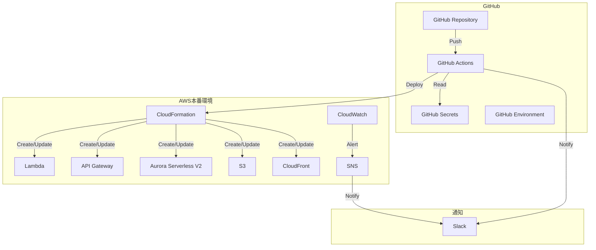
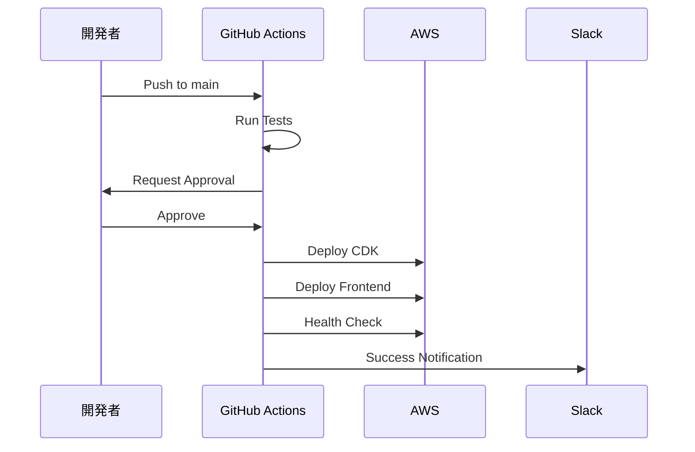

# 本番環境検証・ドキュメント作成 - 設計書

## 概要

本ドキュメントは、本番環境デプロイ（Spec 4.3）で構築したインフラの最終検証とドキュメント作成の設計を定義します。

## アーキテクチャ

### システム構成



### ワークフロー構成



## コンポーネントと責務

### 1. GitHub Secrets管理

#### 責務
- AWS認証情報の安全な保存
- デプロイ関連シークレットの管理
- Slack Webhook URLの保存

#### インターフェース
- GitHub Settings UI
- GitHub CLI

#### 設定項目
```yaml
Secrets:
  - AWS_ACCESS_KEY_ID
  - AWS_SECRET_ACCESS_KEY
  - S3_BUCKET_NAME
  - CLOUDFRONT_DISTRIBUTION_ID
  - API_ENDPOINT
  - SLACK_WEBHOOK_URL

Variables:
  - AWS_REGION
  - AWS_ACCOUNT_ID
```

### 2. デプロイワークフロー

#### 責務
- 自動テスト実行
- CDKデプロイ
- フロントエンドデプロイ
- ヘルスチェック
- Slack通知

#### ワークフロー定義
```yaml
name: Deploy Production
on:
  push:
    branches: [main]
  workflow_dispatch:

jobs:
  test:
    runs-on: ubuntu-latest
    steps:
      - Checkout
      - Setup Node.js
      - Install Dependencies
      - Run Lint
      - Run Type Check
      - Run Unit Tests
      - Run Integration Tests
      - Run E2E Tests
  
  deploy:
    needs: test
    runs-on: ubuntu-latest
    environment: production
    steps:
      - Checkout
      - Setup Node.js
      - Install Dependencies
      - Build
      - Configure AWS Credentials
      - Deploy CDK
      - Deploy Frontend
      - Health Check
      - Notify Slack
```

### 3. ロールバックワークフロー

#### 責務
- 指定バージョンへのロールバック
- ヘルスチェック
- Slack通知

#### ワークフロー定義
```yaml
name: Rollback Production
on:
  workflow_dispatch:
    inputs:
      version:
        description: 'Version to rollback to (tag or commit SHA)'
        required: true
      confirmation:
        description: 'Type "rollback" to confirm'
        required: true

jobs:
  rollback:
    runs-on: ubuntu-latest
    environment: production
    steps:
      - Validate Confirmation
      - Checkout Version
      - Setup Node.js
      - Install Dependencies
      - Build
      - Configure AWS Credentials
      - Deploy CDK
      - Deploy Frontend
      - Health Check
      - Notify Slack
```

### 4. ドキュメント構成

#### デプロイ手順書
```markdown
# デプロイ手順書

## 事前準備
- GitHub Secrets設定
- IAMユーザー作成
- GitHub Environment設定

## 初回デプロイ
1. CDK Bootstrap
2. Secrets Manager設定
3. CDKデプロイ
4. フロントエンドデプロイ
5. 動作確認

## 通常デプロイ
1. mainブランチにpush
2. GitHub Actionsで自動デプロイ
3. 承認
4. 動作確認

## デプロイ後の確認
- ヘルスチェック
- CloudWatch Dashboards
- CloudWatch Alarms
- X-Ray トレーシング
```

#### 運用マニュアル
```markdown
# 運用マニュアル

## 日常的な監視
- CloudWatch Dashboards確認
- CloudWatch Alarms確認
- コスト確認

## アラート対応
- エラー率上昇時の対応
- レイテンシー上昇時の対応
- データベース接続エラー時の対応

## バックアップ・リストア
- データベースバックアップ
- S3バックアップ
- リストア手順

## スケーリング
- Lambda同時実行数調整
- データベースACU調整
- CloudFrontキャッシュ設定

## セキュリティ対応
- Secrets Manager認証情報ローテーション
- IAMポリシー見直し
- CloudTrail監査ログ確認
```

#### トラブルシューティングガイド
```markdown
# トラブルシューティングガイド

## よくある問題
- デプロイ失敗
- ヘルスチェック失敗
- CloudFrontキャッシュ問題
- データベース接続エラー

## ログの確認方法
- CloudWatch Logs
- X-Ray トレーシング
- CloudTrail

## メトリクスの確認方法
- CloudWatch Dashboards
- CloudWatch Alarms

## 緊急時の対応
- ロールバック実行
- サービス停止
- 問題調査

## エスカレーション
- 連絡先
- エスカレーション基準
```

#### ロールバック手順書
```markdown
# ロールバック手順書

## ロールバックの判断基準
- エラー率が5%を超える
- ヘルスチェック失敗
- 重大なバグ発見

## ロールバックの実行手順
1. GitHub Actionsでロールバックワークフロー実行
2. バージョン指定
3. 確認メッセージ入力
4. 承認
5. 動作確認

## ロールバック後の確認
- ヘルスチェック
- CloudWatch Dashboards
- CloudWatch Alarms

## ロールバック失敗時の対処
- 手動ロールバック
- 問題調査
- 修正デプロイ

## ロールバック後の復旧
- 問題修正
- 再デプロイ
- 動作確認
```

## データモデル

### GitHub Secrets
```typescript
interface GitHubSecrets {
  AWS_ACCESS_KEY_ID: string;
  AWS_SECRET_ACCESS_KEY: string;
  S3_BUCKET_NAME: string;
  CLOUDFRONT_DISTRIBUTION_ID: string;
  API_ENDPOINT: string;
  SLACK_WEBHOOK_URL: string;
}

interface GitHubVariables {
  AWS_REGION: string;
  AWS_ACCOUNT_ID: string;
}
```

### ワークフロー入力
```typescript
interface DeployWorkflowInput {
  branch: string;
  environment: 'production';
}

interface RollbackWorkflowInput {
  version: string; // tag or commit SHA
  confirmation: string; // "rollback"
}
```

### ヘルスチェックレスポンス
```typescript
interface HealthCheckResponse {
  status: 'ok' | 'error';
  version: string;
  timestamp: string;
  services: {
    database: 'ok' | 'error';
    api: 'ok' | 'error';
    frontend: 'ok' | 'error';
  };
}
```

## 正確性プロパティ

*プロパティは、システムが満たすべき特性や動作を形式的に記述したものです。これらのプロパティは、テストやレビューを通じて検証されます。*

### Property 1: GitHub Secrets設定の完全性

*すべての* 必須シークレットが設定されている場合、デプロイワークフローは正常に開始できること

**検証**: 要件1.1, 1.2, 1.3, 1.4, 1.5

### Property 2: デプロイワークフローの冪等性

*任意の* コミットに対して、デプロイワークフローを複数回実行しても、最終的なシステム状態は同じであること

**検証**: 要件2.1, 2.2, 2.3, 2.4

### Property 3: テストジョブの完全性

*すべての* テストジョブ（lint、type-check、unit tests、integration tests、E2E tests）が成功した場合のみ、デプロイジョブが実行されること

**検証**: 要件2.2, 2.3

### Property 4: ヘルスチェックの正確性

*任意の* デプロイ後、ヘルスチェックエンドポイントが200 OKを返す場合、システムは正常に動作していること

**検証**: 要件2.5, 3.5

### Property 5: Slack通知の完全性

*すべての* デプロイ成功・失敗イベントに対して、Slack通知が送信されること

**検証**: 要件2.6, 2.7, 3.6, 3.7

### Property 6: ロールバックの正確性

*任意の* 有効なバージョン（タグまたはコミットSHA）に対して、ロールバックを実行すると、システムはそのバージョンの状態に戻ること

**検証**: 要件3.1, 3.2, 3.3, 3.4

### Property 7: ドキュメントの完全性

*すべての* 必須ドキュメント（デプロイ手順書、運用マニュアル、トラブルシューティングガイド、ロールバック手順書）が作成されていること

**検証**: 要件4.1, 4.2, 4.3, 4.4, 4.5, 5.1, 5.2, 5.3, 5.4, 5.5, 6.1, 6.2, 6.3, 6.4, 6.5, 7.1, 7.2, 7.3, 7.4, 7.5

### Property 8: 最終検証の完全性

*すべての* 検証項目（デプロイ、ロールバック、セキュリティ、監視、コスト）が正常に動作すること

**検証**: 要件8.1, 8.2, 8.3, 8.4, 8.5

### Property 9: WBS更新の正確性

*任意の* タスク完了時、WBSドキュメントは最新の進捗状況を反映していること

**検証**: 要件9.1, 9.2, 9.3

### Property 10: ステアリングファイル更新の完全性

*すべての* 学びとベストプラクティスがステアリングファイルに記録されていること

**検証**: 要件10.1, 10.2, 10.3, 10.4, 10.5

## エラーハンドリング

### デプロイワークフローのエラー

#### テストジョブ失敗
- **原因**: lint、type-check、unit tests、integration tests、E2E testsのいずれかが失敗
- **対処**: エラーログを確認し、問題を修正してから再度push

#### デプロイジョブ失敗
- **原因**: AWS認証エラー、CDKデプロイエラー、S3デプロイエラー、CloudFront無効化エラー
- **対処**: エラーログを確認し、問題を修正してから再度デプロイ

#### ヘルスチェック失敗
- **原因**: システムが正常に起動していない、データベース接続エラー
- **対処**: CloudWatch Logsを確認し、問題を修正してからロールバック

### ロールバックワークフローのエラー

#### バージョン指定エラー
- **原因**: 無効なバージョン（存在しないタグまたはコミットSHA）
- **対処**: 有効なバージョンを指定して再実行

#### 確認メッセージエラー
- **原因**: 確認メッセージが"rollback"ではない
- **対処**: 正しい確認メッセージを入力して再実行

#### ロールバック失敗
- **原因**: CDKデプロイエラー、S3デプロイエラー
- **対処**: エラーログを確認し、手動ロールバックを実施

## テスト戦略

### 手動テスト

#### GitHub Secrets設定テスト
1. GitHub Settings UIでシークレットを設定
2. GitHub Actionsでシークレットが正しく読み込まれることを確認

#### デプロイワークフローテスト
1. mainブランチにpush
2. GitHub Actionsでデプロイワークフローが開始されることを確認
3. テストジョブが成功することを確認
4. デプロイジョブが成功することを確認
5. ヘルスチェックが成功することを確認
6. Slack通知が送信されることを確認

#### ロールバックワークフローテスト
1. GitHub Actionsでロールバックワークフローを手動実行
2. バージョンを指定
3. 確認メッセージを入力
4. ロールバックジョブが成功することを確認
5. ヘルスチェックが成功することを確認
6. Slack通知が送信されることを確認

### ドキュメントレビュー

#### デプロイ手順書レビュー
- 事前準備の手順が明確か
- 初回デプロイの手順が明確か
- 通常デプロイの手順が明確か
- デプロイ後の確認手順が明確か

#### 運用マニュアルレビュー
- 日常的な監視項目が明確か
- アラート対応手順が明確か
- バックアップ・リストア手順が明確か
- スケーリング手順が明確か
- セキュリティ対応手順が明確か

#### トラブルシューティングガイドレビュー
- よくある問題と解決方法が明確か
- ログの確認方法が明確か
- メトリクスの確認方法が明確か
- 緊急時の対応手順が明確か
- エスカレーション手順が明確か

#### ロールバック手順書レビュー
- ロールバックの判断基準が明確か
- ロールバックの実行手順が明確か
- ロールバック後の確認手順が明確か
- ロールバック失敗時の対処方法が明確か
- ロールバック後の復旧手順が明確か

### 最終検証

#### デプロイ検証
- デプロイワークフローが正常に動作すること
- ヘルスチェックが成功すること
- Slack通知が送信されること

#### ロールバック検証
- ロールバックワークフローが正常に動作すること
- ヘルスチェックが成功すること
- Slack通知が送信されること

#### セキュリティ検証
- GitHub Secretsが安全に保存されていること
- IAMポリシーが最小権限の原則に従っていること
- CloudTrail監査ログが記録されていること

#### 監視検証
- CloudWatch Dashboardsが正常に表示されること
- CloudWatch Alarmsが正常に動作すること
- X-Ray トレーシングが有効化されていること

#### コスト検証
- 無料利用枠を活用していること
- コスト最適化が適用されていること
- 予算アラートが設定されていること

## セキュリティ考慮事項

### GitHub Secrets管理
- シークレットは一度設定すると値を確認できないため、安全に保管すること
- 定期的なアクセスキーローテーション（推奨：90日毎）
- 最小権限の原則を適用

### IAMポリシー
- GitHub Actions用IAMユーザーに最小権限を付与
- CloudTrailでAPI呼び出しを監視
- 異常なアクセスパターンの検出

### Slack Webhook URL
- Webhook URLは機密情報として扱う
- 不正アクセスを防ぐため、定期的にローテーション

## パフォーマンス要件

### デプロイワークフロー
- テストジョブ: 10分以内
- デプロイジョブ: 15分以内
- 合計: 25分以内

### ロールバックワークフロー
- ロールバックジョブ: 15分以内

### ヘルスチェック
- レスポンスタイム: 5秒以内
- リトライ回数: 5回
- リトライ間隔: 30秒

## 運用考慮事項

### デプロイ頻度
- 通常: 週1回
- 緊急: 随時

### ロールバック頻度
- 通常: 月1回以下
- 緊急: 随時

### ドキュメント更新頻度
- 定期: 月1回
- 変更時: 随時

### 監視頻度
- 日常: 毎日
- アラート: 随時

## 将来の拡張

### 自動ロールバック
- ヘルスチェック失敗時に自動ロールバック
- エラー率上昇時に自動ロールバック

### カナリアデプロイ
- 段階的なデプロイ
- トラフィック分割

### ブルーグリーンデプロイ
- ゼロダウンタイムデプロイ
- 即座のロールバック

### マルチリージョンデプロイ
- 複数リージョンへの同時デプロイ
- リージョン間のフェイルオーバー
