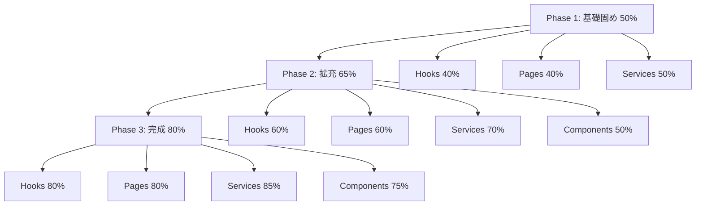

# 設計ドキュメント

## Overview

テストカバレッジ改善プロジェクトは、現在14.60%のカバレッジを80%以上に向上させることを目的としています。段階的なアプローチ（Phase 1: 50%、Phase 2: 65%、Phase 3: 80%）を採用し、優先度の高いカテゴリ（hooks、pages、services、components）から順次テストを追加します。

## Architecture

### テスト戦略



### カテゴリ別優先度

1. **Hooks** (現状2.42%): 最優先
   - カスタムフックは再利用性が高く、バグの影響範囲が広い
   - 43ファイル、推定100-150テストケース

2. **Pages** (現状6.57%): 高優先度
   - ユーザー体験に直結する
   - 13ファイル、推定50-70テストケース

3. **Services** (現状11.12%): 高優先度
   - ビジネスロジックの中核
   - 28ファイル、推定80-120テストケース

4. **Components** (現状15.32%): 中優先度
   - UI要素、数が多い
   - 109ファイル、推定200-300テストケース

## Components and Interfaces

### テストユーティリティ

```typescript
// packages/frontend/src/test/utils/render.tsx
export function renderWithProviders(
  ui: React.ReactElement,
  options?: RenderOptions
): RenderResult {
  const AllProviders = ({ children }: { children: React.ReactNode }) => (
    <QueryClientProvider client={queryClient}>
      <AuthProvider>
        <Router>
          {children}
        </Router>
      </AuthProvider>
    </QueryClientProvider>
  );

  return render(ui, { wrapper: AllProviders, ...options });
}

export function renderHookWithProviders<TProps, TResult>(
  hook: (props: TProps) => TResult,
  options?: RenderHookOptions<TProps>
): RenderHookResult<TResult, TProps> {
  const AllProviders = ({ children }: { children: React.ReactNode }) => (
    <QueryClientProvider client={queryClient}>
      <AuthProvider>
        {children}
      </AuthProvider>
    </QueryClientProvider>
  );

  return renderHook(hook, { wrapper: AllProviders, ...options });
}
```

### テストファクトリー

```typescript
// packages/frontend/src/test/factories/goal.factory.ts
export function createMockGoal(overrides?: Partial<Goal>): Goal {
  return {
    id: faker.string.uuid(),
    userId: faker.string.uuid(),
    title: faker.lorem.sentence(),
    description: faker.lorem.paragraph(),
    deadline: faker.date.future(),
    status: 'active',
    progress: faker.number.int({ min: 0, max: 100 }),
    createdAt: faker.date.past(),
    updatedAt: faker.date.recent(),
    ...overrides,
  };
}
```

## Data Models

### カバレッジデータモデル

```typescript
interface CoverageData {
  overall: {
    statements: number;
    branches: number;
    functions: number;
    lines: number;
  };
  categories: {
    [category: string]: {
      count: number;
      statements: number;
      branches: number;
      functions: number;
      lines: number;
    };
  };
  files: {
    [filePath: string]: {
      statements: number;
      branches: number;
      functions: number;
      lines: number;
    };
  };
}
```

## Correctness Properties

*A property is a characteristic or behavior that should hold true across all valid executions of a system-essentially, a formal statement about what the system should do. Properties serve as the bridge between human-readable specifications and machine-verifiable correctness guarantees.*

### Property Reflection

事前分析の結果、以下のプロパティを特定しました：

- 測定可能な数値目標（カバレッジ目標）: 13個
- 実装の方針（コードレビューで確認）: 多数
- 機能要件（手動確認）: 数個

数値目標は統合テストで確認し、実装の方針はコードレビューで確認します。プロパティベーステストは、個別のテストケースで実装します。

### Property 1: Phase 1カバレッジ目標の達成

*For any* テストスイート実行時、Phase 1完了後のカバレッジは50%以上である

**Validates: Requirements 9.1**

### Property 2: Phase 2カバレッジ目標の達成

*For any* テストスイート実行時、Phase 2完了後のカバレッジは65%以上である

**Validates: Requirements 9.2**

### Property 3: Phase 3カバレッジ目標の達成

*For any* テストスイート実行時、Phase 3完了後のカバレッジは80%以上である

**Validates: Requirements 9.3, 1.1, 1.4**

### Property 4: Hooksカバレッジ目標の達成

*For any* テストスイート実行時、Hooksカテゴリのカバレッジは80%以上である

**Validates: Requirements 2.1**

### Property 5: Pagesカバレッジ目標の達成

*For any* テストスイート実行時、Pagesカテゴリのカバレッジは80%以上である

**Validates: Requirements 3.1**

### Property 6: Servicesカバレッジ目標の達成

*For any* テストスイート実行時、Servicesカテゴリのカバレッジは85%以上である

**Validates: Requirements 4.1**

### Property 7: Componentsカバレッジ目標の達成

*For any* テストスイート実行時、Componentsカテゴリのカバレッジは75%以上である

**Validates: Requirements 5.1**

### Property 8: 分岐カバレッジ目標の達成

*For any* テストスイート実行時、分岐カバレッジは70%以上である

**Validates: Requirements 1.2**

### Property 9: 関数カバレッジ目標の達成

*For any* テストスイート実行時、関数カバレッジは75%以上である

**Validates: Requirements 1.3**

### Property 10: テスト実行時間の制約

*For any* テストスイート実行時、全テストは120秒以内に完了する

**Validates: Requirements 6.1**

### Property 11: ユニットテスト実行時間の制約

*For any* ユニットテスト実行時、全ユニットテストは60秒以内に完了する

**Validates: Requirements 6.2**

### Property 12: HTMLレポート生成

*For any* カバレッジレポート生成時、HTML形式のレポートが生成される

**Validates: Requirements 1.5, 8.1**

### Property 13: JSONレポート生成

*For any* カバレッジレポート生成時、JSON形式のレポートが生成される

**Validates: Requirements 8.2**

## Error Handling

### テスト失敗時のエラーハンドリング

```typescript
// テスト失敗時の詳細なエラーメッセージ
expect(result).toBe(expected, `Expected ${expected}, but got ${result}`);

// 非同期エラーのハンドリング
await expect(async () => {
  await someAsyncFunction();
}).rejects.toThrow('Expected error message');

// タイムアウトエラーのハンドリング
await waitFor(() => {
  expect(element).toBeInTheDocument();
}, { timeout: 3000 });
```

### カバレッジ目標未達成時の対応

1. カバレッジレポートを確認し、未カバーの箇所を特定
2. 優先度を評価（重要度、複雑度、影響範囲）
3. テストケースを追加
4. 再度カバレッジを測定

## Testing Strategy

### ユニットテスト

- **対象**: 個別の関数、コンポーネント、フック
- **ツール**: Vitest、React Testing Library
- **カバレッジ目標**: 80%以上
- **実行時間目標**: 60秒以内

### 統合テスト

- **対象**: 複数のモジュールの統合
- **ツール**: Vitest、React Testing Library
- **カバレッジ目標**: 主要フローの100%
- **実行時間目標**: 30秒以内

### プロパティベーステスト

- **対象**: 複雑なビジネスロジック
- **ツール**: fast-check
- **カバレッジ目標**: 重要なプロパティの100%
- **実行時間目標**: 10秒以内

### テスト実装の優先順位

1. **Phase 1: 基礎固め（50%目標）**
   - Hooks: 40%（最優先）
   - Pages: 40%（高優先度）
   - Services: 50%（高優先度）
   - 推定期間: 2週間

2. **Phase 2: 拡充（65%目標）**
   - Hooks: 60%
   - Pages: 60%
   - Services: 70%
   - Components: 50%（中優先度）
   - 推定期間: 2週間

3. **Phase 3: 完成（80%目標）**
   - Hooks: 80%
   - Pages: 80%
   - Services: 85%
   - Components: 75%
   - 推定期間: 2週間

### テスト品質の保証

1. **AAAパターンの遵守**
   - Arrange: テストデータの準備
   - Act: テスト対象の実行
   - Assert: 結果の検証

2. **テスト分離の保証**
   - 各テストは独立して実行可能
   - beforeEach/afterEachでクリーンアップ
   - グローバル状態の管理

3. **適切なアサーションの使用**
   - toEqual: オブジェクトの比較
   - toBe: プリミティブ値の比較
   - toHaveBeenCalled: 関数呼び出しの確認
   - toBeInTheDocument: DOM要素の存在確認

### カバレッジレポートの生成

```bash
# HTML + JSONレポート生成
pnpm run test:coverage

# カバレッジレポートの確認
open packages/frontend/coverage/index.html
```

### CI/CD統合

```yaml
# .github/workflows/test.yml
- name: Run tests with coverage
  run: pnpm run test:coverage

- name: Upload coverage reports
  uses: codecov/codecov-action@v3
  with:
    files: ./packages/*/coverage/coverage-final.json
```

## Implementation Plan

実装計画の詳細は[tasks.md](./tasks.md)を参照してください。

## Performance Considerations

### テスト実行時間の最適化

1. **並列実行**: maxConcurrency設定の最適化
2. **キャッシュ**: Turboキャッシュの活用
3. **分離**: isolate設定の最適化
4. **タイムアウト**: 適切なタイムアウト設定

### メモリ使用量の最適化

1. **ワーカー再起動**: singleFork: false
2. **ヒープサイズ**: max-old-space-size=8192
3. **並列実行制限**: maxConcurrency: 1（フロントエンド）

## Documentation

### 更新するドキュメント

1. **9-test-guide.md**: テストガイドの更新
2. **4-wbs.md**: WBSの更新
3. **新規ステアリングファイル**: カバレッジ改善のベストプラクティス

### 作成するレポート

1. **カバレッジ改善レポート**: 各Phaseの完了時
2. **テスト実装ガイドライン**: プロジェクト完了時
3. **よくある問題と解決方法**: プロジェクト完了時
