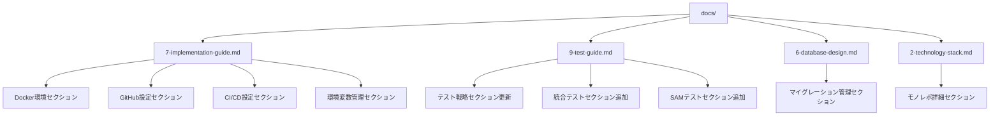

# 設計ドキュメント

## 概要

docs配下のドキュメントを.kiro/steeringに統合し、ドキュメント管理を一元化します。既存のsteeringファイルに新しいセクションを追加する形で統合し、情報の重複を避けながら、より詳細で実用的なガイドを提供します。

## アーキテクチャ

### ドキュメント統合マップ



## コンポーネントと統合方法

### 1. 7-implementation-guide.md への統合

#### 1.1 Docker環境セクション

**統合元**:
- docker-setup-guide.md
- docker-optimization.md
- docker-troubleshooting.md

**統合内容**:
```markdown
## Docker環境

### Docker Composeセットアップ
- 前提条件
- セットアップ手順
- サービス詳細（PostgreSQL、cognito-local）
- 開発用コマンド

### Docker最適化
- リソース制限設定
- ヘルスチェック設定
- ログ設定
- パフォーマンス最適化

### トラブルシューティング
- よくある問題と解決方法
- 診断ツール
- 緊急時の対応
```

#### 1.2 GitHub設定セクション

**統合元**:
- github-branch-protection.md
- github-secrets-setup.md
- husky-setup.md

**統合内容**:
```markdown
## GitHub設定

### ブランチ保護ルール
- mainブランチの保護設定
- developブランチの保護設定
- CODEOWNERSファイル設定

### GitHub Secrets設定
- 必要なシークレット一覧
- IAMユーザー作成手順
- セキュリティベストプラクティス

### Huskyセットアップ
- Pre-commit Hook設定
- Lint-staged設定
- テスト方法
```

#### 1.3 CI/CD設定セクション

**統合元**:
- ci-version-settings.md

**統合内容**:
```markdown
## CI/CD設定

### バージョン管理
- asdf設定（.tool-versions）
- package.json engines設定
- GitHub Actionsでの設定

### バージョン更新手順
- .tool-versionsファイルの更新
- package.jsonの更新
- CI/CDワークフローの更新
```

#### 1.4 環境変数管理セクション

**統合元**:
- environment-variables.md

**統合内容**:
```markdown
## 環境変数管理

### 環境変数ファイルの作成
- .envファイルの作成
- 必須環境変数
- セキュリティ上の注意

### 環境変数検証
- 検証コマンド
- 検証内容
- トラブルシューティング

### 環境別設定
- 開発環境
- テスト環境
- 本番環境
```

### 2. 9-test-guide.md への統合

#### 2.1 テスト戦略セクション更新

**統合元**:
- testing-strategy.md
- test-execution-rules.md

**統合内容**:
```markdown
## テスト戦略（更新）

### タイムアウト設定
- 基本タイムアウト
- 拡張タイムアウト（CI/CD環境）
- テスト実行ルール

### テスト実行コマンド
- 基本コマンド
- タイムアウト付き実行
- 安全モード

### パフォーマンス監視
- メトリクス
- 監視コマンド
```

#### 2.2 統合テストセクション追加

**統合元**:
- integration-testing.md
- integration-test-implementation.md

**統合内容**:
```markdown
## 統合テスト

### モノレポ統合テスト
- テストスクリプト
- テスト内容
- トラブルシューティング

### 統合テスト実装
- 実装されたテストスクリプト
- テストカテゴリ
- テストレポート
```

#### 2.3 SAMテストセクション追加

**統合元**:
- sam-integration-test-results.md

**統合内容**:
```markdown
## SAM CLI統合テスト

### テスト概要
- テスト実行結果
- 実装された機能
- 制限事項と既知の問題

### 実行方法
- 簡略版統合テスト
- 完全版統合テスト
- 手動テスト
```

### 3. 6-database-design.md への統合

#### 3.1 マイグレーション管理セクション

**統合元**:
- migration-guide.md

**統合内容**:
```markdown
## マイグレーション管理

### 開発環境でのマイグレーション
- 前提条件
- 初回セットアップ
- 日常的なマイグレーション
- スキーマ変更の手順

### 本番環境でのマイグレーション
- 事前準備
- 本番マイグレーション実行
- 注意事項

### バックアップと復旧
- バックアップの作成
- データベースの復旧
- バックアップ管理

### トラブルシューティング
- よくある問題と解決方法
- ログの確認
- 緊急対応手順

### セキュリティ設定
- データベース接続のセキュリティ
- 推奨設定

### 監視とログ
- メトリクス監視
- ログ出力
- アラート設定
```

### 4. 2-technology-stack.md への統合

#### 4.1 モノレポ詳細セクション

**統合元**:
- monorepo-architecture.md

**統合内容**:
```markdown
## モノレポ構成詳細

### アーキテクチャ図
- モノレポ構成の可視化
- パッケージ間依存関係

### パッケージ詳細
- @goal-mandala/shared
- @goal-mandala/frontend
- @goal-mandala/backend
- @goal-mandala/infrastructure

### 依存関係の詳細
- パッケージ間依存関係
- workspace プロトコル
- ビルド順序

### 開発ワークフロー
- 共通型定義の変更
- 新しい共通機能の追加
- パッケージ間の型安全性

### パフォーマンス最適化
- Turbo キャッシュ
- キャッシュ設定
- パフォーマンス監視
```

## データモデル

### 統合前のドキュメント構造

```
docs/
├── ci-version-settings.md
├── docker-optimization.md
├── docker-setup-guide.md
├── docker-troubleshooting.md
├── environment-variables.md
├── github-branch-protection.md
├── github-secrets-setup.md
├── husky-setup.md
├── integration-test-implementation.md
├── integration-testing.md
├── migration-guide.md
├── monorepo-architecture.md
├── sam-integration-test-results.md
├── test-execution-rules.md
└── testing-strategy.md
```

### 統合後のステアリング構造

```
.kiro/steering/
├── 1-product-overview.md
├── 2-technology-stack.md (更新)
│   └── + モノレポ構成詳細セクション
├── 3-development-roadmap.md
├── 4-wbs.md
├── 5-screen-specifications.md
├── 6-database-design.md (更新)
│   └── + マイグレーション管理セクション
├── 7-implementation-guide.md (更新)
│   ├── + Docker環境セクション
│   ├── + GitHub設定セクション
│   ├── + CI/CD設定セクション
│   └── + 環境変数管理セクション
├── 8-security-guide.md
├── 9-test-guide.md (更新)
│   ├── + テスト戦略更新
│   ├── + 統合テストセクション
│   └── + SAMテストセクション
├── 10-aws-guide.md
├── 11-react-hooks-best-practices.md
└── 99-spec.md
```

## エラーハンドリング

### 統合時のエラー処理

1. **重複内容の検出**
   - 既存のsteeringファイルと統合元ドキュメントで重複する内容を検出
   - より詳細で最新の情報を保持
   - 矛盾する情報は実装済みコードと整合性を確認

2. **参照の更新**
   - docs配下への参照を検索
   - 新しいsteeringファイルへの参照に更新
   - リンク切れを防止

3. **情報の欠落防止**
   - 統合前後で情報が失われていないことを確認
   - 重要な手順やコマンドが全て保持されていることを検証

## テスト戦略

### 統合後の検証

1. **Markdown形式の検証**
   - 全てのsteeringファイルが正しいMarkdown形式であることを確認
   - 見出しレベルの整合性を確認

2. **内部リンクの検証**
   - ドキュメント内のリンクが正しく機能することを確認
   - 相対パスが正しいことを確認

3. **情報の完全性確認**
   - 統合前のdocs配下の情報が全て保持されていることを確認
   - 重要な手順やコマンドが欠落していないことを確認

4. **参照の確認**
   - README.mdやCONTRIBUTING.mdからの参照が正しく更新されていることを確認
   - 他のファイルからのdocs参照がないことを確認

## パフォーマンス考慮事項

### ドキュメントサイズ

- 各steeringファイルのサイズが適切であることを確認
- 必要に応じてセクションを分割
- 目次を追加して可読性を向上

### 検索性

- 適切な見出しレベルを使用
- キーワードを明確に記載
- 関連情報へのリンクを提供

## セキュリティ考慮事項

### 機密情報の確認

- 統合するドキュメントに機密情報が含まれていないことを確認
- パスワードやAPIキーなどの例は適切にマスク
- 環境変数の例は安全な値を使用

## 実装の優先順位

1. **高優先度**: 7-implementation-guide.md への統合（Docker、GitHub、CI/CD、環境変数）
2. **中優先度**: 9-test-guide.md への統合（テスト戦略、統合テスト、SAMテスト）
3. **中優先度**: 6-database-design.md への統合（マイグレーション管理）
4. **低優先度**: 2-technology-stack.md への統合（モノレポ詳細）
5. **最終**: docsディレクトリの削除と参照の更新

