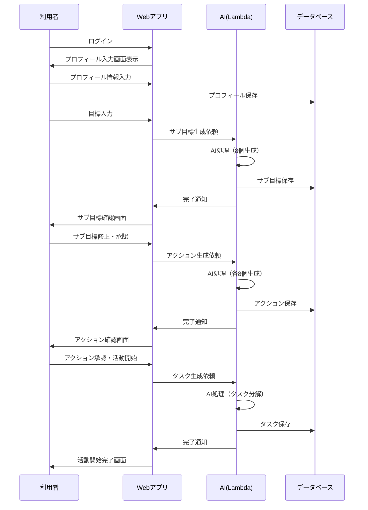
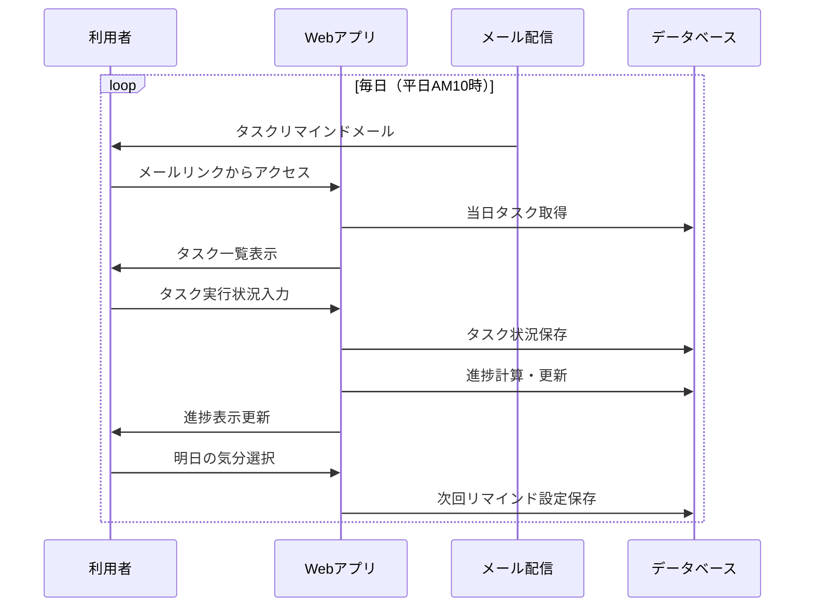
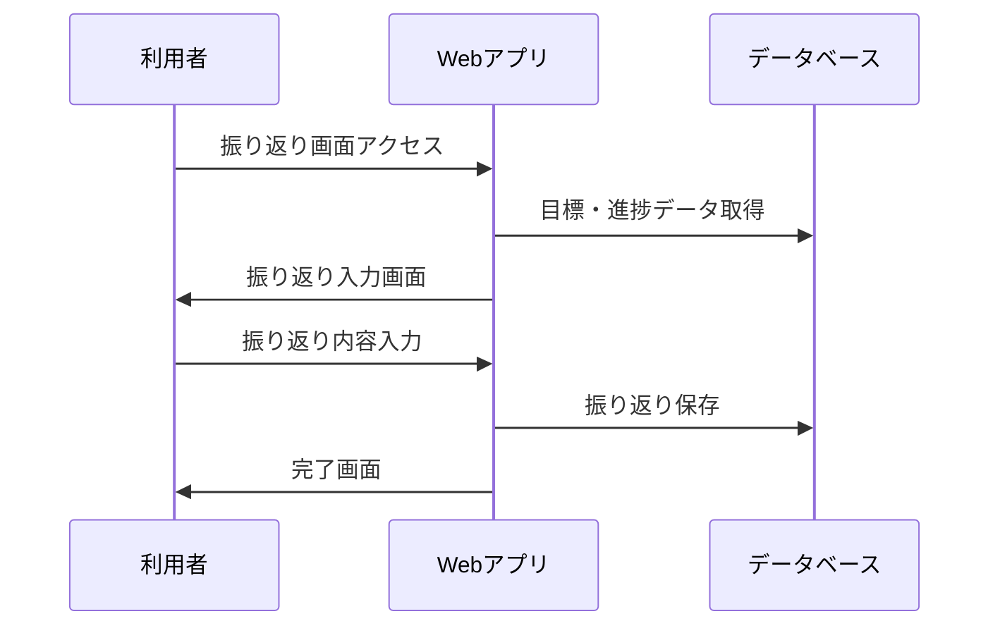

# プロダクト概要

## プロダクト名

目標管理曼荼羅

## 概要

大谷翔平が使用したマンダラチャートを作成・運用するツール。目標達成の道筋を描けない人、努力が継続しない人をサポートします。

利用者が自然言語で目標を入力すると、AIがマンダラチャートを生成。目標に対して8つのサブ目標、各サブ目標に8つのアクションを設定し、さらにアクションを日々のタスク（所要時間30分程度）に落とし込みます。システムは毎日タスクをリマインドし、タスク達成によりマンダラチャートの達成度が向上。最終的に100%で目標達成となります。

### マンダラチャート構造

中央3×3が目標とサブ目標、周囲8つの3×3が各サブ目標のアクション。

## 想定利用者

3〜6ヶ月の中長期目標を持つビジネスパーソンや学生。目標管理報告への活用も想定。

## 用語

| 用語 | 定義 | 備考・例 |
|------|------|----------|
| 目標 | 達成したい具体的な成果物や状態 | |
| 活動 | マンダラ完成後、日々のタスクを実行して目標達成を目指すフェーズ | リマインドを受けてタスクを消化・継続 |
| 振り返り | 目標達成状況の分析と改善点の記録 | |
| マンダラチャート | 中心に目標、周囲にサブ目標とアクションを配置する手法 | 8サブ目標×8アクション |
| マンダラ入力 | 目標入力からマンダラ完成までの入力作業 | または修正作業 |
| サブ目標 | 目標達成に必要な具体的目標 | 各8アクション |
| アクション | サブ目標達成に必要な具体的行動 | N個のタスクに分解 |
| 実行アクション | 実施すれば完了 | 例：プログラム作成、登壇 |
| 習慣アクション | 継続的実施が必要 | 例：読書、ランニング |
| タスク | アクション実施のための具体的作業 | 1アクション=複数タスク |
| リマインド | タスク消化・継続を促す通知 | |
| 消化 | 実行アクションのタスク完了 | |
| 継続 | 習慣アクションのタスク継続実施 | |
| 達成 | 進捗100%の状態 | |

## 操作の流れ

- サインイン → プロフィール入力
- マンダラ入力
  - 目標入力 → AI生成（8サブ目標） → 確認・修正
  - サブ目標からアクション生成 → 確認・修正
  - 活動開始 → アクションをタスクに変換
- 活動
  - 毎日タスクをメールリマインド
  - タスク画面でステータス入力
  - タスク消化・継続 → アクション達成 → サブ目標進捗向上 → 目標進捗向上
- 振り返り
  - 任意タイミングで実施
  - 簡潔な入力方式

### シーケンス図

#### マンダラ入力フェーズ

#### 活動フェーズ

#### 振り返りフェーズ

## 画面

詳細は[5-screen-specifications.md](./5-screen-specifications.md)参照。

主要画面:
- TOP画面: マンダラチャート一覧
- マンダラチャート画面: 9×9グリッド表示とタスクリスト
- 振り返り画面: 目標達成状況の振り返り入力

## 入力項目

### プロフィール

所属組織: 業種、組織規模
本人: 職種、役職（任意）

### 目標

タイトル、説明、達成期限、背景（状況・立場・理由）、制約事項（実行不可事項）

### サブ目標・アクション

タイトル、説明、背景、制約事項
※木構造で管理

### 振り返り

総括、惜しかったアクション、思ったより進まなかったアクション、未着手アクション

## 設計思想

### AIマンダラ生成

- 非同期処理（時間がかかるため）
- 依頼受付後「処理中」に変更、リロードで確認
- 確認は2回（サブ目標生成時、アクション生成時）
- 以降は任意タイミングで編集

### AI精度

- 段階的精度調整（目標→サブ目標→アクション→タスク）
- 各段階で適切な粒度を維持
- プロンプト向上、類似目標活用
- 最終的にAI依存度を下げる

### タスク種類

- アクション:タスク = 1:N（粒度30-60分）
- 実行アクション: 全タスク完了で達成、途中は%表示
- 習慣アクション: 目標期間の8割継続で達成

### リマインド

- 実行アクション: 1日最大3タスク
- 習慣アクション: 週1回必ずリマインド（分散）
- 初回: 完全ランダム
- 気分選択:
  - 「このまま行く」: 2/3を同じ・隣接アクションから、1/3を古い10件からランダム
  - 「気分を変える」: 全て古い10件からランダム

### RDB採用理由

- 階層構造（目標>サブ目標>アクション>タスク）が重要
- 進捗計算、類似データ検索、集計にSQL活用
- NoSQLより適している

### 将来展望

要件→タスク落とし込み、文章構成作成、ニーズ→アプローチ模索などへの転用可能性。

## 現時点で実装しないもの

- AI生成時の詳細進捗表示・完了通知
- タスクリスト見直し機能
- リマインド時刻指定（平日AM10時固定）
- 継続判定基準変更機能（週1回固定）
- RDS Proxy（MVP版は直接Lambda-Aurora接続）
