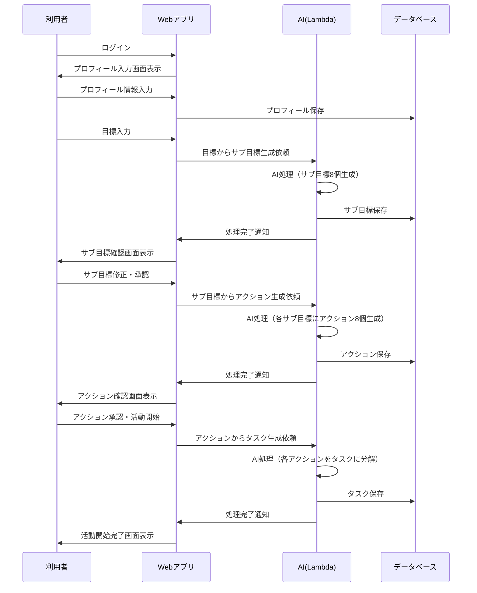
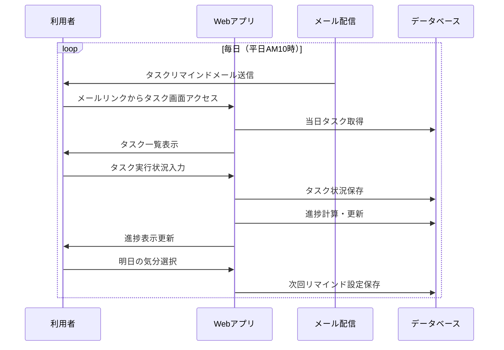
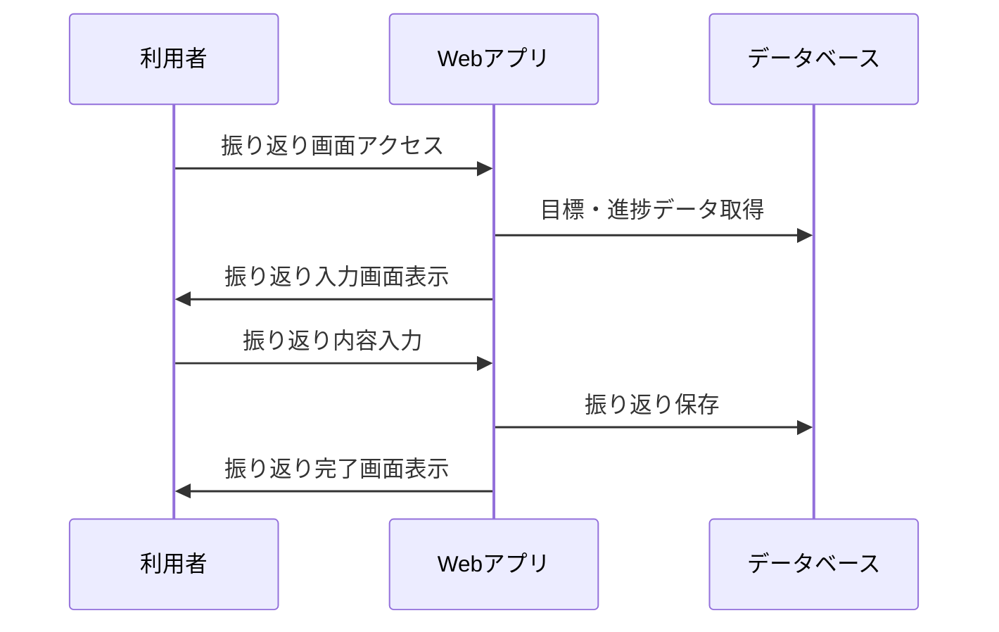

# プロダクト概要

## プロダクト名

目標管理曼荼羅

## 概要

メジャーリーガーの大谷翔平が使ったと言われるマンダラチャートを作成・運用するツールです。
目標を立てたはいいものの、目標達成までの道程が描けない、努力が継続しない人への補助を行うのが目的のツールです。
利用者が自然言語で目標を入力すると、AIが目標を達成するためのマンダラチャートを生成します。
マンダラチャートは目標に対して8つのサブ目標を設定し、さらに各サブ目標に対して8つのアクションを設定します。
AIはサブ目標のアクションを日々のタスクリストに落とし込みます。
1つのタスクの所要時間は30分程度で、システムはタスクリストは日々利用者にリマインドを行います。
利用者がタスクを達成すると、マンダラチャートの達成度が上がります。
最終的にマンダラチャートの達成度が100%になると、目標達成となります。

### マンダラチャートの例

以下は「半年でプログラミングスキルを身につける」という目標のマンダラチャートの例です。
中央の3×3が目標とサブ目標、その周りの8つの3×3がそれぞれのサブ目標のアクションになります：

| | | | | | | | | |
|---|---|---|---|---|---|---|---|---|
| アクション1 | アクション2 | アクション3 | アクション1 | アクション2 | アクション3 | アクション1 | アクション2 | アクション3 |
| アクション4 | **サブ目標1** | アクション5 | アクション4 | **サブ目標2** | アクション5 | アクション4 | **サブ目標3** | アクション5 |
| アクション6 | アクション7 | アクション8 | アクション6 | アクション7 | アクション8 | アクション6 | アクション7 | アクション8 |
| アクション1 | アクション2 | アクション3 | サブ目標1 | サブ目標2 | サブ目標3 | アクション1 | アクション2 | アクション3 |
| アクション4 | **サブ目標8** | アクション5 | サブ目標8 | **目標** | サブ目標4 | アクション4 | **サブ目標4** | アクション5 |
| アクション6 | アクション7 | アクション8 | サブ目標7 | サブ目標6 | サブ目標5 | アクション6 | アクション7 | アクション8 |
| アクション1 | アクション2 | アクション3 | アクション1 | アクション2 | アクション3 | アクション1 | アクション2 | アクション3 |
| アクション4 | **サブ目標7** | アクション5 | アクション4 | **サブ目標6** | アクション5 | アクション4 | **サブ目標5** | アクション5 |
| アクション6 | アクション7 | アクション8 | アクション6 | アクション7 | アクション8 | アクション6 | アクション7 | アクション8 |

## 想定利用者

主にビジネスパーソンや学生で、3から6ヶ月程度の中長期的な目標を持つ人を想定しています。
ビジネスパーソンについては、目標管理の報告に活用することも想定しています。
それ以上の長期的な目標を持つ人は、一旦対象外とします。

## 用語

| 用語 | 定義 | 備考・例 |
|------|------|----------|
| 目標 | 具体的な成果物や達成したい状態を示すもの | |
| 活動 | マンダラが完成した後に、日々のタスクを実行して目標達成を目指すフェーズ | リマインドを受けてタスクを消化・継続する期間 |
| 振り返り | 目標の達成状況に対して、分析したり、改善点を見つけたりして書き記すこと | |
| マンダラチャート（マンダラ） | 目標を達成するための手法で、中心に目標を置き、その周りにサブ目標やアクションを配置する | 8つのサブ目標と、それぞれに対する8つのアクションを設定する |
| マンダラ入力 | 目標入力からマンダラチャート完成までの一連の入力作業 | または、マンダラチャートの修正作業 |
| サブ目標 | 中心の目標を達成するために必要な具体的な目標 | 各サブ目標は、中心の目標に対して8つのアクションを持つ |
| アクション | サブ目標を達成するために必要な具体的な行動 | 各アクションは、N個のタスクに分解される |
| 実行アクション | アクションを実施すれば完了となるもの | 例：プログラムを書く、登壇する |
| 習慣アクション | 一度ではなく、継続的に行う必要があるアクション | 例：読書、ランニング |
| タスク | アクションを実施するための具体的な作業 | タスクは1つのアクションに対して複数存在する |
| リマインド | タスクの消化または継続を促すための通知 | |
| 消化 | 実行アクションのタスクを実施して完了すること | |
| 継続 | 習慣アクションのタスクを継続して実施すること | |
| 達成 | アクション、サブ目標、目標の進捗が100%になった状態 | |

## 操作の流れ

- サインイン
  - プロフィール入力
- マンダラ入力
  - 目標を入力
  - 目標を入力したらAIがマンダラを作成
    - 目標に対して8つのサブ目標を設定
    - 利用者はマンダラを確認・修正
    - サブ目標からアクションを作成
  - マンダラが完成したら「活動」を開始
    - アクションをタスクに変換
- 活動
  - 利用者に毎日タスクをメールでリマインド
  - タスク画面でステータスを入力
  - タスクの消化・継続によりアクションが達成
  - アクション達成によりサブ目標の進捗が向上
  - サブ目標達成により目標の進捗が向上
- 振り返り
  - 任意のタイミングで振り返り可能
  - 心理的負担を軽減した簡潔な入力方式

### シーケンス図

#### マンダラ入力フェーズ

#### 活動フェーズ

#### 振り返りフェーズ

## 画面

システムの画面構成と詳細仕様については、[5-screen-specifications.md](./5-screen-specifications.md)を参照してください。

### 主要画面

- **TOP画面**: マンダラチャート一覧
- **マンダラチャート画面**: 9×9グリッド表示とタスクリスト
- **振り返り画面**: 目標達成状況の振り返り入力

## 入力項目詳細

#### プロフィール入力項目

##### 所属組織の情報

- 業種
- 組織規模

##### 本人の情報

- 職種
- 役職（任意）

#### 目標入力項目

- 目標のタイトル
- 目標の説明
- 目標の達成期限
- 背景（置かれている状況、立場、その目標を立てた理由）
- 制約事項（何らかの制約により実行できないこと）

#### サブ目標・アクション入力項目

- タイトル
- 説明
- 背景
- 制約事項
※目標とサブ目標、サブ目標のアクションは木構造のデータとして管理

#### 振り返り入力項目

- 総括
- 惜しかったアクション
- 思ったより進まなかったアクション
- 未着手となったアクション

## 重要な機能の設計思想

### AIによるマンダラチャート生成

- 時間がかかる処理なので、非同期処理とします
- 作成または修正を依頼したら受け付けたことだけを通知、ステータスを「処理中」に変更
- 利用者はリロードボタンで定期的に画面を更新して、ステータスが「完了」になったらマンダラチャートを確認

### タスクの種類

- アクションに対してタスクは1：Nです
- タスクの粒度を30分から60分とすると、1つのタスクでアクションが完了になり得ないものがあるからです
- アクションは実施すれば完了となるものと、継続しなければならないものの2つがあると思われます
- 実施すれば完了となるアクションは、アクションを構成するタスクを全てこなせば「達成」となります。途中段階は％表示します。
- 継続しなければならないアクションは、タスクもそれに準じたタイプとなります。継続のタスクは継続中かどうかを問います。目標達成期間の8割を継続中と回答すれば「達成」とみなします。

### リマインド

- 実施すれば完了となるアクションのタスクは、1日に最大3までリマインドします。（これが多いかどうかはわかりませんが、現時点ではこの仕様とします。）
- 継続が必要なアクションは、それらのアクションのタスクが一週間に1度必ずリマインドされるように分散させてリマインドします。
- 初回リマインドは上2つのルールに基づき完全ランダムでリマインドします。
- タスク画面でステータスを入力します。
- この時、最後に「明日もこのまま行く」か「明日は少し気分を変える」を選択します。
  - 「明日もこのまま行く」の場合、実施すれば完了となるアクションのタスクのうち、2/3を同じアクションまたはマンダラチャート的に隣接したアクションからタスクを選び、リマインド、残り1個はリマインド時期が古い方の10件からランダムで選ぶます。
  - 「明日は少し気分を変える」の場合、実施すれば完了となるアクションのタスクのうち、全部をリマインド時期が古い方の10件からランダムで選ぶます。

## 現時点ではやらないこと

以下のものは現時点では実装対象外です。
将来の実装候補とします。

- AIによるマンダラチャート生成現は詳細な進捗表示や完了通知は不要です
- タスクリストの見直し機能は不要です
  - 初回入力時にタスクリストまで確認させるのは利用者の負担と考えられるからです
  - 見直しをするとしたら、日々通知されたタスクを見た時と思われますが、これも現時点では実装対象外とします
- タスクのリマインドの指定機能は不要です
  - 現時点では平日AM10時（日本時間）固定とします 
- 継続が必要なアクションについて、どれぐらい継続すれば継続中とみなすかの変更機能は不要です
  -　継続が必要なアクションは1週間に一度リマインドするで固定です
- RDS Proxyの導入
  - MVP版では直接Lambda-Aurora接続とし、パフォーマンス改善時に検討
