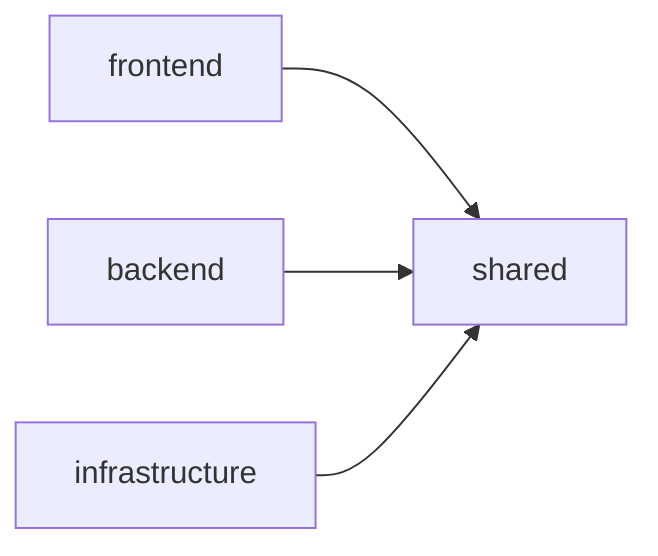

# 技術スタック

## アーキテクチャ

- SPA (Single Page Application)
- インフラ: AWS
- IaC: AWS CDK

## バックエンド(API)

- TypeScript + Hono
- 認証: Amazon Cognito
- 構成: CloudFront > API Gateway > Lambda(Hono) > Aurora Serverless V2
- DB認証情報: AWS Secrets Manager
- スキーマ管理: Prisma（マイグレーション + 型安全ORM）
- タスク生成: Step Functions
- 注: RDS Proxy不使用（MVP版）

## フロントエンド

- 配信: CloudFront > S3
- React + TypeScript
- CSS: Tailwind CSS

## 開発ツール

- バージョン管理: asdf（Node.js 23.10.0、Python 3.13.3）
- 静的解析: ESLint (TypeScript/React)
- フォーマッター: Prettier
- テスト:
  - ユニット: Jest + React Testing Library
  - E2E: Playwright
- CI/CDローカルテスト: act (GitHub Actions)

## 配信

バックエンド・フロントエンド共にCloudFrontで配信、同一ドメイン。

## CI/CD

- モノレポ構成（IaC、バックエンド、フロントエンド）
- パッケージマネージャー: pnpm
- リポジトリ: GitHub
- CI/CD: GitHub Actions
- カバレッジ目標: 80%以上
- E2Eテスト実施
- プリコミット: Lint
- mainプッシュ: 静的解析・自動テスト・カバレッジチェック・E2E
- DBマイグレーション: Prisma（CI/CDで自動実行）
- AWSデプロイ: GitHub Actions（手動実行）

### GitHub Actionsローカルテスト

- act: ワークフローをローカル実行・テスト
- 用途: 動作確認、デバッグ効率化、プッシュ前検証
- 制限: GitHub固有機能は完全再現不可、AWS認証情報は環境変数設定

## モノレポ構成

pnpm workspace + Turbo使用。各パッケージの役割と依存関係を明確化。

### パッケージ

#### @goal-mandala/shared

役割: 共通型定義・ユーティリティ・定数
技術: TypeScript、Zod
機能: 型定義、バリデーションスキーマ、ユーティリティ、定数
依存: なし（基盤パッケージ）

#### @goal-mandala/frontend

役割: UI・フロントエンド機能
技術: React 18 + TypeScript、Vite、Tailwind CSS、React Router、Vitest
機能: マンダラチャート表示、入力フォーム、タスク管理、進捗表示、認証画面
ビルド成果物: dist/（HTML, CSS, JS）→ S3 + CloudFront
依存: @goal-mandala/shared

#### @goal-mandala/backend

役割: API・ビジネスロジック・DB操作
技術: Hono、TypeScript、Lambda、Prisma、AWS SDK、Zod、Jest
機能: REST API、AI統合(Bedrock)、DB操作(Aurora)、認証・認可(JWT)、バリデーション
ビルド成果物: dist/ → Lambda
依存: @goal-mandala/shared

#### @goal-mandala/infrastructure

役割: AWSインフラ定義・管理
技術: AWS CDK v2、TypeScript、Jest
機能: AWSリソース定義、IaC、環境別設定、デプロイ自動化
主要スタック: DatabaseStack、ApiStack、FrontendStack
ビルド成果物: dist/、cdk.out/（CloudFormation）
依存: @goal-mandala/shared

### 依存関係



workspace プロトコル使用: `"@goal-mandala/shared": "workspace:*"`

ビルド順序:
1. shared（他が依存）
2. frontend、backend、infrastructure（並列）

### 開発ワークフロー

共通型定義変更:
```bash
cd packages/shared
# 型定義編集
pnpm build
cd ../../
pnpm build  # 依存パッケージ自動再ビルド
```

### パフォーマンス最適化

Turbo キャッシュ:
- 増分ビルド: 変更パッケージのみ
- 並列実行: 依存なしパッケージ並列
- キャッシュ: ビルド結果再利用

### トラブルシューティング

型定義未更新:
```bash
pnpm --filter @goal-mandala/shared build
pnpm type-check
```

循環依存: 共通機能をsharedに移動、依存を単方向化

ビルド順序エラー:
```bash
pnpm list -r
cat turbo.json
```

### ベストプラクティス

配置:
- 型定義: packages/shared/src/types/
- ユーティリティ: packages/shared/src/utils/
- 定数: packages/shared/src/constants/
- バリデーション: packages/shared/src/schemas/

テスト戦略:
- 各パッケージで独立テスト
- 統合テストで全体動作確認
- 型チェックでパッケージ間整合性保証

## ローカル開発環境

- テスト: インメモリSQLite（Docker不要）
- 認証: 開発用固定トークン（モック）
- AI: 開発用モックレスポンス（Bedrockエミュレータなし）
- API: AWS SAM CLI（Lambda + API Gateway）
- Step Functions: AWS SAM CLI
- CI/CDテスト: act
- フロー:
  - `sam local start-api`でLambda + API Gateway起動
  - フロントエンドは通常の開発サーバー
  - `act`でCI/CDワークフロー事前テスト

## AI

- Amazon Bedrock + Nova Micro（コスト重視）
- CDKでIAM権限・モデルアクセス自動設定
- AI通信はLambda（15分以内に分解）

## AIコーディング

- Kiro全面活用
- MCP Server稼働にPython使用（MCP以外は不使用）
