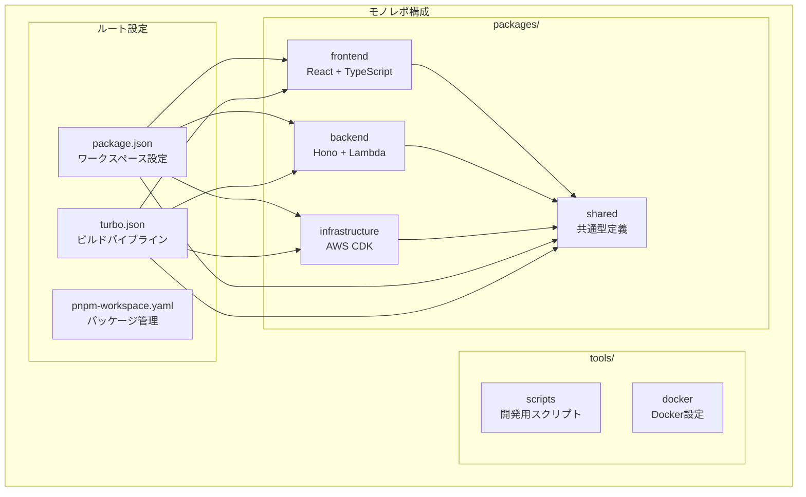
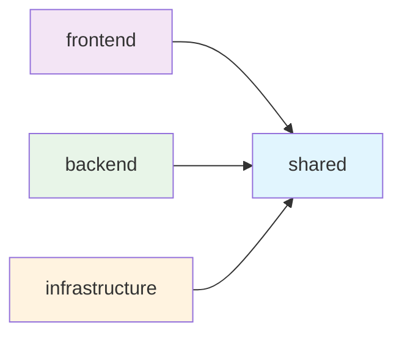

# 技術スタック

## アーキテクチャ

- Single Page Application (SPA)
- インフラ: AWS
- IaC: AWS CDK

## バックエンド(API)

- TypeScript + Hono
- Amazon Cognitoで認証
- Amazon CloudFront > Amazon API Gateway > AWS Lambda(Hono) > Amazon Aurora Serverless V2
- データベース認証情報はAWS Secrets Managerで管理
- データベーススキーマ管理: Prisma（マイグレーション + 型安全なORM）
- アクションごとのタスクを作る部分でStepFunctionsを使用
- 注：RDS Proxyは現時点では使用しない（MVP版のため）

## フロントエンド

- Amazon CloudFront > Amazon S3
- React + TypeScript
- CSSフレームワーク: Tailwind CSS

## 開発ツール

- バージョン管理: asdf（.tool-versionsでNode.js 23.10.0、Python 3.13.3を管理）
- 静的解析ツール: ESLint (TypeScript/React対応)
- フォーマッター: Prettier
- テストツール:
  - ユニットテスト: Jest + React Testing Library
  - E2Eテスト: Playwright
- CI/CDローカルテスト: act (GitHub Actionsワークフローのローカル実行)

## 配信

- バックエンド、フロントエンド共にAmazon CloudFrontで配信
- バックエンド、フロントエンドは同じCloudFrontディストリビューションに配置、故に同じドメインでアクセス可能

## CI/CD

- IaC、バックエンド、フロントエンドを一つのリポジトリで管理するモノレポ構成とする
- パッケージマネージャー: pnpm
- GitリポジトリはGitHubで管理
- CI/CDツールはGitHub Actionsを使用
- ユニットテストのカバレッジは80%以上を目指す
- E2Eテストを実施
- プリコミットでLintを実施
- mainへのプッシュで静的解析・自動テスト・カバレッジチェック・E2Eテストを実施
- データベースマイグレーション: Prismaを使用してCI/CDパイプラインで自動実行
- AWSへのデプロイはGitHub Actionsで実施するが、実施は手動

### GitHub Actionsローカルテスト

- **act**: GitHub Actionsワークフローをローカルで実行・テストするツール
- **使用目的**:
  - ワークフローの動作確認をローカルで実施
  - CI/CDパイプラインのデバッグ効率化
  - プッシュ前の事前検証
- **制限事項**:
  - 一部のGitHub固有機能は完全再現不可
  - AWSクレデンシャルは環境変数で設定
  - 複雑なワークフローは本番環境での最終確認が必要

## モノレポ構成詳細

### 概要

目標管理曼荼羅プロジェクトは、pnpm workspace と Turbo を使用したモノレポ構成で開発されています。各パッケージの役割と依存関係を明確に定義し、型安全性と開発効率を実現しています。

### アーキテクチャ図



### パッケージ詳細

#### @goal-mandala/shared

**役割**: 共通型定義・ユーティリティ・定数の管理

**技術スタック**:
- TypeScript
- Zod (バリデーション)

**主要機能**:
- 型定義 (`types/index.ts`)
- バリデーションスキーマ
- 共通ユーティリティ関数
- 定数定義

**エクスポート構成**:

```typescript
// src/index.ts
export * from './types';
export * from './utils';
export * from './constants';
```

**ビルド成果物**:
- `dist/index.js` - コンパイル済みJavaScript
- `dist/index.d.ts` - TypeScript型定義
- `dist/types/` - 型定義ファイル群

**依存関係**:
- **依存先**: なし（他のパッケージから参照される基盤パッケージ）
- **依存元**: frontend, backend, infrastructure

#### @goal-mandala/frontend

**役割**: ユーザーインターフェース・フロントエンド機能

**技術スタック**:
- React 18 + TypeScript
- Vite (ビルドツール)
- Tailwind CSS (スタイリング)
- React Router (ルーティング)
- React Testing Library + Vitest (テスト)

**主要機能**:
- マンダラチャート表示コンポーネント
- 目標・サブ目標・アクション入力フォーム
- タスク管理画面
- 進捗表示・可視化
- ユーザー認証画面
- レスポンシブデザイン

**ディレクトリ構成**:

```text
src/
├── components/     # Reactコンポーネント
├── hooks/         # カスタムフック
├── services/      # API通信・外部サービス
├── test/          # テスト設定
├── App.tsx        # メインアプリケーション
└── main.tsx       # エントリーポイント
```

**ビルド成果物**:
- `dist/` - 静的ファイル（HTML, CSS, JS）
- S3 + CloudFront で配信

**依存関係**:
- **依存先**: `@goal-mandala/shared`
- **依存元**: なし

#### @goal-mandala/backend

**役割**: API エンドポイント・ビジネスロジック・データベース操作

**技術スタック**:
- Hono (Web フレームワーク)
- TypeScript
- AWS Lambda (実行環境)
- Prisma (ORM)
- AWS SDK (Bedrock, Secrets Manager等)
- Zod (バリデーション)
- Jest (テスト)

**主要機能**:
- REST API エンドポイント
- AI統合 (Amazon Bedrock)
- データベース操作 (Aurora Serverless V2)
- 認証・認可 (JWT)
- バリデーション・エラーハンドリング

**ディレクトリ構成**:

```text
src/
├── handlers/      # APIハンドラー
├── middleware/    # ミドルウェア
├── services/      # ビジネスロジック
├── utils/         # ユーティリティ
└── index.ts       # エントリーポイント
```

**ビルド成果物**:
- `dist/` - コンパイル済みJavaScript
- AWS Lambda にデプロイ

**依存関係**:
- **依存先**: `@goal-mandala/shared`
- **依存元**: なし

#### @goal-mandala/infrastructure

**役割**: AWS インフラストラクチャの定義・管理

**技術スタック**:
- AWS CDK v2
- TypeScript
- Jest (テスト)

**主要機能**:
- AWS リソース定義
- インフラストラクチャのコード化
- 環境別設定管理
- デプロイメント自動化

**ディレクトリ構成**:

```text
src/
├── config/        # 環境設定
├── constructs/    # 再利用可能なCDK構成要素
├── stacks/        # CDKスタック定義
└── index.ts       # CDKアプリケーション
```

**主要スタック**:
- **DatabaseStack**: Aurora Serverless V2, Secrets Manager
- **ApiStack**: Lambda, API Gateway, Cognito
- **FrontendStack**: S3, CloudFront, Route53

**ビルド成果物**:
- `dist/` - コンパイル済みJavaScript
- `cdk.out/` - CloudFormation テンプレート

**依存関係**:
- **依存先**: `@goal-mandala/shared`
- **依存元**: なし

### 依存関係

#### パッケージ間依存関係



#### workspace プロトコル

各パッケージは `workspace:*` プロトコルを使用してsharedパッケージを参照：

```json
{
  "dependencies": {
    "@goal-mandala/shared": "workspace:*"
  }
}
```

#### ビルド順序

Turbo が依存関係を解析し、以下の順序でビルドを実行：

1. `@goal-mandala/shared` (他のパッケージが依存)
2. `@goal-mandala/frontend`, `@goal-mandala/backend`, `@goal-mandala/infrastructure` (並列実行)

### 開発ワークフロー

#### 共通型定義の変更

```bash
# sharedパッケージで型定義を変更
cd packages/shared
# 型定義を編集...

# sharedパッケージをビルド
pnpm build

# 依存するパッケージが自動的に再ビルドされる
cd ../../
pnpm build
```

#### 新しい共通機能の追加

```bash
# sharedパッケージに新機能を追加
cd packages/shared/src
# 新しいユーティリティ関数を追加...

# エクスポートを更新
echo "export * from './new-utility';" >> index.ts

# ビルドして他のパッケージで利用可能にする
cd ../
pnpm build
```

#### パッケージ間の型安全性

TypeScript の Project References により、パッケージ間の型チェックが自動的に行われます：

```typescript
// frontend/src/components/MandalaChart.tsx
import { Goal, SubGoal } from '@goal-mandala/shared';

// 型安全にsharedパッケージの型を使用
const MandalaChart: React.FC<{ goal: Goal }> = ({ goal }) => {
  // ...
};
```

### パフォーマンス最適化

#### Turbo キャッシュ

Turbo は以下の戦略でビルドを最適化：

1. **増分ビルド**: 変更されたパッケージのみビルド
2. **並列実行**: 依存関係のないパッケージを並列ビルド
3. **キャッシュ**: ビルド結果をキャッシュして再利用

#### キャッシュ設定

```json
{
  "pipeline": {
    "build": {
      "dependsOn": ["^build"],
      "outputs": ["dist/**"],
      "cache": true
    }
  }
}
```

#### パフォーマンス監視

```bash
# ビルド時間の測定
pnpm build --profile

# キャッシュ効果の確認
pnpm build --dry-run
```

### トラブルシューティング

#### よくある問題

**型定義が更新されない**

原因: sharedパッケージがビルドされていない

解決方法:

```bash
pnpm --filter @goal-mandala/shared build
pnpm type-check
```

**循環依存エラー**

原因: パッケージ間で循環参照が発生

解決方法:
- 共通機能はsharedパッケージに移動
- 依存関係を見直し、単方向にする

**ビルド順序エラー**

原因: 依存関係の設定が不正確

解決方法:

```bash
# 依存関係を確認
pnpm list -r

# turbo.jsonの設定を確認
cat turbo.json
```

### ベストプラクティス

#### 共通機能の配置

- 型定義: `packages/shared/src/types/`
- ユーティリティ: `packages/shared/src/utils/`
- 定数: `packages/shared/src/constants/`
- バリデーション: `packages/shared/src/schemas/`

#### パッケージ間通信

- 直接的な依存関係は避ける
- 共通インターフェースを定義
- 型安全性を重視

#### テスト戦略

- 各パッケージで独立したテスト
- 統合テストで全体動作を確認
- 型チェックでパッケージ間整合性を保証

## ローカル開発環境

- テスト: インメモリSQLite（Docker不要）
- 認証: 開発用固定トークン（モック認証）
- AI: 開発用モックレスポンス（Bedrockエミュレータなし）
- API: AWS SAM CLI（Lambda + API Gatewayエミュレータ）
- Step Functions: AWS SAM CLI（ローカル実行サポート）
- CI/CDテスト: act（GitHub Actionsワークフローのローカル実行）
- 開発フロー:
  - `sam local start-api` でLambda + API Gateway起動
  - フロントエンドは通常の開発サーバーで起動
  - `act` でCI/CDワークフローの事前テスト

## AI

- Amazon Bedrock + Amazon Nova Micro（コスト重視のテキスト生成）
- CDKでIAM権限とモデルアクセスを自動設定
- AIとの通信を行うのはLambda（故にAIへのリクエスト内容は15分以内に収まる程度に分解する）

## AIコーディング

- 全面的にKiroを活用
- MCP Serverを稼働させるためPythonを使用
  - PythonはMCPの稼働以外には使用しない
