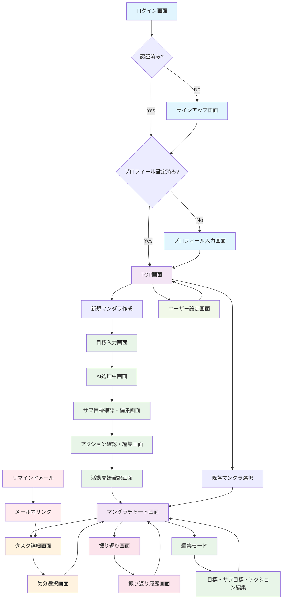

# 画面仕様

## 画面一覧

| 画面名 | URLパス | 目的 | 主要機能 | 入力項目 |
|--------|---------|------|----------|----------|
| ログイン画面 | `/login` | ユーザー認証 | メールアドレス・パスワード入力、ログインボタン、サインアップリンク、パスワードリセットリンク | メールアドレス（必須）、パスワード（必須） |
| サインアップ画面 | `/signup` | 新規ユーザー登録 | ユーザー情報入力、利用規約同意、登録ボタン、ログインリンク | 名前（必須）、メールアドレス（必須）、パスワード（必須）、パスワード確認（必須） |
| プロフィール入力画面 | `/profile/setup` | 初回ログイン時のプロフィール設定 | 所属組織情報入力、本人情報入力、次へボタン | 業種（選択）、組織規模（選択）、職種（入力）、役職（任意入力） |
| TOP画面 | `/` | マンダラチャート一覧表示・管理 | マンダラチャート一覧表示、新規作成ボタン、検索・フィルター機能、ユーザーメニュー | 検索キーワード、フィルター条件 |
| マンダラチャート画面 | `/mandala/:id` | マンダラチャートの表示・操作 | 9×9マンダラチャート表示、タスクリスト表示、進捗表示、編集モード切替、振り返りボタン | - |
| 目標入力画面 | `/mandala/create/goal` | 新規目標の入力 | 目標情報入力フォーム、AI生成開始ボタン、下書き保存機能 | 目標タイトル（必須）、目標説明（必須）、達成期限（必須）、背景（必須）、制約事項（任意） |
| AI処理中画面 | `/mandala/create/processing` | AI処理状況の表示 | 処理状況表示、プログレスバー、リロードボタン、キャンセルボタン | - |
| サブ目標確認・編集画面 | `/mandala/create/subgoals` | AI生成されたサブ目標の確認・修正 | サブ目標一覧表示（8個）、個別編集機能、再生成ボタン、承認・次へボタン | サブ目標タイトル、サブ目標説明、背景、制約事項 |
| アクション確認・編集画面 | `/mandala/create/actions` | AI生成されたアクションの確認・修正 | アクション一覧表示（64個）、サブ目標別表示切替、個別編集機能、アクション種別設定（実行/習慣）、活動開始ボタン | アクションタイトル、アクション説明、背景、制約事項、種別（実行/習慣） |
| 活動開始確認画面 | `/mandala/create/confirm` | マンダラチャート完成の最終確認 | 完成したマンダラチャート表示、活動開始ボタン、戻って編集ボタン | - |
| タスク詳細画面 | `/tasks/:id` | 個別タスクの詳細表示・状態更新 | タスク詳細情報表示、状態更新（未着手/進行中/完了/スキップ）、完了時間記録、メモ機能 | 状態選択、完了時間、メモ |
| 気分選択画面 | `/tasks/mood` | 翌日のタスク選択傾向設定 | 気分選択（同じ調子/気分を変える）、選択理由入力（任意）、保存ボタン | 気分選択（必須）、選択理由（任意） |
| 振り返り画面 | `/mandala/:id/reflection` | 目標達成状況の振り返り入力 | 振り返り項目入力、過去の振り返り履歴表示、保存・更新機能 | 総括、惜しかったアクション、思ったより進まなかったアクション、未着手となったアクション |
| 振り返り履歴画面 | `/mandala/:id/reflections` | 過去の振り返り一覧表示 | 振り返り履歴一覧、詳細表示、編集・削除機能 | - |
| ユーザー設定画面 | `/settings` | ユーザー情報・設定の管理 | プロフィール編集、パスワード変更、通知設定、アカウント削除 | プロフィール情報、パスワード、通知設定 |

## 画面遷移図

