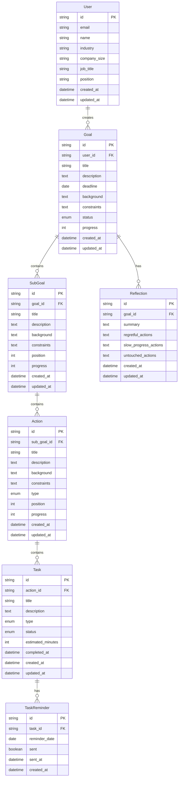

# データベース設計

## データベース設計概要

曼荼羅目標管理システムのデータベース設計では、以下の主要エンティティを定義します：

- **User**: システム利用者
- **Goal**: 中心目標
- **SubGoal**: サブ目標（8個）
- **Action**: アクション（各サブ目標に8個）
- **Task**: タスク（各アクションに複数）
- **TaskReminder**: タスクリマインド
- **Reflection**: 振り返り

## ER図

## リレーションシップ詳細

### User - Goal (1:N)

- 1人のユーザーは複数の目標を持つことができる
- 目標は必ず1人のユーザーに属する

### Goal - SubGoal (1:8)

- 1つの目標は必ず8つのサブ目標を持つ
- サブ目標は必ず1つの目標に属する

### SubGoal - Action (1:8)

- 1つのサブ目標は必ず8つのアクションを持つ
- アクションは必ず1つのサブ目標に属する

### Action - Task (1:N)

- 1つのアクションは複数のタスクを持つことができる
- タスクは必ず1つのアクションに属する

### Task - TaskReminder (1:N)

- 1つのタスクは複数のリマインドを持つことができる
- リマインドは必ず1つのタスクに属する

### Goal - Reflection (1:N)

- 1つの目標は複数の振り返りを持つことができる
- 振り返りは必ず1つの目標に属する

## データ整合性制約

### 必須制約

- すべてのエンティティにid（主キー）が必要
- 外部キー制約により参照整合性を保証
- email（User）はユニーク制約

### ビジネスルール制約

- SubGoalのpositionは0-7の範囲
- Actionのpositionは0-7の範囲
- Goalのprogressは0-100の範囲
- SubGoalのprogressは0-100の範囲
- Actionのprogressは0-100の範囲

### カスケード削除

- User削除時：関連するGoalも削除
- Goal削除時：関連するSubGoal、Reflectionも削除
- SubGoal削除時：関連するActionも削除
- Action削除時：関連するTaskも削除
- Task削除時：関連するTaskReminderも削除
