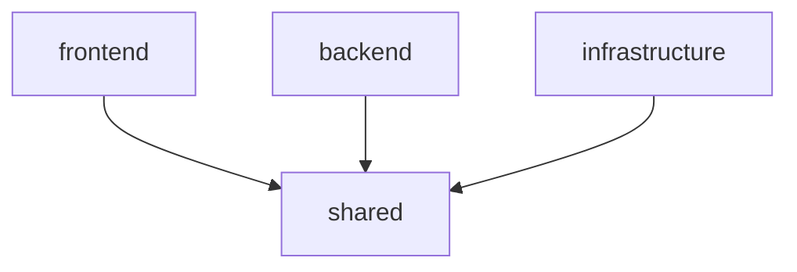

# 目標管理曼荼羅 (Goal Mandala)

曼荼羅チャートを活用した目標管理システム。AI（Amazon Bedrock）を使用して目標から具体的なタスクまでを自動生成し、日々の活動をサポートします。

## 概要

このシステムは、利用者が自然言語で入力した目標をもとに、AIが以下を自動生成します：

- **目標** → **8つのサブ目標** → **各サブ目標に8つのアクション** → **各アクションに複数のタスク**

生成されたマンダラチャートをもとに、日々のタスクリマインドと進捗管理を行い、目標達成をサポートします。

## 技術スタック

### アーキテクチャ

- **フロントエンド**: React + TypeScript + Tailwind CSS
- **バックエンド**: Hono + AWS Lambda + TypeScript
- **インフラ**: AWS CDK
- **データベース**: Amazon Aurora Serverless V2 + Prisma ORM
- **AI**: Amazon Bedrock (Nova Micro)
- **認証**: Amazon Cognito

### 開発環境

- **モノレポ管理**: pnpm workspace + Turbo
- **バージョン管理**: asdf (.tool-versions)
- **テスト**: Jest + React Testing Library + Playwright
- **CI/CD**: GitHub Actions

## プロジェクト構成

```
goal-mandala/
├── packages/
│   ├── frontend/           # React フロントエンド
│   ├── backend/            # Hono バックエンド (Lambda)
│   ├── infrastructure/     # AWS CDK インフラ定義
│   └── shared/             # 共通型定義・ユーティリティ
├── tools/
│   ├── docker/             # Docker Compose設定
│   └── scripts/            # 開発用スクリプト
├── docs/                   # ドキュメント
├── .tool-versions          # asdfバージョン管理
├── pnpm-workspace.yaml     # pnpm ワークスペース設定
├── turbo.json              # Turbo設定
└── package.json            # ルートパッケージ設定
```

### パッケージの役割

#### `packages/frontend`

- **技術**: React + TypeScript + Vite + Tailwind CSS
- **役割**: ユーザーインターフェース、マンダラチャート表示、タスク管理画面
- **依存関係**: `@goal-mandala/shared`

#### `packages/backend`

- **技術**: Hono + TypeScript + AWS Lambda
- **役割**: API エンドポイント、AI統合、データベース操作
- **依存関係**: `@goal-mandala/shared`

#### `packages/infrastructure`

- **技術**: AWS CDK + TypeScript
- **役割**: AWSリソースの定義・管理、デプロイ設定
- **依存関係**: `@goal-mandala/shared`

#### `packages/shared`

- **技術**: TypeScript + Zod
- **役割**: 共通型定義、バリデーションスキーマ、ユーティリティ関数
- **依存関係**: なし（他のパッケージから参照される）

### パッケージ間依存関係



## 必要な環境

### 必須ツール

- **Node.js**: 23.10.0
- **Python**: 3.13.3 (MCP Server用)
- **pnpm**: 8.15.0
- **asdf**: バージョン管理用

### 推奨ツール

- **Docker**: ローカル開発環境用
- **AWS CLI**: AWSリソース管理用
- **AWS SAM CLI**: ローカルAPI開発用

## クイックスタート

### 1. 環境セットアップ

```bash
# asdfでツールバージョンをインストール
asdf install

# 依存関係をインストール
pnpm install
```

### 2. 開発サーバー起動

```bash
# 全パッケージの開発サーバーを並列起動
pnpm dev

# または個別に起動
pnpm --filter @goal-mandala/frontend dev
pnpm --filter @goal-mandala/backend dev
```

### 3. ビルド・テスト

```bash
# 全パッケージをビルド
pnpm build

# 全パッケージのテストを実行
pnpm test

# リントチェック
pnpm lint

# 型チェック
pnpm type-check
```

## 利用可能なスクリプト

### ルートレベルスクリプト

| スクリプト | 説明 |
|------------|------|
| `pnpm build` | 全パッケージをビルド |
| `pnpm test` | 全パッケージのテストを実行 |
| `pnpm test:coverage` | カバレッジ付きテスト実行 |
| `pnpm lint` | 全パッケージのリントチェック |
| `pnpm lint:fix` | リントエラーの自動修正 |
| `pnpm type-check` | 全パッケージの型チェック |
| `pnpm format` | コードフォーマット |
| `pnpm dev` | 全パッケージの開発サーバーを並列起動 |
| `pnpm clean` | ビルド成果物をクリーンアップ |

### 統合テストスクリプト

| スクリプト | 説明 |
|------------|------|
| `pnpm test:integration` | 基本統合テスト |
| `pnpm test:integration:full` | 完全統合テスト |
| `pnpm test:integration:advanced` | 高度な統合テスト |
| `pnpm test:integration:shell` | シェルベース統合テスト |

### パッケージ個別実行

```bash
# 特定のパッケージでスクリプトを実行
pnpm --filter @goal-mandala/frontend [script]
pnpm --filter @goal-mandala/backend [script]
pnpm --filter @goal-mandala/infrastructure [script]
pnpm --filter @goal-mandala/shared [script]
```

## 開発ワークフロー

### 1. 新機能開発

```bash
# 新しいブランチを作成
git checkout -b feature/new-feature

# 開発サーバー起動
pnpm dev

# 変更をコミット
git add .
git commit -m "feat: 新機能を追加"

# プッシュ前にテスト実行
pnpm test:all
pnpm lint:all
pnpm type-check:all
```

### 2. パッケージ間の依存関係更新

```bash
# sharedパッケージを更新した場合
pnpm --filter @goal-mandala/shared build

# 依存するパッケージが自動的に再ビルドされる（Turboによる依存関係管理）
pnpm build
```

### 3. 新しい依存関係の追加

```bash
# 特定のパッケージに依存関係を追加
pnpm --filter @goal-mandala/frontend add react-query

# 開発依存関係を追加
pnpm --filter @goal-mandala/backend add -D @types/node

# ルートに開発ツールを追加
pnpm add -D -w eslint-plugin-new-rule
```

## トラブルシューティング

### よくある問題

#### 1. Node.jsバージョンエラー

```bash
# 現在のバージョンを確認
node --version

# asdfでバージョンを切り替え
asdf install nodejs 23.10.0
asdf global nodejs 23.10.0
```

#### 2. pnpmキャッシュ問題

```bash
# pnpmキャッシュをクリア
pnpm store prune

# node_modulesを再インストール
rm -rf node_modules packages/*/node_modules
pnpm install
```

#### 3. Turboキャッシュ問題

```bash
# Turboキャッシュをクリア
pnpm turbo clean
rm -rf .turbo packages/*/.turbo
```

#### 4. 型エラー

```bash
# 型定義を再生成
pnpm --filter @goal-mandala/shared build
pnpm type-check
```

## 貢献方法

1. このリポジトリをフォーク
2. 機能ブランチを作成 (`git checkout -b feature/amazing-feature`)
3. 変更をコミット (`git commit -m 'feat: 素晴らしい機能を追加'`)
4. ブランチにプッシュ (`git push origin feature/amazing-feature`)
5. プルリクエストを作成

### コミットメッセージ規約

[Conventional Commits](https://www.conventionalcommits.org/ja/v1.0.0/) に従ってください：

- `feat:` 新機能
- `fix:` バグ修正
- `docs:` ドキュメント更新
- `style:` コードスタイル変更
- `refactor:` リファクタリング
- `test:` テスト追加・修正
- `chore:` その他の変更

## ライセンス

MIT License

## 開発チーム

Goal Mandala Team

## 関連ドキュメント

### 開発者向け

- [CONTRIBUTING.md](./CONTRIBUTING.md) - 開発者向け詳細ガイド
- [docs/monorepo-architecture.md](./docs/monorepo-architecture.md) - モノレポアーキテクチャ詳細
- [docs/integration-testing.md](./docs/integration-testing.md) - 統合テストガイド
- [docs/ci-version-settings.md](./docs/ci-version-settings.md) - CI/CD環境設定

### プロジェクト管理

- [.kiro/steering/](./kiro/steering/) - プロジェクト指針・ガイドライン
- [.kiro/specs/](./kiro/specs/) - 機能仕様・実装計画

---

詳細な開発者向けドキュメントは [CONTRIBUTING.md](./CONTRIBUTING.md) を参照してください。
