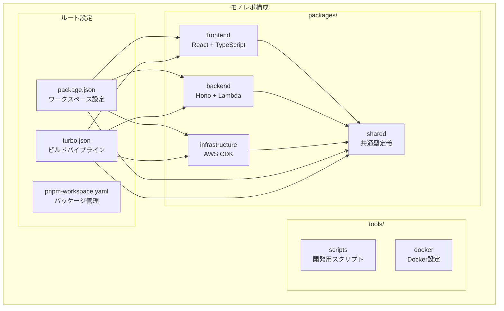
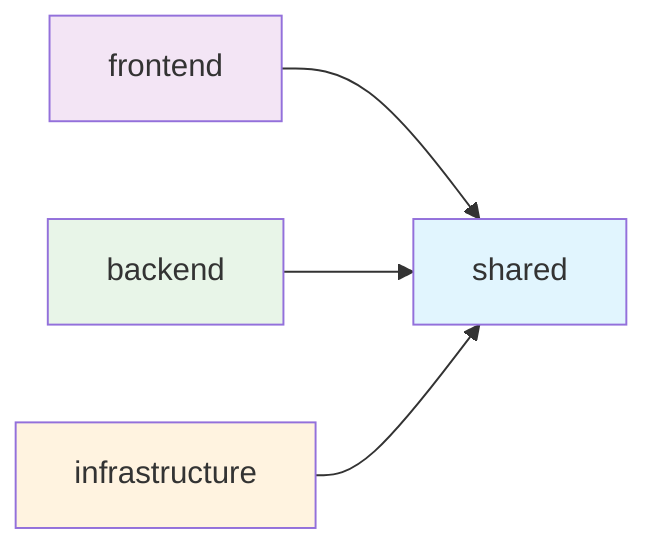

# モノレポアーキテクチャ

## 概要

目標管理曼荼羅プロジェクトは、pnpm workspace と Turbo を使用したモノレポ構成で開発されています。このドキュメントでは、各パッケージの役割と依存関係について詳しく説明します。

## アーキテクチャ図



## パッケージ詳細

### 1. `@goal-mandala/shared`

**役割**: 共通型定義・ユーティリティ・定数の管理

**技術スタック**:

- TypeScript
- Zod (バリデーション)

**主要機能**:

- 型定義 (`types/index.ts`)
- バリデーションスキーマ
- 共通ユーティリティ関数
- 定数定義

**エクスポート構成**:

```typescript
// src/index.ts
export * from './types';
export * from './utils';
export * from './constants';
```

**ビルド成果物**:

- `dist/index.js` - コンパイル済みJavaScript
- `dist/index.d.ts` - TypeScript型定義
- `dist/types/` - 型定義ファイル群

**依存関係**:

- **依存先**: なし（他のパッケージから参照される基盤パッケージ）
- **依存元**: frontend, backend, infrastructure

### 2. `@goal-mandala/frontend`

**役割**: ユーザーインターフェース・フロントエンド機能

**技術スタック**:

- React 18 + TypeScript
- Vite (ビルドツール)
- Tailwind CSS (スタイリング)
- React Router (ルーティング)
- React Testing Library + Vitest (テスト)

**主要機能**:

- マンダラチャート表示コンポーネント
- 目標・サブ目標・アクション入力フォーム
- タスク管理画面
- 進捗表示・可視化
- ユーザー認証画面
- レスポンシブデザイン

**ディレクトリ構成**:

```
src/
├── components/     # Reactコンポーネント
├── hooks/         # カスタムフック
├── services/      # API通信・外部サービス
├── test/          # テスト設定
├── App.tsx        # メインアプリケーション
└── main.tsx       # エントリーポイント
```

**ビルド成果物**:

- `dist/` - 静的ファイル（HTML, CSS, JS）
- S3 + CloudFront で配信

**依存関係**:

- **依存先**: `@goal-mandala/shared`
- **依存元**: なし

### 3. `@goal-mandala/backend`

**役割**: API エンドポイント・ビジネスロジック・データベース操作

**技術スタック**:

- Hono (Web フレームワーク)
- TypeScript
- AWS Lambda (実行環境)
- Prisma (ORM)
- AWS SDK (Bedrock, Secrets Manager等)
- Zod (バリデーション)
- Jest (テスト)

**主要機能**:

- REST API エンドポイント
- AI統合 (Amazon Bedrock)
- データベース操作 (Aurora Serverless V2)
- 認証・認可 (JWT)
- バリデーション・エラーハンドリング

**ディレクトリ構成**:

```
src/
├── handlers/      # APIハンドラー
├── middleware/    # ミドルウェア
├── services/      # ビジネスロジック
├── utils/         # ユーティリティ
└── index.ts       # エントリーポイント
```

**ビルド成果物**:

- `dist/` - コンパイル済みJavaScript
- AWS Lambda にデプロイ

**依存関係**:

- **依存先**: `@goal-mandala/shared`
- **依存元**: なし

### 4. `@goal-mandala/infrastructure`

**役割**: AWS インフラストラクチャの定義・管理

**技術スタック**:

- AWS CDK v2
- TypeScript
- Jest (テスト)

**主要機能**:

- AWS リソース定義
- インフラストラクチャのコード化
- 環境別設定管理
- デプロイメント自動化

**ディレクトリ構成**:

```
src/
├── config/        # 環境設定
├── constructs/    # 再利用可能なCDK構成要素
├── stacks/        # CDKスタック定義
└── index.ts       # CDKアプリケーション
```

**主要スタック**:

- **DatabaseStack**: Aurora Serverless V2, Secrets Manager
- **ApiStack**: Lambda, API Gateway, Cognito
- **FrontendStack**: S3, CloudFront, Route53

**ビルド成果物**:

- `dist/` - コンパイル済みJavaScript
- `cdk.out/` - CloudFormation テンプレート

**依存関係**:

- **依存先**: `@goal-mandala/shared`
- **依存元**: なし

## 依存関係の詳細

### パッケージ間依存関係



### workspace プロトコル

各パッケージは `workspace:*` プロトコルを使用してsharedパッケージを参照：

```json
{
  "dependencies": {
    "@goal-mandala/shared": "workspace:*"
  }
}
```

### ビルド順序

Turbo が依存関係を解析し、以下の順序でビルドを実行：

1. `@goal-mandala/shared` (他のパッケージが依存)
2. `@goal-mandala/frontend`, `@goal-mandala/backend`, `@goal-mandala/infrastructure` (並列実行)

## 開発ワークフロー

### 1. 共通型定義の変更

```bash
# sharedパッケージで型定義を変更
cd packages/shared
# 型定義を編集...

# sharedパッケージをビルド
pnpm build

# 依存するパッケージが自動的に再ビルドされる
cd ../../
pnpm build
```

### 2. 新しい共通機能の追加

```bash
# sharedパッケージに新機能を追加
cd packages/shared/src
# 新しいユーティリティ関数を追加...

# エクスポートを更新
echo "export * from './new-utility';" >> index.ts

# ビルドして他のパッケージで利用可能にする
cd ../
pnpm build
```

### 3. パッケージ間の型安全性

TypeScript の Project References により、パッケージ間の型チェックが自動的に行われます：

```typescript
// frontend/src/components/MandalaChart.tsx
import { Goal, SubGoal } from '@goal-mandala/shared';

// 型安全にsharedパッケージの型を使用
const MandalaChart: React.FC<{ goal: Goal }> = ({ goal }) => {
  // ...
};
```

## パフォーマンス最適化

### Turbo キャッシュ

Turbo は以下の戦略でビルドを最適化：

1. **増分ビルド**: 変更されたパッケージのみビルド
2. **並列実行**: 依存関係のないパッケージを並列ビルド
3. **キャッシュ**: ビルド結果をキャッシュして再利用

### キャッシュ設定

```json
// turbo.json
{
  "pipeline": {
    "build": {
      "dependsOn": ["^build"],
      "outputs": ["dist/**"],
      "cache": true
    }
  }
}
```

### パフォーマンス監視

```bash
# ビルド時間の測定
pnpm build --profile

# キャッシュ効果の確認
pnpm build --dry-run
```

## トラブルシューティング

### よくある問題

#### 1. 型定義が更新されない

**原因**: sharedパッケージがビルドされていない

**解決方法**:

```bash
pnpm --filter @goal-mandala/shared build
pnpm type-check
```

#### 2. 循環依存エラー

**原因**: パッケージ間で循環参照が発生

**解決方法**:

- 共通機能はsharedパッケージに移動
- 依存関係を見直し、単方向にする

#### 3. ビルド順序エラー

**原因**: 依存関係の設定が不正確

**解決方法**:

```bash
# 依存関係を確認
pnpm list -r

# turbo.jsonの設定を確認
cat turbo.json
```

## ベストプラクティス

### 1. 共通機能の配置

- 型定義: `packages/shared/src/types/`
- ユーティリティ: `packages/shared/src/utils/`
- 定数: `packages/shared/src/constants/`
- バリデーション: `packages/shared/src/schemas/`

### 2. パッケージ間通信

- 直接的な依存関係は避ける
- 共通インターフェースを定義
- 型安全性を重視

### 3. テスト戦略

- 各パッケージで独立したテスト
- 統合テストで全体動作を確認
- 型チェックでパッケージ間整合性を保証

## 今後の拡張

### 新しいパッケージの追加

1. `packages/` ディレクトリに新しいパッケージを作成
2. `package.json` で適切な依存関係を設定
3. `turbo.json` にビルド設定を追加
4. 統合テストを更新

### マイクロサービス化

将来的には以下のような分割も検討：

- `@goal-mandala/ai-service` - AI機能専用
- `@goal-mandala/notification-service` - 通知機能専用
- `@goal-mandala/analytics-service` - 分析機能専用

## まとめ

このモノレポ構成により、以下の利点を実現：

- **型安全性**: パッケージ間の型整合性を保証
- **開発効率**: 共通機能の再利用と一元管理
- **ビルド最適化**: Turbo による高速ビルド
- **保守性**: 明確な責任分離と依存関係管理

各パッケージの役割を理解し、適切な依存関係を維持することで、スケーラブルで保守しやすいシステムを構築できます。
