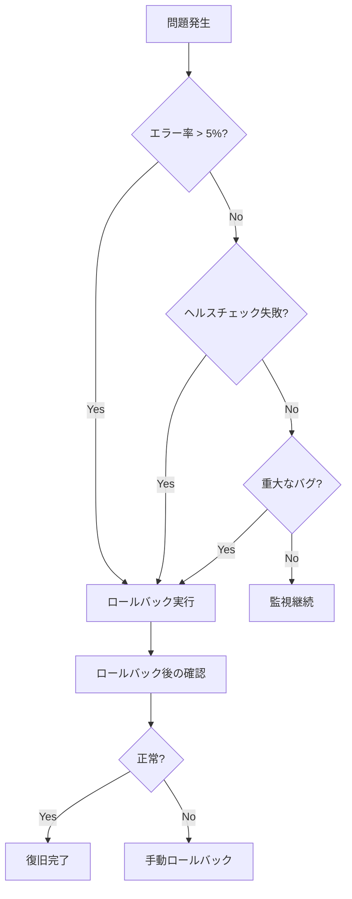

# ロールバック手順書

## 概要

本ドキュメントは、目標管理曼荼羅システムの本番環境でロールバックを実行する手順を説明します。

## 目次

1. [ロールバックの判断基準](#ロールバックの判断基準)
2. [ロールバックの実行手順](#ロールバックの実行手順)
3. [ロールバック後の確認](#ロールバック後の確認)
4. [ロールバック失敗時の対処](#ロールバック失敗時の対処)
5. [ロールバック後の復旧](#ロールバック後の復旧)

## ロールバックの判断基準

以下のいずれかの状況が発生した場合、ロールバックを検討してください。

### 1. エラー率が5%を超える場合

#### 確認方法

```bash
# Lambda エラー率を確認
aws cloudwatch get-metric-statistics \
  --namespace AWS/Lambda \
  --metric-name Errors \
  --dimensions Name=FunctionName,Value=goal-mandala-production-api \
  --start-time $(date -u -d '1 hour ago' +%Y-%m-%dT%H:%M:%S) \
  --end-time $(date -u +%Y-%m-%dT%H:%M:%S) \
  --period 300 \
  --statistics Average
```

#### 判断基準

- エラー率が5%を超えている
- エラー率が上昇傾向にある
- エラーが継続的に発生している

### 2. ヘルスチェック失敗の場合

#### 確認方法

```bash
# APIヘルスチェック
curl https://YOUR_API_ENDPOINT/health

# 期待されるレスポンス
{
  "status": "ok",
  "version": "1.0.0",
  "timestamp": "2025-12-13T12:00:00.000Z",
  "services": {
    "database": "ok",
    "api": "ok",
    "frontend": "ok"
  }
}
```

#### 判断基準

- ヘルスチェックエンドポイントが200 OKを返さない
- データベース接続が失敗している
- APIが応答しない

### 3. 重大なバグ発見の場合

#### 判断基準

- データ損失のリスクがある
- セキュリティ脆弱性が発見された
- ユーザーに重大な影響を与える

### ロールバック判断フローチャート



## ロールバックの実行手順

### 1. ロールバック対象バージョンの確認

#### Gitタグの確認

```bash
# Gitタグ一覧を確認
git tag -l

# 最新のタグを確認
git describe --tags --abbrev=0

# 特定のタグの詳細を確認
git show v1.0.0
```

#### コミットSHAの確認

```bash
# コミット履歴を確認
git log --oneline -10

# 特定のコミットの詳細を確認
git show COMMIT_SHA
```

### 2. GitHub Actionsでロールバックワークフローを実行

#### 手順

1. **GitHubリポジトリにアクセス**

   - GitHub > Actions タブに移動

2. **Rollback Productionワークフローを選択**

   - 左側のワークフロー一覧から **Rollback Production** を選択

3. **Run workflowをクリック**

   - 右上の **Run workflow** ボタンをクリック

4. **バージョンを指定**

   - **Version to rollback to** フィールドにタグまたはコミットSHAを入力
   - 例: `v1.0.0` または `abc1234`

5. **確認メッセージを入力**

   - **Type "rollback" to confirm** フィールドに `rollback` と入力

6. **Run workflowをクリック**

   - 緑色の **Run workflow** ボタンをクリック

### 3. ロールバックの進行状況を確認

#### GitHub Actionsのログを確認

1. **ワークフロー実行を選択**

   - Actions タブで実行中のワークフローを選択

2. **ジョブを選択**

   - `rollback` ジョブを選択

3. **ログを確認**

   - 各ステップのログを確認
   - エラーがないことを確認

#### 主要なステップ

| ステップ | 説明 | 所要時間 |
|---------|------|---------|
| Validate Confirmation | 確認メッセージの検証 | 10秒 |
| Checkout Version | 指定バージョンのチェックアウト | 30秒 |
| Setup Node.js | Node.js環境のセットアップ | 30秒 |
| Install Dependencies | 依存関係のインストール | 2分 |
| Build | ビルド実行 | 3分 |
| Configure AWS Credentials | AWS認証 | 10秒 |
| Deploy CDK | CDKデプロイ | 5分 |
| Deploy Frontend | フロントエンドデプロイ | 2分 |
| Health Check | ヘルスチェック | 30秒 |
| Notify Slack | Slack通知 | 10秒 |

### 4. 承認手順（GitHub Environment設定時）

GitHub Environmentで承認者を設定している場合：

1. **Review deploymentsをクリック**

   - ワークフロー実行画面で **Review deployments** ボタンをクリック

2. **production環境を選択**

   - **production** 環境のチェックボックスを選択

3. **Approve and deployをクリック**

   - 緑色の **Approve and deploy** ボタンをクリック

### 5. ロールバック完了の確認

#### Slack通知の確認

ロールバックが完了すると、Slackに以下の通知が送信されます：

```
✅ Rollback Successful

Environment: production
Version: v1.0.0
Timestamp: 2025-12-13T12:00:00.000Z
```

#### GitHub Actionsの確認

- ワークフロー実行が緑色のチェックマークで完了していることを確認

## ロールバック後の確認

### 1. ヘルスチェック

```bash
# APIヘルスチェック
curl https://YOUR_API_ENDPOINT/health

# 期待されるレスポンス
{
  "status": "ok",
  "version": "1.0.0",
  "timestamp": "2025-12-13T12:00:00.000Z",
  "services": {
    "database": "ok",
    "api": "ok",
    "frontend": "ok"
  }
}

# バージョン確認
curl https://YOUR_API_ENDPOINT/version

# 期待されるレスポンス
{
  "version": "1.0.0",
  "commit": "abc1234",
  "timestamp": "2025-12-13T12:00:00.000Z"
}
```

### 2. CloudWatch Dashboards確認

1. AWSコンソールにログイン
2. **CloudWatch** > **Dashboards** に移動
3. `goal-mandala-production` ダッシュボードを選択
4. 以下のメトリクスを確認：

| メトリクス | 正常範囲 | 確認内容 |
|-----------|---------|---------|
| Lambda実行回数 | 0-10,000/日 | 正常範囲内であることを確認 |
| Lambda実行時間 | 平均 < 1秒 | 正常範囲内であることを確認 |
| Lambda エラー率 | < 1% | エラー率が低下していることを確認 |
| API Gateway リクエスト数 | 0-10,000/日 | 正常範囲内であることを確認 |
| API Gateway レイテンシー | 95%ile < 2秒 | 正常範囲内であることを確認 |

### 3. CloudWatch Alarms確認

1. **CloudWatch** > **Alarms** に移動
2. 以下のアラームが正常（OK）であることを確認：

| アラーム名 | 期待される状態 |
|-----------|---------------|
| `goal-mandala-production-high-error-rate` | OK（緑） |
| `goal-mandala-production-high-latency` | OK（緑） |
| `goal-mandala-production-database-connection-error` | OK（緑） |

### 4. フロントエンドアクセス確認

1. ブラウザでCloudFrontのURLにアクセス
2. ログイン画面が表示されることを確認
3. テストユーザーでログインできることを確認
4. 主要機能が正常に動作することを確認：
   - マンダラチャート表示
   - 目標作成
   - タスク管理

### 5. ユーザー影響の確認

1. **ユーザーからの問い合わせを確認**

   - サポートチケットを確認
   - Slackチャンネルを確認

2. **エラーログを確認**

```bash
# エラーログをフィルタ
aws logs filter-log-events \
  --log-group-name /aws/lambda/goal-mandala-production-api \
  --filter-pattern "ERROR" \
  --start-time $(date -u -d '1 hour ago' +%s)000 \
  --end-time $(date -u +%s)000
```

## ロールバック失敗時の対処

### 1. 手動ロールバック

GitHub Actionsでのロールバックが失敗した場合、手動でロールバックを実行します。

#### 手順

1. **ローカル環境で指定バージョンをチェックアウト**

```bash
# 指定バージョンをチェックアウト
git checkout v1.0.0

# または
git checkout COMMIT_SHA
```

2. **依存関係をインストール**

```bash
# プロジェクトルートで実行
npm install
```

3. **ビルド**

```bash
# プロジェクトルートで実行
npm run build
```

4. **CDKデプロイ**

```bash
# インフラストラクチャをデプロイ
cd packages/infrastructure
npx cdk deploy --all --require-approval never
```

5. **フロントエンドデプロイ**

```bash
# フロントエンドをデプロイ
cd packages/frontend
npm run build
aws s3 sync dist/ s3://YOUR_S3_BUCKET_NAME --delete
aws cloudfront create-invalidation \
  --distribution-id YOUR_CLOUDFRONT_DISTRIBUTION_ID \
  --paths "/*"
```

6. **ヘルスチェック**

```bash
# APIヘルスチェック
curl https://YOUR_API_ENDPOINT/health
```

### 2. 問題調査

ロールバックが失敗した原因を調査します。

#### CloudFormationスタックのエラーを確認

```bash
# CloudFormationスタックのイベントを確認
aws cloudformation describe-stack-events \
  --stack-name DatabaseStack-production \
  --max-items 10

# スタックの状態を確認
aws cloudformation describe-stacks \
  --stack-name DatabaseStack-production
```

#### Lambda関数のログを確認

```bash
# Lambda関数のログを確認
aws logs tail /aws/lambda/goal-mandala-production-api --follow

# エラーログをフィルタ
aws logs filter-log-events \
  --log-group-name /aws/lambda/goal-mandala-production-api \
  --filter-pattern "ERROR"
```

### 3. 修正デプロイ

ロールバックが失敗した原因を修正し、再度デプロイします。

#### 手順

1. **問題を修正**

   - CloudFormationスタックのエラーを修正
   - Lambda関数のエラーを修正

2. **テスト実行**

```bash
# ローカルでテスト実行
npm run test
npm run test:integration
```

3. **デプロイ**

```bash
# CDKデプロイ
cd packages/infrastructure
npx cdk deploy --all --require-approval never

# フロントエンドデプロイ
cd packages/frontend
npm run build
aws s3 sync dist/ s3://YOUR_S3_BUCKET_NAME --delete
aws cloudfront create-invalidation \
  --distribution-id YOUR_CLOUDFRONT_DISTRIBUTION_ID \
  --paths "/*"
```

## ロールバック後の復旧

### 1. 問題修正

ロールバックの原因となった問題を修正します。

#### 手順

1. **問題を特定**

   - エラーログを分析
   - トレースを分析
   - メトリクスを分析

2. **修正方法を決定**

   - コードの修正
   - 設定の修正
   - インフラの修正

3. **修正を実施**

```bash
# 開発ブランチで作業
git checkout develop
git pull origin develop

# 問題を修正
# コードを編集

# コミット
git add .
git commit -m "fix: ロールバックの原因となった問題を修正"
git push origin develop
```

### 2. 再デプロイ

修正をテストし、本番環境に再デプロイします。

#### 手順

1. **ローカルでテスト実行**

```bash
# Lint実行
npm run lint

# Type Check実行
npm run type-check

# Unit Tests実行
npm run test

# Integration Tests実行
npm run test:integration

# E2E Tests実行
npm run test:e2e
```

2. **プルリクエストを作成**

   - GitHub でdevelop -> mainのプルリクエストを作成
   - レビューを依頼

3. **レビュー後、mainブランチにマージ**

   - プルリクエストをマージ
   - GitHub Actionsで自動デプロイが開始される

4. **デプロイの進行状況を確認**

   - GitHub Actionsのログを確認
   - デプロイが完了するまで待機

### 3. 動作確認

再デプロイ後、動作確認を実施します。

#### 手順

1. **ヘルスチェック**

```bash
# APIヘルスチェック
curl https://YOUR_API_ENDPOINT/health

# バージョン確認
curl https://YOUR_API_ENDPOINT/version
```

2. **CloudWatch Dashboards確認**

   - Lambda実行回数
   - Lambda実行時間
   - Lambda エラー率
   - API Gateway リクエスト数
   - API Gateway レイテンシー

3. **CloudWatch Alarms確認**

   - すべてのアラームが正常（OK）であることを確認

4. **フロントエンドアクセス確認**

   - ブラウザでCloudFrontのURLにアクセス
   - 主要機能が正常に動作することを確認

5. **ユーザー影響の確認**

   - ユーザーからの問い合わせを確認
   - エラーログを確認

## まとめ

本ドキュメントでは、目標管理曼荼羅システムの本番環境でロールバックを実行する手順を説明しました。

### 重要なポイント

1. **ロールバックの判断基準**: エラー率が5%を超える、ヘルスチェック失敗、重大なバグ発見の場合にロールバックを検討
2. **ロールバックの実行手順**: GitHub Actionsでロールバックワークフローを実行し、進行状況を確認
3. **ロールバック後の確認**: ヘルスチェック、CloudWatch Dashboards、CloudWatch Alarms、フロントエンドアクセスを確認
4. **ロールバック失敗時の対処**: 手動ロールバック、問題調査、修正デプロイを実施
5. **ロールバック後の復旧**: 問題修正、再デプロイ、動作確認を実施

### ロールバックのベストプラクティス

1. **迅速な判断**: 問題を早期に検出し、迅速にロールバックを判断
2. **明確なバージョン管理**: Gitタグを使用して、ロールバック対象バージョンを明確に管理
3. **自動化**: GitHub Actionsを使用して、ロールバックを自動化
4. **監視**: CloudWatch Dashboards、CloudWatch Alarmsを使用して、ロールバック後の状態を監視
5. **ドキュメント化**: ロールバックの原因と対応を記録し、再発防止に活用

### 次のステップ

- [デプロイ手順書](./deployment-guide.md)を参照して、デプロイ方法を理解してください
- [運用マニュアル](./operations-manual.md)を参照して、日常的な運用方法を理解してください
- [トラブルシューティングガイド](./troubleshooting-guide.md)を参照して、問題発生時の対処方法を理解してください
