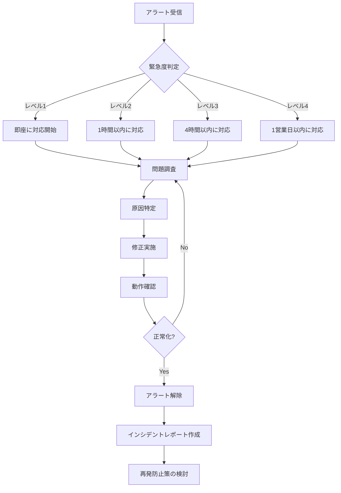

# プロフィール管理API 運用ガイド

## 概要

このドキュメントでは、プロフィール管理APIの運用に必要な監視項目、アラート対応手順、日常的な運用タスクについて説明します。

---

## 監視項目

### 1. APIメトリクス

#### リクエスト数

**メトリクス名**: `ProfileAPIRequests`

**説明**: プロフィールAPI全体のリクエスト数

**監視方法**:

- CloudWatch Metricsで確認
- ダッシュボードで時系列グラフ表示

**正常値**:

- 通常時: 100-1000リクエスト/時間
- ピーク時: 最大5000リクエスト/時間

**異常値の判断**:

- 急激な増加（通常の3倍以上）: DDoS攻撃の可能性
- 急激な減少（通常の1/3以下）: システム障害の可能性

#### エラー率

**メトリクス名**: `ProfileAPIErrors`

**説明**: エラーレスポンスの割合

**監視方法**:

- CloudWatch Metricsで確認
- アラーム設定: エラー率 > 5%

**正常値**:

- 通常時: < 1%
- 許容範囲: < 5%

**異常値の判断**:

- 5%以上: システム障害またはバグの可能性
- 10%以上: 緊急対応が必要

#### レスポンス時間

**メトリクス名**: `ProfileAPILatency`

**説明**: APIレスポンス時間（P50, P95, P99）

**監視方法**:

- CloudWatch Metricsで確認
- アラーム設定: P95 > 2秒

**正常値**:

- P50: < 500ms
- P95: < 1秒
- P99: < 2秒

**異常値の判断**:

- P95 > 2秒: パフォーマンス劣化
- P99 > 5秒: 深刻なパフォーマンス問題

### 2. Lambda関数メトリクス

#### 実行時間

**メトリクス名**: `Duration`

**説明**: Lambda関数の実行時間

**監視方法**:

- CloudWatch Metricsで確認
- 関数別に監視

**正常値**:

- GET /profile: < 500ms
- PUT /profile: < 1秒
- DELETE /profile: < 2秒

**異常値の判断**:

- タイムアウト発生: 10秒を超える実行
- 実行時間の急増: 通常の2倍以上

#### エラー数

**メトリクス名**: `Errors`

**説明**: Lambda関数のエラー数

**監視方法**:

- CloudWatch Metricsで確認
- アラーム設定: エラー数 > 10/5分

**正常値**:

- 通常時: 0-5エラー/時間

**異常値の判断**:

- 10エラー/5分以上: システム障害の可能性

#### スロットリング

**メトリクス名**: `Throttles`

**説明**: Lambda関数のスロットリング発生数

**監視方法**:

- CloudWatch Metricsで確認
- アラーム設定: スロットリング > 0

**正常値**:

- 0（スロットリングなし）

**異常値の判断**:

- スロットリング発生: 同時実行数の上限に達している

### 3. データベースメトリクス

#### 接続数

**メトリクス名**: `DatabaseConnections`

**説明**: データベースへの接続数

**監視方法**:

- Aurora CloudWatch Metricsで確認

**正常値**:

- 通常時: 5-20接続
- 最大: 100接続

**異常値の判断**:

- 接続数が最大値に近い: 接続プールの枯渇

#### クエリ実行時間

**メトリクス名**: `ReadLatency`, `WriteLatency`

**説明**: データベースクエリの実行時間

**監視方法**:

- Aurora CloudWatch Metricsで確認

**正常値**:

- 読み取り: < 10ms
- 書き込み: < 50ms

**異常値の判断**:

- 読み取り > 100ms: インデックスの問題
- 書き込み > 500ms: ロック競合の可能性

### 4. ログ監視

#### エラーログ

**ログレベル**: ERROR

**監視方法**:

- CloudWatch Logs Insightsでクエリ
- アラーム設定: ERRORログ > 10/5分

**確認項目**:

- エラーメッセージ
- スタックトレース
- リクエストID
- ユーザーID

#### 警告ログ

**ログレベル**: WARN

**監視方法**:

- CloudWatch Logs Insightsでクエリ

**確認項目**:

- 警告の内容
- 発生頻度
- 影響範囲

---

## CloudWatchアラーム設定

### 1. エラー率アラーム

**アラーム名**: `ProfileAPI-HighErrorRate`

**条件**:

- メトリクス: `ProfileAPIErrors`
- 閾値: エラー率 > 5%
- 評価期間: 5分間で2回連続

**アクション**:

- SNS通知: 運用チームSlackチャンネル
- 自動対応: なし（手動対応）

**対応手順**:

1. CloudWatch Logsでエラー詳細を確認
2. エラーの種類と原因を特定
3. 必要に応じて緊急修正を実施
4. インシデントレポートを作成

### 2. レスポンス時間アラーム

**アラーム名**: `ProfileAPI-HighLatency`

**条件**:

- メトリクス: `ProfileAPILatency` (P95)
- 閾値: レスポンス時間 > 2秒
- 評価期間: 5分間で2回連続

**アクション**:

- SNS通知: 運用チームSlackチャンネル
- 自動対応: なし（手動対応）

**対応手順**:

1. データベースクエリのパフォーマンスを確認
2. Lambda関数の実行時間を確認
3. ボトルネックを特定
4. 必要に応じてスケーリング設定を調整

### 3. Lambda エラーアラーム

**アラーム名**: `ProfileLambda-Errors`

**条件**:

- メトリクス: `Errors`
- 閾値: エラー数 > 10/5分
- 評価期間: 5分間

**アクション**:

- SNS通知: 運用チームSlackチャンネル
- 自動対応: なし（手動対応）

**対応手順**:

1. CloudWatch Logsでエラー詳細を確認
2. エラーの種類と原因を特定
3. 必要に応じて緊急修正を実施
4. インシデントレポートを作成

### 4. データベース接続アラーム

**アラーム名**: `ProfileDB-HighConnections`

**条件**:

- メトリクス: `DatabaseConnections`
- 閾値: 接続数 > 80
- 評価期間: 5分間で2回連続

**アクション**:

- SNS通知: 運用チームSlackチャンネル
- 自動対応: なし（手動対応）

**対応手順**:

1. 接続プールの設定を確認
2. 接続リークがないか確認
3. 必要に応じて接続プールサイズを調整
4. Lambda関数の同時実行数を確認

---

## アラート対応手順

### 緊急度レベル

#### レベル1: 緊急（Critical）

**定義**: サービスが完全に停止、またはユーザーに重大な影響

**例**:

- エラー率 > 50%
- 全てのリクエストが失敗
- データベース接続不可

**対応時間**: 即座（15分以内）

**対応手順**:

1. インシデント対応チームを招集
2. 影響範囲を特定
3. 緊急修正またはロールバック
4. ユーザーへの通知
5. 復旧後の検証
6. 事後レポート作成

#### レベル2: 高（High）

**定義**: サービスの一部が影響を受けている

**例**:

- エラー率 5-20%
- レスポンス時間が通常の3倍以上
- 一部機能の停止

**対応時間**: 1時間以内

**対応手順**:

1. 問題の詳細を調査
2. 影響範囲を特定
3. 修正計画を立案
4. 修正を実施
5. 動作確認
6. インシデントレポート作成

#### レベル3: 中（Medium）

**定義**: サービスに軽微な影響

**例**:

- エラー率 1-5%
- レスポンス時間が通常の2倍
- 特定条件下でのエラー

**対応時間**: 4時間以内

**対応手順**:

1. 問題の詳細を調査
2. 修正計画を立案
3. 次回デプロイで修正
4. 監視を継続

#### レベル4: 低（Low）

**定義**: サービスへの影響なし、または軽微

**例**:

- エラー率 < 1%
- 一時的なエラー
- 警告ログの増加

**対応時間**: 1営業日以内

**対応手順**:

1. 問題を記録
2. 必要に応じて調査
3. バックログに追加

### アラート対応フロー



---

## 日常運用タスク

### 日次タスク

#### 1. ダッシュボード確認（所要時間: 10分）

**確認項目**:

- リクエスト数の推移
- エラー率の推移
- レスポンス時間の推移
- アラート発生状況

**手順**:

1. CloudWatchダッシュボードにアクセス
2. 過去24時間のメトリクスを確認
3. 異常値がないか確認
4. 必要に応じて詳細調査

#### 2. エラーログ確認（所要時間: 15分）

**確認項目**:

- ERRORレベルのログ
- WARNレベルのログ
- 頻出エラーパターン

**手順**:

1. CloudWatch Logs Insightsでクエリ実行
2. エラーログを確認
3. 新規エラーパターンがないか確認
4. 必要に応じてチケット作成

**クエリ例**:

```
fields @timestamp, @message, level, error, userId
| filter level = "ERROR"
| sort @timestamp desc
| limit 100
```

### 週次タスク

#### 1. パフォーマンスレビュー（所要時間: 30分）

**確認項目**:

- 週間のパフォーマンス推移
- ボトルネックの特定
- 改善の必要性

**手順**:

1. 週間レポートを作成
2. パフォーマンスメトリクスを分析
3. 改善提案をまとめる
4. チームミーティングで共有

#### 2. セキュリティログ確認（所要時間: 20分）

**確認項目**:

- 認証失敗の傾向
- 不正アクセスの兆候
- 異常なアクセスパターン

**手順**:

1. CloudWatch Logs Insightsでクエリ実行
2. 認証失敗ログを確認
3. 異常なパターンがないか確認
4. 必要に応じてセキュリティチームに報告

**クエリ例**:

```
fields @timestamp, userId, error
| filter error.code = "UNAUTHORIZED"
| stats count() by userId
| sort count desc
```

### 月次タスク

#### 1. 月次レポート作成（所要時間: 2時間）

**内容**:

- リクエスト数の推移
- エラー率の推移
- パフォーマンスメトリクス
- インシデント一覧
- 改善提案

**手順**:

1. CloudWatchからデータをエクスポート
2. レポートテンプレートに記入
3. グラフとチャートを作成
4. 改善提案をまとめる
5. ステークホルダーに共有

#### 2. コスト分析（所要時間: 1時間）

**確認項目**:

- Lambda実行コスト
- データベースコスト
- データ転送コスト
- 総コストの推移

**手順**:

1. AWS Cost Explorerでコストを確認
2. 前月比較を実施
3. コスト削減の機会を特定
4. 最適化提案をまとめる

---

## トラブルシューティング

### よくある問題と対処方法

#### 1. エラー率の急増

**症状**: エラー率が5%を超える

**原因**:

- データベース接続エラー
- バリデーションエラーの増加
- Lambda関数のバグ

**対処方法**:

1. エラーログで具体的なエラーを確認
2. データベース接続状態を確認
3. 最近のデプロイを確認
4. 必要に応じてロールバック

#### 2. レスポンス時間の劣化

**症状**: P95レスポンス時間が2秒を超える

**原因**:

- データベースクエリの遅延
- Lambda関数のコールドスタート
- ネットワーク遅延

**対処方法**:

1. データベースクエリのパフォーマンスを確認
2. インデックスの使用状況を確認
3. Lambda関数のメモリサイズを調整
4. 接続プールの設定を確認

#### 3. データベース接続エラー

**症状**: DATABASE_ERRORが頻発

**原因**:

- 接続プールの枯渇
- データベースの過負荷
- ネットワーク問題

**対処方法**:

1. 接続プールの設定を確認
2. データベースのCPU使用率を確認
3. 接続リークがないか確認
4. 必要に応じてスケールアップ

---

## 緊急連絡先

### 運用チーム

- **Slackチャンネル**: #profile-api-ops
- **メール**: ops-team@example.com
- **電話**: 03-XXXX-XXXX（緊急時のみ）

### エスカレーション

1. **レベル1**: 運用チームリーダー
2. **レベル2**: 開発チームリーダー
3. **レベル3**: システムアーキテクト
4. **レベル4**: CTO

---

## 関連ドキュメント

- [API仕様書](./profile-api-specification.md)
- [エラーコード一覧](./profile-error-codes.md)
- [トラブルシューティングガイド](./profile-troubleshooting-guide.md)

---

## 変更履歴

### v1.0.0 (2025-01-10)

- 初版作成
- 監視項目とアラート設定を定義
- 運用タスクを定義
