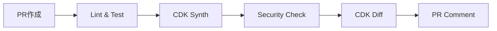
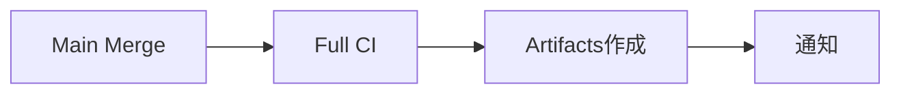
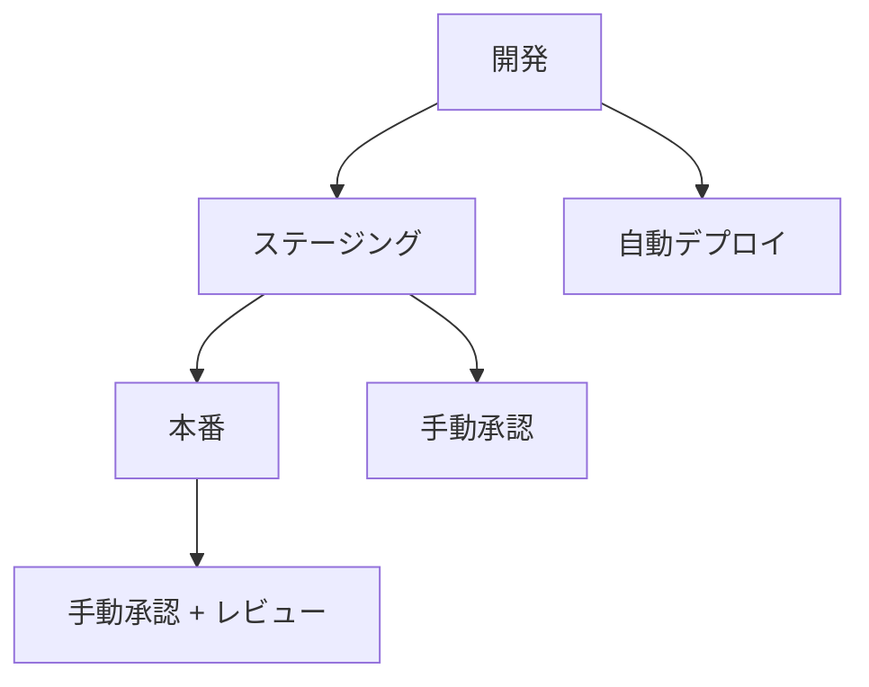

# GitHub Actions セットアップガイド

## 概要

CDKプロジェクトのCI/CDパイプラインをGitHub Actionsで構築するためのセットアップガイドです。

## 必要なSecrets設定

### リポジトリレベルのSecrets

GitHubリポジトリの「Settings」→「Secrets and variables」→「Actions」で以下を設定：

#### AWS認証情報

| Secret名                | 説明                        | 取得方法            |
| ----------------------- | --------------------------- | ------------------- |
| `AWS_ACCESS_KEY_ID`     | AWSアクセスキーID           | IAMユーザーから取得 |
| `AWS_SECRET_ACCESS_KEY` | AWSシークレットアクセスキー | IAMユーザーから取得 |

#### 設定手順

```bash
# 1. IAMユーザー作成（AWS CLI）
aws iam create-user --user-name github-actions-deploy

# 2. 必要なポリシーをアタッチ
aws iam attach-user-policy \
  --user-name github-actions-deploy \
  --policy-arn arn:aws:iam::aws:policy/PowerUserAccess

# 3. アクセスキー作成
aws iam create-access-key --user-name github-actions-deploy
```

### 環境別Variables設定

#### Repository Variables

| Variable名   | 説明          | デフォルト値     |
| ------------ | ------------- | ---------------- |
| `AWS_REGION` | AWSリージョン | `ap-northeast-1` |

#### Environment Variables

各環境（dev, stg, prod）で以下を設定：

| Variable名       | 説明                     | 例                  |
| ---------------- | ------------------------ | ------------------- |
| `AWS_ACCOUNT_ID` | AWSアカウントID          | `123456789012`      |
| `STACK_PREFIX`   | スタック名プレフィックス | `goal-mandala-prod` |

## 環境設定

### Environment作成

1. GitHubリポジトリの「Settings」→「Environments」
2. 各環境を作成：
   - `dev` (開発環境)
   - `stg` (ステージング環境)
   - `prod` (本番環境)

### 本番環境の保護設定

本番環境には以下の保護ルールを設定：

#### Required reviewers

- 最低1人のレビュアーが必要
- レビュアー: プロジェクトリーダー、シニアエンジニア

#### Wait timer

- デプロイ前に5分間の待機時間

#### Deployment branches

- `main`ブランチからのみデプロイ可能

```yaml
# 本番環境の保護設定例
environment:
  name: prod
  protection_rules:
    required_reviewers:
      - username: project-leader
      - username: senior-engineer
    wait_timer: 5
    deployment_branches:
      - main
```

## ワークフロー設定

### 1. CDK CI ワークフロー

`.github/workflows/cdk-ci.yml`で以下をチェック：

- [ ] Linting
- [ ] Type checking
- [ ] Unit tests
- [ ] CDK synthesis
- [ ] Security checks (CDK Nag)

### 2. CDK Deploy ワークフロー

`.github/workflows/cdk-deploy.yml`で手動デプロイを実行：

- [ ] 環境選択
- [ ] デプロイ確認
- [ ] CDK diff表示
- [ ] 実際のデプロイ

### 3. 自動化されたワークフロー

#### プルリクエスト時



#### メインブランチマージ時



## IAM権限設定

### CDKデプロイ用IAMポリシー

```json
{
  "Version": "2012-10-17",
  "Statement": [
    {
      "Effect": "Allow",
      "Action": [
        "cloudformation:*",
        "s3:*",
        "lambda:*",
        "apigateway:*",
        "rds:*",
        "secretsmanager:*",
        "cloudfront:*",
        "route53:*",
        "acm:*",
        "iam:*",
        "logs:*",
        "events:*",
        "states:*",
        "cognito-idp:*",
        "ses:*"
      ],
      "Resource": "*"
    },
    {
      "Effect": "Allow",
      "Action": ["sts:AssumeRole"],
      "Resource": "arn:aws:iam::*:role/cdk-*"
    }
  ]
}
```

### 最小権限の原則

本番環境では、より制限的なポリシーを使用：

```json
{
  "Version": "2012-10-17",
  "Statement": [
    {
      "Effect": "Allow",
      "Action": [
        "cloudformation:DescribeStacks",
        "cloudformation:CreateStack",
        "cloudformation:UpdateStack",
        "cloudformation:DeleteStack",
        "cloudformation:DescribeStackEvents",
        "cloudformation:DescribeStackResources"
      ],
      "Resource": "arn:aws:cloudformation:*:*:stack/goal-mandala-prod-*/*"
    }
  ]
}
```

## セキュリティ設定

### Secrets管理

- [ ] **定期的なローテーション**: アクセスキーの定期更新
- [ ] **最小権限**: 必要最小限の権限のみ付与
- [ ] **監査ログ**: アクセスログの定期確認

### ブランチ保護

```yaml
# .github/branch-protection.yml
protection_rules:
  main:
    required_status_checks:
      strict: true
      contexts:
        - 'cdk-validation'
        - 'security-checks'
    enforce_admins: true
    required_pull_request_reviews:
      required_approving_review_count: 2
      dismiss_stale_reviews: true
      require_code_owner_reviews: true
```

### セキュリティスキャン

```yaml
# .github/workflows/security-scan.yml
name: Security Scan

on:
  schedule:
    - cron: '0 2 * * 1' # 毎週月曜日 2:00 AM
  workflow_dispatch:

jobs:
  security-scan:
    runs-on: ubuntu-latest
    steps:
      - uses: actions/checkout@v4

      - name: Run Snyk security scan
        uses: snyk/actions/node@master
        env:
          SNYK_TOKEN: ${{ secrets.SNYK_TOKEN }}

      - name: Run CodeQL analysis
        uses: github/codeql-action/analyze@v3
```

## 監視・アラート設定

### デプロイ通知

```yaml
# Slack通知の設定例
- name: Notify deployment success
  if: success()
  uses: 8398a7/action-slack@v3
  with:
    status: success
    channel: '#deployments'
    text: |
      🚀 CDK deployment successful!
      Environment: ${{ github.event.inputs.environment }}
      Deployed by: ${{ github.actor }}
  env:
    SLACK_WEBHOOK_URL: ${{ secrets.SLACK_WEBHOOK_URL }}
```

### 失敗時のアラート

```yaml
- name: Notify deployment failure
  if: failure()
  uses: 8398a7/action-slack@v3
  with:
    status: failure
    channel: '#alerts'
    text: |
      ❌ CDK deployment failed!
      Environment: ${{ github.event.inputs.environment }}
      Check logs: ${{ github.server_url }}/${{ github.repository }}/actions/runs/${{ github.run_id }}
  env:
    SLACK_WEBHOOK_URL: ${{ secrets.SLACK_WEBHOOK_URL }}
```

## トラブルシューティング

### よくあるエラー

#### 1. 認証エラー

```
Error: Unable to resolve AWS account to use
```

**解決方法**:

- AWS認証情報の設定確認
- IAM権限の確認

#### 2. CDK Bootstrap エラー

```
Error: This stack uses assets, so the toolkit stack must be deployed
```

**解決方法**:

```bash
# 手動でBootstrap実行
cdk bootstrap aws://ACCOUNT-NUMBER/REGION
```

#### 3. 権限不足エラー

```
User is not authorized to perform: cloudformation:CreateStack
```

**解決方法**:

- IAMポリシーの権限追加
- 最小権限の原則に従った権限設定

### デバッグ方法

```yaml
# デバッグ用の環境変数
env:
  CDK_DEBUG: true
  AWS_SDK_LOAD_CONFIG: 1

# 詳細ログの有効化
- name: Enable debug logging
  run: |
    echo "CDK_DEBUG=true" >> $GITHUB_ENV
    echo "AWS_SDK_LOAD_CONFIG=1" >> $GITHUB_ENV
```

## ベストプラクティス

### 1. 段階的デプロイ



### 2. ロールバック戦略

```bash
# 前のバージョンにロールバック
git revert HEAD
git push origin main

# 緊急時の手動ロールバック
aws cloudformation cancel-update-stack --stack-name goal-mandala-prod-api
```

### 3. 監視とアラート

- デプロイ成功/失敗の通知
- パフォーマンス監視
- セキュリティアラート
- コスト監視

## 参考リンク

- [GitHub Actions Documentation](https://docs.github.com/en/actions)
- [AWS CDK GitHub Actions](https://github.com/aws-actions)
- [CDK Best Practices](https://docs.aws.amazon.com/cdk/v2/guide/best-practices.html)
